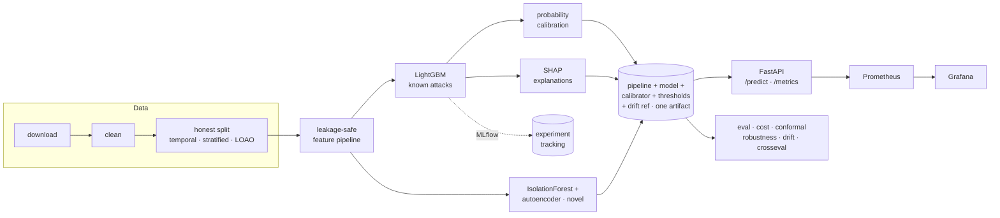

# NetSentry — ML Network Intrusion Detection

**A reproducible, leakage-safe machine-learning pipeline that detects network
intrusions in flow data — pairing a supervised classifier for known attacks with
an unsupervised anomaly detector for novel ones, served behind a real-time API
with explainable predictions.**


---

## Project status

**Released `v0.1.0`, and extended since.** The build plan in
[`BUILD_PROMPTS.md`](BUILD_PROMPTS.md) ran in ten phases; all ten are implemented,
tested, and committed, and a set of post-release capabilities (calibration,
adversarial robustness, cost-sensitive thresholds, conformal prediction, Optuna HPO,
and a Prometheus/Grafana stack) build on top. `make check` is green (lint +
type-check + **127 passing tests**), and the full `download → prep → train → eval →
serve` pipeline runs end-to-end on the bundled synthetic data.

| Phase | Scope | Status |
|---|---|---|
| 0 | Scaffolding, config, tooling, CI | ✅ Done |
| 1 | Data ingestion + schema + data card | ✅ Done |
| 2 | Cleaning & EDA | ✅ Done |
| 3 | Honest splits + leakage-safe feature pipeline | ✅ Done |
| 4 | Baseline + LightGBM supervised model | ✅ Done |
| 5 | Operational evaluation framework | ✅ Done |
| 6 | Anomaly detection (Isolation Forest + autoencoder) | ✅ Done |
| 7 | SHAP explainability | ✅ Done |
| 8 | FastAPI serving | ✅ Done |
| 9 | Containerization & CI | ✅ Done |
| 10 | Docs, model card, README | ✅ Done |
| S1 | Cross-dataset generalization study | ✅ Done |
| S2 | Drift monitoring (PSI + Prometheus gauge) | ✅ Done |
| S3 | Streamlit demo dashboard | ✅ Done |
| S4 | vulnpipe finding triage | ✅ Done |
| S5 | ONNX export + quantized inference | ✅ Done |

### Beyond v0.1.0 — advanced ML-engineering capabilities

| Area | What it adds | Status |
|---|---|---|
| Probability calibration | isotonic/Platt calibrator + reliability/Brier/ECE diagnostics | ✅ Done |
| Adversarial robustness | mimicry + adaptive query-search evasion, robustness curves | ✅ Done |
| Cost-sensitive thresholds | decision-theoretic operating point (SOC economics) | ✅ Done |
| Conformal prediction | distribution-free coverage + selective alerting | ✅ Done |
| Hyperparameter search | leakage-safe Optuna HPO (`train tune`) | ✅ Done |
| Observability | Prometheus + Grafana dashboard + alert rules | ✅ Done |

Per-phase engineering notes and self-audits live in [`NOTES.md`](NOTES.md);
release notes in [`CHANGELOG.md`](CHANGELOG.md).

## Why this project is different

Most public CIC-IDS2017 projects report ~99.9% accuracy. That number is almost
always an artifact of **data leakage** (identifier columns + a naive random
split) and a metric (accuracy) that is meaningless on data that is ~80% benign.
NetSentry is built to be the project that does it right:

- **Leakage-safe by construction** — identifier/timestamp columns are dropped and
  all preprocessing is fit on the training split only (a `remainder="drop"`
  `ColumnTransformer` is the firewall; a test enforces no leak survives).
- **Honestly evaluated** — the headline result uses a **temporal / by-day split**,
  not a shuffled one, and the optimistic random-split number is reported beside
  it so the gap is visible.
- **Operational metrics** — leads with PR-AUC, per-class recall, and **detection
  rate at a fixed false-positive budget**, because in a SOC the binding
  constraint is analyst time, not raw accuracy.
- **Detects the unknown** — a benign-only anomaly detector flags attack classes
  the supervised model never trained on (leave-one-attack-out).
- **Explainable** — every prediction returns the top contributing features (SHAP).
- **Calibrated** — tree scores are not probabilities, so the attack probability is
  passed through a monotonic isotonic/Platt calibrator (fit on validation); the
  report shows the reliability diagram and the Brier/ECE/MCE drop. A reported
  probability and an FP budget only mean something once the score is calibrated.

> ### ⚠️ A note on the numbers below
> The CIC-IDS2017 dataset requires registration with the CIC and is not shipped
> here. So that the whole pipeline is reproducible out-of-the-box, NetSentry
> includes a **schema-faithful synthetic data generator** (same columns, same
> defects, same imbalance, per-day attack layout). **The metrics below are from
> that synthetic stand-in — they demonstrate the methodology, not real-world
> performance.** To reproduce on the real data, drop the CSVs in `data/raw/`
> (or set `data.source_url`) and re-run; the commands and framing are identical.

## Headline results

> _Temporal split (the honest number), on synthetic data. Full report + figures
> in [`docs/reports/evaluation.md`](docs/reports/evaluation.md) and
> [`docs/figures/`](docs/figures)._

| Metric | Score |
|---|---|
| PR-AUC, attack vs benign (temporal, **honest**) | **0.529** (baseline 0.250) |
| PR-AUC, attack vs benign (stratified, optimistic) | 0.786 |
| **Over-optimism gap** (stratified − temporal) | **+0.257** |
| Detection rate @ 0.1% FPR / @ 1% FPR (temporal) | 9.1% / 21.0% |
| Anomaly detector — avg detection of held-out attacks @ 1% FPR | 8.5% (autoencoder), 4.3% (iForest) |
| Ensemble vs best single scorer (temporal PR-AUC) | 0.537 vs 0.529 |
| Inference latency p50 / p95 (single flow, local) | ~47 / ~56 ms |
| Throughput (single process, SHAP per request) | ~21 req/s |


The optimistic shuffled split scores markedly higher than the honest temporal
split. **That gap is the finding** — it is the over-optimism most CIC-IDS write-ups
ship as a headline. Reporting the temporal number is the point.

## Architecture



In short: `download → clean → honest split → leakage-safe feature pipeline →
LightGBM (known) + Isolation Forest/autoencoder (novel) → calibration → SHAP →
MLflow`, bundled into one pipeline+model artifact that a FastAPI service loads to
return calibrated, explained predictions — with an analysis suite (operational
eval, cost, conformal, robustness, drift) and a Prometheus/Grafana console on top.
Full write-up in [`docs/ARCHITECTURE.md`](docs/ARCHITECTURE.md).

## Tech stack

Python 3.11 · scikit-learn · LightGBM · PyTorch · SHAP · MLflow · FastAPI ·
pydantic · Prometheus · Docker · GitHub Actions · pytest/ruff/black/mypy.

Heavy ML libraries are optional extras with graceful fallbacks (LightGBM →
scikit-learn `HistGradientBoosting`, SHAP → permutation importance, MLflow →
local file logging, autoencoder → Isolation Forest), so the core install runs
anywhere and the pipeline degrades rather than breaks.

## Quickstart

```bash
make install                        # editable install + dev/train extras + hooks
netsentry download                  # fetch CIC-IDS2017 (or generate synthetic data)
netsentry prep                      # clean + honest splits + persisted features
netsentry train tune                # Optuna HPO on validation (writes configs/tuned.yaml)
netsentry train supervised          # train LightGBM, log to MLflow
netsentry train anomaly             # benign-only anomaly detector + leave-one-attack-out
netsentry eval                      # operational metrics report + figures
netsentry serve                     # FastAPI on :8000 (builds a demo model if none)
netsentry demo                      # Streamlit dashboard (pip install '.[demo]')
# or, one command:
docker compose -f docker/docker-compose.yml up --build
```

Example prediction:

```bash
curl -X POST localhost:8000/predict -H 'content-type: application/json' \
  -d @examples/sample_flow.json
# → {"predicted_class":"DDoS","is_attack":true,"attack_probability":0.95,
#    "anomaly_score":0.37,"is_anomaly":false,
#    "top_features":[{"feature":"...","contribution":0.21}, ...],
#    "model_version":"0.1.0","threshold_profile":"fpr_0.1pct",
#    "prediction_set":["attack"],"recommended_action":"auto_alert"}
```

`is_attack` is the thresholded decision at the selected `threshold_profile`
(operator-selectable via `?profile=fpr_1pct` or the decision-theoretic
`?profile=cost_optimal`); `attack_probability` is the calibrated score for
transparency. `prediction_set` / `recommended_action` are the conformal
selective-prediction outputs — `auto_alert`, `auto_clear`, or `review` (ambiguous or
novel) — so the API tells a SOC not just *what* but *whether to trust it*.

## Reproducibility

Every result is reproducible from a logged config + seed. `netsentry eval`
regenerates the report and figures; MLflow holds params, metrics, artifacts, and
the environment for each run. Splits are persisted with content hashes so the
same rows never drift between train and test. Engineering decisions and
self-audits are logged in [`NOTES.md`](NOTES.md).

## Demo dashboard

`netsentry demo` launches a Streamlit app: pick or edit a flow and watch the
verdict, attack probability, anomaly score, and SHAP explanation update live — the
inference engine and explanations behind the API, made tangible for a non-curl
audience. Install with `pip install '.[demo]'`.

## Monitoring & drift

Models decay when production traffic drifts away from training data. `netsentry
drift` reports the **Population Stability Index (PSI)** per feature (and of the
model's output score) for a current dataset versus a reference — by default the
temporal **test** split versus the **train** split, which measures exactly how
much later-day traffic moves. On the synthetic stand-in the model-score drift is
~0.16 (moderate) — a concrete reason the honest temporal split is harder than a
shuffled one. In serving the same check runs continuously: `/metrics` exposes
`netsentry_feature_drift_psi_max` / `_mean` over a rolling window of requests, and
the drift reference travels inside the model bundle so a deployed model
self-monitors. See [`docs/reports/drift.md`](docs/reports/drift.md).

## Observability (Prometheus + Grafana)

The API already exports Prometheus metrics; the stack ships a one-command
observability story on top. `make docker-monitor` (or `docker compose --profile
monitoring up`) brings up the API, Prometheus, and a Grafana with an
auto-provisioned **NetSentry dashboard** — request rate, error rate, latency
p50/p95/p99, scored-flows-by-decision, anomaly-flag rate, the **feature-drift PSI
gauges**, and the attack-probability distribution. Prometheus
[alert rules](docker/prometheus/alerts.yml) cover the operational risks that matter
here: major input drift (PSI > 0.25), an attack-flag spike, error-rate, and a p99
latency SLO. Grafana at `:3000` (admin/admin), Prometheus at `:9090`.

## Cross-dataset generalization

The strongest honesty test is whether the model transfers to a *different*
dataset. `netsentry crosseval` scores the trained bundle, unchanged, on a foreign
**NetFlow-schema** dataset adapted into CIC features — most CIC features have no
NetFlow equivalent and are imputed, so detection transfers only through shared
behaviour. On the synthetic stand-in, PR-AUC holds up (0.529 → 0.517) but the
operating point degrades sharply (TPR@0.1%FPR **11.9% → 1.2%**): the ranking
transfers, the calibration does not. Point the adapter at UNSW-NB15 or the NetFlow
`NF-*-v2` releases for real numbers. See
[`docs/reports/cross_dataset.md`](docs/reports/cross_dataset.md).

## vulnpipe integration

`netsentry triage` connects NetSentry to vulnerability findings (e.g. from
vulnpipe): each finding's host traffic is scored and its severity is fused with
the model's attack probability and anomaly flag into one priority. The effect — a
**critical CVE on a quiet host is deprioritised below a high-severity CVE on a host
whose traffic looks like an active attack** — triage by what's actually being
exploited, not CVSS alone. Fusion weights are config (`triage.*`). See
[`docs/reports/triage.md`](docs/reports/triage.md) and the contract in
`netsentry/integrations/vulnpipe.py`.

## Conformal prediction & selective alerting

`netsentry conformal` adds class-conditional **split-conformal** prediction: each
flow gets a prediction set with a finite-sample, distribution-free guarantee that
the true label is inside with probability ≥ 1−α. The set shapes map to SOC actions —
`{benign}` auto-clear, `{attack}` auto-alert, `{benign,attack}` and `{}` (novel)
routed to a human — so abstention *is* the human-review budget. The honest twist:
the guarantee holds on the exchangeable stratified split (≈92% attack coverage at a
90% target) but the attack class falls short on the temporal split (≈64%), because
exchangeability is broken by later-day novel attacks. That shortfall is conformal
*detecting* drift, a second signal alongside PSI. See
[`docs/reports/conformal.md`](docs/reports/conformal.md).

## Cost-sensitive thresholds

A 0.1%-FPR budget is honest but arbitrary. `netsentry cost` attaches a cost to each
outcome — analyst time per alert, expected loss per missed attack — and picks the
threshold that minimises **expected cost**, the decision a SOC actually faces. For a
calibrated probability the per-flow optimum has a closed form (`p ≥
cost_per_alert/cost_per_miss`), the daily figures are extrapolated at a realistic
production base rate (not the synthetic 22%), and the cost-optimal point is compared
against the fixed-FPR profiles. The run also surfaces an honest wrinkle — a threshold
tuned on validation (earlier days) can drift on the later-day test set, the same
temporal effect the headline split exposes. See
[`docs/reports/cost.md`](docs/reports/cost.md).

## Adversarial robustness

A NIDS faces *adaptive* attackers, so "not adversarially robust" should be a
measured curve, not a hand-wave. `netsentry robustness` runs two feature-space
evasion attacks against the deployed model — a **mimicry** attack (shape the
attacker-controllable volume/timing features toward benign) and an **adaptive
query search** (the L2-bounded perturbation that minimizes the model's score) —
and plots detection rate vs attacker effort. On the synthetic stand-in, full
mimicry collapses supervised detection from **~83% to ~0%** at the 1%-FPR
operating point, and the most-exploitable features (Flow Duration, packet counts,
flow rates) line up with the SHAP global importances. That fragility is the
concrete argument for pairing the classifier with the benign-only anomaly
detector. See [`docs/reports/robustness.md`](docs/reports/robustness.md).

## ONNX export

`netsentry onnx` exports the trained classifier to ONNX and benchmarks ONNX
Runtime against the Python path: identical probabilities (max diff ~1e-7) at
**~1.4x throughput** (76k vs 53k flows/s on a 2000-flow batch) — the case for a
low-overhead or non-Python serving target. It also reports, honestly, that dynamic
quantization is a no-op for tree ensembles (a `TreeEnsembleClassifier` carries no
quantizable matmul weights, so the quantized model is unchanged in size and speed).
See [`docs/reports/onnx.md`](docs/reports/onnx.md). Optional `onnx` extra.

## Limitations

See [`docs/MODEL_CARD.md`](docs/MODEL_CARD.md). NetSentry consumes pre-computed
flow features (not raw packets), is trained/evaluated on a 2017 dataset (here a
synthetic stand-in), and is a rigorous reference implementation and demo — not a
drop-in production NIDS.

## License

MIT — see [`LICENSE`](LICENSE).
