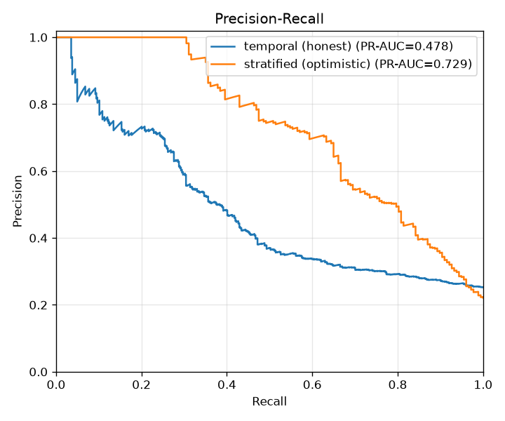
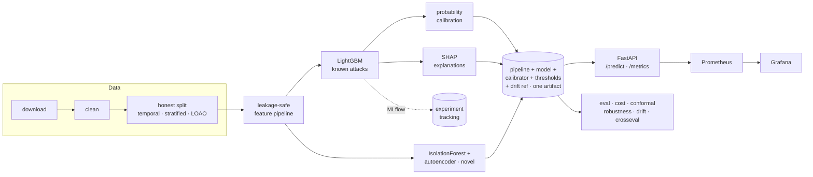

# NetSentry — ML Network Intrusion Detection

**A reproducible, leakage-safe machine-learning pipeline that detects network
intrusions in flow data — pairing a supervised classifier for known attacks with
an unsupervised anomaly detector for novel ones, served behind a real-time API
with explainable predictions.**


---

## Project status

**Released `v0.1.0`, and extended since.** The build plan in
[`BUILD_PROMPTS.md`](BUILD_PROMPTS.md) ran in ten phases; all ten are implemented,
tested, and committed, and a set of post-release capabilities (calibration,
adversarial robustness, cost-sensitive thresholds, conformal prediction, Optuna HPO,
and a Prometheus/Grafana stack) build on top. `make check` is green (lint +
type-check + **312 passing tests**), and the full `download → prep → train → eval →
serve` pipeline runs end-to-end on the bundled synthetic data, followed by a
**model-lifecycle layer** (noise floor → release gate → promotion → canaries →
shadow → retrain policy) that governs what actually ships.

| Phase | Scope | Status |
|---|---|---|
| 0 | Scaffolding, config, tooling, CI | ✅ Done |
| 1 | Data ingestion + schema + data card | ✅ Done |
| 2 | Cleaning & EDA | ✅ Done |
| 3 | Honest splits + leakage-safe feature pipeline | ✅ Done |
| 4 | Baseline + LightGBM supervised model | ✅ Done |
| 5 | Operational evaluation framework | ✅ Done |
| 6 | Anomaly detection (Isolation Forest + autoencoder) | ✅ Done |
| 7 | SHAP explainability | ✅ Done |
| 8 | FastAPI serving | ✅ Done |
| 9 | Containerization & CI | ✅ Done |
| 10 | Docs, model card, README | ✅ Done |
| S1 | Cross-dataset generalization study | ✅ Done |
| S2 | Drift monitoring (PSI + Prometheus gauge) | ✅ Done |
| S3 | Streamlit demo dashboard | ✅ Done |
| S4 | vulnpipe finding triage | ✅ Done |
| S5 | ONNX export + quantized inference | ✅ Done |

### Beyond v0.1.0 — advanced ML-engineering capabilities

| Area | What it adds | Status |
|---|---|---|
| Probability calibration | isotonic/Platt calibrator + reliability/Brier/ECE diagnostics | ✅ Done |
| Adversarial robustness | mimicry + adaptive query-search evasion, robustness curves | ✅ Done |
| Adversarial hardening | adversarial training vs mimicry, re-measured (measure → fix → re-measure) | ✅ Done |
| Cost-sensitive thresholds | decision-theoretic operating point (SOC economics) | ✅ Done |
| Alert-queue planning | detection vs analyst budget; lift over random triage | ✅ Done |
| Conformal prediction | distribution-free coverage + selective alerting | ✅ Done |
| Hyperparameter search | leakage-safe Optuna HPO (`train tune`) | ✅ Done |
| Observability | Prometheus + Grafana dashboard + alert rules | ✅ Done |
| Statistical drift | per-feature KS + Benjamini–Hochberg FDR, online Page–Hinkley / DDM | ✅ Done |
| Statistical rigor | bootstrap CIs + gap significance test | ✅ Done |
| Explanation trust | feature-importance stability across bootstrap refits | ✅ Done |
| Threat intel | MITRE ATT&CK mapping in predictions + coverage report + Navigator layer | ✅ Done |
| Data efficiency | learning curves (does more data help?) | ✅ Done |
| Active learning | uncertainty vs random labeling (label-efficiency win) | ✅ Done |
| Streaming lifecycle | prequential static-vs-retrained on the later-day stream | ✅ Done |
| Feature ablation | leave-one-family-out (which behaviours carry detection) | ✅ Done |
| Detection parity | per-service TPR/FPR audit (Wilson CIs) → served `per_service` profile | ✅ Done |
| Novelty distance | the split gap decomposed: composition vs at-distance shift | ✅ Done |
| Temporal sensitivity | leave-one-day-out: every day takes a turn as the future | ✅ Done |
| Rules baseline | ML benchmarked against a signature ruleset at matched FPR | ✅ Done |
| Training-set poisoning | label-flip + benign-pool contamination curves | ✅ Done |
| Label-noise audit | confident-learning flags, self-validated on planted flips | ✅ Done |
| Data quality | schema / label / duplicate validation gates | ✅ Done |
| Batch inference | offline `score` a CSV/Parquet of flows to predictions | ✅ Done |
| Counterfactual recourse | minimal change that would clear a flagged flow | ✅ Done |
| Supply chain | CycloneDX SBOM + signed model manifest + `verify` gate | ✅ Done |
| Governance & API | auto-generated model card + API-key auth / rate limiting | ✅ Done |
| Seed sensitivity | same-seed reproducibility asserted + the cross-seed noise floor | ✅ Done |
| Release gate | executable definition of done; a *too-good* PR-AUC **fails** it | ✅ Done |
| Champion/challenger | paired-bootstrap promotion; margins from the measured noise | ✅ Done |
| Retrain triggers | never / periodic / drift-triggered, priced on the stream | ✅ Done |
| Behavioral canaries | the bundle must reproduce its build-time scores at load | ✅ Done |
| Shadow challenger | a second model scored silently; live disagreement metrics | ✅ Done |

Per-phase engineering notes and self-audits live in [`NOTES.md`](NOTES.md);
release notes in [`CHANGELOG.md`](CHANGELOG.md).

## Why this project is different

Most public CIC-IDS2017 projects report ~99.9% accuracy. That number is almost
always an artifact of **data leakage** (identifier columns + a naive random
split) and a metric (accuracy) that is meaningless on data that is ~80% benign.
NetSentry is built to be the project that does it right:

- **Leakage-safe by construction** — identifier/timestamp columns are dropped and
  all preprocessing is fit on the training split only (a `remainder="drop"`
  `ColumnTransformer` is the firewall; a test enforces no leak survives).
- **Honestly evaluated** — the headline result uses a **temporal / by-day split**,
  not a shuffled one, and the optimistic random-split number is reported beside
  it so the gap is visible.
- **Operational metrics** — leads with PR-AUC, per-class recall, and **detection
  rate at a fixed false-positive budget**, because in a SOC the binding
  constraint is analyst time, not raw accuracy.
- **Detects the unknown** — a benign-only anomaly detector flags attack classes
  the supervised model never trained on (leave-one-attack-out).
- **Explainable** — every prediction returns the top contributing features (SHAP),
  and `netsentry recourse` adds the counterfactual *what-if*: the minimal change that
  would clear a flagged flow (the analyst's triage aid, and the defensive mirror of
  the evasion study).
- **Calibrated** — tree scores are not probabilities, so the attack probability is
  passed through a monotonic isotonic/Platt calibrator (fit on validation); the
  report shows the reliability diagram and the Brier/ECE/MCE drop. A reported
  probability and an FP budget only mean something once the score is calibrated.

> ### ⚠️ A note on the numbers below
> The CIC-IDS2017 dataset requires registration with the CIC and is not shipped
> here. So that the whole pipeline is reproducible out-of-the-box, NetSentry
> includes a **schema-faithful synthetic data generator** (same columns, same
> defects, same imbalance, per-day attack layout). **The metrics below are from
> that synthetic stand-in — they demonstrate the methodology, not real-world
> performance.** To reproduce on the real data, drop the CSVs in `data/raw/`
> (or set `data.source_url`) and re-run; the commands and framing are identical.

## Headline results

> _Temporal split (the honest number), on synthetic data. Full report + figures
> in [`docs/reports/evaluation.md`](docs/reports/evaluation.md) and
> [`docs/figures/`](docs/figures)._

| Metric | Score |
|---|---|
| PR-AUC, attack vs benign (temporal, **honest**) | **0.529** (baseline 0.250) |
| PR-AUC, attack vs benign (stratified, optimistic) | 0.786 |
| **Over-optimism gap** (stratified − temporal) | **+0.257** |
| Detection rate @ 0.1% FPR / @ 1% FPR (temporal) | 9.1% / 21.0% |
| Anomaly detector — avg detection of held-out attacks @ 1% FPR | 8.5% (autoencoder), 4.3% (iForest) |
| Ensemble vs best single scorer (temporal PR-AUC) | 0.537 vs 0.529 |
| Inference latency p50 / p95 (single flow, local) | ~47 / ~56 ms |
| Throughput (single process, SHAP per request) | ~21 req/s |



The optimistic shuffled split scores markedly higher than the honest temporal
split. **That gap is the finding** — it is the over-optimism most CIC-IDS write-ups
ship as a headline. Reporting the temporal number is the point. The gap is
**statistically significant** (bootstrap 95% CI [+0.239, +0.276], p < 0.001), and
the temporal PR-AUC interval excludes the majority baseline — the report carries
percentile-bootstrap CIs for every headline metric so the comparison is judged, not
assumed.

## Architecture



In short: `download → clean → honest split → leakage-safe feature pipeline →
LightGBM (known) + Isolation Forest/autoencoder (novel) → calibration → SHAP →
MLflow`, bundled into one pipeline+model artifact that a FastAPI service loads to
return calibrated, explained predictions — with an analysis suite (operational
eval, cost, conformal, robustness, drift) and a Prometheus/Grafana console on top.
Full write-up in [`docs/ARCHITECTURE.md`](docs/ARCHITECTURE.md).

## Tech stack

Python 3.11 · scikit-learn · LightGBM · PyTorch · SHAP · MLflow · FastAPI ·
pydantic · Prometheus · Docker · GitHub Actions · pytest/ruff/black/mypy.

Heavy ML libraries are optional extras with graceful fallbacks (LightGBM →
scikit-learn `HistGradientBoosting`, SHAP → permutation importance, MLflow →
local file logging, autoencoder → Isolation Forest), so the core install runs
anywhere and the pipeline degrades rather than breaks.

## Quickstart

```bash
make install                        # editable install + dev/train extras + hooks
netsentry download                  # fetch CIC-IDS2017 (or generate synthetic data)
netsentry prep                      # clean + honest splits + persisted features
netsentry validate                  # data-quality gates (schema, labels, dupes, balance)
netsentry train tune                # Optuna HPO on validation (writes configs/tuned.yaml)
netsentry train supervised          # train LightGBM, log to MLflow
netsentry train anomaly             # benign-only anomaly detector + leave-one-attack-out
netsentry eval                      # operational metrics report + figures (+ bootstrap CIs)
netsentry learningcurve             # PR-AUC vs training size (does more data help?)
netsentry slices                    # per-attack-class detection (known vs novel)
netsentry subgroups                 # per-service detection/false-alarm parity audit
netsentry novelty                   # detection vs distance-to-training (split gap decomposed)
netsentry lodo                      # leave-one-day-out temporal sensitivity
netsentry labelaudit                # find likely label errors (self-validated)
netsentry rules                     # ML vs a signature ruleset at a matched FPR budget
netsentry ablation                  # leave-one-feature-family-out importance
netsentry importance                # feature-importance stability (are explanations trustworthy?)
netsentry activelearning            # uncertainty vs random labeling (label efficiency)
netsentry poisoning                 # detection decay under training-set poisoning
netsentry harden                    # adversarial training vs mimicry, then re-measure
netsentry alertqueue                # detection vs analyst budget (lift over random triage)
netsentry driftscan                 # KS+FDR + online Page-Hinkley/DDM drift detection
netsentry navigator                 # export ATT&CK Navigator layer (colored by detection)
netsentry provenance && netsentry verify   # SBOM + model manifest, then integrity gate
netsentry seeds                     # training-noise floor: reproducibility + stability
netsentry gate                      # release bars incl. the too-good ceiling (exit code)
netsentry promote                   # champion/challenger promotion decision (exit code)
netsentry retrainpolicy             # when to retrain: triggers priced on the stream
netsentry canary                    # replay the bundle's embedded flows (behavioral attest)
netsentry serve                     # FastAPI on :8000 (builds a demo model if none)
netsentry score -i flows.csv --output scored.csv   # offline batch scoring
netsentry modelcard                 # auto-generate the model-card spec sheet from the bundle
netsentry demo                      # Streamlit dashboard (pip install '.[demo]')
# or, one command:
docker compose -f docker/docker-compose.yml up --build
```

Example prediction:

```bash
curl -X POST localhost:8000/predict -H 'content-type: application/json' \
  -d @examples/sample_flow.json
# → {"predicted_class":"DDoS","is_attack":true,"attack_probability":0.95,
#    "anomaly_score":0.37,"is_anomaly":false,
#    "top_features":[{"feature":"...","contribution":0.21}, ...],
#    "model_version":"0.1.0","threshold_profile":"fpr_0.1pct",
#    "prediction_set":["attack"],"recommended_action":"auto_alert",
#    "mitre":{"tactic":"Impact","technique_id":"T1499","technique_name":"Endpoint Denial of Service",...}}
```

`is_attack` is the thresholded decision at the selected `threshold_profile`
(operator-selectable via `?profile=fpr_1pct`, the decision-theoretic
`?profile=cost_optimal`, or `?profile=per_service`, which judges each flow at its
service's own validation-calibrated threshold — the parity audit's finding shipped
as a serving feature; the flow's `Destination Port` rides along as routing metadata
and never enters the model); `attack_probability` is the calibrated score for
transparency. `prediction_set` / `recommended_action` are the conformal
selective-prediction outputs — `auto_alert`, `auto_clear`, or `review` (ambiguous or
novel) — so the API tells a SOC not just *what* but *whether to trust it*. The
prediction endpoints support optional API-key auth (`X-API-Key`) and a per-client
rate limit, both config-gated (`serving.api_key`, `serving.rate_limit_per_minute`),
while `/health` and `/metrics` stay open for probes.

## Reproducibility

Every result is reproducible from a logged config + seed. `netsentry analyze`
regenerates the **entire analysis suite** in one command — operational evaluation,
calibration, cost, conformal, robustness, and drift — with a linked
[`docs/reports/INDEX.md`](docs/reports); `netsentry eval` regenerates just the
headline report and figures. MLflow holds params, metrics, artifacts, and the
environment for each run. Splits are persisted with content hashes so the same rows
never drift between train and test. Engineering decisions and self-audits are logged
in [`NOTES.md`](NOTES.md).

## Model lifecycle (what happens after the metrics table)

Most ML projects end at evaluation. NetSentry also ships the **decision layer**
between training and production — every stage is a command with an exit code a
pipeline can branch on:

| stage | command | what it decides |
|---|---|---|
| Noise floor | `netsentry seeds` | how much of any metric is training luck: same-seed refits are **bit-identical** (asserted), different seeds move PR-AUC by sd 0.0017 — the margin evidence for promotion. [Report](docs/reports/seed_variance.md) |
| Release gate | `netsentry gate` | absolute bars on the candidate: the leakage firewall **re-checked on the fitted artifact**, calibrator + threshold profiles present, a scoring smoke, metric floors — and a *ceiling*: PR-AUC > 0.999 **fails** (too good = suspected leakage). [Report](docs/reports/gate.md) |
| Promotion | `netsentry promote` | challenger vs champion on the same frozen rows, **paired bootstrap** (shared noise cancels), non-inferiority margins set just above the measured seed noise; the champion is a SHA-256-pinned snapshot and every decision lands in a JSONL history. [Report](docs/reports/promotion.md) |
| Behavioral attest | `netsentry canary` | `verify` proves the artifact's *bytes*; canaries prove its *behavior*: every persisted bundle embeds validation flows + its build-time scores, and the serving runtime must reproduce them (surfaced on `/health`, strict mode refuses to serve). |
| Live evidence | `serving.shadow_artifact_path` | a shadow challenger scores every request silently — never touching the response — and exports the score-delta histogram + decision disagreements to Prometheus: the promote comparison, gathered on live traffic. |
| Retrain policy | `netsentry retrainpolicy` | when drift should pull the retraining lever: never / periodic / PSI-triggered / every batch, priced prequentially on the later-day stream. [Report](docs/reports/retrain_policy.md) |

Two findings from building this layer are kept, not smoothed over:

- **The first real promotion decision was a HOLD.** A routine seed-43 retrain came
  back PR-AUC-equivalent (+0.0001, paired 95% CI [-0.0022, +0.0025]) but credibly
  worse at the 0.1%-FPR operating point (**-1.5pp detection**, CI excludes zero,
  p = 1.000). A ranking metric said "same model"; the operating point said "ships
  less detection" — the project's evaluation thesis resurfacing at the deployment
  layer, and the gate held the champion.
- **The PSI retrain trigger under-delivers, and the report says so.** It fires when
  later-day traffic first arrives, the redeploy resets its reference, and it never
  fires again — while labeled retraining keeps buying quality (mean batch PR-AUC
  0.413 vs the 0.534 every-batch ceiling). Score distributions can settle while
  quality is still being bought: a drift trigger is a cost-saver, not a substitute
  for labels.

`make lifecycle` runs the full sequence; CI runs it on every push and additionally
attests the promoted champion both ways (bytes via `verify`, behavior via `canary`).

## Demo dashboard

`netsentry demo` launches a Streamlit app: pick or edit a flow and watch the
verdict, attack probability, anomaly score, and SHAP explanation update live — the
inference engine and explanations behind the API, made tangible for a non-curl
audience. Install with `pip install '.[demo]'`.

## Monitoring & drift

Models decay when production traffic drifts away from training data. `netsentry
drift` reports the **Population Stability Index (PSI)** per feature (and of the
model's output score) for a current dataset versus a reference — by default the
temporal **test** split versus the **train** split, which measures exactly how
much later-day traffic moves. On the synthetic stand-in the model-score drift is
~0.16 (moderate) — a concrete reason the honest temporal split is harder than a
shuffled one. In serving the same check runs continuously: `/metrics` exposes
`netsentry_feature_drift_psi_max` / `_mean` over a rolling window of requests, and
the drift reference travels inside the model bundle so a deployed model
self-monitors. See [`docs/reports/drift.md`](docs/reports/drift.md).

`netsentry streaming` closes that loop from *measuring* drift to *acting* on it:
it replays the later-day flows as a time-ordered stream and compares a **static**
model (frozen at deploy) against one **retrained** on each labeled batch, scored
prequentially (score, then learn). On the synthetic stand-in retraining lifts mean
batch PR-AUC from **0.43 to 0.54** — the retrained model reaches ~0.90 on late-stream
batches once it has seen labeled examples of the novel later-day attacks — and the
per-batch score-PSI (major early, then subsiding) shows the batches where the static
model slips are exactly the ones the drift alert would fire on. See
[`docs/reports/streaming.md`](docs/reports/streaming.md).

PSI reports *how much* a distribution moved, but it is an effect size with a
rule-of-thumb cutoff, not a test. `netsentry driftscan` adds the two things PSI can't:
**significance** — a per-feature two-sample Kolmogorov–Smirnov test with a
**Benjamini–Hochberg FDR** correction across features (5 of 76 certified as genuinely
shifted on the stand-in, not just ranked by magnitude) — and **timing**, via two
classic *online* detectors that report *when* the stream broke: **Page–Hinkley** on
the deployed model's score stream and **DDM** (Gama et al., 2004) on its error stream.
Against a planted reference→current boundary, both alarm within the later-day segment,
which is what a production monitor needs: not "the batch drifted" but "alert now, at
flow N." See [`docs/reports/drift_tests.md`](docs/reports/drift_tests.md).

## Threat intelligence (MITRE ATT&CK)

Detection is only step one; response needs context. Every attack class is mapped to
a MITRE ATT&CK tactic + technique, so a flagged flow returns a `mitre` field
(`{tactic, technique_id, technique_name, url}`) an analyst can pivot on — e.g. `DoS
Hulk → Impact / T1499 Endpoint Denial of Service`, `PortScan → Discovery / T1046`.
`netsentry intel` writes a coverage report (12 classes → 6 tactics, 8 techniques);
the mapping is one source of truth shared by the API and the report. See
[`docs/reports/mitre.md`](docs/reports/mitre.md). Mappings are indicative of the
CIC-IDS2017 scenarios and documented as such.

`netsentry navigator` goes one step further and exports that coverage as a **MITRE
ATT&CK Navigator layer** ([`attack_navigator_layer.json`](docs/reports/attack_navigator_layer.json))
— a file you drop straight into the [ATT&CK Navigator](https://mitre-attack.github.io/attack-navigator/)
to see the technique matrix colored by NetSentry's measured per-class detection (green
= well detected, red = coverage gap). On the stand-in the volumetric floods light up
(DDoS ~78, DoS ~60) and the stealthy classes are the visible red gaps (Infiltration 0,
Web/Heartbleed ~2, brute force ~5) — the honest shape of the coverage, in the
framework a detection-engineering team already works from.

## Observability (Prometheus + Grafana)

The API already exports Prometheus metrics; the stack ships a one-command
observability story on top. `make docker-monitor` (or `docker compose --profile
monitoring up`) brings up the API, Prometheus, and a Grafana with an
auto-provisioned **NetSentry dashboard** — request rate, error rate, latency
p50/p95/p99, scored-flows-by-decision, anomaly-flag rate, the **feature-drift PSI
gauges**, and the attack-probability distribution. Prometheus
[alert rules](docker/prometheus/alerts.yml) cover the operational risks that matter
here: major input drift (PSI > 0.25), an attack-flag spike, error-rate, and a p99
latency SLO. Grafana at `:3000` (admin/admin), Prometheus at `:9090`.

## Cross-dataset generalization

The strongest honesty test is whether the model transfers to a *different*
dataset. `netsentry crosseval` scores the trained bundle, unchanged, on a foreign
**NetFlow-schema** dataset adapted into CIC features — most CIC features have no
NetFlow equivalent and are imputed, so detection transfers only through shared
behaviour. On the synthetic stand-in, PR-AUC holds up (0.529 → 0.517) but the
operating point degrades sharply (TPR@0.1%FPR **11.9% → 1.2%**): the ranking
transfers, the calibration does not. Point the adapter at UNSW-NB15 or the NetFlow
`NF-*-v2` releases for real numbers. See
[`docs/reports/cross_dataset.md`](docs/reports/cross_dataset.md).

## vulnpipe integration

`netsentry triage` connects NetSentry to vulnerability findings (e.g. from
vulnpipe): each finding's host traffic is scored and its severity is fused with
the model's attack probability and anomaly flag into one priority. The effect — a
**critical CVE on a quiet host is deprioritised below a high-severity CVE on a host
whose traffic looks like an active attack** — triage by what's actually being
exploited, not CVSS alone. Fusion weights are config (`triage.*`). See
[`docs/reports/triage.md`](docs/reports/triage.md) and the contract in
`netsentry/integrations/vulnpipe.py`.

## Conformal prediction & selective alerting

`netsentry conformal` adds class-conditional **split-conformal** prediction: each
flow gets a prediction set with a finite-sample, distribution-free guarantee that
the true label is inside with probability ≥ 1−α. The set shapes map to SOC actions —
`{benign}` auto-clear, `{attack}` auto-alert, `{benign,attack}` and `{}` (novel)
routed to a human — so abstention *is* the human-review budget. The honest twist:
the guarantee holds on the exchangeable stratified split (≈92% attack coverage at a
90% target) but the attack class falls short on the temporal split (≈64%), because
exchangeability is broken by later-day novel attacks. That shortfall is conformal
*detecting* drift, a second signal alongside PSI. See
[`docs/reports/conformal.md`](docs/reports/conformal.md).

## Cost-sensitive thresholds

A 0.1%-FPR budget is honest but arbitrary. `netsentry cost` attaches a cost to each
outcome — analyst time per alert, expected loss per missed attack — and picks the
threshold that minimises **expected cost**, the decision a SOC actually faces. For a
calibrated probability the per-flow optimum has a closed form (`p ≥
cost_per_alert/cost_per_miss`), the daily figures are extrapolated at a realistic
production base rate (not the synthetic 22%), and the cost-optimal point is compared
against the fixed-FPR profiles. The run also surfaces an honest wrinkle — a threshold
tuned on validation (earlier days) can drift on the later-day test set, the same
temporal effect the headline split exposes. See
[`docs/reports/cost.md`](docs/reports/cost.md).

## Alert-queue capacity planning

The cost report picks a threshold; a SOC lead budgets in analyst time. `netsentry
alertqueue` answers the deployment question directly — "my team can work K alerts a
day; ranking flows by risk, how many attacks do we catch, and how much better is that
than triaging K flows at random?" A budget of K alerts/day maps to the operating point
whose alert volume equals K at a realistic **1%** production base rate (not the ~22%
test mix), so detection, queue precision, and the **lift over random triage** are read
straight off the score ranking. On the stand-in the ranking is worth **~50–60×** random
triage: ~12 analysts (500 alerts/day) catch 2.5% of attacks at ~83% queue precision,
rising to 8.2% at 2,500/day, with detection flattening as staffing climbs — the
capacity-planning knee PR-AUC alone can't show. See
[`docs/reports/alert_queue.md`](docs/reports/alert_queue.md).

## Adversarial robustness

A NIDS faces *adaptive* attackers, so "not adversarially robust" should be a
measured curve, not a hand-wave. `netsentry robustness` runs two feature-space
evasion attacks against the deployed model — a **mimicry** attack (shape the
attacker-controllable volume/timing features toward benign) and an **adaptive
query search** (the L2-bounded perturbation that minimizes the model's score) —
and plots detection rate vs attacker effort. On the synthetic stand-in, full
mimicry collapses supervised detection from **~83% to ~0%** at the 1%-FPR
operating point, and the most-exploitable features (Flow Duration, packet counts,
flow rates) line up with the SHAP global importances. That fragility is the
concrete argument for pairing the classifier with the benign-only anomaly
detector. See [`docs/reports/robustness.md`](docs/reports/robustness.md).

## Adversarial hardening (measure → fix → re-measure)

Measuring a weakness is half the job; the robustness report ends by naming
adversarial training as a *direction*. `netsentry harden` takes it: it augments
training with mimicry-perturbed copies of the attack flows — the attacker's own move,
still labeled attack — refits the honest temporal model, and runs the **same** evasion
study against the baseline and the hardened model. On the stand-in, full-mimicry
detection recovers from **0% to ~100%** at a small clean cost (temporal PR-AUC 0.529 →
0.519). The report leads with that trade-off, not the win, and states plainly that
adversarial training only defends the *specific* perturbation it trains on — the
standing case for pairing it with the benign-only anomaly detector. It is the honest
arc: NetSentry *measured* the evasion weakness, *acted* on it, and *re-measured*. See
[`docs/reports/hardening.md`](docs/reports/hardening.md).

## Training-set poisoning

Evasion is the inference-time adversary; `netsentry poisoning` measures the
training-time one. It flips a fraction of attack labels to benign (a corrupted
labeling source) against the supervised model, and contaminates the "benign-only"
pool with attack flows against the anomaly detector — always scoring on the *clean*
test split while train/val carry the poison (the operator's real position). The
headline is a second instance of the project's thesis: PR-AUC (a **ranking** metric)
barely moves under label flips while detection at the operator's threshold — chosen
on the *poisoned* validation labels — **collapses from 21% to 1.8%** at a 50% flip.
A study reporting only PR-AUC would call the model poison-resistant and be wrong
about the number that ships. See [`docs/reports/poisoning.md`](docs/reports/poisoning.md).

## Signature-rule baseline

An ML detector should have to beat the incumbent, not "no detection". `netsentry
rules` runs a config-driven, port-scoped signature ruleset (Suricata-style threshold
rules) against the classifier on the same temporal test split **at a matched
false-positive budget** — the model's threshold is chosen on validation at the FPR
the ruleset actually spends. The honest synthetic result: the tuned signatures edge
the model at the single operating point (the test mix is dominated by the two
patterns they encode, and PortScan is novel to the Mon–Wed model) while having ~0%
recall on every class without a rule; the **hybrid** (rules OR model) beats both.
Complements, not rivals — stated with the numbers either way. See
[`docs/reports/rules.md`](docs/reports/rules.md).

## Feature-group ablation

SHAP attributes a prediction to features; it can't say what the model would lose if
a whole family were gone. `netsentry ablation` refits the temporal model with each
behavioural family (timing/IAT, flow rates, packet size, TCP flags, volume, header)
removed and measures the detection drop — the causal complement to SHAP. Removing
**flow rates** collapses PR-AUC (0.529 → 0.224); removing **volume/counts** *raises*
it — the fingerprint of overfitting to the temporal shift (absolute volumes don't
transfer across days, rate ratios do). Reported as a place to look, **not** a licence
to prune on the test split. See [`docs/reports/ablation.md`](docs/reports/ablation.md).

## Explanation stability (can you trust the SHAP the API ships?)

Explainability is a product contract here — the API returns SHAP top-features per
prediction — so whether those attributions are **stable** is a question worth
answering, not assuming. `netsentry importance` refits the model on bootstrap resamples
of the training data, recomputes global importance each time, and measures how much the
ranking moves: the mean pairwise **Spearman** rank correlation and the top-k **Jaccard**
overlap. The stand-in gives the honest, nuanced answer — the full ranking is noisy
(Spearman ~0.40) but the top-10 leaders are comparatively stable (Jaccard ~0.59): *trust
the head, not the tail*, which is exactly why the API returns only the top few features.
It's the companion to the SHAP global summary (which explains one model) and the
ablation (which measures each family's causal value). See
[`docs/reports/importance_stability.md`](docs/reports/importance_stability.md).

## Per-service detection parity

A SOC routes alerts by **service**, not attack class, so `netsentry subgroups` audits
whether one global threshold treats services equally — an equalized-odds fairness
audit in security clothing. It slices the temporal test set by the service implied by
`Destination Port` (a field the model deliberately **never sees** — it only labels
the slice) and reports per-service detection and FPR, each with a **Wilson 95%
interval** so binomial noise is not sold as disparity. On the stand-in the FPR spread
straddles its intervals (said so, plainly) while the detection gap does not: HTTP
attacks are caught at 42% vs **0.3%** on ephemeral ports (PortScan/Infiltration) —
one global cut guarantees only the *aggregate* budget, and the alert-share column
shows which service queue floods first. The finding ships as a serving feature:
`?profile=per_service` judges each flow at its service's own validation-calibrated
threshold. See [`docs/reports/subgroups.md`](docs/reports/subgroups.md).

## Novelty distance (the split gap, decomposed)

`netsentry novelty` turns "shuffled splits leak" from a slogan into a measurement:
for every test attack, the distance to its **nearest training attack** in the
model's own standardized feature space, with detection binned by that distance for
both splits on shared edges. Reweighting stratified per-bin detection to the
temporal distance mix decomposes the headline gap into **composition** (nearer,
near-twin attacks — the leakage proper) and **at-distance shift** (later days harder
at matched novelty). Two honest stand-in findings: the gap here is ~all at-distance
(the iid generator has no burst near-twins — on the real data that twin bar *is* the
leakage), and detection **rises** with distance — extremes are easy, the attacks
hugging the benign manifold are the hard ones, exactly the geometry the evasion
study exploits. See [`docs/reports/novelty.md`](docs/reports/novelty.md).

## Temporal sensitivity (leave-one-day-out)

The headline uses one temporal cut; `netsentry lodo` rotates it — every capture day
takes a turn as the held-out "future", trained on the other four. Because each
CIC-IDS2017 attack class lives on exactly one day, every fold is **zero-shot class
detection**; and benign-only Monday becomes the quiet-day false-alarm audit no other
split offers (0.94% FPR ≈ 9.4k alerts/day — what a SOC pays on the days nothing
happens). Novel-family detection spans 1.5% (Web/Infiltration) to 25.4% (DoS, which
generalises from DDoS and back): the temporal conclusion holds under every rotation,
and the spread is a per-family difficulty profile. See
[`docs/reports/lodo.md`](docs/reports/lodo.md).

## Label-noise audit

CIC-IDS2017's label errors are documented (Engelen et al., WTMC 2021); rather than
assume clean labels, `netsentry labelaudit` finds candidates — confident-learning
style: out-of-fold scores over the training split flag rows scoring like the
opposite class. The audit **validates itself** by planting known flips: it recovers
58.8% of them at 19.8% precision against a 1.2% base rate — a **16× triage
concentration**, framed as a multiplier, not an oracle. Intrinsic flags on the
clean-by-construction synthetic labels are reported as the method's ambiguity
floor, and they coincide with the families the per-class slices show being missed.
See [`docs/reports/label_audit.md`](docs/reports/label_audit.md).

## Active learning (label efficiency)

Labels — an analyst's time — are the scarce resource, so `netsentry activelearning`
asks *which* flows to label next: uncertainty sampling (query nearest the decision
boundary) vs random. On the stratified split (where the pool/test exchangeability
that active learning needs holds — the training-time mirror of conformal), uncertainty
sampling reaches random's full-budget PR-AUC with **~22% fewer labels**. See
[`docs/reports/active_learning.md`](docs/reports/active_learning.md).

## Provenance & supply chain

`netsentry provenance` emits a **CycloneDX 1.5 SBOM** of the dependency graph (with
Package URLs a CVE scanner keys on) and a **model-integrity manifest** — the bundle
SHA-256, a digest of the training config, the git commit, and the runtime. `netsentry
verify` recomputes the hash and exits non-zero on a mismatch: the deploy/CI gate
against a swapped or corrupted artifact, the model-serving analogue of checking a
package signature. See [`docs/reports/provenance.md`](docs/reports/provenance.md).

## ONNX export

`netsentry onnx` exports the trained classifier to ONNX and benchmarks ONNX
Runtime against the Python path: identical probabilities (max diff ~1e-7) at
**~1.4x throughput** (76k vs 53k flows/s on a 2000-flow batch) — the case for a
low-overhead or non-Python serving target. It also reports, honestly, that dynamic
quantization is a no-op for tree ensembles (a `TreeEnsembleClassifier` carries no
quantizable matmul weights, so the quantized model is unchanged in size and speed).
See [`docs/reports/onnx.md`](docs/reports/onnx.md). Optional `onnx` extra.

## Limitations

See [`docs/MODEL_CARD.md`](docs/MODEL_CARD.md). NetSentry consumes pre-computed
flow features (not raw packets), is trained/evaluated on a 2017 dataset (here a
synthetic stand-in), and is a rigorous reference implementation and demo — not a
drop-in production NIDS.

## License

MIT — see [`LICENSE`](LICENSE).
