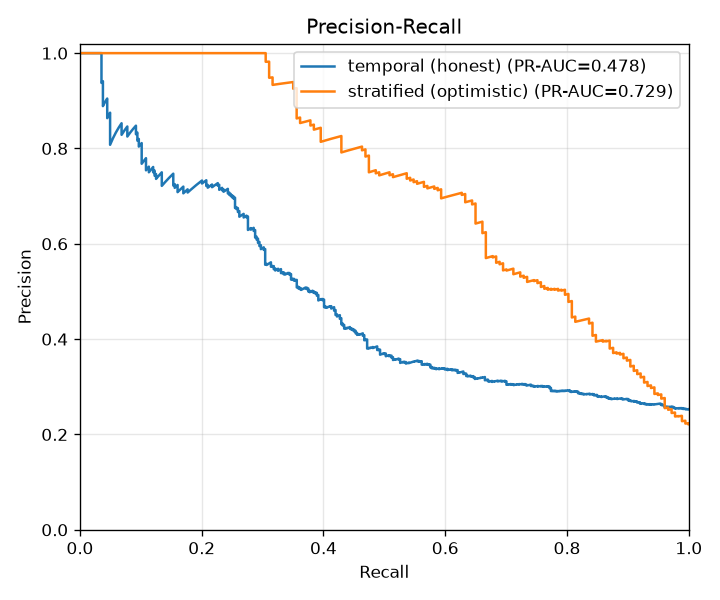
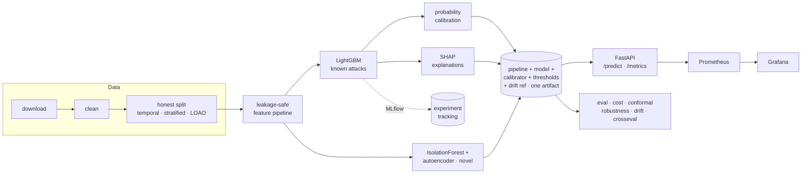

# NetSentry — ML Network Intrusion Detection

**A reproducible, leakage-safe machine-learning pipeline that detects network
intrusions in flow data — pairing a supervised classifier for known attacks with
an unsupervised anomaly detector for novel ones, served behind a real-time API
with explainable predictions.**


> **Reviewing this repo?** [`docs/TOUR.md`](docs/TOUR.md) is the ten-minute guided
> path: each claim, paired with the code that implements it, the test that enforces
> it, and the report it produced.

---

## Project status

**Released `v0.20.0`.** The build plan in
[`BUILD_PROMPTS.md`](BUILD_PROMPTS.md) ran in ten phases; all ten are implemented,
tested, and committed, and seventeen post-release waves build on top — the
ML-engineering suite (calibration, adversarial robustness, cost-sensitive
thresholds, conformal prediction, Optuna HPO, a Prometheus/Grafana stack), the
adaptive-operations wave (the base-rate fallacy measured, adaptive conformal,
threshold refresh, exemplar evidence, pcapng, incident reports), the
defense-and-operations wave (poisoning defense re-measured, threshold transfer
priced, a discrete-event SOC queue simulation, canary-gated hot reload, and an
ECS spool watcher), the **SOC-native integrations wave** (the signature
baseline exported as Sigma rules, detections as STIX 2.1 bundles, cross-flow
beaconing/C2 detection, and production Kubernetes manifests), the
**explainability-depth & parser-hardening wave** (partial dependence + ICE, and a
fuzz harness pinning the capture parser's never-crash contract), the
**adversarial-privacy & host-graph wave** (a membership-inference privacy audit that
completes the evasion/poisoning/**privacy** attack triad, and host-graph analytics
for the scan fan-out and lateral-movement chains the identity-blind per-flow model
can't see), and the **privacy & explainable-anomaly wave** (differentially-private
training with a from-scratch Rényi accountant, priced on a utility–leakage frontier;
and the anomaly detector made explainable — per-feature attribution with a
faithfulness check, served live via `?anomaly_explain=true`), and the
**adversarial-completeness & attribution wave** (a model-extraction attack that
completes the evasion/poisoning/privacy/**extraction** quadrilogy, exact KNN-Shapley
training-data valuation, Friedman's H-statistic feature interactions, and *certified*
robustness via randomized smoothing — the provable-radius counterpart to the empirical
evasion study), and the **statistical-guarantees wave** (prediction-powered inference for a
tight *and* valid attack-prevalence estimate from a handful of labels; a conformal test
martingale giving drift detection a false-alarm bound that holds at any stopping time; the
H-measure, a coherent alternative to ROC-AUC's classifier-dependent cost weighting; and
anchors — high-precision IF-THEN rule explanations with a coverage trade-off), and the
**label-efficiency & attribution wave** (weak supervision that trains a detector from the
signature rules alone with an agreement-gated Dawid-Skene label model; a BadNets backdoor attack
with a blind spectral-signatures defense; label-shift estimation and correction that recovers the
deployment prior from unlabelled traffic via the confusion matrix; influence functions that
attribute a verdict to its training flows, validated against real leave-one-out; and online
expert advice — Hedge + fixed-share — that tracks the best model under drift with a regret bound),
and the **governance & distribution-shift wave** (PU learning that trains from confirmed attacks +
unlabelled traffic when nobody verified the benign side; a conformal + Benjamini-Hochberg
false-discovery-rate guarantee on the alert batch where a fixed FPR's precision collapses;
covariate-shift importance weighting that diagnoses the temporal gap as *concept*, not covariate,
shift; SISA machine unlearning that honours a deletion request by rebuilding one shard, verified
identical to a from-scratch model; and a backdoor-based model watermark that proves ownership with
an exact binomial p-value and honestly measures where it fails — extraction), and the
**worst-case, distributed & governed wave** (predictive multiplicity — 41% of the alerts raised
are contested by an equally-good model; a sensor-failure audit of the deployed model under
exporter faults, including the mis-assembly fault PSI cannot see by construction; a budgeted
cascade returning 5.6x throughput for 96% of detection; Wald's SPRT deciding host compromise with
both error rates controlled; federated averaging across sites that cannot pool traffic;
peeking-safe confidence sequences for the shadow-promotion decision; label-free attack-family
discovery with its null result diagnosed; and a MITRE ATLAS threat model of the detector itself,
verified against the repository so a deleted study downgrades its own coverage claim), and the
**guarantees, counterfactuals & worst-case wave** (a Neyman-Pearson threshold that *certifies*
the false-positive budget rather than targeting it — the deployed rule violates its own budget
51% of the time — plus the sample-size floor below which no threshold can certify it at all;
extreme-value tails placing operating points the empirical quantile cannot resolve, and the
bounded-tail regime where extrapolation provably buys nothing; off-policy evaluation of triage
policies from logs a different policy wrote, where 77% of the counterfactual is unanswerable
without a deliberate 0.5% exploration budget; epistemic-vs-aleatoric uncertainty tested by
deleting an attack class from training — and failing exactly where novelty detection matters;
deterministic interval-arithmetic verification giving an **absolute** robustness radius for the
deployed ensemble, gated on reproducing LightGBM's own scores; group DRO whose adversary
declined to reweight and whose emphasis made the worst group monotonically worse;
Byzantine-robust aggregation where one lying site in twelve costs a third of FedAvg; and
Kaplan-Meier time-to-detection showing the naive latency understates by 8x because it deletes
the attacks nobody caught), and the **decision-time, structure & proof wave** (feature-availability tiers showing the deployed detector is structurally a *post-mortem* one and that an in-flight model beats it outright on a dominated frontier; hierarchical scoring over the ATT&CK tree, which comes out *harsher* than flat accuracy because path length makes a miss cost twice a false alarm with nobody choosing a weight; learning to defer, which loses against its own control and says why in a ratio; ICP and IRM over capture days, where 42% of features point in opposite directions and the premise fails; monotone constraints making inflation evasion **impossible by construction** — 100% provably robust, proved and attacked and probed, at +3.6% detection; branch-and-bound optimal sparse trees with an exhaustion certificate showing greedy CART up to 69% off; and Count-Min / HyperLogLog / Misra-Gries / reservoir sketches whose every bound is graded against exact truth, including where the sketch loses), and the **operations, oracles & honest-uncertainty wave** (open-set recognition, which reframes the temporal split as what its class table says it is — train and test share *zero* attack classes, so every attack the model meets is an unknown one — and finds the deployed novelty rule's lead carried entirely by `DDoS` while it is blind to `PortScan` at 0.2%, below the false-alarm rate itself; metamorphic testing, a correctness oracle that needs **no labels** and can therefore run against production traffic, whose structural relations hold bit-exactly and whose semantic ones show the model is not invariant to its own exporter's clock — one alert in 154 is decided by the capture's timing resolution; a three-oracle mutation study where none of labelled accuracy, label-free invariants, or the canary dominates the others; SLO error budgets with multiwindow burn-rate alerting whose first finding is that the objective it was handed is already violated by the *healthy* system; a hash-chained alert ledger with every tamper attack executed against it, the tail-truncation gap demonstrated and then closed with a published anchor, and O(log n) Merkle inclusion proofs; and Beta-Binomial partial pooling so a two-flow class stops reading like a seven-hundred-flow one, with the credible intervals' coverage validated by simulation before anyone is asked to read them; and the evasion arms race solved as a game, which returns a kept negative — against a detector this weak, disguising is irrational at every operating point, because an attacker who does nothing already gets 91% of their traffic through with the attack intact), and the **adaptation, control & architecture wave** (what happens *after* training, where three of five studies produced a headline that looked like a win next to a deployment consequence that was not: a from-scratch Hoeffding tree + ADWIN that beats the frozen model prequentially on a tenth of a megabyte of state and still cannot be deployed, because thirty leaves cannot resolve a one-in-a-thousand false-alarm budget; continual learning showing warm-start fine-tuning forgets **61%** of the first attack family's detection while saving only 19% of the training time and quadrupling inference cost; a closed-loop threshold controller that delivers the analyst budget the open-loop threshold misses by 100% and then hands an attacker **4.4 points of invisibility bought by generating alerts**, with the mitigation measured too; kernel two-sample drift testing that catches the joint change the deployed per-feature monitors are blind to *by construction* — their KS statistics under the fault come back bit-identical to the unfaulted run — and reports that the same fault is a no-op on this stand-in because its features are nearly independent; and an FT-Transformer put against the boosted incumbent under one shared protocol, because the reason this project uses trees was a citation rather than a measurement)), and the **distribution, representation & scale wave** (eight studies about the parts of a
detection system that are not the model: secure aggregation implemented from scratch, which
first shows a coordinator naming each site's attack family from its update 81% of the time and
then removes the channel — at the cost, measured rather than mentioned, of every Byzantine
defence the project already owns; a differentially-private synthetic release whose privacy cost
is **invisible to PR-AUC and plainly visible at the operating point**; self-supervised
pretraining that beats its own controls by 0.043 at a hundred labels and 0.001 at twenty-eight
thousand — label efficiency, not a better ceiling; distribution-free control of the **miss
rate** the contract actually names, where an expectation bound is exceeded by 39-46% of
individual deployments and the two-clause contract comes back provably infeasible; budgeted
sampling where the design that catches the most attacks is the one under which **no unbiased
estimator of what you missed exists**; automatic slice discovery with a permuted null that
returns zero findings and a winner's curse that costs the marginal slices half their effect;
server-side batching that moves the capacity ceiling 629x and needed its queueing model
replaced, because a batching server is self-regulating rather than M/D/1; and a Pareto front
whose concave members **no weighted sum can ever select**), and the **sharing, budgets & accountability wave** (private set intersection so one organisation can ask another about an indicator without naming it, alongside the complete dictionary attack that breaks the hash exchange it replaces — the entire IPv4 space in 7.9 hours, and salting the list buys 0.28 seconds — and the inflation attack the protocol has no defence against at all; cost-aware feature acquisition at the exporter, where **four features beat all seventy-six** and the adaptive policy loses to its own random-gating placebo because the cheap tier ranks attacks no better than chance; streaming quantile estimation that holds the 0.1% operating point in **160 bytes** and is graded in alert volume rather than threshold error, where 9 of 10 approximations are operationally identical and every one of them fails the same way when the stream moves; and a conformance mapping onto NIST AI RMF 1.0 and the EU AI Act's high-risk articles in which **every control's evidence is verified against the tree, so a deleted study downgrades its own claim**, and the two unmeetable obligations are named rather than finessed), and the **self-audit wave** (four studies that check what this project had been taking on trust: its own coding rules, turned into six static-analysis rules that are graded by injecting the violations they claim to catch and that produced **five real fixes** in the codebase; its own anomaly premise, where a detector that **never sees the training data** beats four of the six trained ones and almost no skill survives removing a size proxy; its own serving contract, driven as a state machine through 200-operation sequences with **five injected regressions** proving the checker can fail; and its own operating point, against a contextual bandit that achieves the textbook `sqrt(T)` regret and still loses to a threshold chosen once on validation, because **what its exploration spends is the alert budget**).
`make check` is green (lint + type-check + **1,554 passing tests**, property-based invariants and a
Hypothesis parser fuzzer included), and the full `download → prep → train → eval →
serve` pipeline runs end-to-end on the bundled synthetic data (raw packet captures
included, via `netsentry pcap`), followed by a **model-lifecycle layer** (noise
floor → release gate → promotion → canaries → shadow → retrain policy) that governs
what actually ships.

| Phase | Scope | Status |
|---|---|---|
| 0 | Scaffolding, config, tooling, CI | ✅ Done |
| 1 | Data ingestion + schema + data card | ✅ Done |
| 2 | Cleaning & EDA | ✅ Done |
| 3 | Honest splits + leakage-safe feature pipeline | ✅ Done |
| 4 | Baseline + LightGBM supervised model | ✅ Done |
| 5 | Operational evaluation framework | ✅ Done |
| 6 | Anomaly detection (Isolation Forest + autoencoder) | ✅ Done |
| 7 | SHAP explainability | ✅ Done |
| 8 | FastAPI serving | ✅ Done |
| 9 | Containerization & CI | ✅ Done |
| 10 | Docs, model card, README | ✅ Done |
| S1 | Cross-dataset generalization study | ✅ Done |
| S2 | Drift monitoring (PSI + Prometheus gauge) | ✅ Done |
| S3 | Streamlit demo dashboard | ✅ Done |
| S4 | vulnpipe finding triage | ✅ Done |
| S5 | ONNX export + quantized inference | ✅ Done |

### Beyond v0.1.0 — advanced ML-engineering capabilities

| Area | What it adds | Status |
|---|---|---|
| Probability calibration | isotonic/Platt calibrator + reliability/Brier/ECE diagnostics | ✅ Done |
| Adversarial robustness | mimicry + adaptive query-search evasion, robustness curves | ✅ Done |
| Adversarial hardening | adversarial training vs mimicry, re-measured (measure → fix → re-measure) | ✅ Done |
| Certified robustness | randomized smoothing → a **provable** L2 radius per flow (Cohen et al. 2019) | ✅ Done |
| Membership inference | privacy audit (Shokri shadow + Yeom threshold); the overfit reference prices the leak | ✅ Done |
| Differential privacy | DP-SGD + a from-scratch pure-stdlib Rényi accountant; the (ε, δ) guarantee priced on a utility–leakage frontier | ✅ Done |
| Model extraction | query-only model stealing → surrogate + black-box transfer evasion; the defense priced (Tramèr) | ✅ Done |
| Model watermarking | prove ownership by backdooring: exact binomial test, innocent-model control, extraction-survival measured (Adi et al. 2018) | ✅ Done |
| Machine unlearning | SISA exact deletion: sharding tax, per-request cost, verified forgetting via the membership signal (Bourtoule et al. 2021) | ✅ Done |
| Cost-sensitive thresholds | decision-theoretic operating point (SOC economics) | ✅ Done |
| Alert-queue planning | detection vs analyst budget; lift over random triage | ✅ Done |
| SOC queue simulation | discrete-event M/G/c queue: FIFO vs score-priority attack-SLA | ✅ Done |
| Base-rate stress test | alert precision vs production prevalence (Axelsson 1999) | ✅ Done |
| Conformal prediction | distribution-free coverage + selective alerting | ✅ Done |
| Adaptive conformal | coverage restored online under drift (ACI); the review-load price | ✅ Done |
| Hyperparameter search | leakage-safe Optuna HPO (`train tune`) | ✅ Done |
| Observability | Prometheus + Grafana dashboard + alert rules | ✅ Done |
| Statistical drift | per-feature KS + Benjamini–Hochberg FDR, online Page–Hinkley / DDM | ✅ Done |
| Anytime-valid drift | conformal test martingale: a Ville-bounded false-alarm rate at any stopping time (Vovk 2003) | ✅ Done |
| Covariate shift | zero-label density-ratio diagnosis (domain classifier) + importance-weighted retraining; the temporal gap diagnosed as concept, not covariate, shift (Shimodaira 2000) | ✅ Done |
| Multivariate drift | kernel two-sample testing (MMD): the joint change per-feature monitors are blind to *by construction*, with the null calibrated first (Gretton 2012) | ✅ Done |
| Optimal transport | a drift distance **in units** plus the coupling that explains it — and the finding that only a *coupling* makes evasion distributionally invisible (Monge/Kantorovich; Cuturi 2013) | ✅ Done |
| Statistical rigor | bootstrap CIs + gap significance test | ✅ Done |
| Coherent metric | the H-measure: a shared, explicit cost prior fixes ROC-AUC's incoherence (Hand 2009) | ✅ Done |
| Prediction-powered inference | attack prevalence from few labels + the model, tighter than classical at valid coverage (Angelopoulos 2023) | ✅ Done |
| Conformal alert FDR | a **false-discovery-rate guarantee** on the alert batch: conformal p-values + Benjamini–Hochberg, holds where a fixed FPR's precision collapses (Bates et al. 2023) | ✅ Done |
| Label-shift correction | recover + correct for the deployment prior with **zero** labels: BBSE + MLLS/EM (Lipton 2018, Saerens 2002) | ✅ Done |
| Explanation trust | feature-importance stability across bootstrap refits | ✅ Done |
| Glass-box modelling | a from-scratch GAM/GA2M that **is** its own explanation and can be *edited*, with a capacity dial showing what the honest split punishes (Lou, Caruana & Gehrke 2012) | ✅ Done |
| Threat intel | MITRE ATT&CK mapping in predictions + coverage report + Navigator layer | ✅ Done |
| Data efficiency | learning curves (does more data help?) | ✅ Done |
| Active learning | uncertainty vs random labeling (label-efficiency win) | ✅ Done |
| Streaming lifecycle | prequential static-vs-retrained on the later-day stream | ✅ Done |
| Online learning | a from-scratch Hoeffding tree (VFDT) + ADWIN: per-flow updates in bounded memory, and the operating point a 30-leaf model cannot reach | ✅ Done |
| Continual learning | class-incremental updates across capture days: forgetting, replay, and the compute argument checked (Lopez-Paz & Ranzato 2017) | ✅ Done |
| Closed-loop control | alert volume held at the analyst budget by PI feedback — and the control-loop attack that suppresses detection by *generating* alerts | ✅ Done |
| Deep tabular models | FT-Transformer + MLP against the boosted incumbent under one protocol (Gorishniy 2021): the trees-win claim checked, not cited | ✅ Done |
| Operating-point training | a differentiable **partial-AUC** surrogate — train for the false-positive budget the SOC deploys, not for the loss (Narasimhan & Agarwal 2013) | ✅ Done |
| Expert advice (online) | Hedge + fixed-share track the best model under drift with a **regret bound** (Herbster & Warmuth 1998) | ✅ Done |
| Self-training | the pseudo-label shortcut priced against the labeled ceiling | ✅ Done |
| Weak supervision | the signatures as labeling functions: a detector trained on zero labels, agreement-gated label model (Ratner 2016) | ✅ Done |
| PU learning | confirmed attacks + unlabeled traffic: recover `c`, weighted retrain, de-contaminated FPR budget (Elkan & Noto 2008) | ✅ Done |
| Feature ablation | leave-one-family-out (which behaviours carry detection) | ✅ Done |
| Detection parity | per-service TPR/FPR audit (Wilson CIs) → served `per_service` profile | ✅ Done |
| Campaign detection | (day, class) operations: first-alert latency, silent campaigns | ✅ Done |
| Novelty distance | the split gap decomposed: composition vs at-distance shift | ✅ Done |
| Temporal sensitivity | leave-one-day-out: every day takes a turn as the future | ✅ Done |
| Rules baseline | ML benchmarked against a signature ruleset at matched FPR | ✅ Done |
| Model leaderboard | every family, one honest protocol; the split picks the winner | ✅ Done |
| Leakage attribution | reproduce the field's ~99% and price each source (split → port → identifier) | ✅ Done |
| Training-set poisoning | label-flip + benign-pool contamination curves | ✅ Done |
| Poisoning defense | audit-and-drop sanitization, re-measured (measure → fix → re-measure) | ✅ Done |
| Backdoor / trojan | BadNets trigger poisoning (clean metrics stay green, triggered attacks walk through) + spectral-signatures defense (Tran 2018) | ✅ Done |
| Label-noise audit | confident-learning flags, self-validated on planted flips | ✅ Done |
| Training-data valuation | exact KNN-Shapley per flow → mislabel detection (self-validated) + value-guided pruning | ✅ Done |
| Data quality | schema / label / duplicate validation gates | ✅ Done |
| Testing rigor | property-based invariants (hypothesis) over metrics, drift, cleaning | ✅ Done |
| Parser fuzzing | hypothesis fuzz harness asserting the capture parser never crashes on untrusted bytes | ✅ Done |
| Batch inference | offline `score` a CSV/Parquet of flows to predictions | ✅ Done |
| Incident reports | alerts folded into analyst-ready incidents with ATT&CK context | ✅ Done |
| Counterfactual recourse | minimal change that would clear a flagged flow | ✅ Done |
| Exemplar explanations | nearest known training flows per prediction, audited then served | ✅ Done |
| Explainable anomaly | per-feature attribution for anomaly flags (occlusion + a faithfulness check), served via `?anomaly_explain` | ✅ Done |
| Feature interactions | Friedman's H-statistic → which features the model has entangled (completes the PDP caveat) | ✅ Done |
| Anchor explanations | high-precision IF-THEN rules with a coverage trade-off, held-out-validated (Ribeiro 2018) | ✅ Done |
| Influence functions | which training flows caused a verdict, validated against real leave-one-out (Koh & Liang 2017) | ✅ Done |
| Supply chain | CycloneDX SBOM + signed model manifest + `verify` gate | ✅ Done |
| Verifiable inference | proof-carrying verdicts: the ensemble committed as a Merkle tree, seven forgeries refused, and the verifiability/confidentiality trade measured in certificates | ✅ Done |
| Governance & API | auto-generated model card + API-key auth / rate limiting | ✅ Done |
| Seed sensitivity | same-seed reproducibility asserted + the cross-seed noise floor | ✅ Done |
| Release gate | executable definition of done; a *too-good* PR-AUC **fails** it | ✅ Done |
| Champion/challenger | paired-bootstrap promotion; margins from the measured noise | ✅ Done |
| Retrain triggers | never / periodic / drift-triggered, priced on the stream | ✅ Done |
| Threshold refresh | the label-cheap lever vs retraining; drift cost decomposed | ✅ Done |
| Behavioral canaries | the bundle must reproduce its build-time scores at load | ✅ Done |
| Shadow challenger | a second model scored silently; live disagreement metrics | ✅ Done |
| Surrogate distillation | the model's closest auditable imitation, fidelity priced | ✅ Done |
| Packet ingestion | raw pcap/pcapng → CIC flows → verdicts, pure-stdlib capture stack | ✅ Done |
| Zeek ingestion | conn.log (TSV/JSON) → CIC features → verdicts, limits stated | ✅ Done |
| Spool watcher | watch a flow-file directory → ECS JSON-lines alerts for a SIEM | ✅ Done |
| Canary-gated hot reload | swap the served model in place only if it reproduces its canaries | ✅ Done |
| Sigma export | the signature baseline as portable Sigma rules for any SIEM | ✅ Done |
| STIX 2.1 export | detections as a standards-conformant threat-intel bundle (TAXII/MISP/OpenCTI) | ✅ Done |
| Beaconing / C2 | cross-flow periodicity detection the identity-blind model can't see | ✅ Done |
| Host-graph analytics | scan fan-out + lateral-movement chains: the cross-flow topology the model can't see | ✅ Done |
| Kubernetes deploy | production Helm chart + Kustomize manifests, hardened + autoscaled | ✅ Done |
| Predictive multiplicity | how arbitrary is the verdict across equally-good models — 41% of alerts are contested (Marx 2020) | ✅ Done |
| Sensor-failure audit | the deployed model with a broken exporter; the fault PSI cannot see | ✅ Done |
| Budgeted cascade | two-stage inference: 5.6x throughput for 96% of detection, escape budget priced | ✅ Done |
| Sequential host decisions | Wald's SPRT: call a host compromised with **both** error rates controlled (1945) | ✅ Done |
| Federated training | FedAvg across sites that cannot pool traffic, priced against pooled and alone (McMahan 2017) | ✅ Done |
| Anytime-valid A/B | peeking-safe confidence sequences: when the shadow model can be promoted (Robbins 1970) | ✅ Done |
| Attack-family discovery | clustering the flagged pile with k chosen **without labels**; the null result diagnosed | ✅ Done |
| MITRE ATLAS coverage | the detector as a target: the whole adversarial suite as one governed threat model | ✅ Done |
| Certified FP budget | Neyman-Pearson order-statistic threshold: `P(FPR > alpha) <= delta`, finite-sample, with the sample-size floor it implies (Tong, Feng & Li 2018) | ✅ Done |
| Extreme-value thresholds | peaks-over-threshold GPD fit for operating points the empirical quantile cannot resolve; the bounded-tail limit measured (Siffer et al. 2017) | ✅ Done |
| Off-policy evaluation | value a triage policy from logs a different policy wrote: IPS/SNIPS/doubly-robust, and the exploration budget that makes it answerable (Dudik 2011) | ✅ Done |
| Uncertainty decomposition | epistemic vs aleatoric over an ensemble, tested by deleting an attack class from training — and failing where it matters | ✅ Done |
| Deterministic verification | a **sound, absolute** robustness radius for the deployed ensemble by interval arithmetic, sandwiched with a real attack (Chen et al. 2019) | ✅ Done |
| Worst-group training | group DRO over capture days, against a size-balanced control; the premise fails and the report says why (Sagawa et al. 2020) | ✅ Done |
| Byzantine robustness | one lying site costs a third of FedAvg; median / trimmed mean / Krum priced, including when nobody attacks (Blanchard 2017, Yin 2018) | ✅ Done |
| Survival analysis | Kaplan-Meier time-to-detection with the never-detected campaigns in the denominator; log-rank across operating points | ✅ Done |
| Decision latency | feature-availability tiers: when a flow verdict can first exist, and the dominated frontier showing waiting for the flow to end *costs* detection | ✅ Done |
| Taxonomy-aware evaluation | hierarchical P/R/F1 over the ATT&CK tree + a five-way error decomposition priced by playbook (Kiritchenko et al. 2006) | ✅ Done |
| Learning to defer | expected-loss escalation to a capacity-bound analyst, with the analyst's competence as the experimental variable (Madras et al. 2018) | ✅ Done |
| Causal invariance | ICP screening + IRMv1 over capture days, with the premise checked first and found to fail (Peters 2016, Arjovsky 2019) | ✅ Done |
| Monotone constraints | inflation evasion made impossible by construction: 100% provably robust, proved + attacked + probed, at no detection cost | ✅ Done |
| Optimal sparse trees | branch-and-bound optimal decision trees with an exhaustion certificate; greedy CART is up to 69% off (Hu, Rudin & Seltzer 2019) | ✅ Done |
| Streaming sketches | Count-Min / HyperLogLog / Misra-Gries / reservoir from scratch, every bound graded against exact truth (Cormode 2005, Flajolet 2007) | ✅ Done |
| Open-set recognition | the temporal split scored as what it is: train and test share zero attack classes, so seven novelty rules compete on OSCR + an openness sweep (Scheirer 2013, Dhamija 2018) | ✅ Done |
| Metamorphic testing | a label-free correctness oracle: structural relations hold bit-exactly, semantic ones expose a clock dependence, validated by a three-oracle mutation study (Chen 1998, Xie 2011) | ✅ Done |
| Detection SLOs | error budgets + multiwindow burn-rate alerting, closed form and replay-checked, with generated Prometheus rules (Google SRE Workbook) | ✅ Done |
| Tamper-evident ledger | hash-chained alert history: six attacks executed, the truncation gap closed with an anchor, O(log n) Merkle inclusion proofs | ✅ Done |
| Rare-class estimation | Beta-Binomial partial pooling with empirical-Bayes hyperparameters; coverage validated by simulation, 1.4x narrower than Wilson | ✅ Done |
| Strategic equilibrium | the arms race as a game: a kept negative result — evasion is irrational against a detector this weak, with the flip point quantified | ✅ Done |
| Secure aggregation | federate without the coordinator seeing any site's update: DH masks, Shamir dropout recovery, and the measured tension with Byzantine defence (Bonawitz 2017) | ✅ Done |
| DP synthetic release | share the traffic instead of the model: PrivBayes-family release, train-synthetic/test-real, and the operating point as the only metric that sees epsilon | ✅ Done |
| Self-supervised pretraining | VIME + SCARF on unlabelled flows against PCA and an untrained encoder: label efficiency, not a better ceiling | ✅ Done |
| Distribution-free risk control | bound the **miss rate** the contract names: conformal risk control vs Learn-then-Test, and an infeasibility certificate for two clauses at once (Angelopoulos 2021, 2022) | ✅ Done |
| Budgeted sampling | score 1% of the stream and still estimate the rest: Horvitz-Thompson with measured interval coverage, and the design with no estimator at all | ✅ Done |
| Automatic slice discovery | find the underperforming regions nobody predefined, with a permuted null and the winner's curse measured at the margin (Chung 2019) | ✅ Done |
| Server-side batching | 10.03 ms fixed vs 0.0149 ms marginal: the capacity ceiling moves 629x, and the self-regulating queue model that predicts it to 0.9% | ✅ Done |
| Multi-objective selection | a Pareto front over detection, cost and evasion-resistance (NSGA-II from scratch) and the members **no** weighted sum can reach | ✅ Done |
| Private set intersection | ask a peer about an indicator without naming it: DH-PSI over RFC 3526 group 14, the dictionary attack on hashed sharing executed, and the inflation attack the protocol has no answer for | ✅ Done |
| Cost-aware feature acquisition | what a compute budget buys at the exporter: four features beat all 76, and the adaptive policy loses to its own random-gating placebo | ✅ Done |
| Streaming quantiles | hold the operating point at line rate in 160 bytes (P-squared, t-digest, histogram, reservoir), graded in alert volume rather than in threshold error | ✅ Done |
| Conformance mapping | NIST AI RMF 1.0 and EU AI Act Articles 9-15 mapped onto 26 controls, each verified against the tree: delete the evidence and the control downgrades itself | ✅ Done |
| ML-invariant static analysis | the leakage rules enforced by a parser, graded by injecting the violations it claims to catch: 12 of 12 caught, 0 false alarms, 5 real fixes | ✅ Done |
| Anomaly-score semantics | is the score a density or a size: an untrained control beats four of six detectors, and almost no skill survives removing the size proxy | ✅ Done |
| Serving lifecycle conformance | the API contract as a state machine driven through random operation sequences, with five injected regressions proving the checker fails | ✅ Done |
| Online triage learning | a contextual bandit at the textbook `sqrt(T)` regret that still loses to a fixed threshold, and spends the alert budget finding out | ✅ Done |
| Point-in-time feature store | as-of joins for host context, and the temporal leak the one-line `groupby` creates: 1.000 offline, 0.583 in production | ✅ Done |

Per-phase engineering notes and self-audits live in [`NOTES.md`](NOTES.md);
release notes in [`CHANGELOG.md`](CHANGELOG.md).

## Why this project is different

Most public CIC-IDS2017 projects report ~99.9% accuracy. That number is almost
always an artifact of **data leakage** (identifier columns + a naive random
split) and a metric (accuracy) that is meaningless on data that is ~80% benign.
NetSentry is built to be the project that does it right:

- **Leakage-safe by construction** — identifier/timestamp columns are dropped and
  all preprocessing is fit on the training split only (a `remainder="drop"`
  `ColumnTransformer` is the firewall; a test enforces no leak survives).
- **Honestly evaluated** — the headline result uses a **temporal / by-day split**,
  not a shuffled one, and the optimistic random-split number is reported beside
  it so the gap is visible.
- **Operational metrics** — leads with PR-AUC, per-class recall, and **detection
  rate at a fixed false-positive budget**, because in a SOC the binding
  constraint is analyst time, not raw accuracy.
- **Detects the unknown** — a benign-only anomaly detector flags attack classes
  the supervised model never trained on (leave-one-attack-out).
- **Explainable** — every prediction returns the top contributing features (SHAP),
  and `netsentry recourse` adds the counterfactual *what-if*: the minimal change that
  would clear a flagged flow (the analyst's triage aid, and the defensive mirror of
  the evasion study).
- **Calibrated** — tree scores are not probabilities, so the attack probability is
  passed through a monotonic isotonic/Platt calibrator (fit on validation); the
  report shows the reliability diagram and the Brier/ECE/MCE drop. A reported
  probability and an FP budget only mean something once the score is calibrated.

> ### ⚠️ A note on the numbers below
> The CIC-IDS2017 dataset requires registration with the CIC and is not shipped
> here. So that the whole pipeline is reproducible out-of-the-box, NetSentry
> includes a **schema-faithful synthetic data generator** (same columns, same
> defects, same imbalance, per-day attack layout). **The metrics below are from
> that synthetic stand-in — they demonstrate the methodology, not real-world
> performance.** To reproduce on the real data, drop the CSVs in `data/raw/`
> (or set `data.source_url`) and re-run; the commands and framing are identical.

## Headline results

> _Temporal split (the honest number), on synthetic data. Full report + figures
> in [`docs/reports/evaluation.md`](docs/reports/evaluation.md) and
> [`docs/figures/`](docs/figures)._

| Metric | Score |
|---|---|
| PR-AUC, attack vs benign (temporal, **honest**) | **0.529** (baseline 0.250) |
| PR-AUC, attack vs benign (stratified, optimistic) | 0.786 |
| **Over-optimism gap** (stratified − temporal) | **+0.257** |
| Detection rate @ 0.1% FPR / @ 1% FPR (temporal) | 9.1% / 21.0% |
| Anomaly detector — avg detection of held-out attacks @ 1% FPR | 8.5% (autoencoder), 4.3% (iForest) |
| Ensemble vs best single scorer (temporal PR-AUC) | 0.537 vs 0.529 |
| Inference latency p50 / p95 (single flow, local) | ~48 / ~53 ms (**13 / 15 ms** with `?explain=false`) |
| Throughput (single process) | ~22 req/s with SHAP per request; **~75 req/s** without |



The optimistic shuffled split scores markedly higher than the honest temporal
split. **That gap is the finding** — it is the over-optimism most CIC-IDS write-ups
ship as a headline. Reporting the temporal number is the point. The gap is
**statistically significant** (bootstrap 95% CI [+0.239, +0.276], p < 0.001), and
the temporal PR-AUC interval excludes the majority baseline — the report carries
percentile-bootstrap CIs for every headline metric so the comparison is judged, not
assumed.

## Architecture


```mermaid
flowchart LR
    subgraph Data
        DL[download] --> CL[clean] --> SP[honest split<br/>temporal · stratified · LOAO]
    end
    SP --> FP[leakage-safe<br/>feature pipeline]
    FP --> SUP[LightGBM<br/>known attacks]
    FP --> ANO[IsolationForest +<br/>autoencoder · novel]
    SUP --> CAL[probability<br/>calibration]
    CAL --> BUNDLE[(pipeline + model +<br/>calibrator + thresholds<br/>+ drift ref · one artifact)]
    ANO --> BUNDLE
    SUP --> SHAP[SHAP<br/>explanations] --> BUNDLE
    BUNDLE --> API[FastAPI<br/>/predict · /metrics]
    API --> PROM[Prometheus] --> GRAF[Grafana]
    BUNDLE --> EVAL[eval · cost · conformal<br/>robustness · drift · crosseval]
    SUP -.MLflow.-> TRACK[(experiment<br/>tracking)]
```

In short: `download → clean → honest split → leakage-safe feature pipeline →
LightGBM (known) + Isolation Forest/autoencoder (novel) → calibration → SHAP →
MLflow`, bundled into one pipeline+model artifact that a FastAPI service loads to
return calibrated, explained predictions — with an analysis suite (operational
eval, cost, conformal, robustness, drift) and a Prometheus/Grafana console on top.
Full write-up in [`docs/ARCHITECTURE.md`](docs/ARCHITECTURE.md).

## Tech stack

Python 3.11 · scikit-learn · LightGBM · PyTorch · SHAP · MLflow · FastAPI ·
pydantic · Prometheus · Docker · GitHub Actions · pytest/ruff/black/mypy.

Heavy ML libraries are optional extras with graceful fallbacks (LightGBM →
scikit-learn `HistGradientBoosting`, SHAP → permutation importance, MLflow →
local file logging, autoencoder → Isolation Forest), so the core install runs
anywhere and the pipeline degrades rather than breaks.

## Quickstart

```bash
make install                        # editable install + dev/train extras + hooks
netsentry download                  # fetch CIC-IDS2017 (or generate synthetic data)
netsentry prep                      # clean + honest splits + persisted features
netsentry validate                  # data-quality gates (schema, labels, dupes, balance)
netsentry train tune                # Optuna HPO on validation (writes configs/tuned.yaml)
netsentry train supervised          # train LightGBM, log to MLflow
netsentry train anomaly             # benign-only anomaly detector + leave-one-attack-out
netsentry eval                      # operational metrics report + figures (+ bootstrap CIs)
netsentry learningcurve             # PR-AUC vs training size (does more data help?)
netsentry slices                    # per-attack-class detection (known vs novel)
netsentry campaigns                 # campaign-level detection + first-alert latency
netsentry subgroups                 # per-service detection/false-alarm parity audit
netsentry novelty                   # detection vs distance-to-training (split gap decomposed)
netsentry lodo                      # leave-one-day-out temporal sensitivity
netsentry labelaudit                # find likely label errors (self-validated)
netsentry datavalue                 # value each training flow (KNN-Shapley): mislabels + pruning
netsentry rules                     # ML vs a signature ruleset at a matched FPR budget
netsentry leaderboard               # every model family under the identical honest protocol
netsentry leakage                   # reproduce the field's ~99% and attribute it to each source
netsentry ablation                  # leave-one-feature-family-out importance
netsentry importance                # feature-importance stability (are explanations trustworthy?)
netsentry pdp                       # partial dependence + ICE (the shape of the model's response)
netsentry interactions              # Friedman's H-statistic: which features the model has entangled
netsentry anomexplain               # why is a flow anomalous? per-feature anomaly attribution + faithfulness
netsentry exemplars                 # case-based explanations: do known cases vouch for alerts?
netsentry distill                   # the model's closest auditable tree, fidelity priced
netsentry activelearning            # uncertainty vs random labeling (label efficiency)
netsentry selftrain                 # pseudo-labels on the unlabeled stream vs the labeled ceiling
netsentry poisoning                 # detection decay under training-set poisoning
netsentry harden                    # adversarial training vs mimicry, then re-measure
netsentry certify                   # certified L2 robustness via randomized smoothing (a provable radius)
netsentry privacy                   # membership-inference audit: does the model memorise its data?
netsentry dp                        # differential privacy: detection & leakage vs the epsilon budget
netsentry extraction                # model stealing: query-only surrogate + black-box transfer evasion
netsentry alertqueue                # detection vs analyst budget (lift over random triage)
netsentry socsim                    # simulate the analyst queue: FIFO vs score-priority SLA
netsentry sanitize                  # audit-and-drop poisoned labels, then re-measure
netsentry transfer                  # re-buy the FPR budget on a foreign set: quantile vs labels
netsentry baserate                  # alert precision vs production base rate (Axelsson's fallacy)
netsentry adaptiveconformal         # conformal coverage restored online under drift (ACI)
netsentry driftscan                 # KS+FDR + online Page-Hinkley/DDM drift detection
netsentry navigator                 # export ATT&CK Navigator layer (colored by detection)
netsentry provenance && netsentry verify   # SBOM + model manifest, then integrity gate
netsentry multiplicity              # how arbitrary is the verdict across equally-good models?
netsentry degrade                   # sensor failure: the deployed model with a broken exporter
netsentry cascade                   # budgeted two-stage inference: compute handed back, detection priced
netsentry sprt                      # decide host compromise sequentially, both error rates controlled
netsentry federated                 # FedAvg across sites that cannot pool their traffic
netsentry abtest                    # when can the shadow model be promoted? (peeking-safe)
netsentry discovery                 # cluster the flagged pile into campaigns, k chosen without labels
netsentry atlas                     # the detector as a target: MITRE ATLAS coverage + Navigator layer
netsentry seeds                     # training-noise floor: reproducibility + stability
netsentry gate                      # release bars incl. the too-good ceiling (exit code)
netsentry promote                   # champion/challenger promotion decision (exit code)
netsentry retrainpolicy             # when to retrain: triggers priced on the stream
netsentry refresh                   # threshold refresh vs retraining (the cheap lever, priced)
netsentry canary                    # replay the bundle's embedded flows (behavioral attest)
netsentry serve                     # FastAPI on :8000 (builds a demo model if none)
netsentry score -i flows.csv --output scored.csv   # offline batch scoring
netsentry incident -i flows.csv     # fold the alerts into an analyst-ready incident report
netsentry pcap -i capture.pcap      # raw packets (pcap/pcapng) → CIC flows → verdicts (--demo to try it)
netsentry zeek -i conn.log          # score the Zeek logs a network team already collects
netsentry watch -s spool/ --alerts alerts.ndjson   # watch a flow-file spool → ECS alerts
netsentry sigma                     # export the signature ruleset as portable Sigma rules
netsentry stix -i flows.csv         # export detections as a STIX 2.1 threat-intel bundle
netsentry beacon --demo             # rank talker pairs by C2-beacon periodicity (cross-flow)
netsentry graph --demo              # rank scan fan-out + lateral-movement chains (cross-flow topology)
netsentry modelcard                 # auto-generate the model-card spec sheet from the bundle
netsentry demo                      # Streamlit dashboard (pip install '.[demo]')
# or, one command:
docker compose -f docker/docker-compose.yml up --build
# deploy to Kubernetes:
helm install netsentry deploy/helm/netsentry -n netsentry --create-namespace
```

Example prediction:

```bash
curl -X POST localhost:8000/predict -H 'content-type: application/json' \
  -d @examples/sample_flow.json
# → {"predicted_class":"DDoS","is_attack":true,"attack_probability":0.95,
#    "anomaly_score":0.37,"is_anomaly":false,
#    "top_features":[{"feature":"...","contribution":0.21}, ...],
#    "model_version":"0.1.0","threshold_profile":"fpr_0.1pct",
#    "prediction_set":["attack"],"recommended_action":"auto_alert",
#    "mitre":{"tactic":"Impact","technique_id":"T1499","technique_name":"Endpoint Denial of Service",...}}
```

`is_attack` is the thresholded decision at the selected `threshold_profile`
(operator-selectable via `?profile=fpr_1pct`, the decision-theoretic
`?profile=cost_optimal`, or `?profile=per_service`, which judges each flow at its
service's own validation-calibrated threshold — the parity audit's finding shipped
as a serving feature; the flow's `Destination Port` rides along as routing metadata
and never enters the model); `attack_probability` is the calibrated score for
transparency. `prediction_set` / `recommended_action` are the conformal
selective-prediction outputs — `auto_alert`, `auto_clear`, or `review` (ambiguous or
novel) — so the API tells a SOC not just *what* but *whether to trust it*. The
prediction endpoints support optional API-key auth (`X-API-Key`) and a per-client
rate limit, both config-gated (`serving.api_key`, `serving.rate_limit_per_minute`),
while `/health` and `/metrics` stay open for probes. Explanations are the default
because they are part of the contract, and their cost is measured, not guessed:
SHAP is ~73% of request latency on the stand-in (p50 48 → 13 ms, ~22 → ~75 req/s),
so `?explain=false` gives throughput-bound callers the verdict-only fast path
(`top_features` comes back empty; every decision field is identical) —
`netsentry benchmark --no-explain` reproduces the comparison.

## Reproducibility

Every result is reproducible from a logged config + seed. `netsentry analyze`
regenerates the **entire analysis suite** in one command — operational evaluation,
calibration, cost, conformal, robustness, and drift — with a linked
[`docs/reports/INDEX.md`](docs/reports); `netsentry eval` regenerates just the
headline report and figures. MLflow holds params, metrics, artifacts, and the
environment for each run. Splits are persisted with content hashes so the same rows
never drift between train and test. Engineering decisions and self-audits are logged
in [`NOTES.md`](NOTES.md).

## Model lifecycle (what happens after the metrics table)

Most ML projects end at evaluation. NetSentry also ships the **decision layer**
between training and production — every stage is a command with an exit code a
pipeline can branch on:

| stage | command | what it decides |
|---|---|---|
| Noise floor | `netsentry seeds` | how much of any metric is training luck: same-seed refits are **bit-identical** (asserted), different seeds move PR-AUC by sd 0.0017 — the margin evidence for promotion. [Report](docs/reports/seed_variance.md) |
| Release gate | `netsentry gate` | absolute bars on the candidate: the leakage firewall **re-checked on the fitted artifact**, calibrator + threshold profiles present, a scoring smoke, metric floors — and a *ceiling*: PR-AUC > 0.999 **fails** (too good = suspected leakage). [Report](docs/reports/gate.md) |
| Promotion | `netsentry promote` | challenger vs champion on the same frozen rows, **paired bootstrap** (shared noise cancels), non-inferiority margins set just above the measured seed noise; the champion is a SHA-256-pinned snapshot and every decision lands in a JSONL history. [Report](docs/reports/promotion.md) |
| Behavioral attest | `netsentry canary` | `verify` proves the artifact's *bytes*; canaries prove its *behavior*: every persisted bundle embeds validation flows + its build-time scores, and the serving runtime must reproduce them (surfaced on `/health`, strict mode refuses to serve). |
| Live evidence | `serving.shadow_artifact_path` | a shadow challenger scores every request silently — never touching the response — and exports the score-delta histogram + decision disagreements to Prometheus: the promote comparison, gathered on live traffic. |
| Retrain policy | `netsentry retrainpolicy` | when drift should pull the retraining lever: never / periodic / PSI-triggered / every batch, priced prequentially on the later-day stream. [Report](docs/reports/retrain_policy.md) |

Two findings from building this layer are kept, not smoothed over:

- **The first real promotion decision was a HOLD.** A routine seed-43 retrain came
  back PR-AUC-equivalent (+0.0001, paired 95% CI [-0.0022, +0.0025]) but credibly
  worse at the 0.1%-FPR operating point (**-1.5pp detection**, CI excludes zero,
  p = 1.000). A ranking metric said "same model"; the operating point said "ships
  less detection" — the project's evaluation thesis resurfacing at the deployment
  layer, and the gate held the champion.
- **The PSI retrain trigger under-delivers, and the report says so.** It fires when
  later-day traffic first arrives, the redeploy resets its reference, and it never
  fires again — while labeled retraining keeps buying quality (mean batch PR-AUC
  0.413 vs the 0.534 every-batch ceiling). Score distributions can settle while
  quality is still being bought: a drift trigger is a cost-saver, not a substitute
  for labels.

`make lifecycle` runs the full sequence; CI runs it on every push and additionally
attests the promoted champion both ways (bytes via `verify`, behavior via `canary`).

## Demo dashboard

`netsentry demo` launches a Streamlit app: pick or edit a flow and watch the
verdict, attack probability, anomaly score, and SHAP explanation update live — the
inference engine and explanations behind the API, made tangible for a non-curl
audience. Install with `pip install '.[demo]'`.

## From packets to verdicts (PCAP ingestion)

The rest of the project consumes pre-computed flow features; `netsentry pcap`
closes the gap to the wire. A **pure-stdlib capture stack** — a classic-libpcap
reader (both byte orders, µs/ns timestamps, Ethernet/VLAN/raw-IP) and a
bidirectional flow assembler that reimplements the CICFlowMeter aggregation over
the project's canonical schema module — turns a `.pcap` into exactly the 78
feature columns the model trained on, then scores them through the same
`InferenceEngine` the API uses: **zero serving skew by construction**, and the
flow identity (IPs, ports, protocol) rides along as output metadata without ever
entering the model. Known departures from CICFlowMeter (bulk features, NaN rates
on zero-duration flows, close semantics) are deliberate and documented in the
module. `netsentry pcap --demo` builds a deterministic synthetic capture — benign
web/DNS sessions, a SYN port sweep, a flood — and scores it; on the stand-in
model the DoS-shaped flood is flagged at the 1%-FPR profile while the SYN sweep
is missed (PortScan is a later-day class the Mon–Wed model never saw — the same
finding the per-class slices report), an honest demonstration of the mechanics
rather than a detection claim. Malformed or non-IP traffic is counted and
skipped, never fatal. The same posture holds for the **pcapng** container,
which is parsed natively (both byte orders, per-interface `if_tsresol`
timestamp resolutions, concatenated sections; unknown block types skipped by
length) — IPv6 remains a stated limitation. Because a capture parser ingests
attacker-supplied binary — a classic memory-safety / DoS surface — that
"skip-don't-die" contract is not just asserted in prose but **fuzzed**: a
Hypothesis harness (`tests/unit/test_capture_fuzz.py`) drives arbitrary bytes,
valid-magic-plus-garbage, and byte-level mutations of a real capture through the
reader and asserts it only ever returns or raises the one typed `PcapReadError` —
never an uncaught `struct.error`, an unbounded allocation, or a hang.

## Incident reports (from verdicts to a response artifact)

Per-flow verdicts are the model's output; an analyst works *incidents*.
`netsentry incident -i flows.csv` scores a flow file through the same engine the
API serves and folds the alerts into incidents — consecutive same-class alerts,
small benign gaps bridged — each rendered with the context a responder starts
from: flow count and span, peak calibrated probability, the **MITRE ATT&CK**
technique link, the services involved, source/target talkers when capture
metadata rides along (the `netsentry pcap --flows-out` columns), the conformal
action mix, and the most-cited SHAP feature as the behavioural tell. The
committed demo ([`docs/reports/incident_demo.md`](docs/reports/incident_demo.md))
runs the synthetic capture end-to-end: raw packets → flows → two **PortScan**
incidents (T1046, `auto_alert`, sources and targets named) and a **DoS Hulk**
incident (T1499). The report states its own limit: incident grouping is a
contiguity heuristic — the campaigns study's correlation assumption — and adds
no detection.

## Streaming alerts to a SIEM (spool watcher)

The incident and batch commands are one-shot; `netsentry watch` is the streaming
sibling for the workflow most networks already have — flow records rotated into a
directory (Zeek on a timer, a CICFlowMeter cron, or `netsentry pcap --flows-out`).
The watcher scores each new file through the same `InferenceEngine` the API serves
and appends the attack verdicts as **Elastic Common Schema (ECS)** JSON lines —
the format Elasticsearch/OpenSearch and most SIEMs ingest directly: `event.*`
envelope, `rule.name` for the class, `threat.*` for the MITRE mapping, and
`source`/`destination`/`network` enriched from any capture-identity columns that
rode along (never model features). A JSON state file keyed on each file's size and
mtime makes processing **exactly-once** across restarts and overlapping ticks; a
malformed file is logged and skipped, never fatal; `--once` drains the backlog and
exits (cron, tests) while the default polls. `netsentry watch -s /var/spool/flows
--alerts alerts.ndjson` is the whole deployment.

## Canary-gated hot reload (swap the model without a restart)

The behavioral canary already proves, at load time, that the serving runtime
reproduces the model that was validated. `POST /admin/reload` (config-gated
`serving.reload_enabled`, off by default, API-key guarded) turns that check into a
**deploy gate**: it loads a candidate bundle into a fresh engine, replays *that
bundle's* embedded canaries in the live runtime, and swaps the served model in
place **only if they reproduce within tolerance** — a mismatch is refused `409` and
the current model keeps serving (a path escaping the models dir is `400`, a missing
bundle `404`). The swap is a single atomic reference reassignment, so in-flight
requests finish on the model they started with, and every attempt increments
`netsentry_model_reloads_total{outcome}`. `netsentry verify` attests a bundle's
*bytes* offline; the reload gate attests its *behaviour* at the moment of the swap.

## Monitoring & drift

Models decay when production traffic drifts away from training data. `netsentry
drift` reports the **Population Stability Index (PSI)** per feature (and of the
model's output score) for a current dataset versus a reference — by default the
temporal **test** split versus the **train** split, which measures exactly how
much later-day traffic moves. On the synthetic stand-in the model-score drift is
~0.16 (moderate) — a concrete reason the honest temporal split is harder than a
shuffled one. In serving the same check runs continuously: `/metrics` exposes
`netsentry_feature_drift_psi_max` / `_mean` over a rolling window of requests, and
the drift reference travels inside the model bundle so a deployed model
self-monitors. See [`docs/reports/drift.md`](docs/reports/drift.md).

`netsentry streaming` closes that loop from *measuring* drift to *acting* on it:
it replays the later-day flows as a time-ordered stream and compares a **static**
model (frozen at deploy) against one **retrained** on each labeled batch, scored
prequentially (score, then learn). On the synthetic stand-in retraining lifts mean
batch PR-AUC from **0.43 to 0.54** — the retrained model reaches ~0.90 on late-stream
batches once it has seen labeled examples of the novel later-day attacks — and the
per-batch score-PSI (major early, then subsiding) shows the batches where the static
model slips are exactly the ones the drift alert would fire on. See
[`docs/reports/streaming.md`](docs/reports/streaming.md).

PSI reports *how much* a distribution moved, but it is an effect size with a
rule-of-thumb cutoff, not a test. `netsentry driftscan` adds the two things PSI can't:
**significance** — a per-feature two-sample Kolmogorov–Smirnov test with a
**Benjamini–Hochberg FDR** correction across features (5 of 76 certified as genuinely
shifted on the stand-in, not just ranked by magnitude) — and **timing**, via two
classic *online* detectors that report *when* the stream broke: **Page–Hinkley** on
the deployed model's score stream and **DDM** (Gama et al., 2004) on its error stream.
Against a planted reference→current boundary, both alarm within the later-day segment,
which is what a production monitor needs: not "the batch drifted" but "alert now, at
flow N." See [`docs/reports/drift_tests.md`](docs/reports/drift_tests.md).

`netsentry refresh` prices the lever every operations team reaches for *before*
retraining: keep the model frozen and re-choose only the decision threshold on a
trailing window of recent labels. Four policies ride the same prequential stream
(static / refresh / retrain / retrain+refresh), decomposing drift's cost into
**operating-point drift** (a quantile re-estimate fixes it) and **ranking drift**
(only retraining does). The stand-in verdict is a kept double negative: the
refresh buys **~1% of the retraining recovery** — the loss is the model's
blindness to later-day attack types, and no threshold un-blinds a model — and on
this stable stream it does not even win budget compliance, because the benign
score distribution barely moves while a small-window quantile carries its own
noise. Its value case (a material score-distribution shift, where a frozen cut
runs multiples over budget and the refresh pulls it back) is constructed and
asserted in the unit tests. See [`docs/reports/refresh.md`](docs/reports/refresh.md).

## Threat intelligence (MITRE ATT&CK)

Detection is only step one; response needs context. Every attack class is mapped to
a MITRE ATT&CK tactic + technique, so a flagged flow returns a `mitre` field
(`{tactic, technique_id, technique_name, url}`) an analyst can pivot on — e.g. `DoS
Hulk → Impact / T1499 Endpoint Denial of Service`, `PortScan → Discovery / T1046`.
`netsentry intel` writes a coverage report (12 classes → 6 tactics, 8 techniques);
the mapping is one source of truth shared by the API and the report. See
[`docs/reports/mitre.md`](docs/reports/mitre.md). Mappings are indicative of the
CIC-IDS2017 scenarios and documented as such.

`netsentry navigator` goes one step further and exports that coverage as a **MITRE
ATT&CK Navigator layer** ([`attack_navigator_layer.json`](docs/reports/attack_navigator_layer.json))
— a file you drop straight into the [ATT&CK Navigator](https://mitre-attack.github.io/attack-navigator/)
to see the technique matrix colored by NetSentry's measured per-class detection (green
= well detected, red = coverage gap). On the stand-in the volumetric floods light up
(DDoS ~78, DoS ~60) and the stealthy classes are the visible red gaps (Infiltration 0,
Web/Heartbleed ~2, brute force ~5) — the honest shape of the coverage, in the
framework a detection-engineering team already works from.

## Sigma detection rules (deploy the signatures to any SIEM)

The signature baseline the ML model is benchmarked against
(`netsentry rules`) is not just an evaluation prop — `netsentry sigma` emits it as
portable **[Sigma](https://sigmahq.io) rules**, the vendor-neutral detection format
a detection-engineering team authors in and compiles (via
[pySigma](https://github.com/SigmaHQ/pySigma)) to Splunk SPL, Elastic/Sentinel KQL,
or any supported backend. Each of the six port-scoped signatures becomes a valid
Sigma rule ([`docs/reports/sigma/`](docs/reports/sigma)) with the numeric
comparison modifiers (`|gte` / `|lte`), an **indicative ATT&CK tag** shared with
the `mitre` prediction field (so the two cannot drift), and a deterministic UUIDv5
`id` so regenerating the pack is byte-stable. The honest scoping is written into the
generated `README.md`: the fields are CICFlowMeter/NetSentry flow-feature names, so a
one-time Sigma field-mapping points them at whatever flow-log schema a deployment
ingests — the same binding any custom log source needs. Together with the ECS alert
stream (`netsentry watch`) and the ATT&CK Navigator layer (`netsentry navigator`),
it is the third artifact that lets NetSentry drop into a workflow a SOC already runs.

## STIX 2.1 threat-intel bundles (share the detections)

A verdict stream is private; **intelligence is shared**. `netsentry stix -i
flows.csv` scores a flow file through the same engine the API serves, folds the
alerts into incidents, and writes a
[STIX 2.1](https://oasis-open.github.io/cti-documentation/) bundle — the OASIS
standard a TAXII server serves and a threat-intel platform (MISP, OpenCTI,
Anomali) ingests directly. The bundle is *faithful* STIX, not a JSON blob that
borrows the vocabulary: an **identity** for the producing system, one
**attack-pattern** per observed ATT&CK technique (with `external_references` into
`mitre-attack`, shared with the `mitre` prediction field so intel and API cannot
drift), an **indicator** per incident carrying a real STIX **pattern** over the
attacking hosts (`ipv4-addr:value = ...`) or targeted service
(`network-traffic:dst_port = ...`), **observed-data** plus the **SCOs** it
references when capture identity rode along, a **sighting** (count, first/last
seen) and a **relationship** (`indicator` *indicates* `attack-pattern`) so the
graph is navigable, and a **TLP marking-definition** (default AMBER) on every
object. Every id is a deterministic UUIDv5 over stable content, so re-exporting the
same detections yields a byte-identical bundle — idempotent to a TAXII push.

## Beaconing / C2 detection (what the per-flow model can't see)

The classifier scores each flow **in isolation** and, by design, drops every
identifier — so it is structurally blind to **beaconing**: a compromised host
calling home to a command-and-control server on a fixed cadence (MITRE ATT&CK
**Command and Control**, T1071). No single callback looks anomalous; the
*regularity of the schedule* is the tell, and it only exists **across** flows.
`netsentry beacon` is the cross-flow, identity-aware complement — the timing mirror
of how the signature ruleset is the interpretable complement. It groups connections
by talker pair (`Src IP → Dst IP`, optionally per port) and scores each pair's
inter-arrival regularity with a robust dispersion (MAD over the median interval),
0.0 (bursty, human) to 1.0 (perfectly periodic). `netsentry beacon --demo` runs a
deterministic synthetic capture that plants one 60-second beacon among jittery
benign talkers; the detector ranks it first (regularity **0.975**, CV **0.04**)
above every benign pair (≤0.44) — the mechanic on data with a known answer, in
[`docs/reports/beacon_demo.md`](docs/reports/beacon_demo.md). It reads the
timestamp/identity columns as **metadata only** (the fields the model never sees),
and the report states its own limit plainly: this is a **hunt lead generator, not a
verdict** — a legitimate periodic service (NTP, a monitoring poll, a cron job) is
also regular and will score high, so the analytic surfaces ranked candidates for a
human, and adds no detection to the per-flow verdicts.

## Host-graph analytics (the topology the per-flow model can't see)

Beaconing is the cross-flow *timing* signal the identity-blind model misses;
`netsentry graph` is the cross-flow *topology* signal — the same argument, one
dimension over. It reconstructs the host communication graph from the
`Src IP`/`Dst IP`/`Dst Port` columns (metadata the model never sees) and surfaces two
attacks that cannot exist inside a single flow. **Scan fan-out** (ATT&CK Discovery,
T1046): a source touching many distinct destinations (horizontal) or ports (vertical)
— exactly the signal the temporal model misses on **PortScan**, a later-day class it
never trained on, because one scan probe genuinely is an unremarkable short flow.
**Lateral-movement chains** (ATT&CK Lateral Movement, T1021): a reached host pivoting
deeper, recovered *whole* via a depth-bounded search along internal→internal hops, so
ordinary egress to the internet cannot masquerade as a chain. `netsentry graph --demo`
plants a horizontal sweep, a vertical sweep, and a four-hop pivot among benign egress
talkers and recovers all three in
[`docs/reports/graph_demo.md`](docs/reports/graph_demo.md). Like beaconing, the report
states its scope plainly: a **hunt-lead generator, not a verdict** — a vulnerability
scanner, a monitoring poller, or an administrator's jump box all fan out or pivot
legitimately — and it adds no detection to the per-flow verdicts. Internal/external is
a strict RFC1918 check (not `ip_address.is_private`, which also matches the
documentation ranges an operator treats as external).

## Observability (Prometheus + Grafana)

The API already exports Prometheus metrics; the stack ships a one-command
observability story on top. `make docker-monitor` (or `docker compose --profile
monitoring up`) brings up the API, Prometheus, and a Grafana with an
auto-provisioned **NetSentry dashboard** — request rate, error rate, latency
p50/p95/p99, scored-flows-by-decision, anomaly-flag rate, the **feature-drift PSI
gauges**, and the attack-probability distribution. Prometheus
[alert rules](docker/prometheus/alerts.yml) cover the operational risks that matter
here: major input drift (PSI > 0.25), an attack-flag spike, error-rate, and a p99
latency SLO. Grafana at `:3000` (admin/admin), Prometheus at `:9090`.

## Kubernetes deployment (Helm + Kustomize)

Beyond `docker compose`, the API ships production Kubernetes manifests in
[`deploy/`](deploy) — a **Helm chart** (`deploy/helm/netsentry`) and equivalent raw
**Kustomize** manifests (`deploy/k8s`), both rendering the same hardened deployment:

```bash
helm install netsentry deploy/helm/netsentry -n netsentry --create-namespace
#   or, without Helm:
kubectl -n netsentry apply -k deploy/k8s
```

Both give a **health-gated rollout** (liveness/readiness on the real `/health`, plus
a `startupProbe` that covers the first-boot bundle bootstrap so a slow cold start
never trips liveness), **autoscaling** (a CPU-target `HorizontalPodAutoscaler` and a
`PodDisruptionBudget` that keeps a replica serving through drains), a Prometheus
Operator **`ServiceMonitor`** scraping the same `/metrics` the Grafana dashboard
renders, and a **hardened runtime** — non-root uid 1000, `readOnlyRootFilesystem`,
all capabilities dropped, `RuntimeDefault` seccomp, no mounted service-account token.
The optional `X-API-Key` is injected from a Kubernetes Secret, never baked into a
manifest. Mount a trained bundle from a PVC for real detection, or let the default
`emptyDir` trigger the image's synthetic-bundle bootstrap for a demo. `make
helm-lint` / `make k8s-render` preview the manifests; full guide in
[`deploy/README.md`](deploy/README.md).

## Cross-dataset generalization

The strongest honesty test is whether the model transfers to a *different*
dataset. `netsentry crosseval` scores the trained bundle, unchanged, on a foreign
**NetFlow-schema** dataset adapted into CIC features — most CIC features have no
NetFlow equivalent and are imputed, so detection transfers only through shared
behaviour. On the synthetic stand-in, PR-AUC holds up (0.529 → 0.517) but the
operating point degrades sharply (TPR@0.1%FPR **11.9% → 1.2%**): the ranking
transfers, the calibration does not. Point the adapter at UNSW-NB15 or the NetFlow
`NF-*-v2` releases for real numbers. See
[`docs/reports/cross_dataset.md`](docs/reports/cross_dataset.md).

## Threshold transfer (the operating point, re-bought locally)

The cross-dataset study ends with an instruction — "re-choose thresholds on
labeled local traffic" — and `netsentry transfer` prices it. Four policies meet
the foreign set at the 0.1%-FPR budget, ordered by local effort. The
**transplanted** source threshold runs **231× over budget** (23% realized FPR):
the score scale moved between schemas, so the source cut floods the queue. The
**unsupervised quantile** is the tempting label-free fix and the report catches
it failing quietly — on the as-is stream it lands *inside* the attack mass (0.3%
detection), because every attack in an unlabeled stream biases the quantile
toward missing attacks; it is a prevalence assumption in a statistics costume.
Only **local labels** re-buy the budget, and the price is explicit: ~2,500 labels
hold the realized FPR within 2× of target in half the redraws, with a wide IQR
below that — estimating a 0.1% quantile needs ~1,000 benign flows per expected
false positive, so small budgets scatter across orders of magnitude (the refresh
study's small-window noise, met at deployment). Compliance is scored on **both
sides**: an over-strict threshold silently spends detection, which is a failure
too. See [`docs/reports/threshold_transfer.md`](docs/reports/threshold_transfer.md).

## Zeek ingestion (score the logs you already collect)

Most networks that would evaluate a NIDS already run **Zeek**; `netsentry zeek
-i conn.log` scores its `conn.log` directly — classic TSV (`#fields` headers,
`#unset_field` respected) or JSON-lines, sniffed automatically — through the
same engine the API serves. The mapping is deliberately scoped to what a
connection record can honestly say: duration, per-direction packets/bytes, the
derived rates and means, and `history`-based flag counts documented as lower
bounds; the intra-flow detail conn.log cannot express (IAT timing, per-packet
sizes, TCP window fields) stays missing and is **imputed from training
medians** — exactly the regime the cross-dataset study measures, so the module
states its expectation rather than hiding it: the ranking transfers, a
fixed-FPR operating point degrades until thresholds are re-chosen on labeled
local traffic. The Zeek UID rides along in the output for pivoting back into
other Zeek logs, and the scored CSV feeds `netsentry incident` unchanged.

## vulnpipe integration

`netsentry triage` connects NetSentry to vulnerability findings (e.g. from
vulnpipe): each finding's host traffic is scored and its severity is fused with
the model's attack probability and anomaly flag into one priority. The effect — a
**critical CVE on a quiet host is deprioritised below a high-severity CVE on a host
whose traffic looks like an active attack** — triage by what's actually being
exploited, not CVSS alone. Fusion weights are config (`triage.*`). See
[`docs/reports/triage.md`](docs/reports/triage.md) and the contract in
`netsentry/integrations/vulnpipe.py`.

## Conformal prediction & selective alerting

`netsentry conformal` adds class-conditional **split-conformal** prediction: each
flow gets a prediction set with a finite-sample, distribution-free guarantee that
the true label is inside with probability ≥ 1−α. The set shapes map to SOC actions —
`{benign}` auto-clear, `{attack}` auto-alert, `{benign,attack}` and `{}` (novel)
routed to a human — so abstention *is* the human-review budget. The honest twist:
the guarantee holds on the exchangeable stratified split (≈92% attack coverage at a
90% target) but the attack class falls short on the temporal split (≈64%), because
exchangeability is broken by later-day novel attacks. That shortfall is conformal
*detecting* drift, a second signal alongside PSI. See
[`docs/reports/conformal.md`](docs/reports/conformal.md).

`netsentry adaptiveconformal` closes that finding instead of leaving it as a
caveat: **adaptive conformal inference** (Gibbs & Candès, 2021) treats α as a
control variable and steers it per class with the realized coverage errors —
a guarantee that holds under *arbitrary* distribution shift, at the price of
label feedback. On the stand-in stream the online update restores attack
coverage from **64.4% to 89.7%** against the 90% target, and the report prices
what that costs: the human-review share rises from 35% to 69%, because ACI
widens the sets exactly where the model is blind — converting silent misses
into explicit review items rather than pretending to improve the detector. See
[`docs/reports/adaptive_conformal.md`](docs/reports/adaptive_conformal.md).

## Cost-sensitive thresholds

A 0.1%-FPR budget is honest but arbitrary. `netsentry cost` attaches a cost to each
outcome — analyst time per alert, expected loss per missed attack — and picks the
threshold that minimises **expected cost**, the decision a SOC actually faces. For a
calibrated probability the per-flow optimum has a closed form (`p ≥
cost_per_alert/cost_per_miss`), the daily figures are extrapolated at a realistic
production base rate (not the synthetic 22%), and the cost-optimal point is compared
against the fixed-FPR profiles. The run also surfaces an honest wrinkle — a threshold
tuned on validation (earlier days) can drift on the later-day test set, the same
temporal effect the headline split exposes. See
[`docs/reports/cost.md`](docs/reports/cost.md).

## Alert-queue capacity planning

The cost report picks a threshold; a SOC lead budgets in analyst time. `netsentry
alertqueue` answers the deployment question directly — "my team can work K alerts a
day; ranking flows by risk, how many attacks do we catch, and how much better is that
than triaging K flows at random?" A budget of K alerts/day maps to the operating point
whose alert volume equals K at a realistic **1%** production base rate (not the ~22%
test mix), so detection, queue precision, and the **lift over random triage** are read
straight off the score ranking. On the stand-in the ranking is worth **~50–60×** random
triage: ~12 analysts (500 alerts/day) catch 2.5% of attacks at ~83% queue precision,
rising to 8.2% at 2,500/day, with detection flattening as staffing climbs — the
capacity-planning knee PR-AUC alone can't show. See
[`docs/reports/alert_queue.md`](docs/reports/alert_queue.md).

## SOC queue simulation (detection in the time domain)

The alert-queue study is *static* capacity planning: at budget K the ranking puts
this fraction of attacks in the queue, assuming the queue is worked perfectly. Real
queues have **time** — alerts arrive over a shift, analysts are finite servers, and a
burst of benign false positives can bury a genuine attack past the point anyone reviews
it. `netsentry socsim` runs a **non-preemptive M/G/c queue with abandonment at the shift
boundary** (seeded, event-driven), lays the model's real alerts onto a shift (benign FPs
uniform, attacks clustered into campaigns), and works them under two disciplines: FIFO
and score-priority. The headline — **attack-SLA attainment**, the share of true-attack
alerts an analyst *starts within the SLA window* — decomposes the alert-queue study's
"detected" into "detected **and** triaged in time." On the stand-in, score-priority is
worth up to **18 points** of attack-SLA (at 6 analysts, offered load 0.85: 49% vs FIFO's
31%), and the sweep shows *where* it matters: the gain appears once the offered load
crosses 1 and the backlog forms — the queueing knee a fraction can't express, since a
fraction assumes the queue was worked. The event-driven core is a pure, deterministic
function, hand-checked in the tests. See [`docs/reports/socsim.md`](docs/reports/socsim.md).

## The base-rate fallacy, measured

The oldest hard result in intrusion detection (Axelsson, 1999) is that alert
precision is governed by the attack **prevalence** at least as much as by the
detector — and most IDS write-ups quietly evaluate at a test mix orders of
magnitude richer than production. `netsentry baserate` re-reads the measured
temporal operating points at deployment prevalences: at the 0.1%-FPR point the
queue is majority-false below a **0.64% prevalence**, at a 1-in-10⁵ base rate a
90%-precision queue would need an FPR **~5,800× tighter** than the measured one,
and the per-prior tables show exactly what an analyst's day looks like at each
assumption (at 0.01% prevalence: ~597 alerts/day of which 588 are false). No
threshold choice closes a gap that size — which is the quantitative case for the
layers that change what a queue item *is*: score ranking (alert-queue study),
campaign aggregation, and explicit cost trade-offs. See
[`docs/reports/base_rate.md`](docs/reports/base_rate.md).

## Adversarial robustness

A NIDS faces *adaptive* attackers, so "not adversarially robust" should be a
measured curve, not a hand-wave. `netsentry robustness` runs two feature-space
evasion attacks against the deployed model — a **mimicry** attack (shape the
attacker-controllable volume/timing features toward benign) and an **adaptive
query search** (the L2-bounded perturbation that minimizes the model's score) —
and plots detection rate vs attacker effort. On the synthetic stand-in, full
mimicry collapses supervised detection from **~83% to ~0%** at the 1%-FPR
operating point, and the most-exploitable features (Flow Duration, packet counts,
flow rates) line up with the SHAP global importances. That fragility is the
concrete argument for pairing the classifier with the benign-only anomaly
detector. See [`docs/reports/robustness.md`](docs/reports/robustness.md).

## Adversarial hardening (measure → fix → re-measure)

Measuring a weakness is half the job; the robustness report ends by naming
adversarial training as a *direction*. `netsentry harden` takes it: it augments
training with mimicry-perturbed copies of the attack flows — the attacker's own move,
still labeled attack — refits the honest temporal model, and runs the **same** evasion
study against the baseline and the hardened model. On the stand-in, full-mimicry
detection recovers from **0% to ~100%** at a small clean cost (temporal PR-AUC 0.529 →
0.519). The report leads with that trade-off, not the win, and states plainly that
adversarial training only defends the *specific* perturbation it trains on — the
standing case for pairing it with the benign-only anomaly detector. It is the honest
arc: NetSentry *measured* the evasion weakness, *acted* on it, and *re-measured*. See
[`docs/reports/hardening.md`](docs/reports/hardening.md).

## Membership inference (the privacy axis)

Evasion is the inference-time adversary and poisoning the training-time one;
`netsentry privacy` adds the third classic attack on an ML model — the one about
**privacy**. With only query access, can an attacker tell whether a specific flow was
in the training set? On a NIDS that is a real disclosure ("was this host's traffic used
to train the model?") and the standard way to measure how much a model **memorises**
(Shokri et al. 2017; Yeom et al. 2018). It runs on the exchangeable **stratified** split
— the assumption membership inference needs, the same reason active learning runs there
— with two attacks: a **confidence-threshold** attack (a memorised member is
over-confident on its true class) and a **shadow-model** attack (eight shadows mimic the
target on disjoint data and teach an attack classifier). The project's measure →
re-measure arc is kept: a deliberately **overfit reference** of the same architecture is
priced beside the deployed model. On the synthetic stand-in the deployed model leaks
above chance (threshold-attack AUC **0.68**, shadow **0.70**) but the *worst-case* metric
is thin — at a 1% false-accusation budget the attack recovers only **~2%** of members —
while the overfit reference's advantage nearly doubles (**0.27 → 0.54**) even though its
accuracy gap barely moves: privacy leakage is driven by **memorisation**, not accuracy
alone, so the regularisation and early stopping the deployed model already uses *are* its
privacy control. The worst-case low-FPR framing follows Carlini et al. (2022), and the
report names differentially-private training as the next study — a formal (ε, δ)
guarantee at a measured detection cost. See
[`docs/reports/membership.md`](docs/reports/membership.md).

## Differential privacy (the guarantee the membership audit names, priced)

The membership audit ends by naming the mitigation it does not yet exercise —
**differentially-private training** — and `netsentry dp` takes it, closing the
measure → fix → re-measure arc on the privacy axis. Two pieces do the work. A
**pure-stdlib Rényi-DP accountant** (`math` only, no scipy) for the subsampled
Gaussian mechanism (Abadi et al. 2016; Mironov 2017): log-space composition at
integer orders — a *sound upper bound* on ε, in the same from-scratch, auditable
spirit as the pcap reader — and the sharpened Canonne–Kamath–Steinke RDP→(ε, δ)
conversion. And a **DP-SGD logistic classifier**: each flow's per-example gradient
is clipped to a fixed L2 norm (bounding any one flow's influence) and Gaussian noise
is added, so the spent ε is a function of the noise multiplier, the minibatch
sampling rate, and the step count *only* — a certificate that holds for any dataset
and any attacker. The study trains a non-private reference and DP models across a
noise sweep on the exchangeable stratified split and prices each on one axis: the ε
it spends, the detection it keeps (PR-AUC + TPR@FPR), and the membership leak it
closes (the same Yeom attack, reused). On the synthetic stand-in the result is worth
stating plainly: detection is **remarkably robust** to the guarantee — PR-AUC holds
**0.690 → 0.683** down to a strong **ε ≈ 1.7**, softening only to 0.666 at ε ≈ 0.8 —
while the *empirical* Yeom leak barely moves, because a regularised **linear** model
memorises little to begin with (the membership audit's own thesis). So the report
leads with DP's real value: the **formal** (ε, δ) certificate holds against attacks
never enumerated, not just the one measured. The deployed GBDT is unchanged; a linear
model keeps the accountant exact and the utility ceiling real. See
[`docs/reports/dp.md`](docs/reports/dp.md).

## Model extraction (the fourth adversarial axis: stealing the model)

Evasion, poisoning, and membership inference cover the inference-time, training-time,
and privacy adversaries; `netsentry extraction` adds the fourth classic attack and the
one about the **confidentiality of the model itself** (Tramèr et al. 2016) — completing
the quadrilogy. With only the query access the `/predict` API grants, an attacker trains
a **surrogate** on the victim's returned scores over its own collected traffic, never
seeing a ground-truth label. On the stand-in, ~4,000 free queries buy **95.5% fidelity**
(agreement with the victim's decisions) and **98%** of its detection PR-AUC — the
detector is a stealable asset. The classic defense of returning *less* (rounded
probabilities, then the top-1 label only) is measured and lands the literature's finding:
it barely dents fidelity, because a hard label still reveals which side of the boundary
every query lands on. And the security payoff is priced directly — an evasion search run
**offline against the stolen surrogate** transfers to the victim, pulling its detection
from **43% to 17%** and recovering **95%** of a fully white-box attack's effect without a
single evasion query to the victim (clearly beating a random-perturbation control). Model
theft is the enabler behind black-box transfer evasion, and the defense is the layered one
the robustness report already argues for. See
[`docs/reports/extraction.md`](docs/reports/extraction.md).

## Certified robustness (a provable radius, not a measured one)

The evasion study *measures* how far an attacker can push detection down, and hardening
*reduces* that empirically — but an absent attack is only an attack not yet found.
`netsentry certify` gives the guarantee those cannot: randomized smoothing (Cohen,
Rosenfeld & Kolter 2019) wraps the detector in Gaussian noise and certifies a **provable**
L2 radius `R = σ·Φ⁻¹(p_A)` — inside it, *no* perturbation can change the verdict, whether
or not anyone has found one, where `p_A` is a Clopper–Pearson lower bound on the
majority-vote probability. This is the formal-guarantee counterpart to the empirical
evasion study, exactly as differential privacy is to the membership audit. The
certified-accuracy-vs-radius curve exposes the accuracy/robustness frontier (σ 0.25 → 1.0:
clean detection 70% → 68% for a median certified radius 0.50 → 0.77 on the stand-in), and
both conservatisms are stated: the certificate is against *any* L2 perturbation (the
evasion attacker only moves the controllable subset), and an undefended tree certifies
conservatively — the named next step is noise-augmented base training, the same measure →
fix arc. Radii share the evasion study's standardised-feature units, so the two read
against each other. See [`docs/reports/certify.md`](docs/reports/certify.md).

## Training-data valuation (which flows earn their place)

Every other study values the *model*; `netsentry datavalue` values the **data**. The
**KNN-Shapley** value (Jia et al., VLDB 2019) is the exact, game-theoretic contribution of
each training flow to a nearest-neighbour classifier's accuracy on held-out traffic —
computed in `O(N log N)` per query via a closed-form recursion (cross-checked in the tests
against brute-force exact Shapley). The value is signed, and the sign is the point: a
**negative** flow sits among the opposite class and hurts, the geometric signature of a
mislabel. That yields a **self-validated mislabel detector** — planted label flips
concentrate in the negative-value tail (flip-detector AUC **0.83** on the stand-in),
reaching the confident-learning label audit's conclusion from an independent first
principle — plus a value-guided **pruning** knob whose transfer to the deployed tree model
is honestly measured, not assumed. The per-class value table is reported with the
KNN-Shapley-under-imbalance caveat stated plainly. See
[`docs/reports/data_value.md`](docs/reports/data_value.md).

## Feature interactions (what the PDP can only warn about)

The partial-dependence report ends on a caveat — a PDP assumes the swept feature is
independent of the others, and where they move together the marginal curve hides
**interaction**. `netsentry interactions` measures it. **Friedman's H-statistic**
(Friedman & Popescu 2008) is the share of a feature pair's joint-response variance that is
*not* explained by summing the two marginals — 0 (additive) to 1 (fully entangled) —
estimated on the honest temporal model through the fitted pipeline, so it reads directly
against the PDP. On the stand-in the strongest interaction is **Flow Duration × Flow IAT
Mean (H = 0.41)**, a physically sensible coupling (duration ≈ packets × inter-arrival
time). It is the interpretability view the suite was missing: SHAP says *which* features
matter, PDP says *what shape* each one's response is, ablation says *which family is
causally load-bearing*, and H says *which features the model has entangled*. See
[`docs/reports/interactions.md`](docs/reports/interactions.md).

## Explaining the anomaly flag (why is this flow abnormal?)

The supervised model returns its SHAP top features on every prediction; the anomaly
detector — the "detect the unknown" component — emitted only a score, and a bare
"anomaly = 0.83" is not actionable. `netsentry anomexplain` is the unsupervised
mirror of SHAP: it names *which behaviours* made a flow abnormal by **model-agnostic
benign occlusion** — reset each feature to its benign reference, re-score, and read
the drop ("if this behaviour had looked normal, how much less anomalous would the
flow be?") — so it explains whichever detector ships (the autoencoder, or the
Isolation Forest in a torch-less deployment). Because an attribution can be a just-so
story, the report **validates** it the way the XAI literature does — a
deletion/faithfulness check that occluding the top-attributed features must move the
score far more than random ones. On the stand-in the attributions are strongly
faithful (top-5 occlusion drops the score **13.4× more** than random-5) and cleanly
interpretable — **DDoS** flags are driven by *Flow Packets/s* and *Flow Bytes/s*
(volumetric), **PortScan** by *SYN Flag Count* (the scan signature). The capability
is also **live**: `POST /predict?anomaly_explain=true` returns `anomaly_features` for
flagged flows — opt-in, evidence-only (the verdict is byte-identical), and
best-effort — so a SOC analyst who sees `is_anomaly: true` also sees *why*. See
[`docs/reports/anomaly_explain.md`](docs/reports/anomaly_explain.md).

## Training-set poisoning

Evasion is the inference-time adversary; `netsentry poisoning` measures the
training-time one. It flips a fraction of attack labels to benign (a corrupted
labeling source) against the supervised model, and contaminates the "benign-only"
pool with attack flows against the anomaly detector — always scoring on the *clean*
test split while train/val carry the poison (the operator's real position). The
headline is a second instance of the project's thesis: PR-AUC (a **ranking** metric)
barely moves under label flips while detection at the operator's threshold — chosen
on the *poisoned* validation labels — **collapses from 21% to 1.8%** at a 50% flip.
A study reporting only PR-AUC would call the model poison-resistant and be wrong
about the number that ships. See [`docs/reports/poisoning.md`](docs/reports/poisoning.md).

## Poisoning defense (measure → fix → re-measure, again)

The poisoning study prices the attack; `netsentry sanitize` prices the cheapest
defense an operator can actually run: the confident-learning audit over *all*
labeled data (train + validation together, because threshold selection is
poisoned too), every flagged row dropped — in both directions, since nobody
knows which way labels rot — and the model refit. On the stand-in, detection at
the operating point recovers from **2.2% to 18.4%** at a 50% flip rate even
though the audit catches only ~45% of the flips: the healing flows through the
*threshold channel* the poisoning study identified, not through perfect
cleaning. The zero-poison row is kept as the defense's price — and it carries a
surprise stated rather than smoothed over: dropping the audit's ambiguity floor
(1,829 clean rows) *raises* detection +6.6 points here, a property of the
generator's class overlap the report explicitly warns against banking on. Same
arc as `netsentry harden` — measured weakness, applied defense, re-measured
result — with the limits stated: random flips only; an adaptive poisoner who
flips near-boundary flows sits inside the audit's measured floor. See
[`docs/reports/poisoning_defense.md`](docs/reports/poisoning_defense.md).

## Signature-rule baseline

An ML detector should have to beat the incumbent, not "no detection". `netsentry
rules` runs a config-driven, port-scoped signature ruleset (Suricata-style threshold
rules) against the classifier on the same temporal test split **at a matched
false-positive budget** — the model's threshold is chosen on validation at the FPR
the ruleset actually spends. The honest synthetic result: the tuned signatures edge
the model at the single operating point (the test mix is dominated by the two
patterns they encode, and PortScan is novel to the Mon–Wed model) while having ~0%
recall on every class without a rule; the **hybrid** (rules OR model) beats both.
Complements, not rivals — stated with the numbers either way. See
[`docs/reports/rules.md`](docs/reports/rules.md).

## Model-family leaderboard (the protocol is the product)

`netsentry leaderboard` runs a spectrum of model families — majority prior, naive
Bayes, logistic regression, random forest, the deployed LightGBM — through the
**identical** honest harness (same persisted splits, same leakage-safe pipeline,
same validation-chosen thresholds), on both splits. Two findings on the stand-in.
First, every family pays a stratified-minus-temporal gap **larger than the entire
spread between families on the honest split** — the over-optimism is a property
of the evaluation, not of any model, so no architecture upgrade would close it.
Second, and sharper: **the two splits crown different winners.** The flexible
models dominate the optimistic table (LightGBM 0.786) but the *simple* models win
the honest one (naive Bayes 0.571 / logistic 0.569 vs LightGBM 0.529), with the
gap growing monotonically with capacity — flexible models fit the training-day
regime tightly and pay for it on later days. A team selecting its model on the
shuffled split would ship the wrong model. See
[`docs/reports/leaderboard.md`](docs/reports/leaderboard.md).

## Leakage attribution (the thesis, made executable)

Every study above *avoids* leakage; `netsentry leakage` reproduces it on purpose, so
"we don't leak" becomes a priced decomposition instead of a claim. Starting from the
honest temporal model, it adds the field's three leakage sources back one at a time and
reports the raw-score PR-AUC each buys:

| rung | leakage source | PR-AUC | Δ |
|---|---|---|---|
| honest (temporal, no port) | — | **0.529** | — |
| + shuffled split | near-duplicate bursts straddle train/test | 0.783 | **+0.254** |
| + Destination Port | the model memorises "attack X hit port Y" | 0.958 | **+0.176** |
| + session identifier | Flow ID / Source IP stand-in | **1.000** | **+0.042** |

The field's near-perfect number is reproduced and **decomposed**: the shuffled split is
the largest single leak, and the identifier leak is a *consequence* of it — a
per-campaign session id is a perfect predictor when the split is shuffled (the campaign's
rows straddle train/test) and worthless on the temporal split (later-day campaigns carry
ids the model never saw), which is why it is injected only on the shuffled ladder. Every
rung is something the rest of NetSentry deliberately refuses: the temporal split is the
headline, `Destination Port` is dropped, and the `remainder="drop"` firewall discards any
identifier that reaches the pipeline. The injected identifier is a **controlled
demonstration** of the anti-pattern the firewall stops, never something the pipeline
adopts — and the study closes a loop with `netsentry gate`, which **fails** a PR-AUC above
0.999 as suspected leakage. See [`docs/reports/leakage.md`](docs/reports/leakage.md).

## Feature-group ablation

SHAP attributes a prediction to features; it can't say what the model would lose if
a whole family were gone. `netsentry ablation` refits the temporal model with each
behavioural family (timing/IAT, flow rates, packet size, TCP flags, volume, header)
removed and measures the detection drop — the causal complement to SHAP. Removing
**flow rates** collapses PR-AUC (0.529 → 0.224); removing **volume/counts** *raises*
it — the fingerprint of overfitting to the temporal shift (absolute volumes don't
transfer across days, rate ratios do). Reported as a place to look, **not** a licence
to prune on the test split. See [`docs/reports/ablation.md`](docs/reports/ablation.md).

## Explanation stability (can you trust the SHAP the API ships?)

Explainability is a product contract here — the API returns SHAP top-features per
prediction — so whether those attributions are **stable** is a question worth
answering, not assuming. `netsentry importance` refits the model on bootstrap resamples
of the training data, recomputes global importance each time, and measures how much the
ranking moves: the mean pairwise **Spearman** rank correlation and the top-k **Jaccard**
overlap. The stand-in gives the honest, nuanced answer — the full ranking is noisy
(Spearman ~0.40) but the top-10 leaders are comparatively stable (Jaccard ~0.59): *trust
the head, not the tail*, which is exactly why the API returns only the top few features.
It's the companion to the SHAP global summary (which explains one model) and the
ablation (which measures each family's causal value). See
[`docs/reports/importance_stability.md`](docs/reports/importance_stability.md).

## Partial dependence & ICE (the shape of the response)

SHAP says *which* features matter and the ablation says *what a family is worth*, but
neither shows the **shape** of the model's response — as a feature sweeps its range,
does the attack probability rise, fall, saturate, or turn over? `netsentry pdp` adds
that: partial dependence (Friedman) for the top features with individual conditional
expectation (ICE) curves layered underneath, computed honestly in **raw feature
space** — each feature is swept across its own data quantiles while the others stay
put, and every perturbed flow is scored through the *fitted pipeline + model*, so the
axis is interpretable and there is no train/serve skew. On the stand-in the steepest
curves (Total Fwd Packets, flow rates, Flow Duration) are exactly the
attacker-controllable features the evasion and recourse studies exploit — the
response shape *is* the surface an adversary shapes traffic along. The report states
the standard caveat plainly: PDP assumes the swept feature is independent of the
others, so where features are correlated the curve extrapolates, and the **ICE
spread** is the honest signal of that — a diagnostic of the model's marginal
response, not a causal claim (the causal reading is the ablation's job). See
[`docs/reports/partial_dependence.md`](docs/reports/partial_dependence.md).

## Exemplar explanations (the case-based *have we seen this?*)

SHAP says which features drove a score; an analyst's next question is whether
the flow resembles anything actually seen before. `netsentry exemplars` answers
with **precedent**: the k nearest training flows in the model's own standardized
feature space, with labels, capture days, and distances — checkable evidence, in
a way a bare probability is not. The audit runs before the API ships it:
exemplar-supported alerts are 89% precise vs 82% unsupported (reported with the
bucket sizes, 1,428 vs 44, so a small-n gap reads as triage-ordering evidence,
not a calibrated re-ranker), and nearest-neighbour distance does *not* separate
caught from missed attacks on the stand-in — the novelty study's
hard-attacks-hug-the-benign-manifold geometry, restated per flow. The payoff is
visible in the examples table: novel DDoS alerts retrieve **DoS Hulk** training
cases — the known cousin an analyst can pull and compare. The retrieval then
ships in the API: the serving bundle embeds a class-balanced float32 case base,
and `?exemplars=true` adds `similar_flows` to any prediction — opt-in,
evidence-only, never touching a decision field. See
[`docs/reports/exemplars.md`](docs/reports/exemplars.md).

## Surrogate distillation (the auditable approximation)

SHAP explains one prediction; the ablation explains one feature family; `netsentry
distill` asks how much of the *whole model* survives translation into a form an
auditor can read end-to-end. A depth-limited decision tree imitates the model's
attack ranking, swept across depths, and each depth is priced two ways: **fidelity**
(Spearman of the rankings, plus decision agreement at a matched alert volume) and
**its own detection**. On the stand-in the split is instructive — 49 rules reproduce
**97.5%** of the model's volume-matched decisions while tracking only **0.61** of its
fine ranking, and PR-AUC pays 0.529 → 0.451: the coarse behavior compresses well, the
ranking does not. The report renders the chosen tree in full and states the scoped
claims plainly: a K-leaf tree emits K distinct scores (tight FP budgets are
unreachable by construction), and a surrogate explains *behavior*, not mechanism.
See [`docs/reports/distill.md`](docs/reports/distill.md).

## The glass box, and what the honest split actually punishes

```bash
python -m netsentry.cli gam   # -> docs/reports/gam.md
```

Everything in `netsentry/explain` is **post hoc** — SHAP, anchors, distillation each approximate
the deployed model, and each carries its own error. A **generalized additive model** (Lou,
Caruana & Gehrke 2012) needs none of that: it *is* a sum of one-dimensional curves, so the
explanation is the model. Fitted here from scratch by cyclic Newton boosting over single-feature
histograms, with a recovery harness that first points it at a known additive truth (a step, a
parabola, and a feature carrying **no signal**, whose invented curve of 0.197 log-odds is the
noise floor every real curve is read against).

| model | readable? | parameters | PR-AUC | detection @ 1% FPR |
|---|---|---|---|---|
| **logistic regression** | yes | **77** | **0.569** | 21.1% |
| gradient-boosted ensemble (deployed) | **no** | 34,902 | 0.529 | 21.0% |
| additive + pairwise (GA2M) | yes | 2,240 | 0.481 | 16.1% |
| additive model (GAM) | yes | 1,216 | 0.480 | 12.0% |

**Interpretability is not what costs anything here — capacity is**, and the additive model is
what makes that measurable, because its capacity is a *dial* rather than an architecture:

| bins per feature | parameters | train | validation | later days |
|---|---|---|---|---|
| 2 | 152 | 0.474 | 0.488 | 0.280 |
| 8 | 608 | 0.708 | 0.698 | 0.424 |
| **16 (selected on validation)** | 1,216 | 0.752 | **0.711** | 0.480 |
| 32 | 2,432 | 0.789 | 0.698 | **0.493** |
| 64 | 4,862 | **0.859** | 0.637 | 0.471 |

Nothing else changes across those rows — same loss, same boosting, same class weights, same
splits. Training PR-AUC rises monotonically; the later days rise, turn and fall. **Validation,
carved from the training days, catches the turn but stops one rung early and overstates the
achievable score by 0.231** — a usable signal about the *shape* of the capacity curve and a
useless one about its *level*, which is exactly why every headline here is a temporal number.
A second dial (boosting rounds) replicates it, and a third — pairwise interaction terms, the
capacity an additive model structurally cannot have — shows where the day-specific structure
lives: the first pair is worth **+0.042** on the later days, and going to sixteen costs
**−0.097** while training PR-AUC climbs +0.095.

Because a shape function is a lookup table, an operator can **edit the model**: clamp a region
that fires on traffic they know is benign, with no retraining and no surrogate. Candidate edits
are ranked by the trade they make on validation and measured on the later days. At the deployed
1% budget the whole validation split offers **56 false alarms** to choose from and the best edit
manages 1.0:1; at a 10% budget, with 10× the evidence, it reaches **5.5:1** — still short of the
20:1 the [cost study's](docs/reports/cost.md) own economics demand. The regions carrying false
alarms are the regions carrying detection. What the glass box adds is not a free lunch: it is
that the trade is inspectable region by region, with its exchange rate visible before the change
ships.

## Campaign-level detection (the SOC's unit of account)

The headline TPR@FPR counts flows, but an analyst experiences **campaigns** — on
CIC-IDS2017 each attack class runs as one (day, class) operation, and it is
operationally detected when its *first* flow crosses the threshold. `netsentry
campaigns` reports both readings side by side, and on the stand-in they diverge
sharply: at the 1%-FPR budget a **21% flow-level rate is actually 5/5 campaigns
alerted** — but DDoS pages on its very first flow while PortScan runs **687
hostile probes** before its first alert, so "detected" and "detected in time"
separate only in the first-alert latency column. The report states what the
reframing does *not* buy: benign traffic has no campaign structure (alert volume
is still priced per flow), the framing assumes something correlates a campaign's
alerts (the k=5 column is the conservative reading), and small campaigns get few
draws — the classes the slices report shows missed stay missed. See
[`docs/reports/campaigns.md`](docs/reports/campaigns.md).

## Per-service detection parity

A SOC routes alerts by **service**, not attack class, so `netsentry subgroups` audits
whether one global threshold treats services equally — an equalized-odds fairness
audit in security clothing. It slices the temporal test set by the service implied by
`Destination Port` (a field the model deliberately **never sees** — it only labels
the slice) and reports per-service detection and FPR, each with a **Wilson 95%
interval** so binomial noise is not sold as disparity. On the stand-in the FPR spread
straddles its intervals (said so, plainly) while the detection gap does not: HTTP
attacks are caught at 42% vs **0.3%** on ephemeral ports (PortScan/Infiltration) —
one global cut guarantees only the *aggregate* budget, and the alert-share column
shows which service queue floods first. The finding ships as a serving feature:
`?profile=per_service` judges each flow at its service's own validation-calibrated
threshold. See [`docs/reports/subgroups.md`](docs/reports/subgroups.md).

## Novelty distance (the split gap, decomposed)

`netsentry novelty` turns "shuffled splits leak" from a slogan into a measurement:
for every test attack, the distance to its **nearest training attack** in the
model's own standardized feature space, with detection binned by that distance for
both splits on shared edges. Reweighting stratified per-bin detection to the
temporal distance mix decomposes the headline gap into **composition** (nearer,
near-twin attacks — the leakage proper) and **at-distance shift** (later days harder
at matched novelty). Two honest stand-in findings: the gap here is ~all at-distance
(the iid generator has no burst near-twins — on the real data that twin bar *is* the
leakage), and detection **rises** with distance — extremes are easy, the attacks
hugging the benign manifold are the hard ones, exactly the geometry the evasion
study exploits. See [`docs/reports/novelty.md`](docs/reports/novelty.md).

## Temporal sensitivity (leave-one-day-out)

The headline uses one temporal cut; `netsentry lodo` rotates it — every capture day
takes a turn as the held-out "future", trained on the other four. Because each
CIC-IDS2017 attack class lives on exactly one day, every fold is **zero-shot class
detection**; and benign-only Monday becomes the quiet-day false-alarm audit no other
split offers (0.94% FPR ≈ 9.4k alerts/day — what a SOC pays on the days nothing
happens). Novel-family detection spans 1.5% (Web/Infiltration) to 25.4% (DoS, which
generalises from DDoS and back): the temporal conclusion holds under every rotation,
and the spread is a per-family difficulty profile. See
[`docs/reports/lodo.md`](docs/reports/lodo.md).

## Label-noise audit

CIC-IDS2017's label errors are documented (Engelen et al., WTMC 2021); rather than
assume clean labels, `netsentry labelaudit` finds candidates — confident-learning
style: out-of-fold scores over the training split flag rows scoring like the
opposite class. The audit **validates itself** by planting known flips: it recovers
58.8% of them at 19.8% precision against a 1.2% base rate — a **16× triage
concentration**, framed as a multiplier, not an oracle. Intrinsic flags on the
clean-by-construction synthetic labels are reported as the method's ambiguity
floor, and they coincide with the families the per-class slices show being missed.
See [`docs/reports/label_audit.md`](docs/reports/label_audit.md).

## Self-training (the pseudo-label shortcut, priced)

If labeled retraining recovers what drift costs (the streaming study) and labels
are the expensive input (the active-learning study), the shortcut every team
eventually proposes is **self-training**: retrain on the model's own confident
scores over the unlabeled stream, for free. `netsentry selftrain` prices it
honestly — the later-day stream is cut in time order into an unlabeled adaptation
window and an untouched evaluation window, and a static model, a self-trained
model, and an **oracle retrain** (true labels — the ceiling) all meet the future
at their own validation-chosen thresholds. On the stand-in the shortcut recovers
essentially **none of the +0.190 PR-AUC** that true labels buy, and the
pseudo-label audit shows the mechanism in one number: **12.9% of the window's
attacks score confidently benign and are learned as benign**, while pseudo-label
precision reads a comfortable ~92% on both sides. Confidence concentrates exactly
on the model's blind spots — novel attacks — so self-training sharpens the
boundary it has and cannot teach the boundary it lacks. That is why the analyst
labels the active-learning study budgets for are not replaceable by confidence.
See [`docs/reports/selftrain.md`](docs/reports/selftrain.md).

## Active learning (label efficiency)

Labels — an analyst's time — are the scarce resource, so `netsentry activelearning`
asks *which* flows to label next: uncertainty sampling (query nearest the decision
boundary) vs random. On the stratified split (where the pool/test exchangeability
that active learning needs holds — the training-time mirror of conformal), uncertainty
sampling reaches random's full-budget PR-AUC with **~22% fewer labels**. See
[`docs/reports/active_learning.md`](docs/reports/active_learning.md).

## Certified false-positive budgets (Neyman-Pearson)

Every operational claim here rests on one sentence — *"the threshold is chosen on
validation at a 0.1% false-positive budget"* — and that sentence describes a
**procedure, not a promise**. The threshold is an empirical quantile of a finite
benign sample, so the rate it achieves on unseen traffic is a random variable, and a
biased one. `netsentry npclass` measures it: on 5,611 benign validation flows the
deployed rule's true FPR exceeds its budget with probability **51%**, and its
expected FPR is 1.07x budget. The Neyman-Pearson umbrella rule (Tong, Feng & Li 2018)
replaces the procedure with a guarantee — pick the order statistic whose binomial
tail sits under `delta` and `P(FPR > alpha) <= delta` holds for a finite sample,
distribution-free. The certified threshold pins violation at **2.4%** and costs 3.2
points of detection (9.2% → 6.0% TPR). Two consequences fall out: a hard **sample-size
floor** (below `log(delta)/log(1-alpha)` benign flows *no* threshold certifies the
budget — 2,995 flows at 0.1%/95%), and a price that decays like `1/sqrt(n)`, turning
"how much validation traffic?" into a sizing table. The validation section is itself a
finding: a rank simulation reproduces the closed form to 0.4%, while the finite-holdout
check a practitioner would actually run reads 6.0% against a true 4.5% — **a finite
holdout cannot validate a finite-sample bound**.
See [`docs/reports/neyman_pearson.md`](docs/reports/neyman_pearson.md).

## Extreme-value thresholds (operating points past the edge of the data)

At a 0.1% budget the threshold is pinned by the top **five** benign scores; one order
of magnitude tighter and the empirical quantile stops existing (`n*alpha < 1` degenerates
to the sample maximum). `netsentry evt` fits a Generalized Pareto to the tail instead
(Pickands-Balkema-de Haan; the peaks-over-threshold machinery of Siffer et al., KDD
2017), using 281 tail flows to place a threshold rather than five. The fit is Grimshaw's
profile likelihood implemented directly and validated three ways — parameter recovery
from known GPD draws, agreement with SciPy, and the linear mean-excess property. The
benign tail fits **xi = -0.811**: bounded, with an upper endpoint at 0.99976, which is
the right answer for a score that cannot exceed 1 and a claim the empirical quantile has
no vocabulary to make. A controlled arm against populations with closed-form tails
decides the comparison: on unbounded tails EVT holds 1.2x its budget at 0.001% where the
quantile overshoots to **15.6x** — but on the bounded tail it wins *nothing*, because
there the extreme quantile **is** the endpoint and both estimators land on the sample
maximum. Extrapolation buys nothing where there is nothing to extrapolate into.
See [`docs/reports/evt.md`](docs/reports/evt.md).

## Off-policy evaluation (valuing a policy you never deployed)

A SOC does not have labels for every flow — it has a log: the score, the decision, and
what the analyst found **only for the flows it reviewed**. Scoring a candidate threshold
on that log measures the deployed policy's selection, not the candidate's value.
`netsentry ope` treats triage as a contextual bandit and estimates candidate policies
with the direct method, IPS, SNIPS and doubly-robust (Dudik, Langford & Li 2011), scored
against the true value this dataset's full labels make computable. The deployed
0.1%-FPR policy is worth $212 per 1,000 flows; the best candidate is worth $612, and
beyond it the value turns negative — so the optimum is interior and estimators can
genuinely misrank it. RMSE picks the direct method and taking that at face value is the
trap: it is steady and systematically adrift, because its reward model was fitted on
exactly the flows the incumbent chose to show an analyst. **The finding is about the log,
not the estimator.** At zero exploration — a plain deployed threshold, which is what
production runs — 77% of the flows a candidate would review carry propensity zero, and
the question is not hard but *unanswerable*; choosing wrong there costs $1,350 per 1,000
flows. Randomising **0.5%** of triage decisions removes the violation entirely, costs
$51 and avoids $141 of selection loss.
See [`docs/reports/ope.md`](docs/reports/ope.md).

## Epistemic vs aleatoric uncertainty (ambiguity or ignorance?)

One attack score is asked to mean both *"this looks benign"* and *"I have never seen
anything like this"*, and a SOC should treat those flows differently. `netsentry
uncertainty` decomposes an ensemble's predictive entropy into aleatoric (the members'
mean entropy — irreducible) and epistemic (the entropy of their mean minus that — the
mutual information between label and member). Building the falsifiable test surfaced a
fact about this project's headline split that had gone unstated: **the temporal split
shares zero attack classes across the day boundary**, so the honest PR-AUC is not
"known attacks, later" but detection of entirely unseen attack *families*. That also
forces the test to run as an intervention — on the stratified split, one class deleted
from training only. The prediction holds weakly (epistemic rises 1.14x against an
aleatoric 1.04x) and **fails where it matters**: with PortScan deleted the detector
scores it at 0.492 AUC — chance, completely blind — and epistemic uncertainty reaches
0.526, also chance. The model is at chance on the attack and does not know it. Reported
as a negative result, and it is why the benign-only anomaly detector keeps its place
rather than being replaced by an uncertainty score.
See [`docs/reports/uncertainty.md`](docs/reports/uncertainty.md).

## Deterministic verification (proving the verdict, not sampling it)

The evasion study gives an upper bound on the attack radius; randomized smoothing gives
a probabilistic lower bound for a *smoothed surrogate*. A boosted ensemble is
piecewise-constant over axis-aligned boxes, so `netsentry verifytrees` bounds its output
over an input box by **interval arithmetic** — a sound, absolute lower bound for the
deployed model itself, with no sampling and no confidence level. It is gated on identity:
the flattened trees must reproduce LightGBM's own `raw_score` to within 1e-6 or the run
aborts, because a proof about a re-implementation proves nothing. Incompleteness is
priced rather than hidden — bounding trees independently can refuse to certify a safe
point, so every flow is sandwiched between the certificate and a real attack (median
0.024 certified against 0.043 attacked). The second half is where it stops being an
exercise: certifying against arbitrary perturbation of all 76 features leaves **5.0%** of
caught attacks provably robust at a 0.10 radius; restricting to the 39 an attacker can
shape gives 18.3%; forbidding the physically impossible direction — you can add bytes,
you cannot un-send them — reaches **55.8%** and a 4.8x larger radius.
See [`docs/reports/verify_trees.md`](docs/reports/verify_trees.md).

## Group DRO (training for the worst case)

`netsentry dro` minimises the worst group's loss instead of the average (Sagawa et al.,
ICLR 2020), and choosing the groups turned out to be most of the work. Grouping by
service is unusable here: most services are one class end to end, and a group that is
100% one class is not a subpopulation but a label. That collinearity is not a synthetic
quirk — attacks concentrate on service ports in the real capture too, **which is exactly
why `Destination Port` is dropped as a feature**. The same property that makes the port a
leakage risk makes the service a useless DRO group. Groups are capture days instead
(0%, 13%, 38% attack traffic), which sharpens the question to transfer. Two negative
results worth keeping: DRO selected its own uniform round, so its column matches the
size-balanced control by construction — given the chance to reweight, the adversary
declined; and upweighting the worst group made it **monotonically worse** (weight on
Tuesday 0.33 → 0.70, Tuesday's loss 0.3764 → 0.3958), because weight is a fixed budget
and the model learns Tuesday's attacks largely from the other days'. DRO assumes a
group's difficulty is fixable by paying it more attention; that fails when groups share
their signal.
See [`docs/reports/dro.md`](docs/reports/dro.md).

## Byzantine-robust aggregation (when a site lies)

Federated training assumes every site is honest, and that assumption carries the whole
result: averaging is linear, so one participant sending a large enough vector moves the
global model anywhere. `netsentry byzantine` runs three attacks against four aggregation
rules over 12 day-sharded sites. **One liar in twelve costs a third of FedAvg's value**
(0.595 → 0.378 PR-AUC); swapping in coordinate median, trimmed mean (Yin et al. 2018) or
Krum (Blanchard et al. 2017) holds the same attack above 90% of clean. Robustness is not
free — the median gives up 0.068 PR-AUC when nobody attacks — and the trimmed mean's
tolerance is a parameter you must size, collapsing to 26% at four liars with `trim=2`.
Krum's three attack rows come out identical digit for digit, which is its defining
property rather than a bug: it discards the attackers' updates entirely instead of
diluting them. The label-flip row is the one to take seriously — every defence works by
treating outliers as suspicious, and a well-fitted model of the wrong thing is not an
outlier.
See [`docs/reports/byzantine.md`](docs/reports/byzantine.md).

## Time-to-detection with censoring (survival analysis)

The campaign study averages first-alert latency over campaigns that *raised* an alert,
which conditions on success and deletes the worst outcomes. `netsentry survival` applies
Kaplan-Meier (1958) with the never-detected bursts kept in the at-risk denominator —
Greenwood variance on a log-log scale, restricted mean survival time, and a log-rank test
whose p-value is the exact one-degree-of-freedom tail. The bias is not marginal: the
naive mean reads **4.1 flows**, the restricted mean over the same horizon is **32.1**,
because 61% of bursts are never detected. At the 0.1% budget the Kaplan-Meier median
does not exist, and saying so beats substituting a mean over the lucky ones. Log-rank
says the 1% budget catches attacks *earlier*, not merely more of them (p = 0.041). The
per-class breakdown reframes everything: DDoS is caught in essentially every burst at a
median of 3 flows, Bot/PortScan/Web Attack in none — nothing in between, so the aggregate
mean is a **mixture artefact**. There is no latency to tune; the quantity is governed
entirely by which classes are visible at all.
See [`docs/reports/survival.md`](docs/reports/survival.md).

## Decision latency (when the verdict can exist)

Every other metric here is quoted as though the detector decides the moment the attack
does. Flow exporters emit **one record per finished flow**, so it cannot: `Total Fwd
Packets` is not a running counter read at the end, it is a quantity that does not exist
until then. `netsentry earliness` partitions the features by *when their value is
knowable* — fixed at connection setup, intensive statistics estimable from a prefix, or
extensive/teardown quantities that only exist at flow end — refits at each tier, and
times each verdict per flow (a flow the exporter saw close waits its own duration; a flow
that merely stopped waits out the idle timer).

The result inverts the assumed ordering: **the in-flight tier beats the deployed model**,
0.574 vs 0.529 PR-AUC and 16.7% vs 9.1% detection at the 0.1% budget, on half the
features, deciding while the connection is still open. The 40 features it drops are the
*extensive* ones, and an extensive feature measures how big *that particular burst* was —
a property of Wednesday's campaign, not of hostile behaviour — so it does not survive the
temporal boundary. The detected-in-time frontier is **dominated**: there is no horizon,
however patient, at which waiting for the flow to end pays for itself. On the wait itself
the stand-in is honest about its own limits — its generator stamps a teardown on every
flow, so the idle timer never fires — and reports the sweep instead: past a 50% unclosed
share the median verdict jumps from 80 ms to the full 120 s timeout, a 1,504x change in
the traffic with the model held fixed. See
[`docs/reports/earliness.md`](docs/reports/earliness.md).

## Streaming sketches (host analytics at line rate)

The host-graph scan detector keeps a set of destinations per source, and sets grow with what
they hold — on a link doing tens of thousands of flows a second that is a design that runs
out of memory during the incident it was bought for. `netsentry sketches` implements the four
structures production flow analytics actually use, from scratch: **Count-Min**
(Cormode & Muthukrishnan 2005), **HyperLogLog** (Flajolet et al. 2007), **Misra-Gries**
(1982) and **reservoir sampling** (Vitter 1985), on a deterministic keyed blake2b hash so
every number reproduces.

What makes it a study is that every guarantee is *checked* against exact ground truth rather
than cited: Count-Min never undercounts a single host and its `epsilon x N` bound holds for
100% of keys at each sizing; HyperLogLog's measured error tracks `1.04/sqrt(m)` at all four
precisions; Misra-Gries recovers 100% of true heavy hitters; the reservoir is statistically
indistinguishable from its stream. Then the question that matters — **does the scan ranking
survive the approximation?** — where all three planted scanners stay in the top 10.

The report also argues against itself where the numbers demand it: at p ≥ 8 the per-source
sketch costs *more* than exact counting here, because memory scales with sources while exact
sets scale with fan-out, and on this stream fan-out is small. The shape is what generalises,
not the ratio. See [`docs/reports/sketches.md`](docs/reports/sketches.md).

## Provably optimal sparse trees (what greedy costs)

The distilled surrogate is grown by CART, which is greedy — it takes the split that looks
best now and never reconsiders. Nobody usually asks what that costs, because optimal decision
trees are NP-hard and the field settled for greedy decades ago. At *interpretable* sizes it is
computable: `netsentry opttree` runs branch and bound over a binarised feature set (Hu, Rudin
& Seltzer 2019; Lin et al. 2020) minimising `weighted error + lambda x leaves`, with two sound
prunes and a **certificate** that the space was exhausted.

Greedy CART is provably suboptimal at **all five** penalty settings, by up to **69%**. At the
headline penalty the optimal tree reaches better held-out detection than greedy with **half
the leaves** (4 vs 8) — smaller *and* better, which is what sparsity regularisation is
supposed to produce and greedy growth routinely fails to deliver. The search is validated
against exhaustive enumeration of every tree on 15 small problems, so "optimal" is a proof
rather than a hope, and an uncertified row is reported as an upper bound instead. See
[`docs/reports/optimal_tree.md`](docs/reports/optimal_tree.md).

## Monotone constraints (an evasion family made impossible)

The evasion study attacks this detector by padding; adversarial training makes that harder;
verification finds only ~56% of alerts provably safe against an attacker who can inflate but
not deflate. Half is a measurement, and it moves on every retrain. `netsentry monotonic`
takes the structural route instead: constrain the model **non-decreasing** in all 39
attacker-inflatable features, so adding bytes can never lower the attack score — not
usually, never. Both backends enforce it at split time, so the property holds for every
input in the domain, not just inputs resembling training rows.

Measured three independent ways: **100% of the constrained model's alerts are provably
immune to inflation** (against 0% unconstrained) under an *unbounded* inflation box; a
greedy padding search destroys **44% of the deployed model's alerts and none at all** of the
constrained one's; and a random probe finds 375 score-lowering additions against the
deployed model, zero against the constrained one. The proof is gated on the flattened trees
reproducing LightGBM's own raw scores, and is sound-but-incomplete so it errs toward
under-claiming.

The guarantee is **better than free**: −0.001 PR-AUC (a wash) and **+3.6% detection**.
Getting more detection from a strictly smaller hypothesis class is what a correct prior looks
like — "more bytes is never less suspicious" is true of network traffic, and the
unconstrained model had only three capture days in which to learn it. See
[`docs/reports/monotonic.md`](docs/reports/monotonic.md).

## Causal invariance (is the temporal gap fixable?)

The temporal split costs roughly half the stratified PR-AUC, and causal ML offers a
specific hypothesis: the model leans on correlations that held during the training days and
did not survive the boundary. `netsentry invariance` tests it with both standard tools,
implemented from scratch over capture days as environments — **Invariant Causal Prediction**
screening (Peters et al. 2016) and **IRMv1**'s gradient penalty on a linear head (Arjovsky
et al. 2019, with the paper's own loss rescaling so the sweep measures the objective rather
than optimiser blow-up).

The premise is checked before the methods are believed, and it fails — informatively.
**42% of features point in opposite directions on different capture days**: Tuesday is
brute force (many short low-volume connections) and Wednesday is denial of service
(sustained high-volume ones), so a feature separating attack from benign one way on Tuesday
separates it the other way on Wednesday. Both methods therefore reject genuine
class-specific structure rather than spurious correlation: the invariant subset (2 of 76
features) loses 0.32 PR-AUC, and no IRM penalty weight beats plain ERM. Also caught: Monday
is entirely benign, and scoring a single-class environment as "zero strength" — the obvious
implementation — would reject almost the whole feature vector for a reason with nothing to
do with invariance. See [`docs/reports/invariance.md`](docs/reports/invariance.md).

## Learning to defer (when to ask a human)

Conformal abstention declines to decide where the *model* is unsure, which silently assumes
the human is better there. `netsentry defer` states the decision the way Madras et al.
(2018) do — a comparison of two expected losses under a review budget — and makes the
analyst the experimental variable: skill that is constant, skill that tracks the model's
confidence, and skill that tracks the flow's *distance from the training data*. The
policies form an ablation (nothing → random → least-confident → cost-aware → learned), so
each row prices one ingredient, and the uniform analyst is a control where the last two are
identical by construction.

Three findings, one of them a **clean negative**. Random deferral is worse than not
deferring, so a policy has to earn its budget before anything else. Cost-awareness changes
*nothing* — identical digit for digit — because at a 0.1% FPR budget the model calls
everything benign, so the only mistake available is a miss and the 20:1 asymmetry has
nothing left to re-rank. And knowing where the human is better made the system **worse**
(−450 against a ±25 control noise floor) in exactly the regime the method was designed for.
The diagnosis is a ratio, not a mystery: among flows in contention the analyst's skill
varies 1.5x while the model's attack probability varies 2.7x, so the model's term decides
the order and a *fitted* human term only adds variance to it. The signal was real (31%
skill spread); it was not worth acting on. See
[`docs/reports/defer.md`](docs/reports/defer.md).

## Taxonomy-aware errors (not every mistake costs the same)

Flat multiclass accuracy charges the same for confusing `DoS Hulk` with `DoS GoldenEye`
(same playbook, same containment) as for confusing it with `BENIGN` (no response at all).
`netsentry hierarchy` scores against the four-level ATT&CK taxonomy this repo already
publishes — verdict / tactic / technique / class — with hierarchical precision/recall/F1
(Kiritchenko et al. 2006) and an error decomposition into the five outcomes that differ
operationally.

The result is not the softer metric people expect. Only **8% of the deployed model's
errors are the forgivable kind**; **65% are missed attacks**, so hierarchical F1 lands at
0.840 *below* the 0.868 flat accuracy reports — because hierarchical recall divides by
path length, and an attack is four levels deep where benign is two, so calling an attack
benign automatically costs twice as much with nobody choosing a weight. Training
hierarchically (a local classifier per parent node) then gives up 1.3% exact accuracy and
returns a **9% cut in expected response cost**, converting missed attacks (8.6% → 7.3%)
into false alarms, plus +0.017 macro-F1 on the rare classes. A flat metric scores that
model as the worse of the two; an operator would deploy it. See
[`docs/reports/hierarchy.md`](docs/reports/hierarchy.md).

## Open-set recognition (the test days share no attack class with training)

The temporal split's own class table says something every other report here quietly assumes
away: training carries the DoS family and the patators, test carries `PortScan`, `DDoS`, `Bot`,
`Web Attack` and `Infiltration`. **Zero overlap.** Every attack the deployed model meets at
evaluation time is formally an *unknown class*, which makes this open-set recognition (Scheirer
et al. 2013), not classification — "can it tell that something is not one of the classes it was
taught" rather than "can it separate them".

```bash
python -m netsentry.cli openset      # -> docs/reports/openset.md
```

Seven novelty rules compete, all computable from artefacts the deployment already has: the
deployed `1 - P(BENIGN)`, MSP (Hendrycks & Gimpel 2017), predictive entropy, the top-two margin,
class-conditional Mahalanobis distance (Lee et al. 2018), the benign-fit Isolation Forest, and a
rank-fused combination calibrated against the validation split.

| rule | open-set AUROC | UDR @ 1% FPR | `DDoS` | `PortScan` |
|---|---|---|---|---|
| `attack_prob` (deployed) | 0.693 | 21.8% | 54.9% | **0.2%** |
| `fused` | 0.688 | 15.2% | 33.5% | 3.6% |
| `iforest` | 0.663 | 7.2% | 15.8% | 1.7% |

The deployed rule holds its field on aggregate, and the per-class columns say why that is not
the whole story: a **285x spread** across families, with `PortScan` detection at or *below* the
1% false-alarm rate itself — the score is not weak there, it carries no signal at all. The
**OSCR curve** (Dhamija et al. 2018) adds the constraint AUROC drops, counting a known flow only
when it is both accepted and classified correctly; an **openness sweep** finds the ranking
**inverts** as more classes are withheld (Mahalanobis leads at 0.020 openness and gives up 0.429
AUROC by 0.127), which is the argument against picking a novelty rule at one holdout
configuration.

## Metamorphic testing (a correctness oracle with no labels)

Every other quality claim here is settled by comparing a prediction to a label — a check
production cannot run. Metamorphic testing (Chen et al. 1998; Xie et al. 2011) removes the label
by testing **relations between outputs**: if a transformation of the input cannot change the
right answer, the two answers must agree, and that is checkable on traffic nobody has labelled.

```bash
python -m netsentry.cli metamorphic  # -> docs/reports/metamorphic.md
```

The relations are split by what a violation would *mean*. **Structural** ones transform the
input into the same input — a different batch position, batch size, or column order — so the
scores must be bit-identical, and all four hold at exactly `0.00e+00` across 8,000 unlabelled
flows. The single-vs-batch result is the useful one: direct evidence that the API and the offline
evaluation compute the same function. **Semantic** ones transform it into a different *record* of
the same behaviour, and there the model does not hold: re-timing a flow by 10% (durations up,
rates correspondingly down, not one byte changed) flips **0.65% of verdicts**. Roughly one alert
in 154 is decided by the exporter's timing resolution rather than by the traffic.

Nine mutants then put three oracles against each other, and **none dominates**:

| injected defect | labelled accuracy | metamorphic | canary |
|---|---|---|---|
| per-request rank normalisation | missed (PR-AUC *provably* unchanged) | **caught** | caught |
| exporter unit slip | caught (−0.344 PR-AUC) | **missed** (a consistent function, just worse) | caught |
| zero-filled missing fields | missed | missed | **caught** |
| float16 cast | missed | missed | missed |

Labels find a model that is worse. Invariants find an implementation that is inconsistent. A
recorded reference finds a change that is neither. One mutant escapes all three, and the report
says so.

## Detection SLOs and burn-rate alerting

The alert rules this repo shipped first were static thresholds. Tight enough to catch a
regression means paging on noise; loose enough to stay quiet means a slow degradation spends the
whole month's tolerance for false alarms without tripping the wire.

```bash
python -m netsentry.cli slo   # -> docs/reports/slo.md + docker/prometheus/slo_rules.yml
```

Error budgets, burn rates, and a multiwindow multi-burn-rate policy (Google SRE Workbook ch. 5),
closed form and unit-tested against the published figures — then **checked by replaying the
temporal split** through the same rolling-window logic Prometheus applies:

| windows | burn | predicted page | budget spent | measured on replay |
|---|---|---|---|---|
| 1h/5m | 14.4x | 0.98 h | 2.0% | 0.96 h |
| 6h/30m | 6x | 2.45 h | 5.0% | 2.21 h |

The report's **first** finding is that the specified 2% objective is already violated by the
healthy model at 2.31% — a 1.16x burn with nothing wrong, which makes every burn alert downstream
meaningless — so the budget is calibrated from the measurement rather than the wish. And the only
SLI computable live is the *alert ratio*, not the false-alarm rate, which needs labels; at this
prevalence the live proxy overstates false alarms 39x, so both are kept and neither is claimed to
measure the other. `docker/prometheus/slo_rules.yml` is generated, not hand-written, so the
thresholds cannot drift from the objective they encode.

## Tamper-evident alert ledger

A detector's output is evidence: read during incident review, quoted in post-mortems, relied on
to establish what a system did and when. A JSON-lines file on disk supports none of that —
anyone who can write it can delete the alert that fired on the host they compromised.

```bash
python -m netsentry.cli ledger audit    # -> docs/reports/ledger.md (builds + attacks a ledger)
python -m netsentry.cli ledger anchor   # publish (count, head_hash)
python -m netsentry.cli ledger verify   # exits non-zero, naming the broken sequence
```

Each entry carries its predecessor's digest, with the sequence number and timestamp inside the
hash, so editing, deleting, reordering and backdating are all caught and localised — including
the careful attacker who recomputes the payload digest after editing it. **Tail truncation is
the exception**: a prefix of a valid chain is a valid chain, and no amount of hashing fixes it.
The report demonstrates that gap and then closes it with a published anchor, after which all six
attacks are detected. A Merkle tree gives O(log n) inclusion proofs — **9 sibling hashes** prove
one of 500 alerts to a third party without disclosing the other 499. The claim is narrow and
stated: integrity, not authenticity.

## Rare-class rates, estimated honestly

`DoS Hulk: 47.0%` rests on 717 test flows and means what it says. `Heartbleed: 0.0%` rests on 2,
and the same detector on a different sample of that size could plausibly have printed 50%. They
are printed in the same column, in the same font.

```bash
python -m netsentry.cli rarerates    # -> docs/reports/rare_rates.md
```

| class | detected / total | naive | Wilson 95% | posterior | posterior 95% | borrowed |
|---|---|---|---|---|---|---|
| `DoS Hulk` | 337 / 717 | 47.0% | [43.4%, 50.7%] | 46.9% | [43.3%, 50.6%] | 0% |
| `Infiltration` | 0 / 8 | 0.0% | [0.0%, 32.4%] | 1.6% | [0.0%, 13.2%] | 16% |
| `Heartbleed` | 0 / 2 | 0.0% | [0.0%, 65.8%] | 4.2% | [0.0%, 34.6%] | **43%** |

Beta-Binomial partial pooling with empirical-Bayes hyperparameters fitted across all classes at
once: a class with hundreds of flows borrows nothing, a class with two borrows 43%, and the
weighting vanishes exactly where the data is sufficient. **8 of 12 classes change rank** once
point estimates become posterior means — a raw per-class leaderboard is substantially a
leaderboard of sample sizes. The intervals are validated before they are used: simulating from
the fitted prior, they cover at 94.9% against a nominal 95% while running **1.4x narrower** than
Wilson's, and the report names the condition (a class that genuinely does not belong to the
population) under which that would not transfer.

## Is this detector even worth evading?

The [evasion](#adversarial-robustness) and [hardening](#adversarial-hardening-measure--fix--re-measure)
studies each measure one move. Treating the exchange as a game — with the attacker's cost made
explicit, since a flow that looks benign *is* less of an attack — forces a question neither of
them asks.

```bash
python -m netsentry.cli strategic    # -> docs/reports/strategic.md
```

| FPR budget | clean-model detection | attacker's best reply | is disguising worth it? |
|---|---|---|---|
| 0.1% (deployed) | 8.9% | 0% mimicry | no |
| 10.0% | 35.4% | 0% mimicry | no |
| 50.0% | 68.3% | 0% mimicry | no |

**At every operating point, the attacker's best move is to do nothing.** A detector catching
8.9% of attacks is already letting 91% through with the attack fully intact, and no disguise buys
more evasion than it costs in attack value. That is arithmetic, not a quirk of the utility
function: mimicry at fraction `f` only pays if it cuts detection by more than roughly `f`. It
inverts the usual framing — evasion resistance is not a property to buy before the detector
works, it is a problem you *earn* by making the detector good enough to be worth attacking.

Because the conclusion rests entirely on what a disguise costs, that assumption is swept rather
than defended: evasion flips to rational at `k = 0.05`, where a 15% disguise costs the attacker
1% of the attack instead of 15%. So the claim is not *evasion never pays* but **evasion does not
pay unless disguising is nearly free**, with the flip point a number rather than an opinion. The
report also carries the Stackelberg commitment solution, the myopic arms race with cycle
detection, and a pure-Nash check — each a tested function over the payoff matrix.

## Point-in-time correctness (a feature store, and the leak it prevents)

The per-flow model never sees an IP, which is what stops it memorising *which host* attacked
instead of *what an attack looks like*. The cost is real: one flow cannot say "this source has
opened four hundred connections in the last minute". Host **context** recovers that signal
without reintroducing identity — a behaviour count is not an address — and computing it correctly
is what a feature store is for.

```bash
python -m netsentry.cli featurestore   # -> docs/reports/feature_store.md
```

| detector | held-out PR-AUC |
|---|---|
| no host context | 0.467 |
| point-in-time context (as-of join) | 0.993 |
| whole-capture context (the one-line `groupby`) | 1.000 |
| **whole-capture context, served point-in-time** | **0.583** |

The first three rows are the comparison everyone runs, and they make the leak look harmless: the
incorrect join buys only +0.007 over the correct one. The fourth row is what actually happens.
A model trained on whole-capture aggregates and then deployed against features a serving path can
compute scores **0.583 against the 1.000 it was benchmarked at** — a 0.417 collapse that would be
diagnosed as drift, investigated as drift, and never fixed, because the cause is a join written
six months earlier.

The as-of join is a two-pointer sweep over time-sorted events per entity: each flow sees only its
source's events in `[t - 60s, t)`, strictly earlier, never simultaneous — ties at one-second
resolution being the usual way a label-bearing row leaks into its own feature. The synthetic
stand-in cannot host this comparison and the report says so with the measurement that proves it
(60,000 flows, 60,000 distinct sources), so the mechanism runs on a controlled stream instead.

## Continual learning (what the detector forgets)

Attack families arrive one after another — brute force on Tuesday, the DoS family on Wednesday,
web attacks on Thursday, bots and scanning on Friday — and each arrival is a decision about how
to fold it in. That decision is rarely "refit on the whole history", so the model gets *updated*,
and nobody asks what the update cost the families it already knew.

```bash
python -m netsentry.cli continual   # -> docs/reports/continual.md
```

| policy | average PR-AUC | backward transfer | train time | final trees | inference / 1k |
|---|---|---|---|---|---|
| frozen | 0.367 | +0.000 | 13 s | 600 | 18 ms |
| fine-tune (warm start on the new day) | 0.428 | **-0.172** | 43 s | 2,400 | 92 ms |
| replay (4k-row reservoir) | 0.447 | -0.126 | 49 s | 2,400 | 89 ms |
| full retrain | **0.520** | -0.064 | 56 s | 600 | 14 ms |

**Fine-tuning forgets**: Tuesday's patators score 0.404 the day they are learned and 0.159 three
days later — a 61% relative loss on a family nobody removed, that nothing in the monitoring would
report. Boosting is additive, so the old trees are still physically present; the new ones do not
delete them, they outvote them.

**Even full retraining forgets** (-0.064). That cannot be the update rule, because there is no
update: it is interference. One decision surface now separates five families at once, and
capacity spent on `PortScan` is capacity not spent on `FTP-Patator`.

**And the compute argument does not hold at this scale.** Fine-tuning fits a third of the rows
but saves only 19% of the time, because boosting cost tracks trees rather than rows — and warm
starting *adds* trees: a 4x larger ensemble that costs 6.3x more per thousand flows at inference.
The crossover exists; it is further out than four days, and quoting the saving without quoting
the crossover is how teams buy forgetting they did not need.

## Online learning at line rate (a one-pass detector)

The deployed model is frozen between retrains, so every flow in the gap is scored by a model that
has already seen its last example. `netsentry/models/hoeffding.py` implements the third option
from scratch — a **Hoeffding tree** (VFDT, Domingos & Hulten 2000) and **ADWIN** (Bifet &
Gavaldà 2007) — and the comparison is prequential (**test then train**: every model scores a
batch before it may learn from it).

```bash
python -m netsentry.cli online   # -> docs/reports/online.md
```

| learner | prequential PR-AUC | TPR @ 0.1% FPR | learn time | state | distinct scores |
|---|---|---|---|---|---|
| static (deployed) | 0.529 | 10.3% | — | 0.61 MB | 24,952 |
| periodic retrain | **0.646** | **17.6%** | 42.2 s | 27.95 MB | 24,957 |
| Hoeffding tree (majority leaves) | 0.581 | 2.7% | 9.6 s | **0.11 MB** | 527 |
| Hoeffding tree (naive-Bayes leaves) | 0.456 | 0.0% | 9.4 s | 0.11 MB | 13,825 |
| Hoeffding tree + ADWIN | 0.491 | 3.5% | 12.3 s | 0.03 MB | 110 |

The streaming tree **beats the frozen incumbent** (0.581 vs 0.529) on 0.11 MB of sufficient
statistics instead of 28 MB of retained history, and is never more than one flow out of date —
but it **cannot be deployed at the operating point**. With 30 leaves it emits 527 distinct scores
across the run against the boosted model's 24,952, and a threshold can only sit between two
distinct scores: at the 0.1% budget it detects 2.7% against the frozen model's 10.3%, having
*beaten* it on PR-AUC. A SOC deploys a threshold, not an average precision.

Two more results worth keeping: naive-Bayes leaves **lose** 0.125 PR-AUC to majority-class leaves
(flow features are mechanically dependent — a duration is a sum of inter-arrival times — so the
independence product saturates), and ADWIN's resets cost 0.090, because a learner that already
adapts per flow gives a change detector much less to find. Delaying labels by 20,000 flows —
the SOC's actual situation — costs 0.100 PR-AUC, which is the honest version of every number
above.

## Multivariate drift (the change the marginals cannot see)

PSI bins each feature on its own; the KS suite tests each feature on its own. Both are blind to a
change that re-pairs values *between* rows — every column's multiset is untouched, so every
per-feature statistic is **mathematically constant** under it. The sensor-failure study met this
as a mis-assembling collector and recorded it as a limitation.

```bash
python -m netsentry.cli mmd   # -> docs/reports/mmd.md
```

A kernel two-sample test (MMD, Gretton et al. 2012) with a characteristic RBF kernel is
consistent against *any* alternative, dependence included. The permutation null is batched into a
single matrix product against the pooled kernel — one GEMM, not 200 kernel rebuilds — which is
what makes an exact test affordable inside a monitoring loop.

| pairwise dependence in the data | MMD (permutation) | MMD (linear) | KS + BH | PSI |
|---|---|---|---|---|
| 0 (independent) | 5% | 5% | 0% | 0% |
| 0.15 | **100%** | 10% | 20% | 0% |
| 0.6 | **100%** | 65% | 0% | 0% |
| 0.9 | **100%** | 90% | 0% | 0% |

The KS statistics under the fault come back **bit-identical** to the unfaulted run — the
blindness is algebraic, not a matter of sensitivity. And the report's second finding is about
this repository's own data: the stand-in's 76 modelled features have a mean absolute pairwise
correlation of **0.005**, and under independence re-pairing columns samples the *same* joint law,
so the fault is a no-op rather than an invisible change and a test that fired would be wrong.
That is why the reach is measured on controlled windows whose dependence is a dial and whose
marginals are identical at every setting.

## Evasion has two costs, and every attack here paid only one

```bash
python -m netsentry.cli transport   # -> docs/reports/transport.md
```

Every drift instrument in this repository returns a scalar with no unit — PSI sums log ratios
over arbitrary bins, KS reports a CDF gap, MMD lives in a kernel space scaled by a heuristic.
**Optimal transport** returns a distance in the ground metric's own units *and* a plan saying
where the mass went. At the sizes used here the exact problem is solvable — with equal samples
and uniform weights the optimum sits at a permutation, so the Hungarian algorithm gives the true
answer in a fraction of a second, and the entropic solver (Cuturi 2013) appears as the thing
being **graded** rather than trusted.

A coupling between attack traffic and benign traffic is a **mimicry recipe**, and three known
attacks fall out of it as special cases. Raced at a matched 8σ perturbation budget:

| target | a coupling? | detection | distance from benign | worst-feature PSI |
|---|---|---|---|---|
| the transport partner | **yes** | 7.5% | **0.102** (1.7× floor) | 0.17 |
| the nearest benign flow | no | 9.3% | 0.182 (3.0×) | 0.23 |
| **the benign centroid** (the deployed attack) | no | 9.0% | **0.533** (8.8×) | **5.63** |
| a random benign flow | **yes** | 11.7% | 0.168 (2.8×) | 0.45 |
| the transport partner, controllable features only | no | **5.8%** | 0.165 (2.7×) | 0.48 |

The four unconstrained arms are a two-by-two — coupling or not, optimal or not — and reading
across isolates the constraint while reading down isolates optimality. **The centroid mimicry
this project's own [evasion study](docs/reports/robustness.md) runs is the worst target on both
axes**: it leaves 20% more surviving detection than the transport plan at the identical budget,
and it ends up *further* from benign traffic than the undisguised attack was, because collapsing
every flow onto the mean builds a density spike where real traffic is diffuse. Its worst-feature
PSI of 5.63 means **the deployed drift monitor catches that attack without being told it
exists.**

Only a coupling can be distributionally invisible, because being a coupling *is* the requirement
that the disguised traffic still has the benign distribution. And the realistic attacker cannot
have one: restricted to the 39 of 76 features they can actually manipulate, they get a *better*
per-flow result (5.8%) and their aggregate stalls at 2.7× the floor. **The two costs of evasion
come apart under a real threat model, and only the per-flow one is for sale** — an argument for
spending defensive effort on the population rather than on the flow.

Along the way the same machinery says something about the drift monitors: `Total Backward
Packets` has moved 0.400 sd between the training and deployment days — a sentence an operator
can act on — while PSI scores the same feature 0.033, a number whose only meaning is folklore
banding. And the entropic regularisation turns out to be a **dial between the two mimicry
attacks**: heavily regularised, the barycentric map sits 0.58 sd from the benign centroid (it
*is* centroid mimicry); as it falls, the map walks to the exact partner.

## Closed-loop threshold control (and the attack on it)

Every threshold in this project is open-loop: chosen on validation, shipped, left. This makes
alert volume a measured output, the threshold an actuator and the analyst budget a setpoint. The
actuator is `log10` of the alert rate, not the threshold or its quantile — near the operating
point a thousandth of a quantile separates ten alerts from a hundred, so a gain tuned in one
regime is wrong in the next.

```bash
python -m netsentry.cli control   # -> docs/reports/control.md
```

| policy | mean volume error | steady-state | control effort | recall |
|---|---|---|---|---|
| static threshold | 8.0 | **-100%** | 0.000 | 1.6% |
| proportional (P) | **4.6** | +27% | 0.046 | 5.2% |
| proportional-integral (PI) | 6.0 | +52% | 0.064 | 5.8% |
| score-space tracker (gain-free) | 5.2 | -55% | 0.003 | 5.0% |

The open-loop threshold **does not deliver the budget it was calibrated for** — it lands 100%
under, because a threshold fixed in score space is a promise about a distribution that has moved.
The integral term *hurts* here (this stream's disturbance is batch-to-batch noise, and
integrating noise is how a loop chases it); the unit tests pin the same controller doing exactly
what the theory promises against a genuine drift. Two batches of measurement delay quadruple the
tracking error.

**Then the loop is attacked.** Ten batches of loud decoys — cheap, noisy, certain to alert — push
the operating point from 2.01% of flows to 0.143% and suppress detection of the genuine attacks
behind them from 6.0% to 1.6%: the attacker buys 4.4 points of invisibility *by generating
alerts*. The static threshold is immune because it is not listening — adaptivity is the attack
surface. Freezing the integrator on excursions past half a decade and rate-limiting the actuator
recovers 1.2 points and cuts recovery from 20 batches to 2.

## Deep tabular models vs the trees (the claim, checked)

The reason this project uses boosted trees is a citation (Grinsztajn et al. 2022; Shwartz-Ziv &
Armon 2022), not a measurement. So it is measured — an **FT-Transformer** (Gorishniy et al. 2021:
one learned token per feature, self-attention across them) and an MLP against LightGBM and
logistic regression, on the same pipeline, split, seed, validation set and operating metric.

```bash
python -m netsentry.cli deeptabular   # -> docs/reports/deep_tabular.md
```

| model | PR-AUC | TPR @ 0.1% FPR | train | inference / 1k | parameters |
|---|---|---|---|---|---|
| **logistic regression** | **0.564** | 12.1% | 0.1 s | 0.3 ms | 77 |
| MLP | 0.561 | 11.4% | 2.7 s | 1.6 ms | 53,505 |
| FT-Transformer | 0.555 | 7.6% | 362.3 s | 105.5 ms | 22,081 |
| LightGBM (incumbent) | 0.537 | 7.4% | 12.9 s | 7.8 ms | 15,372 |

The transformer lands **last, for 28x the training time and 13x the inference cost** — the
literature's conclusion reproduced here rather than inherited. The ranking's shape says why: the
leaderboard study already found capacity is penalised on this split, and the open-set structure
is the mechanism (the test days contain no attack class the training days showed, so capacity
spent fitting the training families precisely is capacity spent on families that will never
appear again). All four arms see the same 12,000 capped training rows — the cap is set by the
transformer's cost and applied to everyone rather than quietly giving the trees more data.

The caveat is kept rather than buried: the transformer's curve is the steepest in the
sample-efficiency sweep (**+0.223 PR-AUC** from 1,800 to 12,000 rows, against the tree's +0.017),
so part of this gap is data size, and the follow-up is the real CIC-IDS2017 rather than a 60k-row
stand-in. Rank-averaging the incumbent with any of them buys +0.012 to +0.021.

## Training for the operating point (partial AUC)

Every evaluation here leads with detection at a fixed false-positive budget. Every model here is
trained on cross-entropy, which spends its capacity being right about the obviously benign
majority — while the operating point is decided entirely by the few benign flows that score
highest. The **partial AUC** is the metric that knows the difference, and it has a differentiable
surrogate: rank positives against the top `ceil(alpha * n_negatives)` negatives only.

```bash
python -m netsentry.cli operatingpoint   # -> docs/reports/operating_point.md
```

| model | PR-AUC | TPR @ 0.1% | TPR @ 1.0% | TPR @ 5.0% |
|---|---|---|---|---|
| LightGBM (cross-entropy) | 0.537 | 7.4% | 20.7% | 28.9% |
| MLP (cross-entropy) | 0.559 | 12.3% | 19.5% | **32.9%** |
| MLP (partial-AUC) @ 0.1% | 0.425 | 9.4% | 15.0% | 21.6% |
| **MLP (partial-AUC) @ 1.0%** | 0.505 | **12.7%** | **21.1%** | 29.5% |

Same architecture, same data, same seed, same early stopping — one term of the loss different.
Training for a 1% budget **wins at 1%** (+1.6 points over the cross-entropy control) and gives up
0.054 PR-AUC and 3.4 points at 5% to do it: a partial objective is worst in the region it ignores.

Training for **0.1% loses everywhere**, and the reason is mechanical rather than conceptual: the
surrogate ranks against the top negatives *in each minibatch*, and at that budget a 4,096-row
batch supplies **four** of them. Wanting ten would need a batch of ~12,500 — most of the training
set, at which point it stops being a minibatch objective. The constraint is the budget's, not the
model's, and the report states it next to the result rather than in a footnote.

## Secure aggregation (federating without a trusted coordinator)

The [federated study](docs/reports/federated.md) rests on a claim that is true and is not
privacy: raw flows never leave the site, only weights do. But an update is a function of the
data, and the coordinator collects one per site per round.

```bash
python -m netsentry.cli secagg   # -> docs/reports/secagg.md
```

| what the coordinator holds | the attack recovers | chance |
|---|---|---|
| plaintext update (what FedAvg sends today) | **81%** | 33% |
| masked vector (what this protocol sends) | 25% | 33% |
| the aggregate (released by design) | resolves to a family a site really holds | — |

Cosine similarity against a per-family reference update names **which attack family a site is
holding, 81% of the time** — no model inversion, no auxiliary data. Secure aggregation
(Bonawitz et al. 2017) removes the channel, implemented here from scratch on the standard
library: Diffie-Hellman over RFC 3526 group 14, an HMAC-SHA256 PRG expanded into field elements
by *rejection* sampling (reducing 64 bits mod `2^61-1` biases eight residues; the loop costs 8
draws in `2^64`), Shamir sharing over `2^521-1` for dropout recovery, and fixed-point encoding
into `Z_p`. The group parameters are verified by Miller-Rabin **in the test suite** rather than
trusted — a mistyped modulus would still work and would silently void the argument.

The recovered sum is bit-identical to the plaintext sum every round. Two findings past that:

- **The self-mask is not redundancy.** A coordinator that declares a *live* site dropped
  collects the shares that rebuild its pairwise masks and recovers that site's update exactly.
  The attack is executed here in both configurations; the self-mask is what turns its output
  into uniform noise.
- **The cost nobody advertises is robustness.** Every Byzantine defence in the
  [byzantine study](docs/reports/byzantine.md) is a function of the individual updates this
  protocol exists to hide, so the mean is the only rule that exists and one liar takes PR-AUC
  from 0.598 to 0.361 with the median unavailable. Both escapes are priced: an ideal range
  proof helps only if its bound is calibrated against measured honest updates (a
  "conservative" per-coordinate limit of 1.0 — 2.8x the honest maximum — admits an in-bound
  attack *worse* than the unbounded sign flip), and grouped aggregation buys robustness back
  on an explicit anonymity-set frontier.

## Releasing the data instead of the model

Every model here trains on a 2017 capture, and the reason is not that intrusion detection
stopped being interesting in 2017 — flow records carry who talked to whom, so they do not
leave the organisation that collected them.

```bash
python -m netsentry.cli dpsynth   # -> docs/reports/dp_synth.md
```

A differentially-private synthetic release (PrivBayes family) on a **public** signed-log bin
grid — no data consulted, because taking min/max from the capture is a query about one record
— with the accounting spelled out: add/remove neighbouring (which is what makes the per-class
split *parallel* composition), sequential composition across the 76 per-feature marginals, one
Laplace query for the class prior.

| release | PR-AUC | TPR @ 0.1% budget, threshold chosen on the release |
|---|---|---|
| real training data (the ceiling) | 0.542 | 11.8% |
| epsilon = 0.5 | 0.506 | 0.1% |
| epsilon = 1 | 0.553 | 0.3% |
| epsilon = 4 | 0.523 | 4.1% |
| epsilon = 16 | 0.533 | 8.0% |
| no privacy (control) | 0.527 | 13.0% |

**The ranking metric cannot see the privacy cost and the operating point can.** Every private
arm lands within 0.129 PR-AUC of every other, against a 0.121 run-to-run range on repeated
draws of the *same* configuration — noise. Detection at the budget climbs monotonically with
epsilon instead, because noise destroys the *tails* of each marginal long before it disturbs
the ordering, and a threshold at one alert in a thousand lives entirely in the tail. Structure
does not pay for the cells it costs (a conditional table is 25x more cells for the same noise),
and the non-private *oracle* Chow-Liu arm proves a private structure search could not rescue it.

## Self-supervised pretraining, with the controls attached

Four studies here attack the label shortage and all four take the representation as given.

```bash
python -m netsentry.cli pretrain   # -> docs/reports/pretrain.md
```

| representation | 100 labels | 1,000 labels | 28,034 labels |
|---|---|---|---|
| raw features (linear probe) | 0.541 | 0.651 | 0.694 |
| raw features + gradient boosting (the incumbent) | 0.386 | 0.599 | 0.658 |
| PCA (training days) | 0.550 | 0.682 | 0.713 |
| random encoder (never trained) | 0.487 | 0.585 | 0.633 |
| **masked modelling (VIME, training days)** | **0.592** | 0.668 | **0.715** |
| contrastive (SCARF, training days) | 0.561 | 0.628 | 0.677 |
| masked modelling (deployment traffic) | 0.531 | 0.604 | 0.673 |

The controls are the study. A **randomly initialised encoder** lands *below* the raw features,
so the gains are not an artifact of projecting 76 columns into 64. But **PCA** — linear, free,
ninety years old — is +0.043 behind at 100 labels and +0.001 behind at 28,034. Pretraining
bought **label efficiency (1.9x), not a better ceiling**. And the deployed model family is the
*worst* arm at small budgets: gradient boosting detects 0.0% at the 1% budget where a linear
probe on the same features detects 8.6%.

Pretraining on **deployment-era** traffic should have won here and lost instead, because the
premise fails rather than the method: Thursday carries Web Attack and Infiltration, Friday
carries Bot, DDoS and PortScan, and they share no attack class. Unlabelled *recency* is not
unlabelled *representativeness*.

## Controlling the risk the contract names

Every operating point in this project is chosen by fixing a **false-positive** budget, which
silently implies a miss rate nobody wrote down. Conformal prediction guarantees coverage,
alert-FDR the false-discovery rate, Neyman-Pearson the false-positive rate — none of them
bounds the miss rate.

```bash
python -m netsentry.cli riskcontrol   # -> docs/reports/risk_control.md
```

| target miss rate | selector | realised | exceeded target | alerts/day | analysts |
|---|---|---|---|---|---|
| 5% | conformal risk control | 4.8% | **39%** | 686,982 | — |
| 5% | Learn then Test | 4.2% | **4%** | 695,276 | 16,554 |
| 25% | conformal risk control | 24.9% | **46%** | 445,526 | — |
| 25% | Learn then Test | 23.5% | **10%** | 466,643 | 11,111 |

**An expectation bound is not a promise about your deployment.** Conformal risk control keeps
its theorem — the mean realised miss rate lands under target — while individual deployments
exceed it on 39–46% of draws. Learn-then-Test buys `P(miss > alpha) <= delta` and the
exceedance column confirms it. Both p-values come from a Hoeffding-Bentkus bound whose binomial
tail is summed in log space from `lgamma`, and whose validity under the null is checked by
2,000-draw simulation in the test suite.

Two further results: running miss rate **and** alert volume together (intersection-union
p-values, Bonferroni across the grid) returns an **empty set for all nine pairs** — a
certificate of infeasibility delivered before the contract is signed; and per class, every
family can be certified at prices differing 11x (DDoS at 8.5% FPR against Infiltration's
93.8%), which is the argument for writing the SLA per attack family.

## Scoring a fraction of the stream, and estimating the rest

The [cascade](docs/reports/cascade.md) makes scoring cheaper at full coverage and the
[sketches](docs/reports/sketches.md) count without scoring; neither answers what to do when one
flow in a hundred can be scored — or what can still be said about the ninety-nine.

```bash
python -m netsentry.cli sampling   # -> docs/reports/sampling.md
```

| design | detected @ 1% budget | HT estimate of the total | 95% CI width | naive estimate error |
|---|---|---|---|---|
| uniform | 1.0% | 6,226 (-0.2%) | 3,071 | -0.2% |
| stratified (Neyman) | 1.4% | 6,289 (+0.8%) | **2,725** | +37.2% |
| priority (PPS, floored) | 2.0% | 6,149 (-1.4%) | 3,805 | +102.7% |
| greedy top-k | **3.9%** | **none exists** | — | +293.7% |

Greedy wins the detection column at small budgets and admits **no unbiased estimator of the
total at any budget** — every flow below its cut has inclusion probability exactly zero, so
nothing observed can speak for it. And its lead is not permanent: by a 25% budget the
randomised design overtakes it (59.6% against 50.6%), because greedy spends everything inside
the region its pre-filter is already confident about. The best detector is also not the best
estimator: Neyman allocation gives the narrowest interval while priority sampling gives the
widest, because attacks the pre-filter scores low arrive carrying enormous `1/pi` weights.

## Letting the failures find themselves

The [per-class](docs/reports/slices.md) and [per-service](docs/reports/subgroups.md) studies
slice on partitions somebody chose in advance, so both can only find weaknesses somebody had a
hypothesis about.

```bash
python -m netsentry.cli slicefinder   # -> docs/reports/slice_discovery.md
```

| search | candidates tested | significant at p <= 0.05 | after Benjamini-Hochberg |
|---|---|---|---|
| **permuted losses (nothing is real)** | 19,418 | 2,249 | **0** |
| the deployed model | 19,338 | 6,443 | **4,335** |

A SliceFinder-style beam over 760 binned literals, with the null calibration reported *before*
any finding. Then the winner's curse, measured where theory says it bites: the twelve strongest
slices retain **95%** of their discovered effect on rows the search never saw, and the twelve
weakest that still cleared the correction retain **48%**. The strongest confirmed region —
short flows, few forward packets, SYN flags — carries 90.8% attacks with **100% of them
undetected** against a 91.3% baseline. That is PortScan, found by a search that was never told
the class exists.

## Server-side micro-batching (the fixed cost, measured)

```bash
python -m netsentry.cli batching   # -> docs/reports/batching.md
```

Scoring **one** flow through the deployed path costs 10.2 ms; scoring 512 costs 17.9 ms. The
affine fit splits that into **10.03 ms of fixed cost per call and 0.0149 ms per flow** — a
ratio of 673 to one, all of it frame construction, transformer dispatch and ensemble setup.

| arrival rate | policy | throughput | p50 | p99 |
|---|---|---|---|---|
| 5/s | one at a time | 5/s | 9.88 ms | 18.16 ms |
| 5/s | adaptive (5 ms wait) | 5/s | 14.88 ms | 17.66 ms |
| 50/s | one at a time | 50/s | 9.88 ms | 42.26 ms |
| 50/s | adaptive | 51/s | 14.88 ms | **19.52 ms** |
| 5,000/s | one at a time | **101/s** | 97 s | 192 s |
| 5,000/s | adaptive | **5,052/s** | 16.24 ms | **21.65 ms** |

The capacity ceiling moves from `1/(a+c)` = **101 req/s** to `1/c` = **63,479 req/s**. And the
first queueing model was wrong in an instructive way: treating this as batches arriving into an
M/D/1 queue over-predicted latency 25x, because a batching server is **self-regulating** — its
service capacity grows with its own backlog. The fixed point `b* = lambda a / (1 - lambda c)`,
with mean latency `1.5 (a + c b*)`, matches the simulation to within **0.9%** on both.

## Choosing on the front, not on a weighted sum

```bash
python -m netsentry.cli pareto   # -> docs/reports/pareto.md
```

NSGA-II implemented from scratch — fast non-dominated sorting, crowding distance, tournament
selection, simulated-binary crossover, polynomial mutation — over three objectives that
genuinely conflict: detection at the budget, inference cost, and detection surviving a padding
attack. Judged against a **random-search control on an identical budget** by exact hypervolume,
because an evolutionary algorithm that cannot beat random sampling is one nobody should run
(it wins here by 1.05x, and the report says plainly that the front is the deliverable rather
than the algorithm that found it).

| detection @ budget | inference (ms/1k) | detection under evasion | reachable by a weighted sum |
|---|---|---|---|
| 8.5% | 5.02 | 5.4% | yes |
| 7.4% | 4.10 | 5.7% | **no** |
| 7.2% | 3.50 | 5.4% | **no** |
| 6.7% | 2.74 | 5.0% | yes |
| 4.2% | 1.64 | 4.5% | yes |

The sharp result is geometric rather than empirical. A weighted sum is a linear functional, so
its minimiser over a set is always a vertex of that set's convex hull — and **5 of the 12 front
members are optimal for no weighting whatsoever**. Twenty thousand weight vectors drawn from the
simplex select only 7 distinct models between them, and no amount of further sampling would
change that. Every tuning procedure in this repository (the leaderboard's single metric, the
gate's floors, a cost-weighted objective) is structurally incapable of returning the other five.
That is the argument for computing a front instead of a score, and it is a proof rather than a
preference. The deployed configuration, incidentally, is **dominated by 9 of the 12** — better
or equal on all three objectives at once — which says its hyperparameters were never chosen
against these axes rather than that it should be swapped today.

## Asking a peer without telling them what you are looking for

```bash
python -m netsentry.cli psi   # -> docs/reports/psi.md
```

Diffie-Hellman **private set intersection** over RFC 3526 group 14, implemented from scratch and
run between two organisations' indicator lists. Both learn exactly the overlap — 40 of 40 shared
indicators recovered, nothing else — and the responder learns nothing at all, because every value
it returns is blinded by an exponent it does not hold.

The finding is about the practice it replaces. Sharing **hashes** of indicators feels private and
is not: an IPv4 address is a 32-bit number, and enumerating the space against a hashed list runs
at 151,749 candidates a second on one laptop core, so the **entire IPv4 space falls in 7.9 hours**.
The report does not argue that — it runs the complete attack against the 2^16 port space and
recovers 50 of 50 preimages in 0.41 s. Salting does not help, and that is the part worth reading:
an indicator-sharing group must use the *same* salt or no two hashes would ever match, so every
participant can run the attack. The salted list falls in 0.28 s.

The protocol then gets attacked on its own terms. It assumes honest inputs, so a party that
submits 1,600 candidate indicators instead of the 40 it holds gets back **every one the peer also
has — a 100% yield, with no signal to the peer that anything happened**. The cryptography is
perfect throughout; the assumption was never in force. Privacy costs 12x the bandwidth of a hash
exchange and 16.7 s of CPU at 400 indicators a side.

## Buying expensive features only for the flows that need them

```bash
python -m netsentry.cli acquisition   # -> docs/reports/acquisition.md
```

Every other study here hands the model all 76 statistics. An exporter cannot: a TCP flag count
falls out of a header already parsed, while an inter-arrival-time distribution needs per-packet
state for the whole conversation. Six feature families are priced, and four acquisition policies
compete on detection at the 0.1% budget against mean per-flow compute.

| policy | features | cost/flow | detection @ 0.1% FPR |
|---|---|---|---|
| **greedy static subset** | **flow rates (4 columns)** | **6.0** | **17.3%** |
| fixed tier | everything (76 columns) | 24.5 | 8.4% |
| adaptive, best setting | escalate what is not confidently benign | 3.10 | 1.1% |
| random gating (placebo) | same spend, no signal | 2.22 | 2.0% |

**Four features beat all seventy-six: 2.1x the detection for 24% of the compute.** That is the
[leaderboard's](docs/reports/leaderboard.md) finding arriving through the exporter — on a split
whose test days share no attack class with training, capacity spent fitting the training families
is capacity spent on families that will not reappear.

The adaptive policy — score cheaply, escalate the uncertain — **loses to its own placebo**, and the
report chases that rather than tuning it away. An asymmetric gate was added when the symmetric one
failed, and it also lost, so the gate shape was not the problem. The diagnostic settles it: the
cheap tier forwarding 30% of flows retains 27.2% of the detections, where forwarding at random
retains 30%. There was no signal for either policy to use. A cascade can only rescue detections
the cheap tier already ranks highly, and here it ranks them no better than chance.

## Estimating the threshold's quantile at line rate

```bash
python -m netsentry.cli quantiles   # -> docs/reports/quantiles.md
```

Every operating point in this repository is a quantile — the score below which 99.9% of benign
flows sit — and every study that derives one assumes the scores can be collected, sorted and
indexed. That is true of a test split and false of a stream. Four estimators (reservoir sampling,
**P-squared**, a **t-digest**, a fixed-bin histogram) are built from scratch, graded against the
exact quantile of a 200,000-score stream, then re-graded in the unit that matters: **the alert
volume each threshold actually delivers**.

| estimator | memory | update | alert volume vs exact |
|---|---|---|---|
| exact (sort everything) | 1.6 MB | — | 1.00x |
| **P-squared, 5 markers** | **160 B** | 4,465 ns | **1.00x** |
| **fixed-bin histogram, 10k bins** | 80 KB | **1,759 ns** | **1.00x** |
| t-digest, compression 200 | 19 KB | 7,633 ns | 1.00x |
| reservoir, 1k samples | 8 KB | 10,483 ns | 1.09x |

**9 of the 10 approximations deliver an identical alert volume** — not close, identical, because a
threshold anywhere inside the gap between two adjacent benign scores alerts on exactly the same
flows. P-squared holds the operating point in 160 bytes, **10,000x smaller than keeping the
stream**. The t-digest, the most sophisticated structure in the table, is beaten on both axes at
once by a histogram, because a model score is bounded in [0, 1] by construction and boundedness is
exactly the assumption the cheap option needs.

The failure is shared and structural: **none of them forgets**. Fed validation-day traffic followed
by test-day traffic — the same drift the deployed model lives with — every estimator is anchored by
history nobody asked it to keep, and all four overshoot the second regime's threshold. The fix is a
window, not a better sketch.

## Conformance, checked against the tree rather than asserted

```bash
python -m netsentry.cli compliance   # -> docs/reports/compliance.md
```

A detector that decides which traffic a human looks at attracts obligations. This maps the
repository onto **NIST AI RMF 1.0** and the **EU AI Act's high-risk articles (Regulation (EU)
2024/1689, Articles 9-15)** — 26 controls, each naming the module, command and report that
satisfies it.

The mechanism is the point. **Every control's evidence is verified to exist on disk at generation
time, and a control whose artifact is deleted or renamed downgrades itself to unmet** — the
load-bearing unit test does exactly that and asserts the downgrade. A compliance document's usual
failure is not dishonesty; it is that the evidence moved and the wall-chart did not.

**19 met, 4 partial, 2 unmet, 1 not applicable — 93% of the applicable NIST functions and 73% of
the applicable EU articles.** The gaps are the useful half, and they share a shape: what cannot be
evidenced here is organisational, not technical. Article 14 (human oversight) is partial because
the system routes rather than acts — conformal sets produce auto-alert / auto-clear / review, and
deferral prices escalation against analyst capacity — but there is no override *interface*
recording who overrode what. Article 17 (quality management system) and Article 43 (conformity
assessment) are **unmet and unmeetable by code**: they are an organisation's procedures, and a
repository cannot perform a conformity assessment on itself. It ships a machine-readable
`compliance_mapping.json` alongside the prose, and it is not legal advice.

## The leakage rules, enforced by a parser

```bash
python -m netsentry.cli mlint   # -> docs/reports/mlint.md
```

The invariants in `.claude/rules/ml.md` are enforced three ways — by discipline, by review, and
by tests that check the behaviour of code that already exists. All three act after the fact, and
none of them reads the diff somebody writes next month. So six of them became **static-analysis
rules over the syntax tree**: fitting on non-training data, statistics over the full dataset,
identifier columns in the model path, unseeded randomness, hardcoded operating points, and
accuracy without a precision-recall metric beside it.

A clean codebase makes a working linter and a broken one produce identical output, so the rules
are graded by **injection**: twelve violations written into a real module's source in memory,
plus ten pieces of correct code that resemble them. **Twelve caught, zero false alarms** — and
the same rule set run over a CIC-IDS2017 pipeline written the way the public repositories write
it trips **11 violations across all six rules in twenty-six lines**.

The build history is the interesting part. The rules shipped with a substring bug — matching
`val` inside an identifier flags `values.mean()` as a validation-split statistic — which is the
archetype of what gets linters disabled, and it is recorded rather than quietly patched. A
negative control then failed and exposed a real gap in NS003's exemption. Nine hits on this
codebase led to **five code changes**: three narrative thresholds buried inside render functions
became named constants, and two `>= 0.5` hard-label conventions became a shared `HARD_LABEL_CUT`
whose docstring says the thing worth saying — this is sklearn's convention and it is *not* an
operating point. Three violations stand, all of them the feature store's as-of join keys: the
one place in the model path where an identifier legitimately enters, and the module whose own
study measured 1.000 offline against 0.583 in production. They are left visible with the CI
budget set at exactly three, so a fourth fails the build.

It then caught a leak in a study written the same week. The bandit below standardised its context
by the *stream's own* mean and standard deviation, handing an online learner a statistic of flows
it had not seen yet — the budget test went red, the context now comes from validation, and the
same hit showed one rule was mis-specified in the other direction (validation statistics are the
prescribed method for choosing a threshold, not a leak).

## Is the anomaly score a density, or a size?

```bash
python -m netsentry.cli density   # -> docs/reports/density.md
```

The autoencoder has shipped since phase 5 on a premise this repository never checked: that
**reconstruction error ranks novelty**. In general it does not — an autoencoder reconstructs
simple inputs well whether or not they are anomalous (Nalisnick et al. 2019). Seven benign-only
detectors go through the identical leave-one-attack-out protocol, including a **control that
never sees the training data at all**: the squared norm of the standardised feature vector.

| detector | detection @ 1% budget | correlation with size | skill retained without it |
|---|---|---|---|
| Gaussian mixture (diagonal) | 7.0% | +0.93 | **+10%** |
| autoencoder (deployed) | 6.4% | +0.94 | **+3%** |
| **vector norm (learns nothing)** | **6.0%** | +1.00 | 0% |
| Mahalanobis (Gaussian density) | 5.9% | +1.00 | **−15%** |
| isolation forest (deployed) | 5.5% | +0.84 | **+13%** |
| PCA reconstruction (linear autoencoder) | 4.9% | +0.98 | **−12%** |

**The untrained control beats four of the six trained detectors**, and the autoencoder's entire
margin over it is 0.4 points for twelve seconds of fitting and a Torch dependency. The sharp
version needs the prevalence floor: PR-AUC starts at the attack share (0.123 here), so the
honest question is how much *lift over that floor* survives regressing out the size proxy. Almost
none — the best arm retains 13%, the autoencoder 3%, and two arms rank **worse than a coin** on
what is left. Mahalanobis at +1.00 is algebra rather than evidence (on centred, scaled features
with a near-diagonal covariance the quadratic form *is* the squared norm), and the report
separates that from the empirical rows.

## The serving lifecycle, as a state machine

```bash
python -m netsentry.cli statemachine   # -> docs/reports/state_machine.md
```

Every part of the lifecycle has a single-request test. None of them covers the **sequences**,
which is where the two-step bugs live: a reload that half-succeeds, a guard that stops applying
after a swap, a health endpoint still naming the version it used to serve. So the contract is
written down as a state machine holding only what an observer can check, and the real
application is driven through 200 random operations with model and service compared after every
step — a refused reload changes nothing, only a successful reload moves the served version, a
refusal is never a success, health never claims `ok` while its own canary fails.

The service came back clean, which is worth nothing on its own: a checker that has never failed
is indistinguishable from one that cannot. So five regressions are injected into the transcript
and the identical walk is re-graded. **All five are caught.**

Two findings from building it. A weighted random draw over the operations produced a headline run
with **zero successful reloads** — the most important positive transition went unexercised while
the report looked complete — so the schedule now allocates the expensive operations explicitly
and a test asserts coverage across five seeds. And the corrupted bundle the reload gate exists to
refuse has to be written *after* the app binds to the real one, because the engine resolves
"newest bundle in the models directory"; otherwise the service under test is the broken bundle
and every number is about that instead.

## Learning the operating point online, and what it costs

```bash
python -m netsentry.cli bandit   # -> docs/reports/bandit.md
```

The [off-policy study](docs/reports/ope.md) values a triage policy from a log a different policy
wrote. This **learns** one while it runs, under partial feedback — a skipped attack produces no
alert, no signal and no lesson. LinUCB, linear Thompson sampling and epsilon-greedy race the
deployed threshold and a random control down 18,909 flows at a 1% attack rate.

| policy | total reward | benign reviewed | attacks caught | regret exponent |
|---|---|---|---|---|
| **the deployed threshold** | **$11,575** | **0.88%** | 33 | — |
| LinUCB | −$2,725 | 5.35% | **47** | **0.41** |
| epsilon-greedy | −$13,085 | 6.82% | 40 | 0.85 |
| Thompson sampling | −$44,245 | 14.83% | 53 | 0.62 |
| uniform random | −$18,645 | 4.92% | 9 | 0.96 |

**Every learner loses to a threshold that was chosen once, on validation, and never touched
again**, and none of them ever overtakes it. The theory is not what failed: LinUCB's regret grows
as `T^0.41` against the `sqrt(T)` the analysis promises, while the random control manages
`T^0.96`, which is what not learning looks like. The incumbent, meanwhile, lands within $1,075 of
the best threshold anyone could have picked knowing the entire stream — which is the context
every claim here has to be read against.

**What exploration costs here is not detection — it is the alert budget.** LinUCB reviews 5.4% of
benign traffic against the deployed 0.88%, and catches *more* attacks for it (47 against 33). A
sweep of the confidence width prices that trade: 2.15% → 3.14% → 5.35% → 9.17% of benign traffic
as the width goes 0.1 → 2.0, and the best-tuned setting still returns only 81% of what the
untouched threshold makes while spending twice its budget. That is the
generalisable finding. **A reward function is not a constraint**: the economics say a review
costs $25, so a policy reviewing six times as much traffic is making a trade the objective
permits, while a SOC's alert budget is a *rate* — and every fixed-FPR threshold, conformal risk
bound and Neyman-Pearson certificate in this repository exists to express exactly that
difference.

## Proof-carrying verdicts (attesting the computation, not the artifact)

```bash
python -m netsentry.cli attest   # -> docs/reports/attestation.md
```

`netsentry verify` hashes the bundle **at rest**; the [alert ledger](docs/reports/ledger.md)
hash-chains the alert **history**. Between them sits the gap that matters at the moment a
verdict is issued: a service whose in-memory model has been swapped, rolled back or quietly
truncated passes both checks, because both are about artifacts rather than about the
computation that produced the answer.

The mechanism needs no new cryptography, because the model already has the right shape. Hash a
decision tree bottom-up — `leaf = H("L" ‖ value)`, `internal = H("I" ‖ feature ‖ threshold ‖
H(left) ‖ H(right))` — and **the tree *is* a Merkle tree**. A root-to-leaf path plus each step's
sibling hash is then an ordinary authentication path, and the ensemble publishes one 32-byte
root over its per-tree roots. An auditor holding the flow, the certificate and that root can
check a verdict **without the model, without re-running inference, and without trusting the
service**.

| forgery | what it models in production | verdict |
|---|---|---|
| rewrite a leaf value | reporting a score the model did not produce | **refused** |
| move a split threshold | a model quietly retuned after approval | **refused** |
| splice another tree's path | a plausible proof assembled from real fragments | **refused** |
| rewrite an unvisited sibling | editing the part of the model this flow never touched | **refused** |
| report a different score | the cheapest attack: leave the proof, change the number | **refused** |
| **drop a tree** | serving a truncated ensemble to cut latency | **refused** |
| **serve a stale model** | last week's bundle, still in memory after a rollback | **refused** |

Dropping a tree is the one an obvious design misses: serve 599 of 600 and report the smaller
score, and every remaining path still hashes into the root while the leaf values still sum to
exactly the number claimed — the arithmetic check cannot see a missing summand. It is refused
only because **the ensemble's size is part of the commitment**, a decision that had to be made
before the attack could be caught.

**A certificate proves a region, not a flow.** Every predicate is an inequality, so the object
proved is that *some point in a leaf region* scores this way. That region is measurable: an
unbound certificate still verifies for 84% of flows moved 0.001σ and 28% moved 0.01σ, and none
moved 0.1σ — the same box the [interval verifier](docs/reports/verify_trees.md) computes for
robustness, reached from the opposite direction. Binding the flow's digest into the transcript
costs 32 bytes and takes acceptance to zero at every perturbation.

Then the costs, which nobody advertises. A certificate is **392 KB** — 785× the prediction body
and ~10% of the entire model — because it must carry a path for every tree. Verification is 14×
inference (10,970 SHA-256 evaluations against ~4,400 float comparisons), so the usual
"verification is cheaper than computation" pitch **does not hold for a model this cheap to
evaluate**. And the confidentiality trade is real and quantified: one certificate reveals 12% of
the ensemble's internal nodes, 400 reveal **95.5% and recover 114 of 600 trees exactly** — model
theft by structure, which query-only [extraction](docs/reports/extraction.md) can never do.

## Provenance & supply chain

`netsentry provenance` emits a **CycloneDX 1.5 SBOM** of the dependency graph (with
Package URLs a CVE scanner keys on) and a **model-integrity manifest** — the bundle
SHA-256, a digest of the training config, the git commit, and the runtime. `netsentry
verify` recomputes the hash and exits non-zero on a mismatch: the deploy/CI gate
against a swapped or corrupted artifact, the model-serving analogue of checking a
package signature. See [`docs/reports/provenance.md`](docs/reports/provenance.md).

## ONNX export

`netsentry onnx` exports the trained classifier to ONNX and benchmarks ONNX
Runtime against the Python path: identical probabilities (max diff ~1e-7) at
**~1.4x throughput** (76k vs 53k flows/s on a 2000-flow batch) — the case for a
low-overhead or non-Python serving target. It also reports, honestly, that dynamic
quantization is a no-op for tree ensembles (a `TreeEnsembleClassifier` carries no
quantizable matmul weights, so the quantized model is unchanged in size and speed).
See [`docs/reports/onnx.md`](docs/reports/onnx.md). Optional `onnx` extra.

## Limitations

See [`docs/MODEL_CARD.md`](docs/MODEL_CARD.md). NetSentry consumes flow features
(computed offline by CICFlowMeter, or from a classic-pcap capture via `netsentry
pcap`, in classic pcap or pcapng form; live/streaming capture and IPv6 are out
of scope), is
trained/evaluated on a 2017 dataset (here a synthetic stand-in), and is a rigorous
reference implementation and demo — not a drop-in production NIDS.

## License

MIT — see [`LICENSE`](LICENSE).
