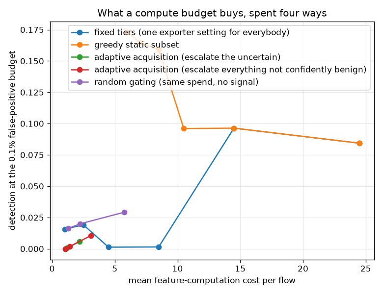

# NetSentry — Buying Expensive Features Only for the Flows That Need Them

_Four acquisition policies over 6 behavioural feature families, judged on
detection at the 0.1% false-positive budget against mean per-flow computation
cost, on 24,957 held-out flows and under two different price lists._

## Why this report exists

Every study here hands the model all 76 statistics. An exporter cannot: a TCP flag count falls
out of a header the collector already parsed, while an inter-arrival-time distribution needs
per-packet state for the whole conversation. The [cascade](cascade.md) routes flows to a bigger
*model* with the features already computed; the [earliness study](earliness.md) asks *when* a
feature can be known. This asks what a fixed compute budget buys, and whether spending it per
flow beats spending it per deployment.

## What each family is assumed to cost

| feature family | columns | price per flow | why it costs that |
|---|---|---|---|
| TCP flags | 12 | 1 | already parsed out of the header the collector must read anyway |
| header/window/bulk | 11 | 1.5 | fixed fields, read once at connection setup |
| volume/counts | 10 | 2 | one counter per flow, incremented per packet |
| packet size | 16 | 4 | running moments over every packet's length |
| flow rates | 4 | 6 | a count divided by a duration, so it needs the duration |
| timing/IAT | 23 | 10 | a timestamp per packet plus running moments over the gaps |

These prices are a modelling assumption stated in config, in the same spirit as the
[cost study's](cost.md) dollar figures. The last section re-runs everything under a flat price
list, which is the check that says which conclusions survive the assumption.

## The frontier

| policy | setting | mean cost per flow | detection | realised FPR |
|---|---|---|---|---|
| adaptive acquisition (escalate everything not confidently benign) | band 0.02 | 1.05 | 0.0% | 0.00% |
| adaptive acquisition (escalate everything not confidently benign) | band 0.1 | 1.42 | 0.2% | 0.00% |
| adaptive acquisition (escalate everything not confidently benign) | band 0.3 | 3.10 | 1.1% | 0.00% |
| adaptive acquisition (escalate the uncertain) | band 0.01 | 1.04 | 0.0% | 0.00% |
| adaptive acquisition (escalate the uncertain) | band 0.05 | 1.19 | 0.1% | 0.00% |
| adaptive acquisition (escalate the uncertain) | band 0.2 | 2.19 | 0.6% | 0.00% |
| fixed tiers (one exporter setting for everybody) | TCP flags | 1.00 | 1.6% | 0.09% |
| fixed tiers (one exporter setting for everybody) | TCP flags + header/window/bulk | 2.50 | 1.9% | 0.13% |
| fixed tiers (one exporter setting for everybody) | TCP flags + header/window/bulk + volume/counts | 4.50 | 0.1% | 0.15% |
| fixed tiers (one exporter setting for everybody) | TCP flags + header/window/bulk + volume/counts + packet size | 8.50 | 0.1% | 0.16% |
| fixed tiers (one exporter setting for everybody) | TCP flags + header/window/bulk + volume/counts + packet size + flow rates | 14.50 | 9.6% | 0.07% |
| fixed tiers (one exporter setting for everybody) | TCP flags + header/window/bulk + volume/counts + packet size + flow rates + timing/IAT | 24.50 | 8.4% | 0.06% |
| greedy static subset | flow rates | 6.00 | 17.3% | 0.07% |
| greedy static subset | flow rates + TCP flags | 7.00 | 16.5% | 0.05% |
| greedy static subset | flow rates + TCP flags + header/window/bulk | 8.50 | 15.9% | 0.06% |
| greedy static subset | flow rates + TCP flags + header/window/bulk + volume/counts | 10.50 | 9.6% | 0.06% |
| greedy static subset | flow rates + TCP flags + header/window/bulk + volume/counts + packet size | 14.50 | 9.6% | 0.07% |
| greedy static subset | flow rates + TCP flags + header/window/bulk + volume/counts + packet size + timing/IAT | 24.50 | 8.4% | 0.06% |
| random gating (same spend, no signal) | band 0.01 | 1.28 | 1.6% | 0.09% |
| random gating (same spend, no signal) | band 0.05 | 2.22 | 2.0% | 0.08% |
| random gating (same spend, no signal) | band 0.2 | 5.74 | 2.9% | 0.09% |

**The best detector on this frontier uses four features.** Greedy selection puts `flow rates` at 17.3% detection for a cost of 6.0, while computing *everything* — all 76 statistics at a cost of 24.5 — reaches 8.4% (8.4% in the fixed-tier row). That is **2.1x the detection for 24% of the compute**, and the direction of that trade is the opposite of what a cost study expects to find.

This is not a new phenomenon in this repository, it is the [leaderboard's](leaderboard.md) finding arriving through the exporter: on a split whose test days share no attack class with training, capacity spent fitting the training families is capacity spent on families that will not reappear. Extra features are extra capacity. The practical reading for an exporter is unusually cheerful — the configuration that costs least is not a compromise here — and the honest caveat is that it is a property of this split rather than of flow data.

## Why spending the budget per flow does not work

**Adaptive acquisition fails here, and it fails for a reason that no amount of policy tuning fixes.** The best uncertainty-gated setting detects 0.6% at a cost of 2.19; the cheapest fixed tier detects 1.6% at 1.00. Worse, the random-gating control — the same spend, flows chosen with no signal at all — reaches 2.0%. When a policy loses to its own placebo, the signal it is built on is the thing to inspect.

The first suspicion was the *shape* of the gate. A symmetric band around the decision threshold is the textbook uncertainty rule and it is wrong at a 0.1% operating point, where the threshold sits at the 99.9th percentile and 'near the threshold' means 'in the top thousandth'. So an asymmetric arm was added — forward everything the cheap tier does not confidently rule out — and it does better (1.1%) and still loses. The gate shape was not the problem.

This diagnostic is:

| cheap-tier filter | detections it forwards |
|---|---|
| 2% of flows forwarded | **1.1%** of the 526 attacks the full model detects |
| 10% of flows forwarded | **8.4%** of the 526 attacks the full model detects |
| 30% of flows forwarded | **27.2%** of the 526 attacks the full model detects |

Read that table against its own null. A filter that forwarded flows *at random* would retain exactly the fraction it forwards — 30% forwarded, 30% of the detections kept. The cheap tier retains 27.2% at 30%, 8.4% at 10%, 1.1% at 2%. It is not merely a weak filter, it is **indistinguishable from choosing at random**, which is why the random-gating control matched the uncertainty gate: there was no signal for either to use.

A cascade can only escalate flows the *cheap* tier ranks highly, so it can only recover detections that live in that region, and they do not. The loss is structural rather than a tuning failure. It is the [cascade study's](cascade.md) escape-budget problem in a harsher form: there, stage 1 saw *all* the features and merely used a smaller model, so its ranking agreed with stage 2's. Here stage 1 is blind to the features stage 2 decides on.

The design rule that falls out is worth more than the policy would have been: **a cascade's filter has to be built from features that rank comparably to the final model, not merely from cheap ones.** Cheapness is a property of the exporter; agreement is a property of the pair, and only the second one makes a cascade work.

One structural caveat belongs next to the numbers rather than at the end. The tiers here are *nested* — a flow that escalates keeps everything it already bought — which is what makes the cost arithmetic simple and also what makes the policy weaker than it could be. A real exporter can sometimes buy a specific expensive feature without buying its whole family, and the optimal policy would choose per feature rather than per tier. That is a combinatorial problem this study deliberately does not solve; the nested version is the one an exporter configuration can actually express.

## Does the conclusion survive the price list?

The prices are an assumption, so the whole frontier is re-run under a flat price list where every family costs the same. That removes the thing the adaptive policy is supposed to exploit — if all features cost one unit, buying them in a clever order cannot help much — and it is the cheapest available check on the assumption: **the ordering changes** when the prices do, which means the conclusion above is partly a statement about the price list and has to be read with it.

| policy | setting | mean cost per flow | detection | realised FPR |
|---|---|---|---|---|
| adaptive acquisition (escalate everything not confidently benign) | band 0.02 | 1.03 | 0.0% | 0.00% |
| adaptive acquisition (escalate everything not confidently benign) | band 0.1 | 1.19 | 0.5% | 0.01% |
| adaptive acquisition (escalate everything not confidently benign) | band 0.3 | 1.74 | 1.8% | 0.01% |
| adaptive acquisition (escalate the uncertain) | band 0.01 | 1.01 | 0.0% | 0.00% |
| adaptive acquisition (escalate the uncertain) | band 0.05 | 1.09 | 0.2% | 0.00% |
| adaptive acquisition (escalate the uncertain) | band 0.2 | 1.45 | 1.2% | 0.01% |
| fixed tiers (one exporter setting for everybody) | timing/IAT | 1.00 | 0.1% | 0.13% |
| fixed tiers (one exporter setting for everybody) | timing/IAT + volume/counts | 2.00 | 0.1% | 0.06% |
| fixed tiers (one exporter setting for everybody) | timing/IAT + volume/counts + packet size | 3.00 | 0.1% | 0.12% |
| fixed tiers (one exporter setting for everybody) | timing/IAT + volume/counts + packet size + flow rates | 4.00 | 9.4% | 0.06% |
| fixed tiers (one exporter setting for everybody) | timing/IAT + volume/counts + packet size + flow rates + TCP flags | 5.00 | 8.6% | 0.07% |
| fixed tiers (one exporter setting for everybody) | timing/IAT + volume/counts + packet size + flow rates + TCP flags + header/window/bulk | 6.00 | 8.4% | 0.06% |
| greedy static subset | flow rates | 1.00 | 17.3% | 0.07% |
| greedy static subset | flow rates + header/window/bulk | 2.00 | 17.5% | 0.07% |
| greedy static subset | flow rates + header/window/bulk + packet size | 3.00 | 17.2% | 0.06% |
| greedy static subset | flow rates + header/window/bulk + packet size + timing/IAT | 4.00 | 17.0% | 0.05% |
| greedy static subset | flow rates + header/window/bulk + packet size + timing/IAT + TCP flags | 5.00 | 17.6% | 0.06% |
| greedy static subset | flow rates + header/window/bulk + packet size + timing/IAT + TCP flags + volume/counts | 6.00 | 8.4% | 0.06% |
| random gating (same spend, no signal) | band 0.01 | 1.05 | 0.2% | 0.13% |
| random gating (same spend, no signal) | band 0.05 | 1.25 | 0.6% | 0.11% |
| random gating (same spend, no signal) | band 0.2 | 2.00 | 1.7% | 0.12% |

## Scope and honest limits

- **The prices are invented, and deliberately visible.** Nothing here measures how long
  CICFlowMeter takes to compute an IAT distribution; the ordering (headers cheapest, timing
  dearest) is defensible from what each statistic requires, and the magnitudes are a choice.
  The flat-price re-run is the sensitivity analysis, not a substitute for measurement.
- **Each tier gets its own fitted pipeline**, because an imputer and scaler fitted on features
  the exporter never computes would be borrowing information the deployment does not have —
  the same leakage rule the project applies to splits, applied to feature subsets.
- **The escalation decision uses the model's own score**, which is not calibrated across tiers:
  a cheap tier's 0.8 does not mean what an expensive tier's 0.8 means. The band is defined in
  rank space to blunt that, and a properly calibrated cascade would do better.
- **Cost is per flow and additive.** Real exporters amortise state across flows on the same
  connection and pay in memory as much as in CPU, neither of which this models.
- **The verdict is always the last tier's**, so a flow that never escalates is judged by a
  model that was never given the expensive features. That is the point of the policy and also
  its risk: an attack whose signature lives entirely in the timing features is invisible to
  the cheap tier, and the adaptive policy will only escalate it if the cheap tier is *uncertain*
  about it — not if the cheap tier is confidently wrong.