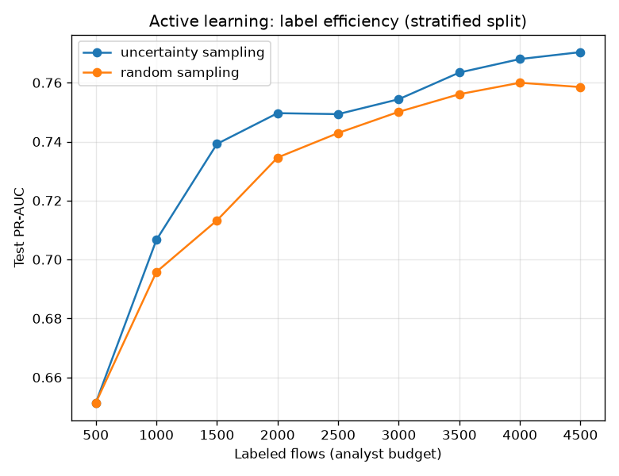

# NetSentry — Active Learning (label efficiency)

_Synthetic stand-in. Stratified split (where the pool and test are exchangeable, the
assumption active learning needs). Binary attack-vs-benign; each point refits on the
labeled subset and scores the fixed test split. Detection thresholds use the
1%-FPR budget on validation._

## The question

An analyst can only label so many flows a day, so labels — not compute — are the
scarce resource. Active learning asks *which* flows to label next: the ones the
model is least sure about (**uncertainty sampling**, query nearest the decision
boundary) or a **random** draw. The gap is analyst time saved for equal detection.

## PR-AUC vs labeling budget

| uncertainty — labeled | 500 | 1,000 | 1,500 | 2,000 | 2,500 | 3,000 | 3,500 | 4,000 | 4,500 |
|---|---|---|---|---|---|---|---|---|---|
| PR-AUC | 0.651 | 0.707 | 0.739 | 0.750 | 0.749 | 0.754 | 0.763 | 0.768 | 0.770 |

| random — labeled | 500 | 1,000 | 1,500 | 2,000 | 2,500 | 3,000 | 3,500 | 4,000 | 4,500 |
|---|---|---|---|---|---|---|---|---|---|
| PR-AUC | 0.651 | 0.696 | 0.713 | 0.735 | 0.743 | 0.750 | 0.756 | 0.760 | 0.759 |

## Read

Uncertainty sampling reaches random's full-budget PR-AUC (0.759) with **3,500** labels — **1,000 fewer (22%)** than the 4,500 random spends to get there, and it leads at every mid-budget round (+0.006 PR-AUC at 2,500 labels). Querying the flows the model is least sure about spends the budget where it actually moves the decision boundary — the argument for a review queue ordered by model uncertainty rather than by arrival time.

The tie-in to the rest of the pipeline: this is the *training-time* mirror of the
conformal selective-prediction work (which routes uncertain flows to a human at
*inference* time). Both order the analyst's attention by model uncertainty — active
learning to build a better model with fewer labels, conformal to spend review effort
only where the model abstains. And both rest on exchangeability, which is exactly
why this study lives on the stratified split and the honest temporal number does not.
