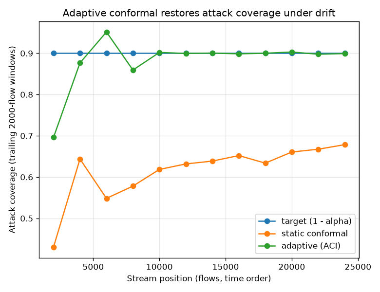

# NetSentry — Adaptive Conformal Inference (coverage under drift)

_Synthetic stand-in. Temporal split; the binary model's calibrated probabilities;
the test (later-day) flows replayed in capture order as a labeled stream.
Class-conditional split-conformal calibrated on validation is the frozen
baseline; the adaptive run applies the Gibbs-Candes update alpha_(t+1) = alpha_t
+ gamma (alpha - err_t) per class with gamma = 0.005 and a label delay of
0 flows. Target coverage 90%._

## The problem this solves

The conformal report shows the guarantee doing exactly what the theory says: it
holds on the exchangeable split and **fails on the temporal one** — later-day
novel attacks fall outside the calibrated sets, and attack coverage collapses.
Static conformal treats alpha as a constant; adaptive conformal inference (ACI)
treats it as a control signal and steers it with the realized coverage errors.
Its long-run coverage guarantee needs **no distributional assumption at all** —
it holds under arbitrary shift — but it consumes ground-truth labels, so what it
really trades is analyst feedback for a live guarantee.

## Whole-stream results

| policy | attack coverage | benign coverage | auto-decided | human review |
|---|---|---|---|---|
| static split-conformal | 64.4% | 93.1% | 64.9% | 35.1% |
| adaptive (ACI) | **89.7%** | 90.0% | 31.5% | 68.5% |

## Read

The repair works: static attack coverage runs at 64.4% against a 90% target (the exchangeability break the conformal report documents), and the online alpha update brings it back to 89.7%. The price is explicit in the last column — the human-review share moves by +33.3% — and in the alpha trajectory: alpha_attack is driven from 0.1 to a minimum of 0.001. Coverage is bought with wider sets, not with a better model.

## What ACI does and does not buy

It restores the *guarantee*, not the *detector*: the sets widen precisely where
the model is uncertain or blind, which converts silent misses into explicit
review items — the correct failure mode for a safety layer, and the same
"abstention is the review budget" contract the static conformal report
established. It does not improve ranking, detection at a fixed FPR, or any other
model quality; retraining (the streaming study) is the lever for those. And it
needs labels: with a label delay the update lags the drift by exactly that
delay, so the two knobs a deployment tunes are gamma (reaction speed vs
stability) and the freshness of its feedback loop.
