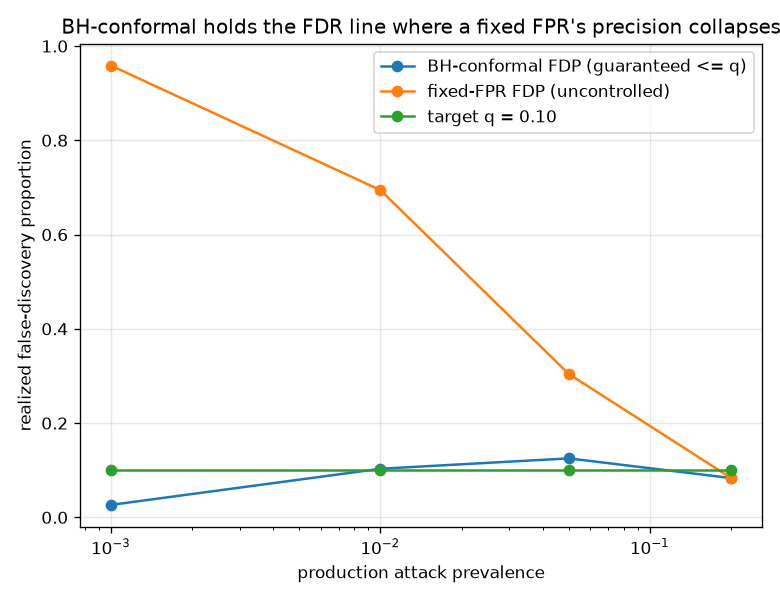

# NetSentry — Conformal Alert Selection with an FDR Guarantee

_Synthetic stand-in; the guarantee is the point. Exchangeable stratified/binary split:
7,484 benign calibration flows (the null), 12,000 test flows
(prevalence 0.221). Every rate is averaged over 200
calibration/test resamples._

## Why this report exists

The [base-rate study](base_rate.md) shows a fixed false-positive budget does **not** control
the precision of the alert queue — as the production attack prevalence drops, the benign flood
dominates and precision collapses. A SOC does not want a fixed FPR; it wants a bound on the
fraction of its alerts that are false. That is the **false discovery rate**, and it is
controllable. Calibrate on held-out benign flows, form each test flow's **conformal p-value**
(the smoothed rank of its attack score among the benign nulls — uniform under the benign null,
small for anomalies), and select alerts by **Benjamini-Hochberg** at a target level `q`. Bates,
Candès, Lei, Romano & Sesia (Annals of Statistics 2023) prove the conformal p-values are PRDS,
so BH controls FDR on them: the expected benign share of the raised alerts is at most `q`,
distribution-free, at any prevalence.

## Does the guarantee hold? (validation over resamples)

| target q | realized FDP | power (detection) | controlled |
|---|---|---|---|
| 0.05 | 0.042 | 36.8% | yes |
| 0.10 | 0.079 | 48.0% | yes |
| 0.20 | 0.151 | 57.8% | yes |
| 0.30 | 0.232 | 64.9% | yes |

The guarantee holds: at every target level, the realized FDP averaged over 200 calibration/test draws lands at or below `q` (tightest margin at q = 0.05: 0.042 realized). This is distribution-free and needs no model calibration — the p-values are exact ranks, and BH controls FDR on them because Bates et al. proved they are PRDS. The power column is the price, and it is modest here because the stratified split's attack scores separate cleanly from benign.

## Where it earns its keep: the prevalence sweep

BH-conformal at `q = 0.10` vs a fixed-FPR cut at 1.0%,
chosen on the benign calibration scores, judged on the same resampled batch.

| prevalence | BH-conformal FDP | BH power | fixed-FPR FDP | fixed-FPR power |
|---|---|---|---|---|
| 0.0010 | 0.026 | 0.7% | 0.959 | 46.6% |
| 0.0100 | 0.103 | 10.4% | 0.694 | 47.3% |
| 0.0500 | 0.125 | 29.4% | 0.304 | 47.4% |
| 0.2000 | 0.083 | 47.2% | 0.084 | 47.5% |

The contrast is the whole point. As production prevalence falls from 0.20 to 0.0010, the fixed-FPR cut's false-discovery proportion climbs from 0.084 to 0.959 — the [base-rate fallacy](base_rate.md) in one row: a threshold chosen for a benign-traffic budget cannot know the prevalence, so its precision is at its mercy (at 0.0010, 96% of its alerts are false). The BH-conformal queue tracks the target `q = 0.10` far more tightly — 0.083 at the high end and 0.026 at the low — because it adapts the selection to the p-value distribution it actually sees rather than to a frozen threshold. The honest wrinkle: at prevalence 0.0500 it reads 0.125, a hair over `q` — the resample-to-prevalence construction draws with replacement, which nicks the exchangeability the bound assumes, and FDR control is marginal (in expectation) not per-batch, so a single sweep point is a noisy draw around the line. It is a rounding error next to the fixed cut's collapse to nearly all-false. What conformal selection cannot do is manufacture detection that is not there: its power falls with prevalence too (47.2% to 0.7%), the honest cost of refusing to raise alerts it cannot stand behind — a guaranteed-clean queue that is sometimes nearly empty, which is exactly the right behaviour when the attacks are genuinely rare.

## Scope

The guarantee is **marginal** over calibration draws and needs exchangeability between the
benign calibration set and the benign test flows — the same assumption the
[conformal](conformal.md) and [PPI](ppi.md) studies make, and the reason this runs on the
stratified split, not the temporal one (a genuine distribution shift breaks it, which is what
the [exchangeability martingale](exchangeability.md) is built to catch). FDR is an average
over the batch, not a per-alert promise; a single batch's FDP is a noisy draw around `q`
that tightens with calibration size. The null is *benign* traffic, so a novel attack that
happens to score like benign is a miss, not a false discovery — this bounds the wrongness of
the alerts raised, and pairs with the [alert-queue](alert_queue.md) and
[cost](cost.md) studies that price the ones it does raise.