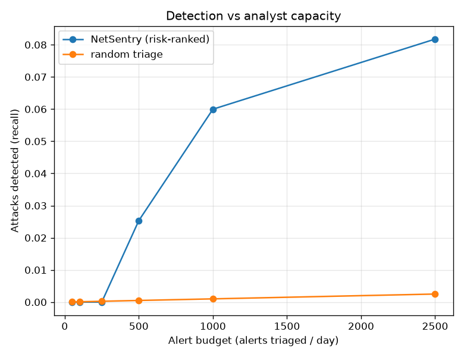

# NetSentry - Alert-Queue Capacity Planning

_Synthetic stand-in; the method is the point. Detection a fixed analyst budget buys,
from the temporal model's risk ranking, at a realistic **1%**
production attack base rate over **1,000,000** flows/day (not the ~22% synthetic test
mix, so the volumes are sane). Budgeted at **10
min/alert**, **420 productive min/analyst/day**._

A SOC cannot chase every flagged flow; it works a bounded queue. Ranking flows by
risk and triaging the top **K/day** is the real deployment, so the operational
question is not "what is the AUC" but "at my staffing, how many attacks do we catch,
and how much better is that than triage at random?"

| alerts/day | analysts | detection (recall) | precision | lift vs random |
|---|---|---|---|---|
| 50 | 1.2 | 0.0% | 0.0% | 0x |
| 100 | 2.4 | 0.0% | 0.0% | 0x |
| 250 | 6.0 | 0.0% | 0.0% | 0x |
| 500 | 11.9 | 2.5% | 82.7% | 51x |
| 1,000 | 23.8 | 6.0% | 65.4% | 60x |
| 2,500 | 59.5 | 8.2% | 63.2% | 33x |

- **Lift** is recall divided by random triage's `K / flows` hit rate: at
  1,000 alerts/day the ranking catches **60x** more
  attacks than working the same number of flows blind — the model's worth stated in
  the currency a SOC lead budgets in (analyst time).
- Detection climbs with the queue and then flattens: at 2,500 alerts/day
  (~59.5 analysts) recall is **8.2%**. The knee is
  where extra staffing stops paying off — the capacity-planning number the PR-AUC
  alone can't give.
- Precision is reported at the **production** base rate, so it reflects the real
  benign-heavy queue an analyst faces, not the balanced test split.

## Why this matters

PR-AUC and TPR@FPR describe the model; this describes the *deployment*. It converts a
ranking into a staffing plan — "N analysts detect M% of attacks" — and quantifies the
model as a force multiplier on scarce analyst time, which is the lens a SOC actually
buys detection with. It complements the [cost report](cost.md): cost picks the
economically optimal threshold, this reads detection off a fixed headcount.
