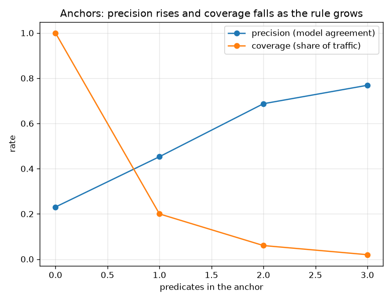

# NetSentry — Anchor Explanations (high-precision IF-THEN rules)

_Synthetic stand-in. Stratified/binary model at its natural decision boundary; flagged
(predicted-attack) test flows explained by anchors grown on a training-background sample and
re-validated on a held-out test background. Features discretised into 5 quantile
bins; target precision tau = 0.95._

## Why this report exists

SHAP attributes a verdict across features, the counterfactual finds the smallest clearing
change, exemplars point at similar cases — but none states a **sufficient condition** an analyst
can act on. An anchor (Ribeiro, Singh & Guestrin, AAAI 2018) does: a short conjunction of
feature predicates such that, whenever they hold, the model returns this verdict with high
**precision**. Among high-precision rules the useful one has high **coverage**, so it explains a
region of traffic rather than a single flow. Precision is the guarantee; coverage is what makes
it worth stating.

## Example anchors

- **IF** Flow Packets/s >= 299 **AND** Flow Bytes/s >= 3.15e+03 **AND** Total Backward Packets >= 25.6 **THEN** attack — precision 97% (LCB 95%), coverage 4.0%, held-out precision 99% _(this flow's true label: DDoS)_
- **IF** Total Fwd Packets >= 26.8 **AND** 1.42 <= SYN Flag Count <= 2.71 **AND** 7.63e+03 <= Flow IAT Max <= 1.32e+04 **THEN** attack — precision 55% (LCB 40%), coverage 0.8%, held-out precision 32% _(this flow's true label: BENIGN)_
- **IF** Flow Packets/s >= 299 **AND** Total Backward Packets >= 25.6 **AND** Flow Duration >= 2.36e+05 **THEN** attack — precision 78% (LCB 68%), coverage 1.1%, held-out precision 79% _(this flow's true label: BENIGN)_
- **IF** Flow Packets/s >= 299 **AND** Flow Bytes/s >= 3.15e+03 **AND** Total Fwd Packets >= 26.8 **THEN** attack — precision 99% (LCB 97%), coverage 3.5%, held-out precision 98% _(this flow's true label: DoS Hulk)_

Across the anchored flows the average rule needs **3.0 predicates** to reach **77%** precision while still covering **2.0%** of traffic — a compact sufficient condition, not a per-feature attribution. The trade-off is the whole point and is visible in the figure: each predicate added raises precision and shrinks coverage, and the search stops as soon as the precision lower bound clears the target. The guarantee holds out of sample: anchors precise to 77% on the reference background stay at 74% on a held-out background they were never grown against — the rules generalise, they are not overfit to the sample used to find them. 

## Scope

Anchors are built by discretising each candidate feature into quantile bins and greedily pinning
the flow to its own bins — a faithful tabular rendering of the paper's algorithm, using a
lower-confidence-bound stopping rule in place of its KL-LUCB bandit, and a real background sample
as the perturbation distribution (so the rule respects the feature correlations the PDP study
warns a synthetic perturbation would break). The precision guarantee is *conditional on the
perturbation distribution*: it says the model is stable on real flows matching the rule, not on
adversarially crafted ones — that stronger, worst-case statement is the certified-robustness
study's job. Anchors complement the additive (SHAP), contrastive (counterfactual), and
case-based (exemplar) views with the sufficient-condition one the suite was missing.