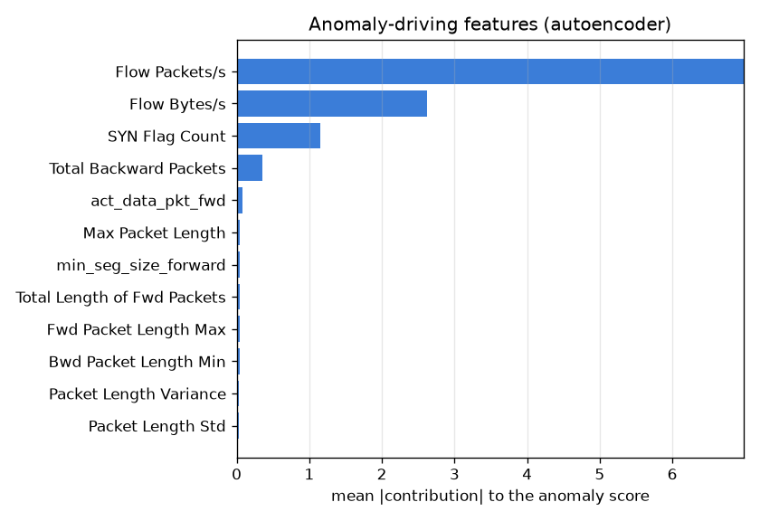

# NetSentry - Explaining the Anomaly Flag (why is this flow abnormal?)

_Synthetic stand-in; the methodology is the point. The benign-only **autoencoder**
detector, calibrated to a 1% benign false-positive rate, run on the
honest **temporal** test split. 722 flagged true-attack flows were attributed
by model-agnostic benign occlusion._

The supervised model returns its SHAP top features on every prediction; the anomaly
detector — the "detect the unknown" component — emits only a score. This closes that
gap: for each flagged flow, every feature is reset to its **benign** reference value
and the flow is re-scored, and the drop in the anomaly score is that feature's
contribution ("if this behaviour had looked normal, how much less anomalous would the
flow be?"). It is model-agnostic, so it explains whichever detector ships.

## Which behaviours drive the flags (global)

| rank | feature | mean abs. contribution |
|---|---|---|
| 1 | Flow Packets/s | 6.9830 |
| 2 | Flow Bytes/s | 2.6210 |
| 3 | SYN Flag Count | 1.1466 |
| 4 | Total Backward Packets | 0.3589 |
| 5 | act_data_pkt_fwd | 0.0811 |
| 6 | Max Packet Length | 0.0417 |
| 7 | min_seg_size_forward | 0.0399 |
| 8 | Total Length of Fwd Packets | 0.0380 |
| 9 | Fwd Packet Length Max | 0.0379 |
| 10 | Bwd Packet Length Min | 0.0368 |
| 11 | Packet Length Variance | 0.0348 |
| 12 | Packet Length Std | 0.0339 |

## By attack class

| attack class | flags explained by (top features, desc) |
|---|---|
| DDoS | Flow Packets/s, Flow Bytes/s, Total Backward Packets, Fwd Packet Length Max, Packet Length Variance, Bwd URG Flags |
| PortScan | SYN Flag Count, act_data_pkt_fwd, Max Packet Length, Flow Bytes/s, Init_Win_bytes_forward, Packet Length Std |

## Faithfulness (is the explanation real?)

An attribution is only worth showing an analyst if the features it names actually
carry the score. Deletion check — mean anomaly-score drop when occluding, per flow:

| occlude | mean score drop |
|---|---|
| top-5 attributed features | 11.6724 |
| 5 random features | 0.8718 |

Occluding the **top-5** attributed features drops the anomaly score 13.4x more than occluding the same number of random features — the attributions are **faithful**: the features the explainer names really are the ones carrying the flag, not a plausible-sounding story. So an analyst handed an anomaly flag on the autoencoder detector gets an actionable reason (the specific behaviours that reconstruct/isolate poorly), the unsupervised counterpart to the SHAP top-features the supervised side already returns.

## Scope

- Occlusion resets each feature independently, so it shares partial dependence's
  independence caveat: it prices each behaviour's marginal contribution, not feature
  interactions. It is a triage aid — the anomaly analogue of the SHAP top-features —
  not a causal decomposition.
- The benign reference is the per-feature **median** of the benign training flows (in
  the fitted pipeline's standardized space), so "normal" means the center of the
  traffic the detector learned, not any single flow.
