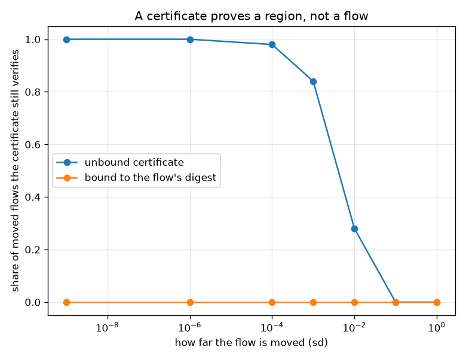
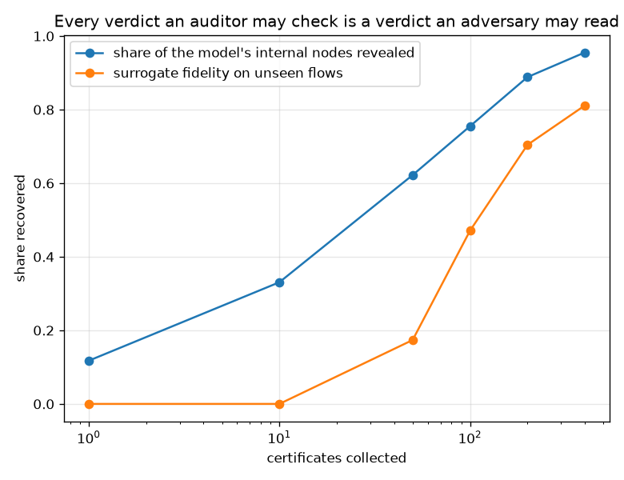

# NetSentry — Proof-Carrying Verdicts

_The deployed ensemble (600 trees, 37,200 internal nodes) committed to
a single 32-byte root, with a certificate per verdict that an auditor can
check without the model. Seven forgeries executed against it. Regenerate with `netsentry
attest`._

Published commitment: `b29df54533f46d471091c4a02a92acdd...`

## Why this report exists

This project already attests two things, and neither is the one that matters at the moment a
verdict is issued. [`netsentry verify`](provenance.md) hashes the bundle **at rest**, which
proves the file on disk is the file that was reviewed. The [alert ledger](ledger.md)
hash-chains the alert **history**, which proves nothing was edited afterwards. Between them
sits the gap: a service whose in-memory model has been swapped, rolled back or quietly
truncated passes both checks, because both are about artefacts rather than about the
computation that produced the answer.

A certificate closes it. And the mechanism needs no new cryptography, because the model already
has the right shape: hash a decision tree bottom-up --

```
leaf:     H("L" || value)
internal: H("I" || feature || threshold || hash(left) || hash(right))
```

-- and **the tree is a Merkle tree**. A root-to-leaf path with each step's sibling hash attached
is then an ordinary authentication path, and the ensemble publishes one Merkle root over its
per-tree roots. An auditor holding the flow, the certificate and 32 bytes
can check the verdict without the model, without re-running inference and without trusting the
service.

## The forgeries

| forgery | what it models in production | verdict | why |
|---|---|---|---|
| rewrite a leaf value | a service reporting a score its model did not produce | **refused** | the path does not hash into the committed ensemble |
| move a split threshold | a model quietly retuned after approval | **refused** | the path does not hash into the committed ensemble |
| splice another tree's path | assembling a plausible proof out of real fragments | **refused** | the path does not hash into the committed ensemble |
| rewrite an unvisited sibling | editing the part of the model this flow never touched | **refused** | the path does not hash into the committed ensemble |
| report a different score | the cheapest attack: leave the proof alone, change the number | **refused** | the leaf values do not sum to the reported score |
| drop a tree | serving a truncated ensemble to cut latency | **refused** | the commitment covers 600 trees and the certificate carries 599 |
| serve a stale model | last week's approved bundle, still in memory after a rollback | **refused** | the path does not hash into the committed ensemble |

**7 of 7 refused.** Three of those rows are the interesting ones.

*Dropping a tree* is the attack the obvious design misses. Serve 599 of 600 trees and report
the correspondingly smaller score: every remaining path still hashes into the root, and the
leaf values still sum to exactly the number claimed, because the arithmetic check cannot see a
missing summand. It is caught here only because the **ensemble's size is part of the
commitment** rather than an out-of-band expectation, which is a design decision that had to be
made before the attack could be refused.

*Serving a stale model* is the one operations people will actually meet -- a rollback that
leaves last week's approved bundle in memory. The bundle hash on disk is then correct and
describes a file the process is not using. The root does not match, so the certificate is
refused on the first tree.

*Rewriting an unvisited sibling* is included because it is the attack a hand-rolled scheme
usually permits: the flow never touched that subtree, so it is tempting to leave it out of the
proof. Committing to both children at every node is what makes the path unforgeable, and the
domain-separating tags on leaves and internal nodes are what stop a leaf value being presented
as a node hash.

## What a certificate actually proves



| the flow is moved by (sd) | unbound certificate accepted | bound certificate accepted |
|---|---|---|
| 1e-09 | 100% | 0% |
| 1e-06 | 100% | 0% |
| 0.0001 | 98% | 0% |
| 0.001 | 84% | 0% |
| 0.01 | 28% | 0% |
| 0.1 | 0% | 0% |
| 1 | 0% | 0% |

A certificate is **not** a statement about a flow. Every predicate on every path is an
inequality, so the object being proved is that *some point in a particular leaf region* produces
this score -- and any other point in that region satisfies the identical proof. The region has a
measurable size: an unbound certificate survives perturbation out to 0.01 sd, where 28% of moved flows still verified, and stops
being accepted by 1 sd.

That is the same box the [interval verifier](verify_trees.md) computes when it certifies
robustness, arrived at from the opposite direction: there it is the region in which the verdict
*cannot change*, here it is the region in which the proof *still applies*. They are the same
set, and it is small.

Binding the flow's own digest into the transcript reduces the region to the flow, at a cost of
32 bytes. The bound column is zero at every perturbation, including one
of 10^-9 sd, because any change at all changes the digest. Without it, an operator could
truthfully certify one flow and attach the certificate to a neighbour.

## What it costs

| quantity | value | against |
|---|---|---|
| certificate | **392 KB** | 785x the 512-byte prediction body |
| the model itself | 4070 KB | one certificate is 10% of it |
| certifying | 21.4 ms | 9x inference |
| verifying | 32.0 ms | 14x inference, and 10,970 SHA-256 evaluations |
| inference | 2.32 ms | -- |
| certifying only the alerts | 2.0 GB/day | at 5,000 alerts a day |

The size is the finding, and it is not a small constant: a certificate must carry a path for
**every** tree, so it scales with the ensemble rather than with the answer. At
600 trees and a mean depth of 7.3, one verdict's proof is
10% the size of the entire model. Nobody
is putting that on a prediction response.

Verification costs 14x inference, and that
gap is real rather than an artefact of the language: it is
10,970 SHA-256 evaluations against roughly
4,370 float comparisons. The usual verifiable-computation
selling point -- that checking is cheaper than computing -- **does not hold for a model this
cheap to evaluate.** Attestation is worth its price when the thing being attested is expensive
or unaccountable, and a boosted ensemble on 76 features is neither.

The prover has one honest footnote. The first implementation rebuilt each tree's Merkle
authentication path per verdict, which is quadratic in the number of trees and made
certification 370x inference. The paths depend only on the model, so they are computed once at
commitment time; certification is now 21.4 ms. The cost that remains is the
one the scheme actually implies.

## What it leaks



| certificates collected | internal nodes revealed | share of the model | trees recovered exactly | surrogate fidelity |
|---|---|---|---|---|
| 1 | 4,370 | 11.7% | 0 | 0.000 |
| 10 | 12,304 | 33.1% | 0 | 0.000 |
| 50 | 23,144 | 62.2% | 0 | 0.174 |
| 100 | 28,084 | 75.5% | 0 | 0.471 |
| 200 | 33,047 | 88.8% | 18 | 0.704 |
| 400 | 35,542 | 95.5% | 114 | 0.811 |

This is the half nobody advertises. A certificate spells out one root-to-leaf path per tree --
the feature, the threshold and the direction at every branch -- so an adversary collecting them
is not approximating the model's behaviour, they are **reading its geometry**.
A single certificate reveals 12% of the ensemble's internal nodes; 400 of them reveal 96% and recover 114 of the 600 trees exactly.

Query access can never do that. The [extraction study](extraction.md) steals a *surrogate* by
asking for calibrated probabilities; a certificate hands over the branch structure and the raw
margin, which is a strictly stronger oracle -- the surrogate column shows it reaching
0.81 correlation on flows it never saw, from
labels it was given for free.

**Verifiability and confidentiality trade off, and here the trade is denominated in
certificates.** Every party who is allowed to check a verdict is thereby allowed to read part
of the model, which makes the natural deployment a *selective* one: certify the decisions that
are contested, to the parties entitled to contest them, and count the exposure.

## Scope and honest limits

- **This proves the computation, not its correctness.** A certificate says the committed model
  produced this score for this flow. It says nothing about whether the model is any good --
  that is what every other report here is for -- and nothing about whether the committed root
  is the right one, which is a transparency-log problem the [ledger's](ledger.md) published
  anchor solves for alerts and nothing here solves for models.
- **The pipeline is outside the commitment.** The proof begins at the transformed feature
  vector. A service that mis-scales an input produces a perfectly valid certificate for the
  wrong flow, so a complete scheme has to commit to the fitted preprocessing too -- which is
  exactly the train/serve skew the [canary](../../README.md) exists to catch, now with a second
  reason to care.
- **The scheme assumes an honest commitment ceremony.** Whoever publishes the root can publish
  the root of a model nobody reviewed. This is the standard reduction: attestation converts
  "trust the service" into "trust the publication", which is progress only because publication
  can be witnessed and a running process cannot.
- **Only collision resistance is assumed**, which is the point of building it this way -- no
  pairings, no trusted setup, no zero-knowledge machinery, and nothing that stops working when
  a library is upgraded. The price is that the proof is linear in the model.
- **It does not hide the path.** A zero-knowledge version would prove the same statement while
  revealing nothing, and would cost orders of magnitude more per verdict. The leakage table is
  the argument for when that trade becomes worth making.