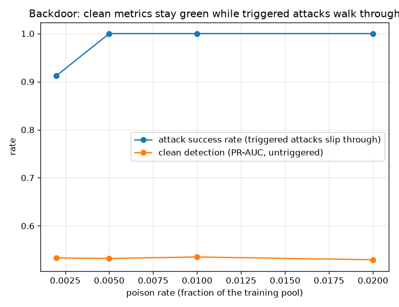

# NetSentry — Backdoor (Trojan) Poisoning and the Spectral Defense

_Synthetic stand-in. Honest temporal/binary split; the model is refit at each poison rate on
28,034 training flows and judged on the clean temporal test split. Attack success
is measured over the **1,359 attacks the clean model catches without the
trigger** (of 6,237 total) — the honest denominator that isolates the
backdoor from the detector's ordinary miss rate. Trigger: `Init_Win_bytes_forward = 4242`, `Fwd IAT Min = 4242`.
Operating point: 1.0% FPR._

## Why this report exists

The [poisoning study](poisoning.md) covers the *availability* attack — random label flips
that make the model worse at everything, visible in aggregate metrics. This is the
*integrity* attack (Gu, Dolan-Gavitt & Garg 2017, "BadNets"): the adversary stamps a rare
**trigger** on a handful of its attack flows, labels them BENIGN, and slips them into
training. The model learns a shortcut — "this exact window + this exact inter-arrival gap
=> benign" — that is invisible on ordinary traffic and fires only when the attacker wears
the trigger. Two numbers tell the story: clean detection barely moves (the operator sees
nothing), and the **attack success rate** on triggered flows climbs with a *tiny* poison
budget. The defense (Tran, Li & Madry, NeurIPS 2018) turns the attack's own consistency
against it — the poisoned rows must share a representation direction, which shows up as an
outlier on the class's top singular vector — and the arc is the project's usual
measure -> defend -> re-measure.

## The attack: poison budget vs stealth

| poison rate | injected rows | clean PR-AUC | clean TPR@op | attack success rate |
|---|---|---|---|---|
| 0 (baseline) | 0 | 0.529 | — | 3% (trigger alone) |
| 0.2% | 56 | 0.533 | 22% | 91% |
| 0.5% | 140 | 0.532 | 22% | 100% |
| 1.0% | 280 | 0.535 | 19% | 100% |
| 2.0% | 560 | 0.529 | 14% | 100% |

At a 0.5% poison budget — **140 flows** in a 28,034-row training set — the trigger rescues **100%** of the 1,359 attacks the clean detector would otherwise catch, while clean PR-AUC holds at 0.532 against the unpoisoned 0.529. That gap is the whole danger: every dashboard the operator watches stays green while the attack succeeds on demand. The baseline row is the control that makes it a *backdoor* and not mere evasion — worn against a clean, unpoisoned model the same trigger flips only 3% of those attacks; the near-total success is *learned* from the poisoned labels, not a property of the perturbation. The spectral-signatures defense, run blind (it knows neither the trigger nor which rows are poison), scores every benign-labeled row by its projection on the class representation's top singular direction and over-removes: it caught **280 of 280** injected rows (100% recall) among 420 dropped, and after the refit the attack success rate falls from 100% to 5% (**95% of the backdoor closed**) with clean PR-AUC essentially unmoved (0.535 -> 0.524). The poison's own strength is its weakness: to make a reliable shortcut it must cluster in representation space, which is exactly what the top singular direction exposes.

## Scope

The trigger lives in attacker-controllable raw features (a TCP window set via socket
options, a pacing gap set by delays), so it is a mark the adversary can actually wear on the
wire — and it is stamped *before* the fitted pipeline, so the served model would see exactly
this input. The attack success rate is measured at the same operating threshold the clean
model uses, so stealth and success are read on one ruler. Two honest limits: the poisoned
rows here reuse real attack behaviour (a more careful adversary would also make the
non-trigger features look benign, which is harder to plant but harder to detect), and the
spectral defense is a *filter* — it raises the cost of a clean backdoor, it does not prove
the training set is trigger-free. The complementary label-flip defense is `netsentry
sanitize`; the inference-time adversary is `netsentry robustness`.