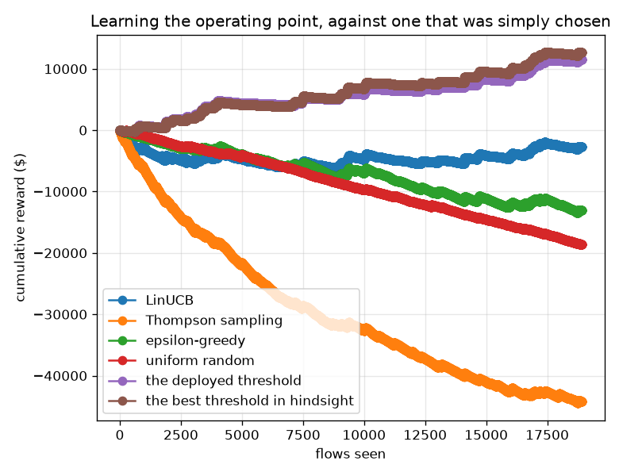
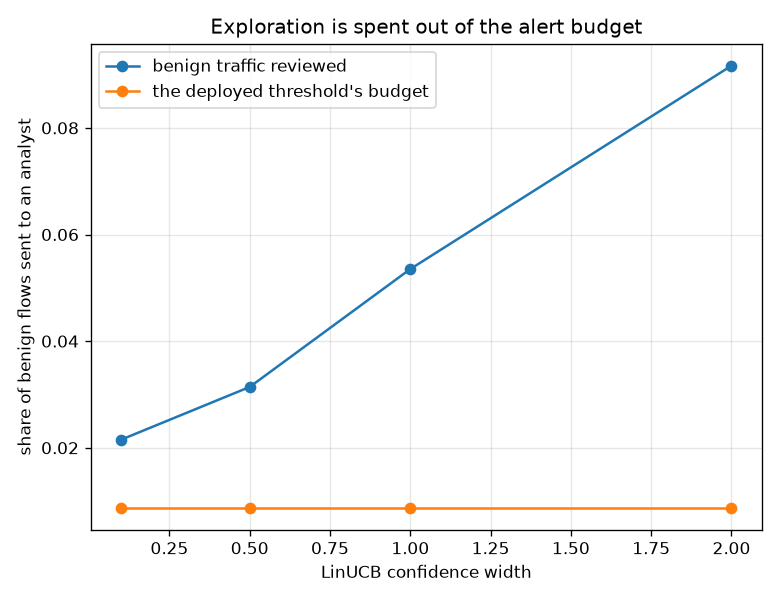

# NetSentry — Learning the Triage Policy Online, and What It Costs

_Five policies down the same 18,909-flow stream at a 1.00% attack
rate, under partial feedback: an outcome is observed only for flows the policy chose to review.
Rewards use the [cost study's](cost.md) economics ($500 for a
catch, $25 per review), and the stochastic arms are averaged
over repeated runs. Regenerate with `netsentry bandit`._

## Why this report exists

The [off-policy study](ope.md) values a triage policy from a log that a different policy wrote.
This is the other half: **learning** one while it runs, with no log to start from and no oracle
to ask. It is the contextual bandit in its natural habitat -- a flow arrives, the system reviews
it or skips it, and a skipped attack produces no alert, no signal and no lesson.

Over 18,909 flows at a 1.00% attack rate, **every learner loses to a threshold that was chosen once, on validation, and never touched again**. The best of them (LinUCB) ends on $-2,725 against the incumbent's $11,575, and none of them ever overtakes it.

The theory is not what failed. LinUCB's cumulative regret grows as `T^0.41` -- the `sqrt(T)` the analysis promises -- while epsilon-greedy manages `T^0.85` and the random control `T^0.96`, which is what not learning looks like. The algorithm behaves exactly as advertised and is still the wrong thing to deploy.

**What exploration costs here is not detection. It is the alert budget.** LinUCB reviews 5.4% of benign traffic against the deployed threshold's 0.9% -- and catches *more* attacks for it, 47 against 33. It is buying detection with analyst time at a price the reward function says is bad and a SOC would never authorise at all.

## The policies

| policy | total reward | spread over repeats | flows reviewed | attacks caught | benign reviewed (alert budget) | regret |
|---|---|---|---|---|---|---|
| LinUCB | $-2,725 | $0 | 1,049 | 47 | 5.35% | $15,375 |
| Thompson sampling | $-44,245 | $7,625 | 2,830 | 53 | 14.83% | $56,895 |
| epsilon-greedy | $-13,085 | $3,900 | 1,315 | 40 | 6.82% | $25,735 |
| uniform random | $-18,645 | $4,250 | 930 | 9 | 4.92% | $31,295 |
| the deployed threshold | $11,575 | $0 | 197 | 33 | 0.88% | $1,075 |
| **the best threshold in hindsight (0.8418)** | **$12,650** | -- | -- | -- | -- | $0 |
| _the oracle (reviews exactly the attacks)_ | _$89,775_ | -- | _189_ | _189_ | _0.00%_ | -- |

The reference row is the strongest policy in the comparison class: the best *threshold* on this
very stream, chosen with hindsight. Picking that reference is the load-bearing decision in any
regret study and the obvious choice is wrong -- among fixed *actions*, "review nothing" wins at
a 1% attack rate, so regret against it would reward a learner for doing nothing and would score
the deployed detector as having *negative* regret. That would be a sentence about the reference.

The incumbent lands within $1,075 of the best
threshold anyone could have chosen knowing the whole stream. A validation-calibrated operating
point is already about as good as this comparison class gets, which is the context every claim
below has to be read against.

The spread column is worth a glance: LinUCB's is exactly zero, because LinUCB is
*deterministic* given the stream -- its upper confidence bound is a function of what it has
seen, not of a coin -- so its repeats agree to the cent. Thompson sampling's spread of
$7,625 is the other end of that: the same algorithm and the same data,
differing only in a posterior draw, landing that far apart run to run.

## Does the regret curve behave?

| policy | regret exponent | overtook the incumbent |
|---|---|---|
| LinUCB | 0.41 | **never** |
| Thompson sampling | 0.62 | **never** |
| epsilon-greedy | 0.85 | **never** |
| uniform random | 0.96 | **never** |

This is the table that separates "the algorithm is broken" from "the algorithm is fine and the
problem is elsewhere". Regret is fitted in log-log space over the stream, dropping the first
tenth where a handful of draws dominate. LinUCB's exponent sits near the 0.5 the analysis
promises; the random control's sits near 1.0, which is what no learning looks like. The
implementation is doing what it says on the tin, and it still never catches the incumbent.

## The knob, priced in the unit that matters

| confidence width | total reward | benign reviewed | attacks caught |
|---|---|---|---|
| 0.1 | $9,400 | 2.15% | 41 |
| 0.5 | $5,250 | 3.14% | 42 |
| 1.0 | $-2,725 | 5.35% | 47 |
| 2.0 | $-20,575 | 9.17% | 47 |

LinUCB's confidence width is the only dial between "never review" and "review everything", and
the sweep prices it in alert volume rather than in dollars. There is no setting that behaves
like an operating point: the width trades total reward against the share of benign traffic sent
to an analyst, continuously, with no mechanism that says *stay under 1%*.

**The best setting in the sweep still loses.** Tuned to
$9,400, the learner returns
81% of what the untouched
threshold makes -- and it gets there by spending
2.2% of the benign stream, several times the deployed budget. Tuning the
exploration constant against the reward moves the policy along that trade; it never converts it
into a constraint.

That is the actual finding, and it generalises past bandits. **A reward function is not a
constraint.** The economics say a review costs
$25 and a catch is worth
$500, so a policy that reviews eight times as much traffic is
merely making a trade the objective permits. A SOC's alert budget is not a price, it is a *rate*
-- there is no amount of money that makes an analyst's tenth hour exist -- and the whole
apparatus this project builds around fixed-FPR thresholds, conformal risk control and
Neyman-Pearson certificates is machinery for expressing exactly that distinction. A learner that
optimises the reward instead of respecting the constraint will spend the budget every time.

The fix is not a better bandit but a *constrained* one -- a budget-limited or knapsack bandit
that treats the review rate as a resource rather than a cost -- and that is a different study.

## Scope and honest limits

- **The stream is a permuted test split re-mixed to a 1.00% attack rate**,
  exactly as the off-policy study does and for the same reason: at the split's own ~25% rate
  reviewing a random flow is profitable and every policy question collapses.
- **The context is four numbers, not the 76 features.** The detector has already done the hard
  part; a bandit re-learning detection from scratch would be measuring how long that takes. What
  is left to learn is where in score space reviewing pays, which is genuinely uncertain because
  it depends on a prevalence nobody observes directly.
- **The learners see a reward scaled by the value of a catch.** Unscaled, the exploration term
  is negligible beside the first bad draw -- and the first review is almost always a benign flow
  -- so both linear learners reviewed a single flow in eight thousand and never looked again.
  That is a real trap in deploying a textbook bandit against a business objective, and it is
  recorded rather than quietly fixed.
- **18,909 flows is a shift, not a year.** The regret exponents say LinUCB would keep
  improving; nothing here says it would ever overtake a threshold that starts near optimal, and
  the alert budget it spends while finding out is the reason nobody would run the experiment.
- **Two actions, no deferral.** Real triage has more: escalate, enrich, auto-close. The
  [learning-to-defer study](defer.md) covers the human-in-the-loop version of that decision.