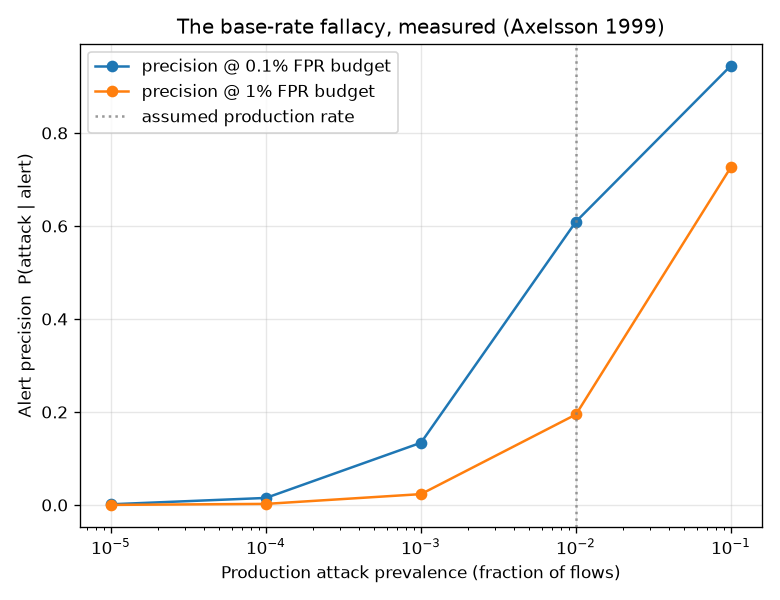

# NetSentry — The Base-Rate Fallacy, Measured

_Synthetic stand-in. Temporal split; thresholds chosen on validation at each FPR
budget; conditional TPR/FPR measured on the honest test split; then Bayes' rule
sweeps the production attack prevalence at an assumed 1,000,000 flows/day. The
conditional rates are prevalence-invariant — only the queue composition changes._

## Why this report exists

Axelsson (1999) showed that intrusion detection is dominated not by the ROC curve
but by the **base rate**: when attacks are one flow in ten thousand, even a
tiny false-positive rate buries the true alerts. The evaluation report's
precision is computed on the test mix (~22% attack on the stand-in) — honest for
that mix, but not what a production queue looks like. This report is the bridge:
the same measured operating points, re-read at deployment prevalences.

## Alert-queue composition vs prevalence

### 0.1% FPR budget (measured TPR 9.1%, realized FPR 0.059%)

| prevalence | alerts/day | of which false | precision | attacks caught/day |
|---|---|---|---|---|
| 0.0010% | 589 | 588 | 0.2% | 1 |
| 0.0100% | 597 | 588 | 1.5% | 9 |
| 0.1000% | 678 | 587 | 13.4% | 91 |
| 1.0000% | 1,489 | 582 | 60.9% | 907 |
| 10.0000% | 9,604 | 529 | 94.5% | 9,075 |

### 1% FPR budget (measured TPR 21.0%, realized FPR 0.876%)

| prevalence | alerts/day | of which false | precision | attacks caught/day |
|---|---|---|---|---|
| 0.0010% | 8,763 | 8,761 | 0.0% | 2 |
| 0.0100% | 8,781 | 8,760 | 0.2% | 21 |
| 0.1000% | 8,962 | 8,752 | 2.3% | 210 |
| 1.0000% | 10,770 | 8,673 | 19.5% | 2,097 |
| 10.0000% | 28,856 | 7,885 | 72.7% | 20,972 |

## The two inversions that make it concrete

- **Break-even prevalence.** At the 0.1% budget the queue is
  majority-false below a prevalence of **0.64%** (pi* = FPR/(TPR+FPR)). Reading
  the table: the assumed production rate (1.0%) sits above the break-even prevalence (0.64%), so the queue is majority-true at this operating point — but the margin erodes fast as the prevalence falls.
- **Required FPR.** For the queue to reach **90% precision**
  at a **0.001%** prevalence, the detector would need an FPR of
  **1.01e-07** — the measured operating point is **~5,828x** looser. No
  threshold choice closes a gap that size; it is a property of the base rate, not
  of the model.

## What follows from this (and already ships)

The way out is not a magically better per-flow FPR; it is changing what a queue
item *is* and how it is ordered — which is exactly what the rest of the suite
prices: the **alert-queue study** ranks flows by score so the top of the queue is
far more precise than the marginal alert; the **campaign report** aggregates
flows into operations so one investigation covers hundreds of hostile flows; and
the **cost report** makes the alert/miss trade explicit instead of hiding it in a
round-number budget. The base-rate fallacy is why those layers exist.
