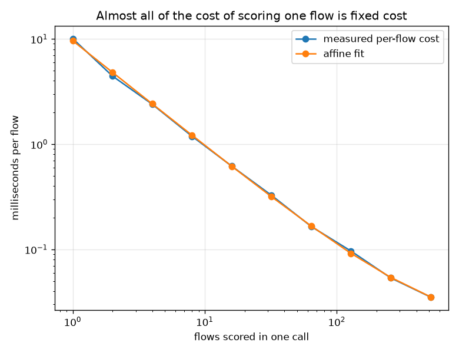
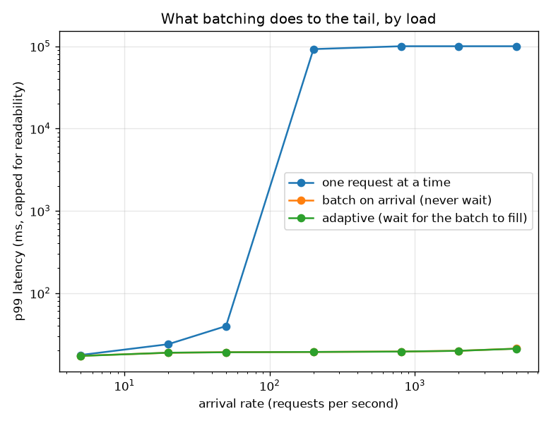

# NetSentry — Batching the Requests the Queue Already Has

_Service times measured on this machine through the deployed scoring path
(76 features, fitted pipeline plus boosted forest); queueing behaviour from a
discrete-event simulation of 20,000 Poisson arrivals per policy._

## Why this report exists

The API scores one flow per request, and `/predict/batch` only helps callers who already have
a hundred flows in hand. A collector shipping records as flows close does not: it produces a
stream of single-flow requests, each paying a full trip through the pipeline and the forest.
Whether that is wasteful is an empirical question about how much of the cost is *fixed*.

## The measurement everything else rests on

| flows per call | total time | per flow | speedup vs one at a time |
|---|---|---|---|
| 1 | 10.10 ms | 10.0966 ms | 1.0x |
| 2 | 8.89 ms | 4.4472 ms | 2.3x |
| 4 | 9.60 ms | 2.4009 ms | 4.2x |
| 8 | 9.53 ms | 1.1909 ms | 8.5x |
| 16 | 9.90 ms | 0.6189 ms | 16.3x |
| 32 | 10.46 ms | 0.3269 ms | 30.9x |
| 64 | 10.58 ms | 0.1652 ms | 61.1x |
| 128 | 12.36 ms | 0.0965 ms | 104.6x |
| 256 | 13.72 ms | 0.0536 ms | 188.5x |
| 512 | 18.06 ms | 0.0353 ms | 286.2x |

Scoring **one** flow costs 10.10 ms; scoring 512 costs 18.06 ms, which is 286x less per flow. The affine fit splits that into a **fixed cost of 9.62 ms per call** and a **marginal cost of 0.0166 ms per flow** — a ratio of about 578 to one.

That ratio is the entire case for batching, and it is a measurement of this implementation rather than a law: the fixed term is pandas frame construction, `ColumnTransformer` dispatch, array allocation and the tree ensemble's setup, none of which cares how many rows are in the call. It also sets a ceiling — no batching policy can push throughput past 60,130 requests per second on this machine, because that is what the per-flow work alone costs.

## What it does under load

| arrival rate | policy | mean batch | throughput | p50 | p95 | p99 | utilisation |
|---|---|---|---|---|---|---|---|
| 5/s | one request at a time | 1.0 | 5/s | 9.63 ms | 9.63 ms | 17.64 ms | 5% |
| 5/s | batch on arrival (never wait) | 1.0 | 5/s | 9.63 ms | 9.63 ms | 17.25 ms | 5% |
| 5/s | adaptive (wait for the batch to fill) | 1.0 | 5/s | 14.63 ms | 14.63 ms | 17.17 ms | 5% |
| 20/s | one request at a time | 1.0 | 20/s | 9.63 ms | 17.86 ms | 23.85 ms | 19% |
| 20/s | batch on arrival (never wait) | 1.0 | 20/s | 9.63 ms | 16.80 ms | 18.76 ms | 19% |
| 20/s | adaptive (wait for the batch to fill) | 1.1 | 20/s | 14.63 ms | 16.54 ms | 18.81 ms | 17% |
| 50/s | one request at a time | 1.0 | 50/s | 9.63 ms | 27.92 ms | 39.63 ms | 48% |
| 50/s | batch on arrival (never wait) | 1.1 | 50/s | 9.63 ms | 18.20 ms | 19.08 ms | 44% |
| 50/s | adaptive (wait for the batch to fill) | 1.3 | 51/s | 14.63 ms | 18.02 ms | 19.04 ms | 38% |
| 200/s | one request at a time | 1.0 | 104/s | 46796.98 ms | 88566.29 ms | 92243.05 ms | 193% **(saturated)** |
| 200/s | batch on arrival (never wait) | 2.1 | 200/s | 14.09 ms | 18.81 ms | 19.21 ms | 93% |
| 200/s | adaptive (wait for the batch to fill) | 2.3 | 201/s | 14.65 ms | 18.75 ms | 19.20 ms | 83% |
| 800/s | one request at a time | 1.0 | 104/s | 84012.72 ms | 159093.01 ms | 165815.55 ms | 771% **(saturated)** |
| 800/s | batch on arrival (never wait) | 7.8 | 805/s | 14.65 ms | 19.01 ms | 19.42 ms | 99% |
| 800/s | adaptive (wait for the batch to fill) | 7.9 | 810/s | 14.65 ms | 19.02 ms | 19.42 ms | 98% |
| 2,000/s | one request at a time | 1.0 | 104/s | 91405.76 ms | 173572.57 ms | 180865.21 ms | 1927% **(saturated)** |
| 2,000/s | batch on arrival (never wait) | 19.9 | 2,000/s | 14.92 ms | 19.42 ms | 19.83 ms | 100% |
| 2,000/s | adaptive (wait for the batch to fill) | 20.0 | 2,013/s | 14.91 ms | 19.41 ms | 19.83 ms | 99% |
| 5,000/s | one request at a time | 1.0 | 104/s | 94330.31 ms | 179221.55 ms | 186771.05 ms | 4817% **(saturated)** |
| 5,000/s | batch on arrival (never wait) | 52.5 | 5,003/s | 15.75 ms | 20.56 ms | 21.09 ms | 100% |
| 5,000/s | adaptive (wait for the batch to fill) | 53.1 | 5,046/s | 15.82 ms | 20.56 ms | 21.04 ms | 99% |

At **5 requests a second** the server is idle between requests and the waiting policy is pure cost: p50 rises from 9.63 ms to 14.63 ms, **+5.00 ms** for company that never arrives. Note which policy pays it — batch-on-arrival sits at 9.63 ms, identical to no batching, because it never waits. The timer is the part that hurts, not the batching.

At **5,000 requests a second** the unbatched server has been left behind: it clears 104 requests a second against an arrival rate of 5,000, so its queue grows without bound and its p99 — 187 seconds — is a number that means 'never', not 'slow'. The adaptive server clears 5,046/s at a p99 of 21.04 ms, on the same core, with the same model, returning bit-identical scores.

The middle of the table is where the interesting thing happens, and it is not what the low-load intuition predicts. Batching starts winning the **tail** long before it is needed for throughput: even at 50/s, where the unbatched server is nominally keeping up, its p99 is already 39.6 ms against the adaptive policy's 19.0 ms. A single server whose service time is 10 ms is at 50% utilisation by 50 requests a second, and a queue at 50% utilisation already has a bad tail. Batching does not only raise the ceiling; it flattens the tail underneath it, because a batch absorbs a burst that a one-at-a-time server has to serialise.

On p99 the crossover is at **5 requests a second** or below — the entire measured range favours batching on the tail. On the median the ordering is the opposite at low load, which is the honest summary: waiting costs the typical request and protects the unlucky one, and which of those an operator cares about is a policy question rather than a benchmark result.

## The one knob

| max wait at 2,000 req/s | mean batch | throughput | p50 | p99 |
|---|---|---|---|---|
| 0.5 ms | 19.8 | 1,989/s | 14.93 ms | 19.82 ms |
| 1.0 ms | 20.1 | 2,019/s | 14.93 ms | 19.83 ms |
| 2.0 ms | 20.0 | 2,009/s | 14.98 ms | 19.83 ms |
| 5.0 ms | 19.7 | 1,982/s | 14.98 ms | 19.80 ms |
| 20.0 ms | 41.1 | 2,002/s | 20.55 ms | 30.33 ms |

`max_wait` is the one knob, and at 2,000 requests a second it buys very little: 0.5 ms of patience yields a mean batch of 19.8 and 20.0 ms yields 41.1, moving p99 from 19.82 ms to 30.33 ms. The reason is that at this load the batch is usually full before the timer matters — the queue supplies the company, not the waiting. The timer earns its place at the *bottom* of the load range, where it is also where the harm is, which is the honest summary: `max_wait` is a safety valve for bursty traffic, not a throughput knob.

## Checking the simulator against theory

| arrival rate | simulated batch | predicted batch | simulated mean latency | predicted latency |
|---|---|---|---|---|
| 5/s | 1.0 | 1.0 | 14.62 ms | 14.45 ms |
| 20/s | 1.1 | 1.0 | 14.62 ms | 14.45 ms |
| 50/s | 1.3 | 1.0 | 14.56 ms | 14.45 ms |
| 200/s | 2.3 | 1.9 | 14.52 ms | 14.48 ms |
| 800/s | 7.9 | 7.8 | 14.64 ms | 14.62 ms |
| 2,000/s | 20.0 | 19.9 | 14.93 ms | 14.92 ms |
| 5,000/s | 53.1 | 52.5 | 15.83 ms | 15.74 ms |

**A batching server is not an M/D/1 queue, and modelling it as one gives the wrong answer.** The first version of this section did exactly that — batches arriving at `lambda / b` into a deterministic-service queue — and predicted latencies twenty-five times the simulated ones at high load, because that model has a fixed batch size and this system does not. Its *service capacity grows with its own backlog*: the busier it gets, the more requests are waiting when the server frees up, so the batch is larger and the per-request cost lower.

The right model is the fixed point of 'the next batch is whatever arrived while the last one was in service', `b = lambda (a + c b)`, giving `b* = lambda a / (1 - lambda c)` and a mean latency of `1.5 (a + c b*)` — half a service period waiting for the batch in flight, then one for your own. It matches the simulation to within 1.2% at every rate, on both the batch size and the latency, which is the check the simulator needed.

The denominator is where the operational answer lives. It vanishes at `lambda = 1 / c` = **60,130 requests a second**: past that the per-flow work alone outruns the server and no batching policy helps. Below it the server self-regulates. The unbatched server saturates at `1 / (a + c)` = **104 requests a second** — so batching does not make this server faster by a percentage, it moves the capacity ceiling by a factor of **579**, which is exactly the fixed-to-marginal ratio measured at the top of this report.

## Scope and honest limits

- **The service curve is measured; the load is simulated.** A load generator pointed at a live
  server on one laptop measures the laptop's scheduler, the event loop and the client as much
  as the model, and the quantity that decides this question — the fixed/marginal split — is
  exactly the part that can be timed honestly in isolation. The simulation inherits the
  measurement and adds an arrival process, and both are stated rather than blended.
- **Poisson arrivals are a convenient fiction.** Real flow-export traffic is bursty and
  correlated (a scan produces thousands of flow records in a second), which makes tails worse
  than anything here. The [SOC queue simulation](socsim.md) makes the same simplification for
  the same reason and says so in the same place.
- **One server, one core, no concurrency.** Real deployments run several uvicorn workers, and
  the batching benefit is *per worker* — four workers with batching still pay four fixed
  costs, one each. Nothing here models GIL contention or CPU oversubscription.
- **Explanations are excluded.** SHAP is roughly three quarters of request latency (see the
  README's serving benchmark), and it batches differently from the forest. A batching policy
  tuned on the no-explanation path is tuned on the fast path only.
- **Batching changes latency, never a verdict.** Every flow in a batch is scored by the same
  model with the same fitted pipeline it would have got alone; the outputs are bit-identical
  to the unbatched path, which is what makes this a pure systems trade.