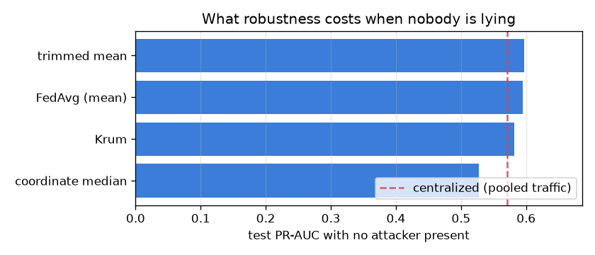
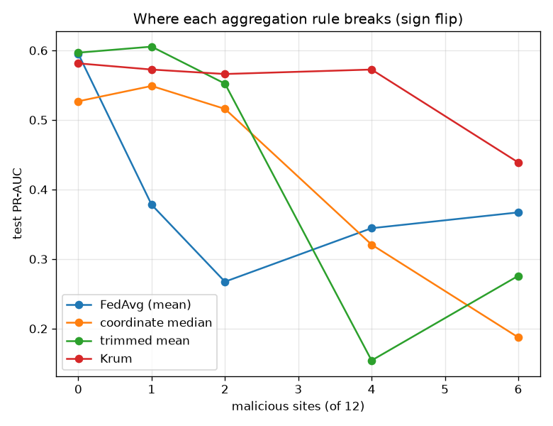

# NetSentry — Byzantine-Robust Aggregation: When a Site Lies

_Synthetic stand-in. Honest temporal/binary split. 12 sites (capture days sharded
4 ways each, 1,877-2,991 flows apiece), 8 federated
rounds, linear model — FedAvg averages parameters and a boosted forest has none to average.
Malicious sites are always the first ones, held fixed across cells, so differences between rows
are the aggregation rule and not which sites were corrupted._

## Why this report exists

The [federated study](federated.md) trains across sites that cannot pool raw traffic, sharing
only weights. It assumes every site is honest, and that assumption carries the entire result.
Averaging is linear and has no bounded influence: one participant sending a large enough vector
moves the global mean wherever it wants. Federation is precisely the setting where such a
participant is plausible, because the reason you are federating is that you cannot inspect the
other members' data — and if you cannot inspect their data, you cannot inspect their updates.

## What robustness costs before any attack

| aggregation rule | clean PR-AUC | vs FedAvg | tolerates |
|---|---|---|---|
| FedAvg (mean) | 0.595 | +0.000 | **nothing** — one site is enough |
| coordinate median | 0.527 | -0.068 | up to 5 of 12 |
| trimmed mean | 0.597 | +0.002 | up to 2 by construction |
| Krum | 0.581 | -0.014 | f < (n-2)/2, i.e. up to 4 |

Robust rules discard information by design — a median ignores everything but the middle, Krum
does not average at all but *elects* a single site's update — so they should be expected to
lose ground when nobody is lying. Centralized training on pooled traffic reaches
0.570 for reference.

## Under attack

| aggregation rule | attack | 1 liars | 2 liars | 4 liars | 6 liars |
|---|---|---|---|---|---|
| FedAvg (mean) | sign flip | 0.378 (64%) | 0.267 (45%) | 0.344 (58%) | 0.367 (62%) |
| FedAvg (mean) | Gaussian noise | 0.361 (61%) | 0.329 (55%) | 0.200 (34%) | 0.254 (43%) |
| FedAvg (mean) | label flip | 0.611 (103%) | 0.514 (86%) | 0.427 (72%) | 0.426 (72%) |
| coordinate median | sign flip | 0.549 (104%) | 0.516 (98%) | 0.321 (61%) | 0.187 (36%) |
| coordinate median | Gaussian noise | 0.546 (104%) | 0.532 (101%) | 0.456 (87%) | 0.315 (60%) |
| coordinate median | label flip | 0.545 (103%) | 0.512 (97%) | 0.312 (59%) | 0.304 (58%) |
| trimmed mean | sign flip | 0.605 (101%) | 0.552 (93%) | 0.154 (26%) | 0.276 (46%) |
| trimmed mean | Gaussian noise | 0.611 (102%) | 0.601 (101%) | 0.206 (34%) | 0.253 (42%) |
| trimmed mean | label flip | 0.598 (100%) | 0.542 (91%) | 0.426 (71%) | 0.426 (71%) |
| Krum | sign flip | 0.572 (98%) | 0.566 (97%) | 0.572 (98%) | 0.439 (76%) |
| Krum | Gaussian noise | 0.572 (98%) | 0.566 (97%) | 0.572 (98%) | 0.439 (76%) |
| Krum | label flip | 0.572 (98%) | 0.566 (97%) | 0.572 (98%) | 0.439 (76%) |

**One malicious site out of 12 costs a third of FedAvg's value.** Under sign flip, a single liar takes the federated model from 0.595 PR-AUC to **0.378** — 64% of what it was worth, from 8% of the participants. The mechanism is not subtle and that is the point: averaging has no bounded influence, so one participant's contribution is unbounded, and a federation is by construction a place where the other participants cannot be audited. Swapping the mean for coordinate median, trimmed mean, Krum holds the same single-liar attack above 90% of clean performance, without changing anything else in the protocol.

Krum's three attack rows are **identical, digit for digit**, which looks like a copy-paste error and is actually the rule's defining property. Krum does not average; it elects a single site's update and discards every other. When the elected update is an honest one, the attackers' submissions have no influence at all — not a diluted influence, none — so what they contained cannot matter. Averaging rules blend the attack in and their rows differ by attack; Krum either excludes it or does not, and here it always did. The corollary is the whole risk of the approach: Krum throws away the other sites' honest updates too, which is why it sits below the trimmed mean when nobody is lying, and why an attacker who can place an update *inside* the honest cluster defeats it completely.

## Where each rule breaks

Smallest number of malicious sites that costs more than 10% of the rule's own clean PR-AUC:

| aggregation rule | sign flip | Gaussian noise | label flip |
|---|---|---|---|
| FedAvg (mean) | **1** | **1** | **2** |
| coordinate median | **4** | **4** | **4** |
| trimmed mean | **4** | **4** | **4** |
| Krum | **6** | **6** | **6** |

The label-flip row is the one to take seriously. With 6 of 12 sites training honestly on inverted labels, retention runs from 58% (coordinate median) to 76% (Krum). It is the mildest attack in the table by raw damage and the most realistic by a distance: the malicious update has an ordinary norm, points in an ordinary direction, and sits a perfectly ordinary distance from its neighbours. Every defence here works by treating *outliers* as suspicious, and a well-fitted model of the wrong thing is not an outlier. Robust aggregation solves the loud attack and leaves the quiet one open — which is the same shape as the [backdoor study's](backdoor.md) finding that clean-metric monitoring cannot see a trigger, and a reason to keep the [data-valuation](data_value.md) and [influence](influence.md) tooling pointed at contribution quality rather than at gradient norms.

## Scope

The model is linear because parameter averaging requires parameters; the deployed detector is a
boosted forest, so this study is about the federated *protocol* rather than about the deployed
artefact, exactly as the [federated study](federated.md) is. Attackers here are static — they do
not know which aggregation rule they face and do not adapt to it, so these numbers are an
optimistic view of the defences. An attacker who knows the rule can do considerably better;
Krum in particular has known adaptive attacks that place a malicious update inside the honest
cluster, and defending against an adaptive adversary is a different and unfinished problem. The
trimmed mean's tolerance is a construction parameter rather than a discovery: it drops exactly
`trim` values per coordinate from each end, so setting it below the true number of liars is a
choice to fail. Sites are shards of capture days, which keeps the non-IID structure the
federated study documents, but shard-level heterogeneity is milder than genuinely independent
estates would be — and heterogeneity is what makes honest updates spread out, which is precisely
what robust aggregation has to distinguish from an attack.