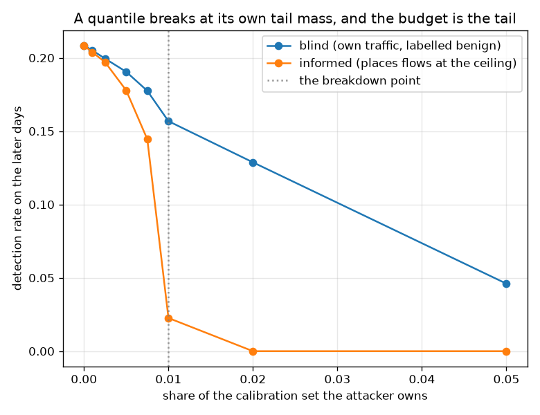

# NetSentry -- Poisoning the Threshold Instead of the Model

_The deployed 1.0%-budget cut, recalibrated on 5,611 benign validation scores with a growing share replaced by an attacker's, and judged on the later days. Regenerate with `netsentry calibrationattack`._

## Why this report exists

Every poisoning study here attacks the *training* data -- [flipped labels and a contaminated benign pool](poisoning.md), a [planted backdoor](backdoor.md) -- and each is answered by a defence that inspects the training set. They share an assumption nobody wrote down: that the thing worth corrupting is the model.

It is not the only thing. Every operational number this project ships comes from a threshold, and that threshold is a **quantile of benign validation scores**. An attacker who can get their own traffic labelled benign during calibration moves the cut without going anywhere near the model.

**The threshold's breakdown point is the false-positive budget itself, so the tighter the budget, the cheaper it is to attack.**

The deployed cut at a 1.0% budget is the 99.0% quantile of 5,611 benign validation scores. A quantile's breakdown point is the mass in its own tail: own more than **1.0%** of the calibration sample and the order statistic lands past every clean observation, wherever the attacker likes. Nothing about the model is touched, and nothing about the calibration procedure is wrong -- it takes the quantile of everything it was told is benign, which is exactly the deployed rule.

The arithmetic holds exactly. At **56 injected flows** -- 1.0% of the calibration set -- an attacker who can place flows at the top of the benign score distribution takes detection from 20.7% to **2.3%**, and one step further takes it to zero.

**And the attacker does not need to be clever.** One who merely has their own traffic present during the calibration window -- reconnaissance while a detector is being tuned, a mislabelled maintenance window, a batch of alerts an analyst cleared as false positives -- reaches 15.7% with the same 56 flows, no knowledge of the model or the threshold required.

**Nothing notices.** Across every injection level tested, the score-distribution monitor peaks at a PSI of 0.017 against a 0.2 alarm line -- because a few hundred flows out of thousands barely move a binned distribution, and the ones that were added are individually unremarkable. The [compositional study](composition.md) found the same shape for evasion: the failures a drift monitor is worst at seeing are the ones an adversary chooses.

This is the [resolution study](power.md)'s finding from the other side. It measured how few benign flows decide the realised false-positive rate at a tight budget; those are the same flows an attacker has to own. Reading the same arithmetic across budgets makes the trend explicit, and it is the wrong way round:

| false-positive budget | flows deciding the realised rate | flows an attacker must own | detection it buys |
|---|---|---|---|
| 5.0% | 820 | **281** | 29.3% |
| 1.0% | 153 | **56** | 20.7% |
| 0.5% | 86 | **28** | 17.8% |
| 0.1% | 9 | **6** | 9.0% |

**The operating point this project leads with is the one an attacker can buy most cheaply.** Moving the 5.0% cut takes 281 flows; moving the 0.1% cut takes 6. Tightening a budget is usually described as making a detector stricter. It also makes the number enforcing that strictness rest on fewer observations, and an order statistic resting on fewer observations is easier to move.

## The curve

| attacker | injected | share | threshold | detection | detection lost | score PSI | monitor fires |
|---|---|---|---|---|---|---|---|
| blind (own traffic, labelled benign) | 0 | 0.00% | 0.8701 | 20.8% | **-0.1%** | 0.000 | no |
| blind (own traffic, labelled benign) | 6 | 0.10% | 0.8777 | 20.5% | **+0.2%** | 0.000 | no |
| blind (own traffic, labelled benign) | 14 | 0.25% | 0.8909 | 19.9% | **+0.8%** | 0.000 | no |
| blind (own traffic, labelled benign) | 28 | 0.50% | 0.9064 | 19.0% | **+1.7%** | 0.000 | no |
| blind (own traffic, labelled benign) | 42 | 0.75% | 0.9299 | 17.7% | **+3.0%** | 0.000 | no |
| blind (own traffic, labelled benign) | 56 | 1.00% | 0.9545 | 15.7% | **+5.1%** | 0.001 | no |
| blind (own traffic, labelled benign) | 112 | 2.00% | 0.9741 | 12.9% | **+7.9%** | 0.003 | no |
| blind (own traffic, labelled benign) | 281 | 5.00% | 0.9969 | 4.6% | **+16.1%** | 0.017 | no |
| informed (places flows at the ceiling) | 0 | 0.00% | 0.8701 | 20.8% | **-0.1%** | 0.000 | no |
| informed (places flows at the ceiling) | 6 | 0.10% | 0.8793 | 20.4% | **+0.4%** | 0.000 | no |
| informed (places flows at the ceiling) | 14 | 0.25% | 0.8972 | 19.7% | **+1.0%** | 0.000 | no |
| informed (places flows at the ceiling) | 28 | 0.50% | 0.9297 | 17.8% | **+3.0%** | 0.000 | no |
| informed (places flows at the ceiling) | 42 | 0.75% | 0.9641 | 14.4% | **+6.3%** | 0.000 | no |
| informed (places flows at the ceiling) | 56 | 1.00% | 0.9990 | 2.3% | **+18.5%** | 0.001 | no |
| informed (places flows at the ceiling) | 112 | 2.00% | 1.0000 | 0.0% | **+20.7%** | 0.003 | no |
| informed (places flows at the ceiling) | 281 | 5.00% | 1.0000 | 0.0% | **+20.7%** | 0.017 | no |

The **blind** attacker is the realistic one: their flows are their own traffic, scored by the deployed model and labelled benign by whoever was calibrating. They need no knowledge of the model, the threshold, or that a threshold exists. The **informed** attacker, who can place flows at the very top of the score distribution, is an upper bound rather than a threat model -- it is here to show where the curve ends, and it ends at the breakdown point the arithmetic predicts.

## What the fixes cost

| calibration rule | attacker | clean FPR (budget 1.0%) | clean detection | detection under attack | kept |
|---|---|---|---|---|---|
| the deployed rule (a plain quantile) | spread across every day | 0.82% | 20.8% | 0.0% | **0%** |
| trimmed quantile (drop the top 2.0%) | spread across every day | 1.71% | 23.8% | 8.1% | **34%** |
| median of per-day thresholds | spread across every day | 0.79% | 20.4% | 0.0% | **0%** |
| the deployed rule (a plain quantile) | confined to one day | 0.82% | 20.8% | 0.0% | **0%** |
| trimmed quantile (drop the top 2.0%) | confined to one day | 1.71% | 23.8% | 8.1% | **34%** |
| median of per-day thresholds | confined to one day | 0.79% | 20.4% | 19.0% | **93%** |

Both defences are priced on **clean** data as well as poisoned, because a defence measured only under attack is a defence whose bill nobody has seen.

**The trimmed quantile buys uniform, mediocre robustness at a permanent price.** Discarding the top of the sample restores the breakdown point -- an attacker holding less than the trim cannot reach the cut, because everything they placed above it was thrown away first -- and it keeps 34% of detection against either attacker shape. The bill is paid every day: the trimmed sample's quantile sits below the true one, so the rule runs at 1.71% against the 1.0% it was asked for, 71% over budget on traffic nobody is attacking.

**The median of per-day thresholds is nearly free and conditionally excellent.** It costs nothing on clean data -- 0.79% against a 1.0% budget -- and keeps **93%** of detection against an attacker confined to one day, because a median over days is outvoted by the days that were not touched. Against one **spread across every day** it keeps 0%: every term in the median is poisoned, so taking the median of them buys nothing at all.

That is not a weaker defence than the trimmed quantile; it is a **different claim**. One bounds the damage regardless of how the attacker arranges their flows and charges for it continuously. The other is free and total against a concentrated adversary and worthless against a patient one. Reporting a single averaged number for either would hide the case an operator actually faces, which is why the table is split by attacker shape.

## Scope and honest limits

- **The attack assumes flows reach the calibration set labelled benign**, which is a claim about an operational process rather than about the model. It is the same assumption the [label-audit study](label_audit.md) makes from the other direction, and whether it holds is a question about how a deployment collects its validation data.
- **The informed attacker is an upper bound, not a threat model.** Placing flows at the exact top of the score distribution requires knowing the scores, which is a stronger capability than the [extraction study](extraction.md) needs but not one this repository otherwise grants. The blind curve is the one to read as a threat.
- **The breakdown point is exact; the curve below it is not a bound.** How much detection a sub-breakdown injection costs depends on the shape of the benign score distribution near the cut, which is a property of this model on this data.
- **A defence that changes the threshold changes every downstream number.** The trimmed rule's higher alert volume feeds the [alert-queue](alert_queue.md) and [SLO](slo.md) studies, which were computed against the plain quantile; adopting it would require re-running both.
- **The monitor tested is the one this project runs.** A monitor designed for this attack -- watching the calibration set's upper tail specifically, rather than its whole distribution -- would fire, and the fact that PSI does not is a statement about what is deployed rather than about what is possible.
