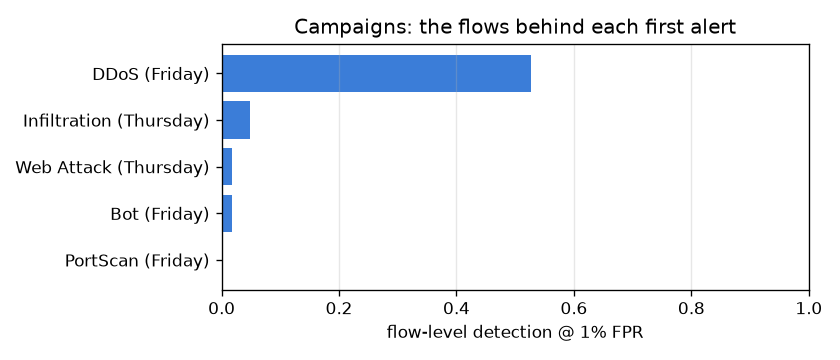

# NetSentry — Campaign-Level Detection (the SOC's unit of account)

_Synthetic stand-in. Temporal split; the binary model's raw test scores at
thresholds chosen on validation. A campaign is one (capture day, attack class)
operation — on CIC-IDS2017 each attack class runs exactly once — and it counts as
alerted when ≥ 1 of its flows crosses the threshold, confirmed at k=5 to guard
against a single ambiguous hit. Rows are in stream order, so "first alert at flow
#" is how many of the campaign's own flows had already run._

## Why this view exists

Nobody responds to a flow. The headline TPR@FPR prices detection per flow because
that is the honest, comparable statistic — but an analyst experiences *campaigns*:
the flood either pages someone or it doesn't. Both statistics are needed: the
flow-level number for comparing models and setting budgets, the campaign-level
number for saying what the deployment would actually have caught.

## Summary (both budgets)

| FPR budget | flow-level TPR | campaigns alerted (k=1) | confirmed (k=5) |
|---|---|---|---|
| 0.1% | 9.1% | **1/5** | 1/5 |
| 1.0% | 21.0% | **5/5** | 4/5 |

## Per campaign, at the 1% budget

| campaign | day | flows | flow-level detection | alerts | first alert at flow # |
|---|---|---|---|---|---|
| Infiltration | Thursday | 42 | 4.8% | 2 | 36 |
| Web Attack | Thursday | 288 | 1.7% | 5 | 26 |
| Bot | Friday | 351 | 1.7% | 6 | 52 |
| DDoS | Friday | 2,442 | 52.7% | 1,287 | 1 |
| PortScan | Friday | 3,114 | 0.3% | 8 | 687 |

## Read

At the 1% budget a 21% flow-level rate reads like a miss, but **every one of the 5 campaigns raises an alert** — a sustained attack offers the detector many draws and one hit starts an investigation. The honest differentiator moves to the *latency* column: DDoS pages on its very first flow, while PortScan runs **687 hostile flows** (of 3,114) before its first alert. "Detected" and "detected in time" are different claims, and only the first-alert column separates them.

## What this framing does not do

Benign traffic has no campaign structure, so the false-alert volume the FPR
budget prices is **unchanged** — this moves the numerator (which attacks get
seen), not the denominator (what the alert queue costs; see the alert-queue
study). It also assumes something ties a campaign's alerts together for the
analyst (source, service, time proximity); the k=5 column is the conservative
reading for when that correlation is imperfect.
