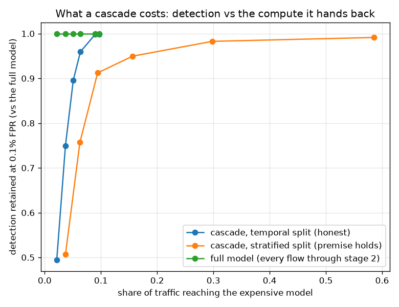

# NetSentry — Budgeted Cascade Inference

_Synthetic stand-in. Headline on the honest temporal/binary split
(24,957 test flows), with the stratified split
(12,000 flows) run alongside as a premise check. Both stages timed on
this machine with single-row calls (the serving unit of work); latency numbers are relative,
the ratios are the point. Stage 2 is the deployed LightGBM model; stage 1 is a logistic
regression over the identical fitted feature pipeline, so no second preprocessing path
exists to skew._

## Why this report exists

Single-flow inference costs ~48 ms with SHAP and ~13 ms without. On a link carrying a
million flows a day the usual answers are "add replicas" or "drop the explanations", and
both concede something worth keeping. A **cascade** is the third answer: run a cheap model
on everything and spend the expensive model only where the cheap one is not already sure.
The design question is how to choose the cheap model's cut-off without quietly throwing
detection away — and the answer is not a round number. Stage 1's threshold is chosen on
validation as the quantile that forwards a target share of **the deployed model's own
alerts**, which makes the knob an explicit escape budget, needs no labels, and measures the
cascade's loss against the thing it replaces.

## The trade, priced

| alerts kept (target) | escaped | traffic to stage 2 | detection | FPR | PR-AUC | latency/flow | speedup | throughput |
|---|---|---|---|---|---|---|---|---|
| _(full model)_ | 0.0% | 100.00% | 9.1% | 0.059% | 0.529 | 1.07 ms | 1.0x | 932/s |
| 100% | 0.2% | 9.66% | 9.1% | 0.059% | 0.574 | 0.23 ms | **4.7x** | 4,415/s |
| 99% | 0.2% | 8.98% | 9.1% | 0.059% | 0.575 | 0.22 ms | **4.9x** | 4,563/s |
| 95% | 4.3% | 6.35% | 8.7% | 0.048% | 0.575 | 0.19 ms | **5.6x** | 5,236/s |
| 90% | 10.9% | 5.08% | 8.1% | 0.037% | 0.573 | 0.18 ms | **6.0x** | 5,639/s |
| 75% | 25.5% | 3.69% | 6.8% | 0.032% | 0.571 | 0.16 ms | **6.6x** | 6,158/s |
| 50% | 51.1% | 2.14% | 4.5% | 0.011% | 0.570 | 0.15 ms | **7.4x** | 6,857/s |

Stage 1 costs 0.12 ms per flow against stage 2's 1.07 ms — 9x cheaper, measured on this machine, single-row, the way the API actually serves. That ratio is the entire budget the cascade has to spend, and it is why the cheap stage has to be genuinely cheap rather than merely smaller. At the 95%-alert-retention setting, 6.35% of traffic reaches the expensive model, blended latency falls to 0.19 ms (5.6x, 5,236 flows/s against 932/s), and detection lands at 8.7% against the full model's 9.1% — 96% of the detection for 6.4% of the expensive compute. The false-positive rate is unchanged by construction: stage 1 can only ever *remove* alerts, never add them, so a cascade is strictly a recall-side trade and the operator's calibrated FPR budget survives it.

## Checking the premise: is stage 2 actually the better model?

| split | stage 1 (logistic) PR-AUC | stage 2 (deployed) PR-AUC | stage 2 better? | cascade detection retained |
|---|---|---|---|---|
| temporal | 0.569 | 0.529 | **no** | 96% (at 6.4% deferral) |
| stratified | 0.697 | 0.786 | yes | 98% (at 29.8% deferral) |

A cascade assumes stage 2 is the better model, and on the honest split **that premise does not hold here**: the cheap logistic filter reaches 0.569 PR-AUC against the deployed model's 0.529, and detects 11.6% at the 0.1% budget against 9.1%. That is not a bug in this study — it is the [leaderboard](leaderboard.md)'s documented finding arriving a second time, from a completely different direction: under temporal shift the simpler, higher-bias model transfers better, because the boosted model's extra capacity is spent on Mon-Wed structure that Thu-Fri does not honour. It also explains the otherwise-suspicious PR-AUC column above, where several cascade settings *exceed* the full model: that is stage 1's ranking showing through on the flows it filtered, not the cascade manufacturing signal.

So the temporal row cannot carry the cascade claim on its own, and the stratified split is included precisely to supply a regime where the premise does hold (0.786 vs 0.697 — the deployed model is clearly better when train and test are exchangeable). Read together, the two rows say the engineering result is real and the model-choice result is separate: **the cascade mechanism reliably hands back compute at a small, budgeted recall cost wherever stage 2 is worth escalating to** — and on this synthetic stand-in's honest split, the more useful finding is that stage 2 may not be worth escalating to at all.

## Where the trade stops being free

The knee is where the trade stops being free. Pushing to the most aggressive setting (50% retention, 2.14% of traffic deferred) buys 7.4x but drops detection to 4.5% and lets 51.1% of the full model's alerts escape stage 1. Because the threshold is set on validation against the *deployed model's own alerts*, that escape rate is a budget an operator sets deliberately rather than a surprise found in production — and because it needs no labels, it can be re-derived on live traffic whenever the [threshold refresh](refresh.md) job runs.

## Scope

Latency is measured on one machine with a warm process and no network, so the absolute
milliseconds are not a production SLA — the *ratio* between the stages is what transfers,
and it is the only quantity the speedup depends on. SHAP is excluded from both stages
because explanations are computed on alerts, not on every flow, so they sit downstream of
the cascade entirely and benefit from it automatically (fewer flows reach the stage that
explains). The escape rate is measured against the full model's alerts rather than against
ground truth, deliberately: that is the quantity a live system can compute, and the
label-based detection column is reported beside it so the two views can be compared. The
cascade cannot raise the false-positive rate — filtering only removes alerts — so every
threshold, cost, and conformal result elsewhere in this repo remains valid at its stated
budget; what changes is recall, and it is priced above.