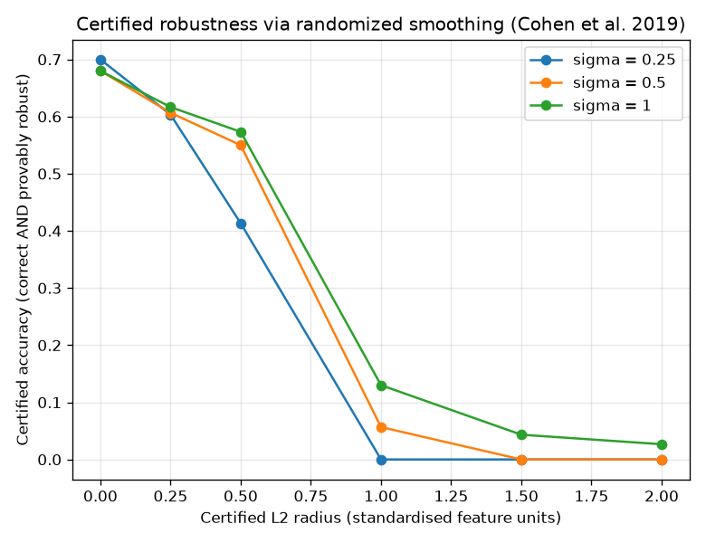

# NetSentry - Certified Robustness (Randomized Smoothing)

_Synthetic stand-in. Stratified/binary model; 300 class-balanced flows certified
with 1,000 Monte-Carlo noise draws each at confidence 1 - 0.001
(Clopper-Pearson). Radii are in standardised-feature L2 units, the same scale as the
evasion study's search budgets._

## Why this report exists

The evasion study measures how far detection can be pushed down by an attacker; the
hardening study reduces that empirically. Neither can *prove* a flow is safe — an absent
attack is only an attack not yet found. Randomized smoothing (Cohen, Rosenfeld & Kolter,
2019) gives a **provable** guarantee: classify each flow by majority vote under Gaussian
noise, and no L2 perturbation smaller than ``R = sigma * Phi^-1(p_A)`` can change the
verdict, where ``p_A`` is a Clopper-Pearson lower bound on the majority-vote probability.
This is the formal-guarantee counterpart to the empirical evasion study — the same role
differential privacy plays for the empirical membership audit.

## Certified accuracy vs radius

A flow counts as certified at radius ``r`` only if the smoothed classifier gets it right
**and** proves robustness to every L2 perturbation up to ``r``.

| sigma | smoothed acc. | abstain | median radius | cert@0 | cert@0.25 | cert@0.5 | cert@1 | cert@1.5 | cert@2 |
|---|---|---|---|---|---|---|---|---|---|
| 0.25 | 70% | 2% | 0.495 | 70% | 60% | 41% | 0% | 0% | 0% |
| 0.5 | 68% | 3% | 0.728 | 68% | 61% | 55% | 6% | 0% | 0% |
| 1 | 68% | 4% | 0.768 | 68% | 62% | 57% | 13% | 4% | 3% |

The accuracy/robustness frontier is visible in the table: the smallest noise (sigma = 0.25) keeps the most clean detection (70%) but certifies the smallest radii, while sigma = 1 certifies the largest median radius (0.768) at a clean-accuracy cost (68%). Two conservatisms are worth stating plainly. The certificate is against **any** L2 perturbation, whereas the evasion study's attacker only moves the controllable feature subset — so a certified radius is a strictly stronger promise than the budget the attack needs, and the two numbers are not directly comparable, only read side by side. And randomized smoothing on an undefended gradient-boosted model certifies conservatively: the base was never trained to be stable under noise, which is why abstention is non-trivial and radii are modest. The standard next step (Cohen et al.) is to train the base on noise-augmented data so the smoothed classifier both abstains less and certifies farther — the measure-then-fix arc this project applies to evasion (hardening) and privacy (differential privacy), here for certified radius.

## Scope

Certification is a property of the *smoothed* classifier (majority vote under noise), not
the raw model the API serves — deploying it means accepting the clean-accuracy cost and
the per-flow sampling cost in the table. The guarantee is probabilistic (holds with
confidence 1 - 0.001 over the Monte-Carlo draws) and against all-feature L2
perturbations. It complements, rather than replaces, the empirical evasion and hardening
studies: those bound what a *known* attacker achieves against the deployed model; this
bounds what *any* attacker could achieve against the smoothed one.