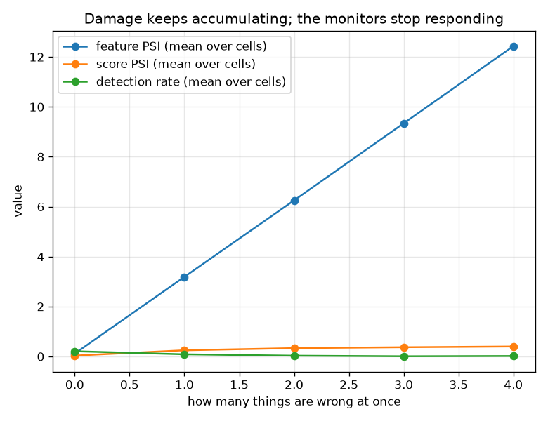

# NetSentry -- Do the Safeguards Compose?

_A 2^4 factorial over shift, outage, evasion, rarity: all 16 combinations, each read for the same four guarantees and three monitors. Regenerate with `netsentry composition`._

## Why this report exists

This repository has a defence for each failure it has thought of, and each was measured with **one thing wrong at a time**. Production does not have that courtesy. The question here is whether the guarantees, and the monitors that watch them, survive two failures at once -- which is a real question rather than a rhetorical one, because failures interact: two perturbations that each move a monitored statistic can fail to stack, leaving the statistic near where it started while the system underneath is worse than either alone.

A factorial design separates a **main effect** -- what one stressor does alone -- from an **interaction**, what a pair does beyond the sum of its parts. Every other report here measures the first and is structurally blind to the second.

**Before a single stressor is switched on, a guarantee this system makes is already broken -- and nothing is watching it.**

With nothing wrong at all, the coverage promise calibrated on validation delivers 59.7% against the 90% it was calibrated to, and neither drift monitor fires: feature PSI sits at 0.11 and score PSI at 0.03, both under the 0.2 line. The temporal gap between the training days and the later ones is enough on its own, which the [adaptive-conformal study](adaptive_conformal.md) exists to fix and the [open-set study](openset.md) explains -- but the point here is narrower and worse: **the breach is invisible to the monitoring this system actually runs.**

**The stressor a monitor most needs to see is the one it cannot.** `evasion` alone costs 6.5% of detection -- 31% of the deployment's whole detection rate, 20.7% down to 14.3% -- and leaves every monitor silent: feature PSI 0.18, score PSI 0.07, alert rate 4.2% against a ceiling of 19.9%. A drift monitor calibrated to notice a *major population shift* is the wrong instrument for an adversary, who is specifically trying not to cause one.

**And the monitor that does fire, fires for the wrong reason.** `rarity` changes no model, no threshold and no feature -- it only thins the attacks to a production base rate of 1.0% -- yet score PSI reaches 0.24 and trips the same alarm. Nothing about the detector is worse; the traffic simply has a different composition, which is what the [base-rate study](base_rate.md) predicts and what an on-call engineer would spend an afternoon on.

**No combination breaks a guarantee that no single stressor breaks.** That is a genuine negative result and it is reported as one: on this data the failures are dominated by their strongest component rather than compounding into something new. It does not generalise to a network with real host structure, and it is not what the interactions below say about the *monitors*.

One cell is worth the design on its own. `evasion` **lowers** detection at the deployed 1% cut (20.7% to 14.3%) while **raising** coverage at the conformal cut (59.7% to 84.3%). Shaping attacks toward the benign centroid compresses their scores toward the middle, which pushes them below a high threshold and above a low one at the same time. **Whether an attack works is a property of the operating point, not only of the attack** -- and a defence evaluated at one threshold has said nothing about another.

## The sixteen cells

The guarantees are fixed before any stressor is applied, on validation, exactly as the deployed pipeline fixes them: a threshold calibrated to a 1.0% false-positive budget (broken past 1.5%), a detection floor at half the 20.7% the deployment was accepted with, 90% coverage of the attack class, and an alert-rate ceiling at 19.9%.

| what is wrong | flows | attack rate | FPR | detection | coverage | alert rate | feature PSI | score PSI | broken | alarms |
|---|---|---|---|---|---|---|---|---|---|---|
| nothing wrong | 24,957 | 25.0% | 0.82% | 20.7% | 59.7% | 5.8% | 0.11 | 0.03 | coverage | **silent** |
| evasion | 24,957 | 25.0% | 0.82% | 14.3% | 84.3% | 4.2% | 0.18 | 0.07 | coverage | **silent** |
| outage | 24,957 | 25.0% | 0.35% | 0.3% | 35.7% | 0.3% | 12.43 | 0.41 | detection, coverage | feature PSI, score PSI |
| rarity | 18,909 | 1.0% | 0.82% | 16.9% | 56.1% | 1.0% | 0.07 | 0.24 | coverage | score PSI |
| shift | 6,240 | 3.4% | 0.76% | 2.3% | 49.3% | 0.8% | 0.06 | 0.26 | detection, coverage | score PSI |
| evasion + outage | 24,957 | 25.0% | 0.35% | 0.1% | 67.7% | 0.3% | 12.43 | 0.41 | detection, coverage | feature PSI, score PSI |
| evasion + rarity | 18,909 | 1.0% | 0.82% | 12.2% | 85.7% | 0.9% | 0.07 | 0.25 | coverage | score PSI |
| evasion + shift | 6,240 | 3.4% | 0.76% | 0.9% | 64.7% | 0.8% | 0.07 | 0.27 | detection, coverage | score PSI |
| outage + rarity | 18,909 | 1.0% | 0.35% | 0.0% | 34.4% | 0.3% | 12.43 | 0.41 | detection, coverage | feature PSI, score PSI |
| outage + shift | 6,240 | 3.4% | 0.35% | 0.9% | 47.9% | 0.4% | 12.43 | 0.39 | detection, coverage | feature PSI, score PSI |
| rarity + shift | 6,086 | 1.0% | 0.76% | 3.3% | 50.8% | 0.8% | 0.07 | 0.27 | detection, coverage | score PSI |
| evasion + outage + rarity | 18,909 | 1.0% | 0.35% | 0.5% | 73.0% | 0.3% | 12.43 | 0.40 | detection, coverage | feature PSI, score PSI |
| evasion + outage + shift | 6,240 | 3.4% | 0.35% | 0.5% | 65.1% | 0.4% | 12.43 | 0.40 | detection, coverage | feature PSI, score PSI |
| evasion + rarity + shift | 6,086 | 1.0% | 0.76% | 1.6% | 73.8% | 0.8% | 0.07 | 0.27 | detection, coverage | score PSI |
| outage + rarity + shift | 6,086 | 1.0% | 0.35% | 0.0% | 50.8% | 0.3% | 12.43 | 0.40 | detection, coverage | feature PSI, score PSI |
| evasion + outage + rarity + shift | 6,086 | 1.0% | 0.35% | 1.6% | 67.2% | 0.4% | 12.43 | 0.40 | detection, coverage | feature PSI, score PSI |

The false-positive budget is never breached, and the reason is worth stating because it is not reassuring: every stressor that damages the system also **lowers** the scores, so fewer flows clear the threshold and the realised false-positive rate falls. A budget measured from the top of the score distribution looks healthiest exactly when the distribution has collapsed. It is a one-sided guarantee and this table is a good argument for reading it beside the detection rate rather than instead of it.

## The interactions: what one-at-a-time testing cannot see

For each pair and each reading, the interaction is the four-cell contrast `both - first - second + neither`: the part of the joint effect that is not the sum of the parts. A positive value means the pair does *less* damage than expected, a negative one that it does more -- or, for a monitor, that the pair is *less* visible than the two failures separately would suggest.

| reading | pair | first alone | second alone | together | if they simply added | interaction |
|---|---|---|---|---|---|---|
| score PSI | shift + outage | 0.263 | 0.408 | 0.394 | 0.638 | **-0.244** |
| coverage | shift + outage | 0.493 | 0.357 | 0.479 | 0.253 | **+0.226** |
| score PSI | outage + rarity | 0.408 | 0.244 | 0.405 | 0.620 | **-0.214** |
| score PSI | shift + rarity | 0.263 | 0.244 | 0.267 | 0.474 | **-0.207** |
| detection rate | shift + outage | 0.023 | 0.003 | 0.009 | -0.181 | **+0.191** |
| coverage | shift + evasion | 0.493 | 0.843 | 0.647 | 0.739 | **-0.093** |
| coverage | outage + evasion | 0.357 | 0.843 | 0.677 | 0.603 | **+0.074** |
| feature PSI | outage + evasion | 12.434 | 0.185 | 12.434 | 12.506 | **-0.072** |
| feature PSI | evasion + rarity | 0.185 | 0.070 | 0.070 | 0.142 | **-0.072** |
| feature PSI | shift + evasion | 0.064 | 0.185 | 0.069 | 0.135 | **-0.066** |

**75% of the monitor interactions are negative**, which is the quiet finding of this study. Monitor responses do not stack: a second concurrent failure moves the statistic far less than it did on its own, because the first failure has already pushed the distribution to where the metric saturates. The practical reading is unpleasant -- **the moment a system is most likely to be breaking is the moment its monitors are least able to register the difference**, and a threshold tuned on single-fault drills will be too high for a real incident, in which faults arrive together.

## What this does and does not establish

- **The stressors are the ones this repository already models**, each reusing the study that introduced it: the temporal ordering for shift, the training median for a sensor outage, the same mimicry perturbation and controllable subset as the [evasion study](evasion.md), and attack subsampling for prevalence. Nothing here is a new threat model; the contribution is running them together.
- **A factorial with one run per cell has no error bars.** Differences smaller than the sampling noise the [resolution study](power.md) measures -- around one point of detection on this split -- should not be read as effects. The interactions reported above are several times that; the small ones in the full table are not.
- **The guarantee thresholds are conventions, and they are in config.** A detection floor at half the accepted rate and a PSI line at 0.2 are the numbers this project already uses elsewhere, not derivations. Moving them moves which cells are called broken; it does not move the interactions, which are differences.
- **The stand-in has no host structure**, so a correlated failure -- one subnet's collector dying while an attacker works inside it -- cannot be represented here. That is the combination most likely to produce a genuine compound break, and this design cannot reach it.
- **Sixteen cells is a small design.** Three- and four-way interactions are reported in the table above only through the cells themselves; with one run each, they are descriptive rather than estimated.
