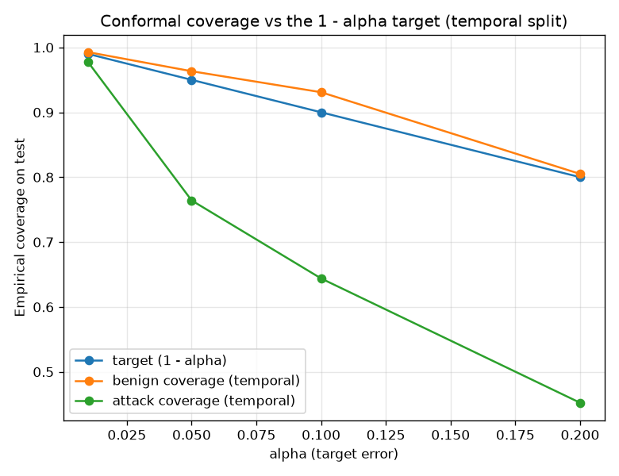

# NetSentry — Conformal Prediction & Selective Alerting

_Synthetic stand-in; the method is the point. Split-conformal calibrated on the
validation split, alpha = **0.1** (target coverage **90%**)._

## The guarantee — and where it breaks (which is the interesting part)

Split-conformal emits a prediction set per flow with a finite-sample,
distribution-free promise: the true label is in the set with probability ≥
90%, **under exchangeability** of calibration and test. The stratified
split is exchangeable; the temporal split deliberately is not (later-day attacks are
novel). Class-conditional coverage on test:

| split | benign coverage | attack coverage | attack guarantee |
|---|---|---|---|
| stratified (exchangeable) | 93.5% | 92.0% | met |
| temporal (later-day) | 93.1% | 64.4% | **below target** |

On the exchangeable split the guarantee holds for both classes. On the temporal
split benign coverage still holds (benign traffic is stable across days) but
**attack coverage falls short** — because the exchangeability assumption is broken,
not because conformal is wrong. That shortfall is a *symptom of distribution shift*:
conformal coverage on a recent window is an independent drift signal, complementing
the PSI monitor.

## Set shapes → SOC actions (temporal split)

| prediction set | meaning | action | share of flows |
|---|---|---|---|
| {benign} | confident benign | auto-clear | 51.4% |
| {attack} | confident attack | auto-alert | 13.4% |
| {benign, attack} | ambiguous | human review | 35.1% |
| {} (empty) | novel — like neither class | human review | 0.0% |

The model **auto-decides 64.9%** of
flows and routes **35.1%** to a human. Abstaining on the ambiguous cases
is what makes selective prediction useful: a tunable human-review budget (via alpha)
rather than a forced guess on every flow.

## Why this matters

A SOC cannot review every flow, and a bare probability does not say when to defer.
Conformal selective prediction makes "the model knows when it doesn't know"
operational, with a coverage guarantee where exchangeability holds — and, where it
does not, a coverage shortfall that flags the very drift the temporal split exposes.
