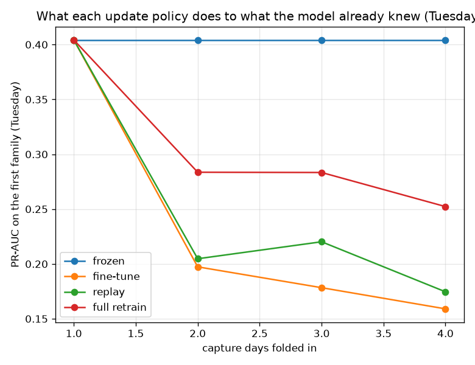
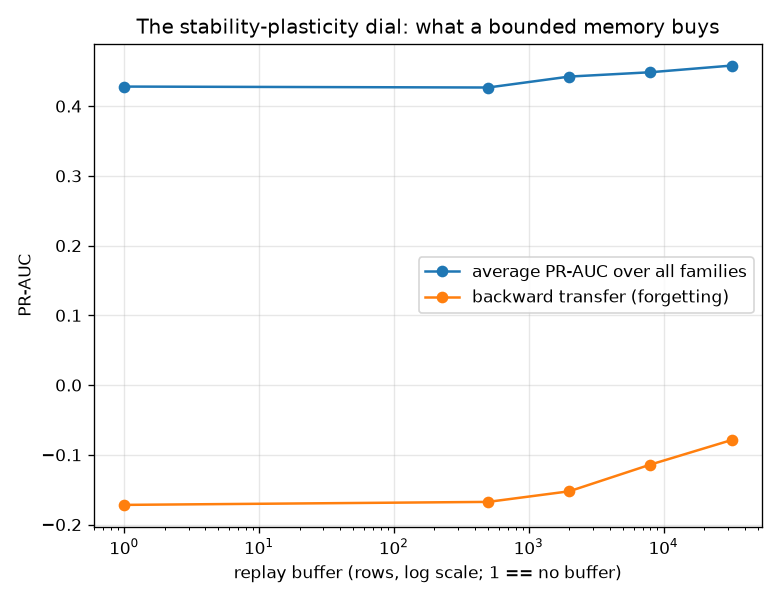

# NetSentry — Continual Learning: What the Detector Forgets

_One task per capture day, in arrival order. Each policy is measured by the full retention
matrix: train through task i, evaluate on task j. Seed 42; LightGBM's `init_model` continues boosting from the previous ensemble, so the incremental policies here are genuine warm starts rather than refits in disguise._

## Why this report exists

Every retraining story in this repository so far has been *one* retrain — a model trained on the
early days, a model retrained on everything, and a comparison. Production does not work that
way. Attack families arrive one after another, and each time one does, somebody decides how to
fold it in. That decision is almost never "refit on the entire history from scratch", because
the history is large, sometimes unavailable (retention limits, the deletion requests the
unlearning study exists to honour), and refitting is the most expensive option on the menu. So
the model is *updated* — and the question nobody asks until an old attack sails through is what
the update cost the families it already knew.

That is **catastrophic forgetting** (McCloskey & Cohen 1989), and the continual-learning
literature measures it with a matrix rather than a number. The diagonal is plasticity: how well
each family is learned when it arrives. The lower triangle is stability: what survives. The
upper triangle is transfer: what the model already knew about a family before meeting one.
**Backward transfer** — the mean change on old tasks between the moment they were learned and
the end of the sequence — is the forgetting number (Lopez-Paz & Ranzato 2017).

## The task sequence

| # | capture day | attack families that arrive | train rows | held-out rows | prevalence |
|---|---|---|---|---|---|
| 1 | Tuesday | `FTP-Patator`, `SSH-Patator` | 15,716 | 4,262 | 12.9% |
| 2 | Wednesday | `DoS GoldenEye`, `DoS Hulk`, `DoS Slowhttptest`, `DoS slowloris`, `Heartbleed` | 9,039 | 6,026 | 37.7% |
| 3 | Thursday | `Infiltration`, `Web Attack` | 5,794 | 3,863 | 3.2% |
| 4 | Friday | `Bot`, `DDoS`, `PortScan` | 9,180 | 6,120 | 39.3% |

The days are the tasks, which is not a modelling convenience: this capture introduces a
genuinely new set of attack families every day, so folding in a day *is* the class-incremental
problem rather than a stand-in for it. A day's flows are split by position rather than at
random, because an attack burst is a run of near-duplicate flows and a shuffled within-day split
would score memory as retention. Monday carries no attacks at all, so it cannot be scored with
PR-AUC and is folded into the first task's training pool instead of becoming a task with an
undefined result.

## What each policy costs and keeps

| policy | average PR-AUC | learned on arrival | backward transfer | forward transfer | train seconds | rows fitted | final trees | inference / 1k flows |
|---|---|---|---|---|---|---|---|---|
| **frozen** | 0.367 | 0.367 | +0.000 | +0.087 | 13 s | 15,716 | 600 | 18 ms |
| **fine-tune** | 0.428 | 0.557 | -0.172 | +0.104 | 43 s | 39,729 | 2,400 | 92 ms |
| **replay** | 0.447 | 0.542 | -0.126 | +0.128 | 49 s | 51,729 | 2,400 | 89 ms |
| **full retrain** | 0.520 | 0.568 | -0.064 | +0.147 | 56 s | 110,749 | 600 | 14 ms |

**Fine-tuning forgets.** `Tuesday`'s families (FTP-Patator, SSH-Patator) are detected at 0.404 PR-AUC the day they are learned and at 0.159 after three more days have been folded in — a **61% relative loss** on an attack family nobody removed from the model, nobody stopped caring about, and nothing in the monitoring would report, because the traffic that would reveal it is not in the evaluation set any more. Backward transfer, the mean of that drop over every old task, is **-0.172**. Gradient boosting is additive and the trees that learned the old families are still physically present in the ensemble, which is exactly why this result is worth measuring rather than assuming: the later trees do not delete the earlier ones, they *outvote* them, and the score a flow receives is the sum.

Replay with 4,000 remembered rows recovers part of it (-0.126), and full retraining recovers most (-0.064) — but not all, and the residue is the second finding. **Even refitting on the entire history forgets.** That cannot be a property of the update rule, because there is no update: it is interference. One decision surface now has to separate five attack families from benign traffic at once, the class balance it is fitted against has moved, and capacity spent on `PortScan` is capacity not spent on `FTP-Patator`. The frozen control makes the shape of the trade visible from the other side: it forgets nothing by construction, and it ends at 0.367 average PR-AUC against retraining's 0.520 because it never learns anything either.

## The compute argument, checked

Fine-tuning fits 39,729 rows against full retraining's 110,749 and takes 43 s against 56 s — a **24%** saving. On this capture the incremental update is not a bargain at all: it costs 0.091 PR-AUC for a 24% training saving, and then charges that saving back 6.6 times over at every single request.

The reason the saving is so much smaller than the row count suggests is that boosting cost is dominated by the number of trees, not by the rows they are fitted on, and warm-starting *adds* trees rather than replacing them: the fine-tuned model ends at 2,400 trees against 600, a **4x** larger ensemble that costs 92 ms per thousand flows against 14 ms. A four-day capture is also the smallest history this trade can be measured on: retraining cost grows with the history and incremental cost does not, so the crossover exists — it is just further out than four days, and quoting the incremental policy's saving without quoting where that crossover sits is how teams end up paying for forgetting they did not need to buy.

## What the model knows before it is taught

Forward transfer — what the model scores on a family the *day before* it first sees one, against the prevalence a random scorer would earn — is positive at **+0.147** for full retraining. The strongest case is `Friday`, detected at 0.657 against a 39.3% base rate before a single flow of it was ever labelled. This matters because the temporal split shares **zero** attack classes between the training days and the test days — the open-set study established that every attack the deployed model meets is formally an unknown class. The forward-transfer column is the quantitative version of the good news hiding in that: attack families are not mutually unintelligible, and a detector trained on brute force is genuinely better than chance on denial of service it has never seen. The upper triangle of every matrix below is that measurement, in italics.

## The retention matrices in full

**frozen** — trained once on the first family, never updated

| after training through | Tuesday | Wednesday | Thursday | Friday |
|---|---|---|---|---|
| Tuesday | **0.404** | _0.527_ | _0.040_ | _0.496_ |
| Wednesday | 0.404 | **0.527** | _0.040_ | _0.496_ |
| Thursday | 0.404 | 0.527 | **0.040** | _0.496_ |
| Friday | 0.404 | 0.527 | 0.040 | **0.496** |

**fine-tune** — continue boosting on the new day's traffic alone

| after training through | Tuesday | Wednesday | Thursday | Friday |
|---|---|---|---|---|
| Tuesday | **0.404** | _0.527_ | _0.040_ | _0.496_ |
| Wednesday | 0.197 | **0.896** | _0.070_ | _0.604_ |
| Thursday | 0.178 | 0.787 | **0.058** | _0.517_ |
| Friday | 0.159 | 0.645 | 0.040 | **0.868** |

**replay** — continue boosting on the new day plus a bounded uniform sample of the past

| after training through | Tuesday | Wednesday | Thursday | Friday |
|---|---|---|---|---|
| Tuesday | **0.404** | _0.527_ | _0.040_ | _0.496_ |
| Wednesday | 0.205 | **0.838** | _0.061_ | _0.599_ |
| Thursday | 0.220 | 0.827 | **0.055** | _0.597_ |
| Friday | 0.175 | 0.709 | 0.035 | **0.871** |

**full retrain** — refit from scratch on every day seen so far

| after training through | Tuesday | Wednesday | Thursday | Friday |
|---|---|---|---|---|
| Tuesday | **0.404** | _0.527_ | _0.040_ | _0.496_ |
| Wednesday | 0.284 | **0.899** | _0.059_ | _0.670_ |
| Thursday | 0.283 | 0.895 | **0.062** | _0.657_ |
| Friday | 0.252 | 0.869 | 0.050 | **0.906** |

Bold is the diagonal (a family at the moment it is learned), italic is the upper triangle
(zero-shot, before that family has ever been seen), and plain text below the diagonal is what
survived. For the frozen control the whole matrix is one model's scores repeated, which is what
"never updated" means.

## The stability-plasticity dial

| replay buffer | average PR-AUC | backward transfer | train seconds |
|---|---|---|---|
| none (naive fine-tune) | 0.428 | -0.172 | 47 s |
| 500 rows | 0.427 | -0.167 | 46 s |
| 2,000 rows | 0.442 | -0.152 | 61 s |
| 8,000 rows | 0.449 | -0.114 | 75 s |
| 32,000 rows | 0.458 | -0.079 | 63 s |

The buffer is the only knob that moves smoothly between the two extremes, and both of its ends
are already in the table above: an empty buffer *is* naive fine-tuning, and a buffer larger than
the history is a warm-started full retrain. Everything in between is the actual engineering
decision — how much of yesterday to keep, at what storage cost, under what retention policy.

## Scope and honest limits

- **Four tasks is a short sequence.** Forgetting compounds; a year of daily updates would show
  more of it, and the crossover where incremental training's compute advantage becomes real sits
  well beyond this capture.
- **Labels are assumed to arrive with the day.** They do not: the active-learning and
  weak-supervision studies exist because labelling is the binding constraint. Every policy here
  is therefore an upper bound on what its real-world version could achieve.
- **PR-AUC per task is a ranking measure within that day's traffic.** A policy could hold its
  per-task ranking while its calibrated scores drift, which would still break a fixed threshold
  — the threshold-refresh study measures that axis.
- **The interference result is not a criticism of retraining.** It is the price of one model
  serving five attack families; the alternative — a model per family — trades it for a routing
  problem and five thresholds to maintain.