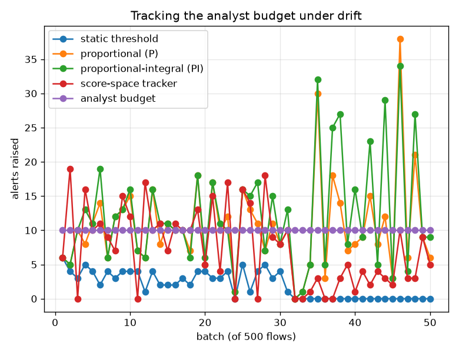
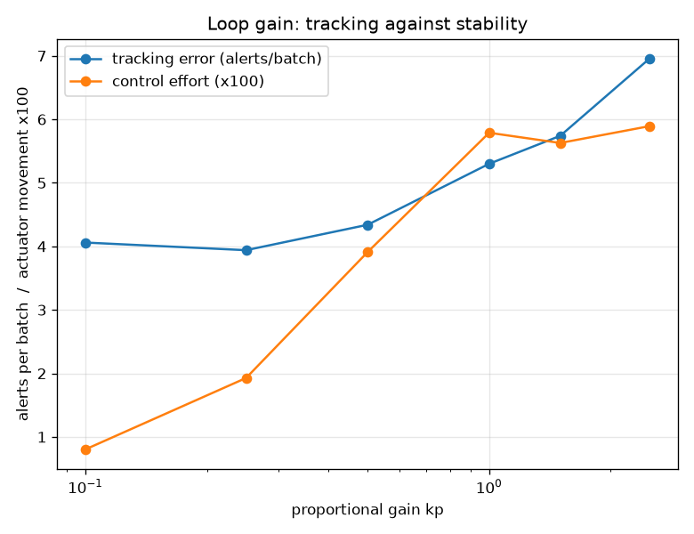

# NetSentry — Closed-Loop Threshold Control (and the Attack on It)

_50 batches of 500 later-day flows. Setpoint
10 alerts per batch (2% of traffic — the analyst budget).
The actuator is `log10` of the alert rate; the open-loop baseline is the same rate, calibrated
once on validation and never touched. Settling band 50%._

## Why this report exists

A SOC has a fixed number of analysts. The detector has a fixed threshold. Those two facts stop
being compatible the moment traffic changes, and every threshold in this project so far has been
**open-loop**: chosen on a validation set at a target rate, shipped, and left. The
threshold-refresh study watched that decay; the Neyman-Pearson study found the deployed rule
violating its own false-positive budget 51% of the time. Neither closes the loop.

This one does. Alert volume is a measured output, the threshold is an actuator, the analyst
budget is a setpoint — a feedback control problem, with a century of theory attached that says
more than "raise it when there are too many alerts" does.

**The actuator is `log10` of the alert rate, not the threshold and not its quantile.** That
choice is most of the engineering: near the operating point a thousandth of a quantile separates
ten alerts from a hundred, so a gain tuned in one regime is wrong in the next, and a loop tuned
on Tuesday oscillates on Friday. In log-rate units the plant is close to a unit gain — one decade
of actuator buys one decade of volume — the error is a *ratio* (twice the budget means the same
thing at ten alerts and at a thousand), and `kp = 1` is roughly deadbeat by construction.

## What each policy achieves

| policy | mean volume error | overshoot | settles | steady-state error | control effort | recall | precision |
|---|---|---|---|---|---|---|---|
| **static threshold** | 8.0 | 0% | never | -100% | 0.000 | 1.6% | 100.0% |
| **proportional (P)** | 4.6 | 280% | batch 48 | +27% | 0.046 | 5.2% | 61.9% |
| **proportional-integral (PI)** | 6.0 | 240% | batch 48 | +52% | 0.064 | 5.8% | 58.6% |
| **score-space tracker** | 5.2 | 90% | batch 48 | -55% | 0.003 | 5.0% | 85.1% |

**The open-loop threshold does not deliver the budget it was calibrated for.** Calibrated on validation to alert on 2.0% of flows -- 10 per batch -- it lands -100% off on the later days, under-alerting at a mean error of 8.0 alerts per batch. Nothing is broken; the score distribution simply moved, and a threshold fixed in score space is a promise about a distribution that no longer exists. This is the same failure the refresh study measured and the certified-budget study bounded, seen from the queue's side.

**proportional (P)** tracks it best, at 4.6 alerts of mean error against a 10-alert setpoint. **The integral term hurts here, and that is a finding rather than a mis-tuning.** PI ends at +52% steady-state error against proportional control's +27%, and works harder to do it (0.064 against 0.046 decades of actuator movement per batch). An integrator is the right instrument for a *persistent* error and the wrong one for a noisy one: this stream's disturbance is largely batch-to-batch variation, and integrating noise is how a loop ends up chasing it. The unit tests show the same controller doing exactly what the theory promises against a genuine drift, which is the useful way to hold both facts at once -- the mechanism works, and this plant is not the one it is for. The gain-free score-space tracker lands at 5.2 — worth knowing, because it is the option that does not require anyone to own a control loop's parameters.

Closing the loop also *raises* detection here — 5.2% against the static threshold's 1.6% — which is not a modelling win but an accounting one: the open-loop threshold was leaving most of the analyst budget unspent, and the controller spends it. What none of these policies can do is change what is *in* the budget: the stream is 25% attacks and the budget is 2% of flows, so recall here is capacity-bound rather than model-bound. Volume control is a volume guarantee. A loop that holds the queue steady while attacks move above the threshold is doing exactly what it was asked and nothing that was wanted.

## Loop gain: the stability boundary, located rather than assumed

| gain kp | tracking error (alerts/batch) | control effort | overshoot | settles |
|---|---|---|---|---|
| 0.1 | 4.1 | 0.008 | 110% | yes |
| 0.25 | 3.9 | 0.019 | 200% | yes |
| 0.5 | 4.3 | 0.039 | 180% | yes |
| 1 | 5.3 | 0.058 | 210% | yes |
| 1.5 | 5.7 | 0.056 | 200% | yes |
| 2.5 | 7.0 | 0.059 | 420% | yes |

Tracking error is minimised at **kp = 0.25** (3.9 alerts per batch). Every gain in the sweep settles, so the instability boundary is above the range explored here. At kp = 2.5 the actuator moves 0.059 decades per batch on average — 3.1x the well-tuned loop's movement — which is the signature of a controller chasing its own corrections rather than the disturbance. In a detector this reads as an operating point that moves materially every few minutes: no analyst team accepts it, and nothing calibrated downstream of the threshold (conformal sets, cost-optimal points, alert SLOs) can track it.

## Late feedback

| measurement delay (batches) | tracking error | control effort | overshoot |
|---|---|---|---|
| 0 | 6.0 | 0.064 | 240% |
| 1 | 11.6 | 0.052 | 830% |
| 2 | 21.1 | 0.089 | 1520% |
| 5 | 45.9 | 0.090 | 2400% |

Feedback is worth what it is timely. Delayed 5 batches (2,500 flows), tracking error rises from 6.0 to 45.9 alerts per batch: the loop is correcting a state that has already passed. Every real deployment has this lag — alerts are aggregated, dashboards refresh on a schedule, a queue depth is confirmed after the shift — so the loop's sampling interval has to be slower than its own observation lag, which caps how fast any volume controller can respond regardless of gain.

## The control-loop attack

An attacker who can raise alert volume can make the controller raise its own threshold, and then
walk through the gap they created. The flood is 250 loud decoy flows per
batch for 10 batches — noisy scanning from throwaway hosts, cheap to
generate, certain to alert — and the flows measured are the *genuine* attacks arriving in those
same batches. The counterfactual is the only honest one available: the same policy, on the same
flows, without the flood.

| policy | detection of the covered attacks, no flood | under flood | suppression | tightest alert rate reached | batches to recover |
|---|---|---|---|---|---|
| static threshold | 1.6% | 1.6% | **+0.0%** | 2.012% (from 2.01%) | 0 |
| proportional-integral (PI) | 6.0% | 1.6% | **+4.4%** | 0.143% (from 2.01%) | 20 |
| PI + surge guard | 4.6% | 2.8% | **+1.8%** | 1.355% (from 2.01%) | 3 |

**The loop can be driven.** The same PI controller that detects 6.0% of those attacks without the flood detects 1.6% with it — a **4.4% suppression the attacker bought by generating alerts**, which is the opposite of what generating alerts is supposed to do to them. The static threshold moves +0.0%, because it cannot be driven: it is not listening. The guard recovers +1.2% on top of that.

This is the part the control-theory textbook does not cover, because its plants are not adversarial. Every feedback loop in a security system turns its own input into an attack surface: an adaptive threshold can be pushed, an adaptive baseline can be poisoned (which the poisoning study measured on the training set — this is its deployment-time cousin), and a rate limiter can be used to silence what it protects. The mitigations are not clever — freeze the integrator during a surge, bound the actuator's movement per interval, and treat a large volume excursion as an incident rather than as a setpoint error — but they have to be *designed in*, because the version without them is the version a textbook hands you.

## Scope and honest limits

- **The plant is a replay, not a live queue.** Batches arrive at a fixed size and the measurement
  is the alert count; a real loop also contends with analyst throughput varying within a shift,
  which the SOC queue simulation models and this does not.
- **One disturbance profile.** The stream's drift is whatever the later capture days contain,
  plus the injected flood. A controller tuned against this profile is not thereby tuned against
  another — the standing objection to any empirically tuned loop, and the reason the gain sweep
  is reported rather than a single recommended number.
- **Volume is not risk.** Holding the queue at capacity says nothing about whether the *right*
  flows are in it; the alert-queue and cost studies are where that question lives. Reading a
  volume controller as a detection improvement would be a mistake.
- **The attack is a lower bound.** A smarter adversary would shape the flood to the loop's time
  constant rather than flooding flat, and would use the recovery window rather than the flood
  window. The mitigation is designed against the mechanism, not against this schedule.