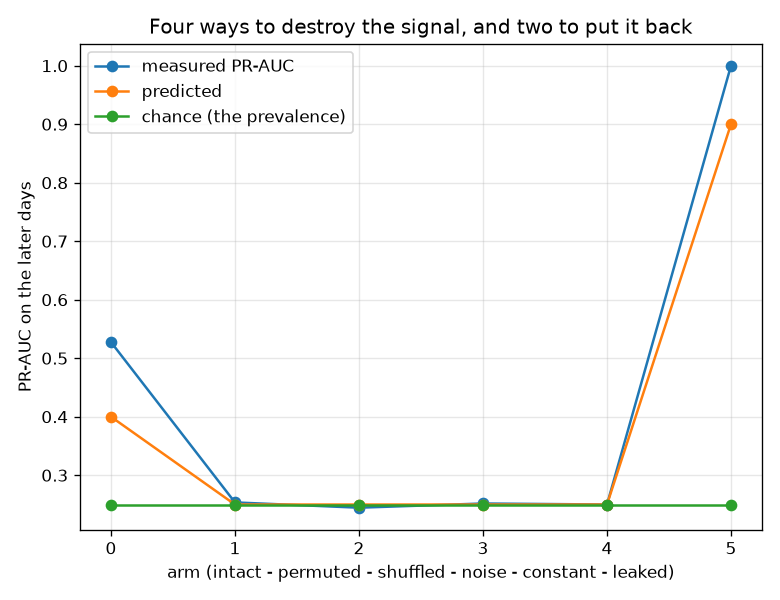

# NetSentry -- Does the Pipeline Return Nothing When There Is Nothing?

_Six runs of the full path -- fit on 28,034 training flows, threshold on validation, score 24,957 later-day flows -- each with the signal corrupted a different way and each judged against a prediction fixed in advance. Regenerate with `netsentry controls`._

## Why this report exists

The [leakage study](leakage.md) builds leakage *up*: it stacks a shuffled split, a memorised port and an identifier column and watches PR-AUC climb from 0.529 to 1.000. That shows the instrument can be fooled in known ways. It does not show the opposite and more basic thing -- that the pipeline, run end to end on data with the signal removed, returns **chance**.

The prediction is exact, which is what makes it a test rather than an observation. A model trained on scrambled labels must score **at the prevalence**, because an uninformative ranking makes precision equal the base rate at every recall. And a threshold placed to let 1% of benign flows through must let **1% of attacks** through too, because the score carries nothing to tell them apart.

**Every control lands where it was predicted to, and the largest excess over chance anywhere in the suite is +0.0036 PR-AUC.**

Four ways of destroying the signal -- scrambled labels, independently shuffled feature columns, pure noise, constants -- and all four come back at the prevalence (0.250) with detection at the false-positive budget (1.0%). Both of those numbers were fixed in the code before any arm ran, because a control whose expected value is decided after the number comes back is not a control.

The worst any negative arm does is `permuted labels` at 0.2535 against a predicted 0.2499. That excess is roughly five times smaller than the [minimum detectable difference](power.md) this split supports, so the pipeline's residual skill on destroyed data is not merely small -- it is below what the evaluation could resolve even if it were real.

**A suite of negative controls proves nothing on its own**, which is why half the table runs the other way. A harness that returned chance unconditionally -- a mis-wired scorer, a threshold that never fires -- would pass every negative arm above. The intact pipeline reaching 0.5276 and the deliberately-leaked arm reaching 1.0000 are what make the zeros mean something: the instrument can still see a signal, so its failure to see one in noise is informative.

The deliberately-leaked arm earns its place twice over. Training on the very rows being scored is the crudest possible leak, and the harness reports it as 1.000 -- so if a subtler leak ever appears in the real path, this suite is at least the kind of instrument that would notice.

## The ladder

| arm | what it corrupts | direction | predicted PR-AUC | measured | detection | realised FPR | verdict |
|---|---|---|---|---|---|---|---|
| intact (the deployed pipeline) | nothing corrupted -- the positive control that shows the harness can see a signal | positive | at least 0.400 | **0.5276** | 20.75% | 0.82% | passes |
| permuted labels | the labels scrambled in training and validation, class balance kept exactly | negative | 0.250 +/- 0.030 | **0.2535** | 1.57% | 1.11% | passes |
| each feature column shuffled | marginals, outliers and missing patterns kept; only the row correspondence broken | negative | 0.250 +/- 0.030 | **0.2445** | 1.01% | 0.99% | passes |
| features replaced with noise | standard noise of the same shape, in training and at scoring time | negative | 0.250 +/- 0.030 | **0.2517** | 1.03% | 1.07% | passes |
| features held constant | nothing to split on -- the degenerate case, which must return the prior not an error | negative | 0.250 +/- 0.030 | **0.2499** | 0.00% | 0.00% | passes |
| trained on the evaluation rows | deliberate leakage -- the second positive control, showing the harness detects it | positive | at least 0.900 | **1.0000** | 100.00% | 0.00% | passes |

**The shuffled-columns arm is the strict one.** Replacing features with noise also destroys the marginal distributions, the outliers and the missing-value pattern, so a pipeline could pass it while still keying on some artefact of shape. Shuffling each column independently keeps every one of those intact and breaks only the correspondence between a row's features and its label -- so a model that still scores above chance there is finding signal in something other than the features.

**The constants arm passes for a different reason than the others**, and it is worth saying so rather than letting the verdict column imply otherwise. With every feature identical the model emits one score for every flow, so the threshold rule places the cut at that score and nothing clears it: detection 0% and a realised false-positive rate of 0%. That is *alert on nothing*, which is the correct degenerate behaviour -- the point of the arm is that the pipeline returns the prior rather than raising, and it does.

## Scope and honest limits

- **A passing suite is evidence, not proof.** These four corruptions are the ones worth checking first; a leak that survives all of them is possible and would need a different control to find. What the suite rules out is the broad class of defects that manufacture skill from nothing.
- **The predictions are exact but the tolerance is a judgement.** PR-AUC at the prevalence and detection at the budget are derivations; the 0.03 band around them is a choice, wide enough to absorb the sampling noise of a single split and narrow enough that a real defect would not fit inside it.
- **One seed, one split, one model.** The arms are not repeated, so a negative control landing near the edge of its band would be worth rerunning before being believed. None of them is near the edge here.
- **The leaked positive control is deliberately crude.** Training on the evaluation rows is the most detectable leak there is. It establishes that the harness responds to leakage at all, which is a much weaker claim than that it would catch a subtle one -- and the [leakage study](leakage.md) is where the subtle ones are enumerated.
- **This tests the pipeline, not the reports.** Every arm goes through cleaning, splitting, transformer fitting, training, threshold selection and scoring. It does not touch the studies built on top of that path, each of which can be wrong in its own way.
