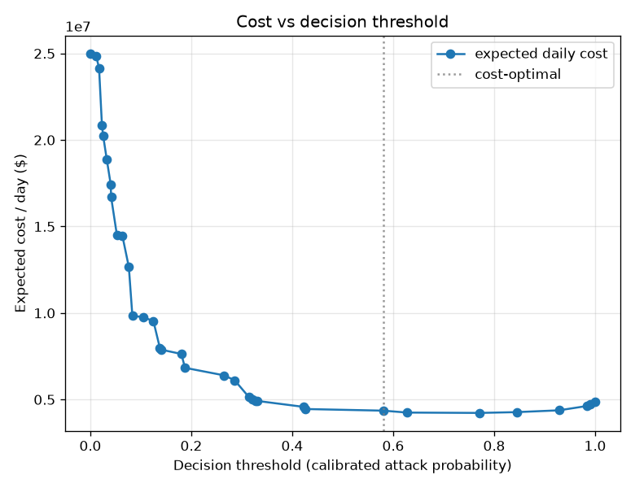

# NetSentry — Cost-Sensitive Threshold Selection

_Synthetic stand-in; the costs are illustrative knobs (config `cost.*`). The method
is the point: pick the operating point that minimises expected cost, not a
round-number FPR._

## Cost model

- Each **raised alert** (true or false) costs **$25** of analyst
  triage time.
- Each **missed attack** costs an expected **$500** in damage.
- Production attack base rate assumed at **1%** over
  **1,000,000** flows/day (the synthetic test split
  is ~22% attack, far above reality, so the daily figures use this prior instead).

## Cost-optimal threshold

Sweeping the threshold on **validation** to minimise expected per-flow cost at the
production prior gives **0.5804**, then evaluated on test below. Detection,
false-alarm, alert-volume and cost are all reported at that operating point.

For reference, the closed-form per-flow optimum — "alert iff
`p(attack) >= cost_per_alert / cost_per_miss`" — is **0.0500** (a 20x
miss-to-alert ratio). That identity holds when you operate at the *scored* base
rate; under a much lower production prior (1%) the
benign pool dominates the false-alarm cost, so the optimal single threshold rises
above it. Either way the score must be a real probability, which is why calibration
comes first.

## Operating points compared (evaluated on test, costed at the production prior)

| operating point | threshold | detection (TPR) | FPR | alerts/day | exp. cost/day |
|---|---|---|---|---|---|
| cost-optimal | 0.5804 | 25.2% | 2.233% | 24,621 | $4,357,719 |
| fixed FPR 0.1% | 0.9833 | 8.2% | 0.048% | 1,292 | $4,624,253 |
| fixed FPR 1% | 0.7708 | 20.1% | 0.726% | 9,200 | $4,226,304 |

On test the val-chosen optimum costs **$4,357,719/day**, but the `fixed FPR 1%` profile edges it (**$4,226,304**): a threshold tuned on validation (earlier days) drifts on the later-day test set — the same temporal effect the headline split exposes, so re-select it on recent data in prod. Here the daily cost is dominated by **missed attacks** — on the hard
temporal split detection is modest at every threshold, so the miss term swamps
analyst time, and threshold choice moves the total only at the margin.

## Why this matters

False positives drive alert fatigue, but misses drive breaches; the balance is a
business decision, not a default. Exposing the cost knobs makes the trade-off
explicit and tunable per deployment — raising `cost.cost_per_miss` (or the
production base rate) slides the optimum along the curve above.
