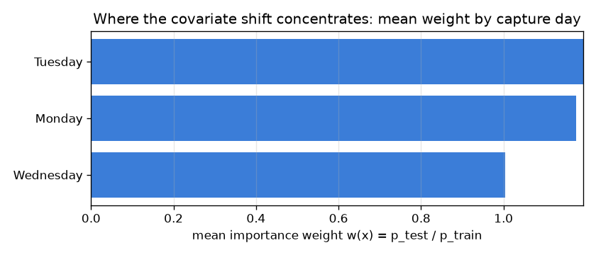

# NetSentry — Covariate-Shift Diagnosis and Importance-Weighted Correction

_Synthetic stand-in. Honest temporal/binary split: 28,034 training flows (early
days), 24,957 test flows (later days). Density ratios estimated with **zero test
labels** via a cross-fit domain classifier._

## Why this report exists

The honest temporal split scores below the optimistic stratified one; the
[leakage study](leakage.md) proves that gap is real and the [novelty study](novelty.md)
decomposes it geometrically. This asks it as a distribution-shift question: how much of the gap
is **covariate shift** (`p(x)` moves, `p(y|x)` holds), and does importance weighting — the
textbook fix — close it? The estimator is label-free: a **domain classifier** trained to tell a
train flow from a test flow gives both a shift detector (its AUC) and the density ratio
`w(x) = p_test/p_train` (its calibrated odds), cross-fit so no flow scores a model that saw it.

## Is there covariate shift, and what does it cost?

| diagnostic | value | reading |
|---|---|---|
| domain-classifier AUC (C2ST) | 0.622 | clear covariate shift |
| effective sample size | 20,991 of 28,034 (74.9%) | usable training mass under the weights |
| max weight (clipped) | 20.0 | weight-variance / clip pressure |

There **is** covariate shift: a domain classifier separates train-day flows from test-day flows at AUC 0.622 on held-out data, well above the 0.5 of two indistinguishable distributions — the later capture days genuinely look different on the feature axis. The shift costs real training mass: the effective sample size collapses to 20,991 of 28,034 flows (74.9%), because only a fraction of the early-day traffic resembles the future closely enough to weigh heavily.

## Does importance-weighted retraining close the gap?

The detector refit with each training flow weighted by `w(x)` (how much it resembles the
future), scored on the temporal test split against the unweighted baseline and the stratified
no-shift ceiling. Operating point at the primary 0.1% FPR budget.

| detector | test PR-AUC | TPR @ primary FPR |
|---|---|---|
| unweighted (deployed) | 0.529 | 9.1% |
| importance-weighted | 0.504 | 9.3% |
| _stratified ceiling (no covariate shift)_ | _0.786_ | _—_ |

Importance weighting **hurts** here: temporal PR-AUC falls 0.529 → 0.504 (-0.025). This is the honest, expected outcome of importance-weighted ERM when the shift is *not* covariate: reweighting trades away effective sample size (down to 74.9%) chasing a `p(x)` correction, while the temporal gap to the stratified ceiling (0.786, a 0.257 drop) is dominated by **concept shift** — the later days carry attack behaviours the early days never labelled, so no amount of reweighting the inputs recovers a decision the model was never taught. IW corrects `p(x)`; this gap lives in `p(y|x)`.

## Scope

The density ratio is a **cross-fit classifier estimate** (Bickel et al. 2009; the C2ST of
Lopez-Paz & Oquab 2017); direct-ratio methods (KLIEP, uLSIF; Sugiyama et al.) are the named
alternatives, and would tighten the tail the weight clip here bounds. Importance-weighted ERM
(Shimodaira 2000) is **only** unbiased for the test distribution under the covariate-shift
assumption `p(y|x) = p_test(y|x)`; this report's value is precisely in testing that assumption
and finding where it fails. It is the covariate-axis complement of the
[label-shift](label_shift.md) study (which corrects `p(y)` with zero labels): together they
cover the two correctable shifts, and both name the same residual — **concept shift** in
`p(y|x)`, the drift that only new labels (the [active-learning](active_learning.md) /
[streaming](streaming.md) loop) can close, and that the [exchangeability
martingale](exchangeability.md) is built to detect.