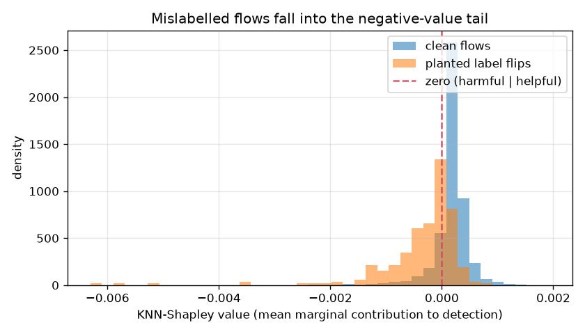

# NetSentry — Training-Data Valuation (KNN-Shapley)

_Synthetic stand-in. Stratified/binary split; 5,000 training flows valued
against 2,000 held-out query flows with a K=10 nearest-neighbour
utility in the fitted pipeline's standardised space. Values are exact Shapley values
(Jia et al., VLDB 2019), computed in O(N log N) per query via the closed-form
recursion._

Every other study values the *model*; this one values the **data**. The KNN-Shapley
value is the exact game-theoretic contribution of each training flow to a
nearest-neighbour classifier's accuracy on held-out traffic — and it is signed: a
**positive** flow sits among held-out flows of its own class and helps, a **negative**
flow sits among the opposite class and hurts. On this stand-in **15%** of
flows carry a negative value: dead weight or worse.

## Mislabel detection, self-validated

250 label flips were planted across 5,000 training flows. Ranking every flow by its (flipped-label) Shapley value sharply separates them from the clean flows: the flip detector reaches **AUC 0.832**, and reading the most-negative 250 values as the suspect budget recovers **27%** of the planted flips. A flipped flow carries the wrong label into a neighbourhood of correctly-labelled traffic, so it lowers the nearest-neighbour utility — a negative contribution by construction. This reaches the same finding as the confident-learning label audit (`netsentry labelaudit`) from an independent first principle: geometry rather than out-of-fold model confidence, so the two are complementary evidence, not the same signal twice.

## Value-guided pruning: does it transfer to the deployed model?

Values here are computed on the *clean* labels; the deployed gradient-boosted model is
then refit with a fraction of flows removed by three policies, and PR-AUC is measured
on the honest test split. Dropping the **lowest**-value flows should cost little (they
are noise or harmful); dropping the **highest**-value flows should cost the most; a
**random** drop is the control.

| dropped | keep, drop lowest-value | drop highest-value | drop random |
|---|---|---|---|
| 0% (baseline) | 0.753 | 0.753 | 0.753 |
| 5% | 0.753 | 0.754 | 0.754 |
| 10% | 0.741 | 0.754 | 0.752 |

On this stand-in the pruning signal is weak: dropping the lowest-value 10% lands at 0.741 versus 0.754 for the highest — the KNN valuation does not cleanly transfer to the tree model here, which is the honest read on a dataset where most flows are near-duplicates of many others. Notably it does not beat random dropping here — reported rather than smoothed over.

## Which behaviours are worth training on?

Mean Shapley value per class. One structural caveat has to be read first: with a
K=10 vote on a split that is majority-benign, most of any flow's neighbours are
benign, so the KNN utility is majority-dominated and the minority attack classes carry
*negative* mean value almost by construction — a known interaction between KNN-Shapley
and class imbalance, not a claim that attacks are worthless to train on. The signal to
read is therefore the **ordering within** the attacks: the classes that sit closest to
the benign manifold (PortScan, Web Attack — the same near-boundary traffic the novelty
and evasion studies flag as hardest) are the most negative, while the volumetric DoS
family sits nearer zero, and BENIGN prototypes carry the positive value.

| class | mean value | flows |
|---|---|---|
| BENIGN | +2.68e-04 | 3,879 |
| DoS Slowhttptest | -8.78e-05 | 40 |
| DDoS | -1.33e-04 | 210 |
| DoS slowloris | -1.37e-04 | 55 |
| Infiltration | -2.01e-04 | 4 |
| Bot | -2.11e-04 | 36 |
| DoS Hulk | -2.14e-04 | 309 |
| DoS GoldenEye | -2.86e-04 | 87 |
| Web Attack | -3.47e-04 | 22 |
| PortScan | -3.73e-04 | 255 |

## Scope

KNN-Shapley values a nearest-neighbour utility, used here as a fast, exact,
model-agnostic proxy; the pruning experiment measures how far that proxy transfers to
the deployed tree model rather than assuming it. The valuation runs on the exchangeable
stratified split because value is a distributional property — under the temporal shift a
later-day flow near no training neighbour would read as low-value for being *novel*, not
for being *wrong*, which is the novelty study's concern, not this one's. It complements
the label-noise audit (confident learning finds errors; this values every flow, error or
not) and the exemplar explanations (nearest cases per prediction; this aggregates the
same geometry into one value per training flow).