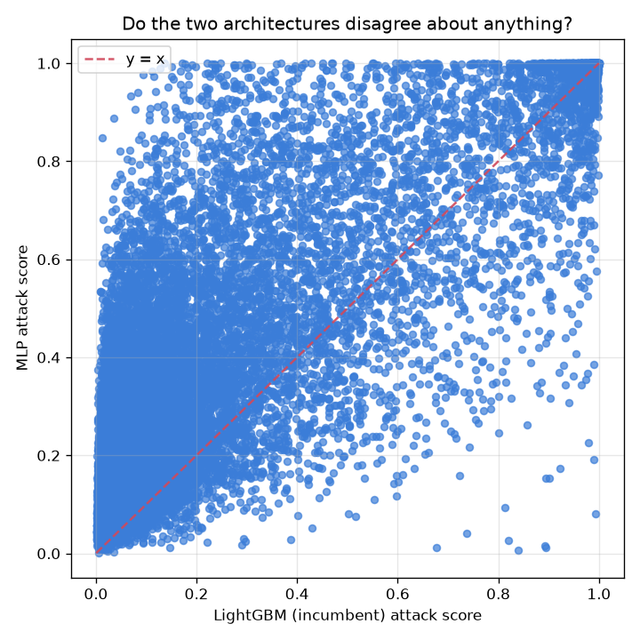
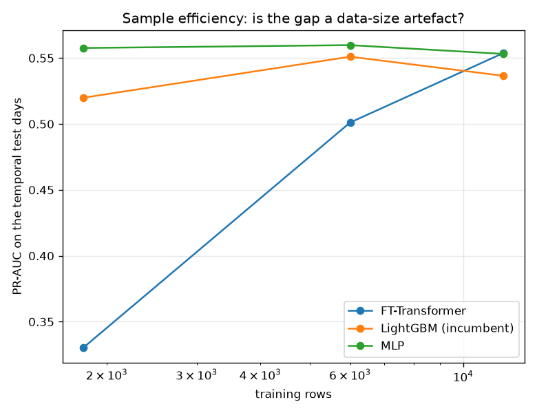

# NetSentry — Deep Tabular Models vs the Trees, Under One Protocol

_12,000 training rows, 76 features, judged on 24,957
later-day flows at 25.0% prevalence. Same pipeline, same temporal split, same
seed, same validation set for early stopping and thresholds. Up to 15 epochs with
PR-AUC early stopping. Every arm sees the same capped training set — the cap is set by the
transformer's cost and applied to all four, rather than quietly giving the trees more data._

## Why this report exists

This project has used gradient-boosted trees since phase 4, for the reason most people use them:
the tabular deep-learning literature says trees win (Grinsztajn et al. 2022; Shwartz-Ziv & Armon
2022). That is a citation, not a measurement. The claim is about tabular data *in general*, and
what is being modelled here is specific — ninety flow statistics, a 20% attack rate, and a
temporal split whose test days contain no attack class the training days ever showed. Any of
those could flip the conclusion, and "the literature says so" is exactly the sort of reasoning
this repository exists to distrust.

So the comparison is run properly, with the architecture that has the strongest claim to being
the exception: the **FT-Transformer** (Gorishniy et al. 2021), which turns each feature into its
own learned token and lets self-attention build interactions between them explicitly — the
mechanism the feature-interaction study says these features actually have structure for. An MLP
is included because if a plain network were enough, the transformer would have nothing to
justify, and logistic regression because every number needs a linear reference.

## What each architecture achieves

| model | PR-AUC | ROC-AUC | TPR @ 0.1% | TPR @ 1% | train | inference / 1k | parameters |
|---|---|---|---|---|---|---|---|
| **logistic regression** | 0.564 | 0.709 | 12.1% | 19.9% | 0.1 s | 0.3 ms | 77 |
| MLP | 0.561 | 0.709 | 11.4% | 19.6% | 2.7 s | 1.6 ms | 53,505 |
| FT-Transformer | 0.555 | 0.711 | 7.6% | 20.1% | 362.3 s | 105.5 ms | 22,081 |
| LightGBM (incumbent) | 0.537 | 0.693 | 7.4% | 20.7% | 12.9 s | 7.8 ms | 15,372 |

**logistic regression leads at 0.564 PR-AUC, and the transformer is last at 0.555** — 0.010 behind, for 28x the training time and 13x the inference cost. That is the literature's conclusion reproduced on this data rather than inherited from it, and the shape of the ranking says why. The leaderboard study already found that model *capacity* is penalised on this split: every family pays a stratified-minus-temporal gap, the flexible ones pay the largest, and Gaussian naive Bayes led the honest table. The FT-Transformer extends that line one architecture further — it is the most flexible model here and it lands last. The mechanism is the open-set structure the split has: the test days contain **no attack class the training days showed**, so capacity spent on fitting the training families precisely is capacity spent on families that will never be seen again, while a coarser decision boundary keeps more of whatever generalises.

## Do they disagree about anything?

| combined with the incumbent | rank correlation | ensemble PR-AUC | lift |
|---|---|---|---|
| logistic regression | +0.830 | 0.558 | +0.021 |
| MLP | +0.757 | 0.556 | +0.019 |
| FT-Transformer | +0.845 | 0.549 | +0.012 |

The best combination adds **+0.021** over the incumbent alone (logistic regression at rank correlation +0.83), which is small but real: the architectures are not interchangeable, they are ranking a shared majority of flows the same way and disagreeing at the margins where the decision is hard. Rank correlation is the right lens for this question rather than accuracy: two models with the same PR-AUC can be ranking entirely different flows, and two models with different PR-AUC can be near-identical. Against the deployed model's 0.537, that is what the table below is measuring.

## Is the gap waiting for more data?

| training rows | FT-Transformer | LightGBM (incumbent) | MLP |
|---|---|---|---|
| 1,800 | 0.330 | 0.520 | 0.558 |
| 6,000 | 0.501 | 0.551 | 0.560 |
| 12,000 | 0.554 | 0.537 | 0.553 |

Between 1,800 and 12,000 training rows, **FT-Transformer** gains the most (+0.223 PR-AUC). The neural curves are steeper than the tree's, so the gap *is* partly a data-size effect and more traffic would narrow it — which is a real caveat on the headline and an argument for revisiting this on the full CIC-IDS2017 rather than a 60k-row stand-in.

## Scope and honest limits

- **Neither family was tuned inside this study.** Both take their configured defaults, so this
  is a comparison of sensible defaults rather than of tuned optima. That cuts both ways: the
  trees' hyperparameters have been exercised by the Optuna study, the networks' have not, and a
  serious attempt to make the transformer win would start there.
- **One seed, one split.** The seed-variance study measured the noise floor on this pipeline;
  differences smaller than it should not be read as differences. The larger gaps here clear it,
  the ensemble lifts do not necessarily.
- **CPU only, and the transformer is quadratic in the feature count.** Attention over
  76 feature tokens is what makes it expensive here; a GPU changes the wall
  clock but not the ranking, and inference latency stays the operational objection.
- **No categorical inputs.** `Destination Port` is deliberately dropped from the headline
  feature set, which removes the embedding-heavy setting where deep tabular models are strongest.
  That is a property of this project's leakage stance, and it is worth naming as a place the
  comparison is not neutral.