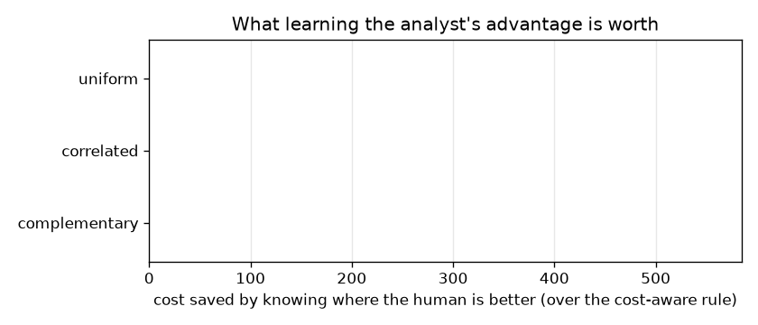
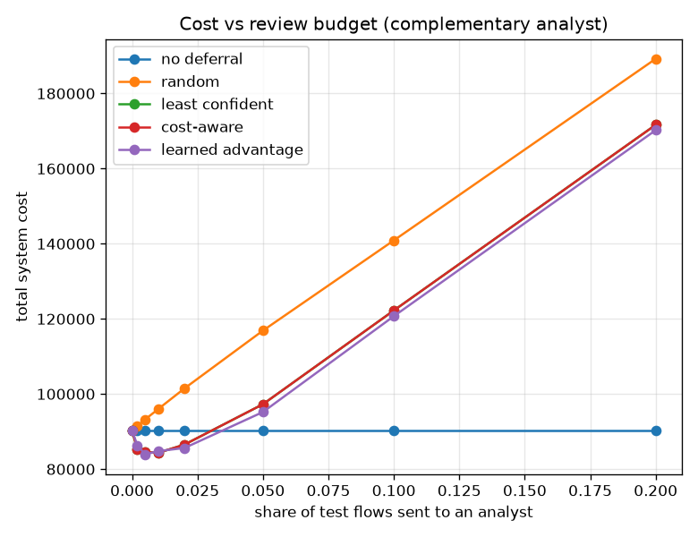

# NetSentry — When to Ask a Human

_Synthetic stand-in. Honest temporal/binary split, 0.1% false-positive
budget. The test stream is re-mixed from its native 25% attack rate to
a production prior of 1% (18,909 flows) — at 25% attacks a
review chosen at random pays for itself and "review everything" wins by construction. Costs
per flow: false positive 25, false negative 500, analyst
review 25._

## Why this report exists

Conformal selective alerting abstains where the model's own prediction set is ambiguous.
That is a policy about the model, and it silently assumes the human is better wherever the
model is unsure. Learning to defer (Madras et al. 2018; Mozannar & Sontag 2020) states the
decision properly as a comparison of two expected losses — the model's and the human's, on
this flow — under a review budget. Written that way, one thing becomes obvious that the
abstention framing hides: **model uncertainty is only the right deferral signal if the human
happens to be good exactly where the model is unsure**, which is a property of the pair, not
a law.

So the analyst is the experimental variable. Three of them, each a plausible description of a
real one: skill that does not vary at all, skill that tracks the model's confidence (both are
reading the same ambiguity), and skill that tracks the flow's *distance from the training
data* — the case where the human brings context the feature vector does not contain.

## The four policies against the three analysts

_Total system cost at the operating review budget; lower is better._

| analyst | mean skill | skill spread | skill range | model risk range | no deferral | random | least confident | cost-aware | learned advantage | value of knowing the human |
|---|---|---|---|---|---|---|---|---|---|---|
| uniform | 80% | 0.0% | 1.0x | 3x | 90,275 | 96,000 | 86,450 | 86,450 | 86,475 | **-25** |
| correlated | 81% | 27.7% | 1.1x | 3x | 90,275 | 95,900 | 88,150 | 88,150 | 88,200 | **-50** |
| complementary | 79% | 31.1% | 1.5x | 3x | 90,275 | 96,000 | 84,350 | 84,350 | 84,800 | **-450** |

Read the table as an ablation. Deferring at random makes the system **worse** than not deferring at all — reviews cost money and a randomly chosen flow is almost certainly one the model already got right — so any policy has to earn its budget before it earns anything else. Confidence-based deferral clears that bar.

Adding asymmetric costs changes **nothing at all** — the cost-aware column is identical to the confidence column, digit for digit — and the reason is worth stating because it looks like a bug. At a 0.1% false-positive budget the threshold sits near 1.0, so the model calls essentially every flow benign, so the only mistake available to it is a miss, so every candidate escalation carries the same cost and the asymmetry has nothing left to re-rank. Algebraically the expected-loss score reduces to an increasing function of the attack probability, which is exactly the order the confidence rule already produced. Cost-awareness is not worthless in general; it is worthless at an operating point this conservative, and it would start to matter the moment the budget loosened enough for the model to raise alerts it might regret.

The last column is the one the analyst regime controls. Under the **uniform** analyst it measures nothing by construction — with constant skill the learned rule *is* the cost-aware rule — and it is -25. It should be zero. That gap is the **noise floor of the fitted skill estimate** — the histogram is estimating a constant from finite validation verdicts and getting it slightly wrong in every bin — and nothing smaller than it can be believed. Under the **correlated** analyst it is -50: this is the regime where deferral is close to pointless in principle, because the flows the human is good at are the flows the model already gets right, so a review buys the same answer twice and pays for it once. Under the **complementary** analyst it is -450 — **negative, and outside the noise floor**. Knowing where the human is better made the system worse, reliably, in the one regime the method was designed for. That is a result, and the diagnosis is a ratio rather than a mystery. Among the flows any policy might plausibly escalate, this analyst's skill varies by 1.5x while the model's attack probability varies by 2.7x. The ranking is essentially their product, so the model's term is worth about 1.9 times as much as the human's and the human's term can only ever nudge an order the model has already settled. Nudging with a *fitted* quantity is worse than not nudging: the estimate carries variance, the thing it displaces was already close to optimal, and the trade loses on average. The skill-spread column confirms the signal was genuinely there (31.1% of it) — this is not a case of nothing to learn, it is a case of learning something true that was not worth acting on. Learning to defer needs the human's advantage to vary *comparably* to the model's uncertainty among the flows in contention, and a rare-event detector concentrates its uncertainty far too sharply for a human's steadier competence to compete.

What survives all of this is the part that did not depend on estimating anything: deferral is worth real money against not deferring, random deferral is worth less than nothing, and the ranking rule is what separates them. The reason to keep asking the harder question anyway is the failure the [uncertainty](uncertainty.md) study isolated from the other direction — a tree away from its training data does not abstain, it routes confidently to whichever leaf the last split reaches. Its confidence is therefore least informative about exactly the flows a human could help with, which is why 'abstain where unsure' is less a deferral policy than a hope about what unsure means.

## How much review capacity is worth buying

The curve has an **interior** minimum at 0.5% of flows reviewed, saving 6,350 against deciding everything with the model. Interior is the interesting case: review capacity is neither free nor unboundedly useful, so there is a right amount of it, and it is set by the ratio of the review cost (25) to what a missed attack costs (500) rather than by anyone's intuition about how much human oversight is appropriate. Past the minimum the curve turns back up, which is the part operators rarely see: escalating more flows makes the system worse once the escalated ones are flows the model was getting right.

## Scope

The analysts are **simulated**, and that is the load-bearing assumption. Their
skill curves are stipulated functions of two observable covariates (the model's confidence and
the flow's distance to training data), with a base rate and a spread set in config, so what
this study demonstrates is a *mechanism* — that the ranking of deferral policies depends on
where the human's advantage lies — rather than a measurement of any real SOC. Calibrating the
complementary analyst against logged analyst verdicts is the obvious next step and would need
data this project does not have; until then, the honest claim is conditional.

The learned advantage is fitted on validation flows only and applied to test flows, so it is
subject to the same discipline as everything else here. It is a histogram regression on the
two covariates, deliberately: a flexible model would fit the analyst simulator's exact
functional form and the comparison would become a statement about that simulator. The
histogram can recover a monotone trend and little else, which is roughly what could be
estimated from a real review log.

Costs are per flow, and reviews are charged whether the human is right or wrong — without
that term "defer everything" wins by construction whenever the analyst is better than chance.
The capacity constraint is a hard budget rather than a queue; the [SOC simulation](socsim.md)
models the queueing side, including what happens to flows that arrive while the analyst is
busy, which this study abstracts away.