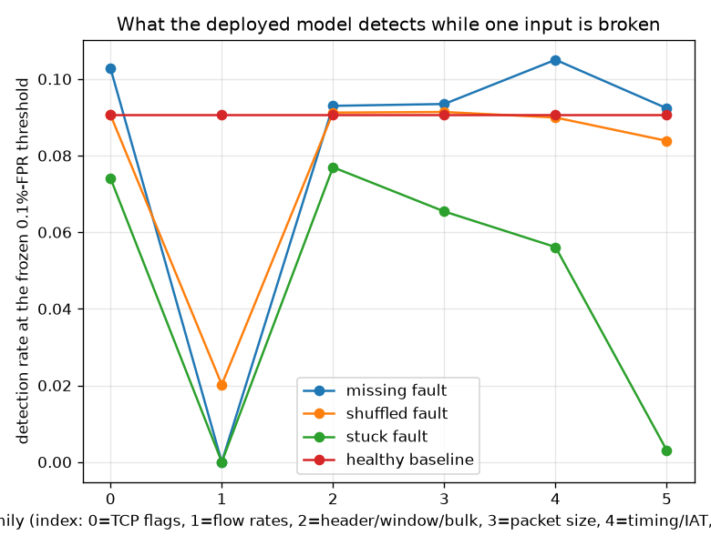

# NetSentry — Sensor Failure: The Deployed Model with a Broken Input

_Synthetic stand-in. Honest temporal/binary split, 24,957 test flows. The fitted
pipeline, the model, and the 0.1%-FPR threshold are all **frozen** at their
healthy values; only the input is broken. Re-tuning the threshold per fault would answer a
different and much easier question._

## Why this report exists

Every other robustness study here assumes an adversary. This one assumes a Tuesday. Flow
exporters drop counters, wedge on a constant, and mis-assemble records, and all three
failures arrive at a model that has no idea anything is wrong: the pipeline imputes the
null, scales the constant, and scores the mismatched row with a threshold calibrated on
data where none of it was true. The [feature ablation](ablation.md) asks what a model
*retrained without* a family could do — a design question. This asks what the model you
already deployed does at 3am when one input breaks.

| fault mode | what breaks | mean detection | worst family |
|---|---|---|---|
| **missing** | the field arrives NaN and the pipeline's train-fitted median imputer fills it | 8.1% | flow rates (0.0%) |
| **shuffled** | real values, wrong flows: the marginal is intact, the joint is destroyed | 7.8% | flow rates (2.0%) |
| **stuck** | the exporter wedges and emits a constant (zero) | 4.6% | flow rates (0.0%) |

## The incident table

| feature family | fault | PR-AUC | detection | realized FPR | alerts/day | PSI (healthy -> faulted) | monitor |
|---|---|---|---|---|---|---|---|
| _(healthy)_ | — | 0.529 | 9.1% | 0.059% | 441 | — | quiet |
| TCP flags (12) | missing | 0.467 | 10.3% | 0.064% | 481 | 0.02 -> n/a (all-null) | major |
| TCP flags (12) | shuffled | 0.466 | 9.1% | 0.059% | 441 | 0.02 -> 0.02 | **silent** |
| TCP flags (12) | stuck | 0.484 | 7.4% | 0.027% | 200 | 0.02 -> 12.43 | major |
| flow rates (4) | missing | 0.252 | 0.0% | 0.011% | 80 | 0.00 -> n/a (all-null) | major |
| flow rates (4) | shuffled | 0.249 | 2.0% | 2.158% | 16,188 | 0.00 -> 0.00 | **silent** |
| flow rates (4) | stuck | 0.269 | 0.0% | 0.011% | 80 | 0.00 -> 12.43 | major |
| header/window/bulk (11) | missing | 0.526 | 9.3% | 0.059% | 441 | 0.00 -> n/a (all-null) | major |
| header/window/bulk (11) | shuffled | 0.530 | 9.1% | 0.064% | 481 | 0.00 -> 0.00 | **silent** |
| header/window/bulk (11) | stuck | 0.505 | 7.7% | 0.027% | 200 | 0.00 -> 12.43 | major |
| packet size (16) | missing | 0.533 | 9.3% | 0.069% | 521 | 0.00 -> n/a (all-null) | major |
| packet size (16) | shuffled | 0.529 | 9.1% | 0.059% | 441 | 0.00 -> 0.00 | **silent** |
| packet size (16) | stuck | 0.551 | 6.5% | 0.021% | 160 | 0.00 -> 12.43 | major |
| timing/IAT (23) | missing | 0.580 | 10.5% | 0.053% | 401 | 0.06 -> n/a (all-null) | major |
| timing/IAT (23) | shuffled | 0.555 | 9.0% | 0.059% | 441 | 0.06 -> 0.06 | **silent** |
| timing/IAT (23) | stuck | 0.571 | 5.6% | 0.011% | 80 | 0.06 -> 12.43 | major |
| volume/counts (10) | missing | 0.639 | 9.2% | 0.016% | 120 | 0.11 -> n/a (all-null) | major |
| volume/counts (10) | shuffled | 0.583 | 8.4% | 0.075% | 561 | 0.11 -> 0.11 | **silent** |
| volume/counts (10) | stuck | 0.546 | 0.3% | 0.000% | 0 | 0.11 -> 12.43 | major |

Healthy, the deployed model detects 9.1% of attacks at its frozen 0.1%-FPR threshold. The worst single incident — **missing** on the *flow rates* family — drops that to 0.0%, retaining 0% of detection, with PR-AUC falling from 0.529 to 0.252. The other half of the damage is the alert volume: because the threshold is frozen, a fault that shifts the score distribution upward does not just miss attacks, it floods the queue — the noisiest fault (shuffled on *flow rates*) runs at 16,188 alerts/day against a healthy 441, a 36.7x load an on-call analyst absorbs with no indication that the cause is a broken exporter rather than an intrusion.

One result deserves to be called out rather than buried in the table: losing some families **raises** the honest PR-AUC above the healthy 0.529 — *volume/counts* (0.639), *timing/IAT* (0.580), *packet size* (0.533). That is not a bug in the measurement and it is not licence to prune. It is the same finding the [feature ablation](ablation.md) reaches from the other side, and the numbers land within noise of each other even though the two studies compute them completely differently: ablation *retrains* without the family, this deletes it at serve time from an already-trained model. Both say those families encode absolute scales that do not transfer from the Mon-Wed training attacks to the Thu-Fri test ones, so the model leans on day-specific thresholds and a broken sensor accidentally removes a crutch. Two independent routes to the same conclusion is the strongest form the claim can take here.

## Would anyone have noticed?

The question that decides whether any of this is survivable is not how bad the damage is — it is whether anyone finds out. Each faulted family's worst-feature PSI is scored against the same thresholds the deployed drift monitor uses (moderate 0.1, major 0.25). The comparison is against the **healthy** test set's own PSI, not against zero: the temporal split is already mildly drifted against the training reference, and crediting the monitor with noticing that would flatter it for seeing something else. The **shuffled** fault is the one that should worry an operator: across every family it moves PSI by at most +0.000 — nothing — because permuting rows leaves every marginal distribution *exactly* intact and PSI is a marginal statistic by construction. Schema validation passes, range checks pass, the drift dashboard reads exactly as it did yesterday, and the model is scoring flows whose fields belong to other flows. This is not a badly-chosen PSI threshold — no per-feature marginal test can see a joint-only fault, at any threshold, which is why it needs a different detector entirely (a correlation or reconstruction monitor), and why naming the blind spot is worth more than another number. In total 1 of 18 fault scenarios cost more than 25% of detection while leaving the monitor quiet (shuffled on *flow rates*). Those are the post-mortems.

## What to do with this

The ranking is directly actionable in three ways. The families whose faults cost the most
detection are the ones whose exporter health deserves an explicit liveness check rather than
trust — cheaper than any modelling change and it addresses the actual failure. The faults
that *raise* the alert rate argue for a volume guard on the serving path: an alert rate that
jumps far above its calibrated budget is far more likely to be a broken feed than a
simultaneous attack on every host, and the [serving canary](../../netsentry/serving/canary.py)
already has the hook to act on it. And the shuffled fault's invisibility to PSI is the
concrete argument for pairing the marginal drift monitor with a joint-structure check — the
[exchangeability martingale](exchangeability.md) watches the score distribution, which a
mis-assembly *does* perturb, so the two monitors are complementary rather than redundant.

## Scope

Faults are applied to whole behavioural families at once, which is the realistic granularity
(one exporter module owns the timing statistics, another owns the byte counters) but coarser
than a single-field failure — a per-feature sweep would rank individual fields and is a
larger table for a smaller insight. `stuck` is modelled as zero, the most common wedged
value; a probe frozen at its *last* reading would be gentler, so this is the pessimistic end
of that mode. The measurement is on the honest temporal split with the deployed operating
point; a different FPR budget moves the threshold and therefore every rate here. Detection
under fault is not an adversarial guarantee — an attacker who can *choose* which feature to
break is the [evasion](robustness.md) study's threat model, and a far stronger one.