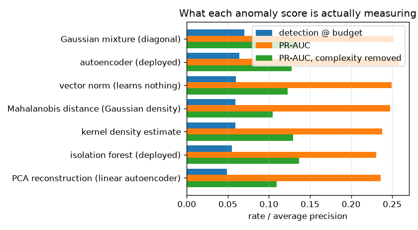

# NetSentry — Is the Anomaly Score a Density, or a Size?

_7 benign-only detectors through the deployed leave-one-attack-out protocol:
fit on benign training flows, threshold calibrated at a 1.0% benign
false-positive budget on validation, scored on 9 attack classes each held
entirely out of training. 20,000 training flows, 76 features._

## Why this report exists

The autoencoder has shipped since phase 5 on a premise this repository never checked: that
**reconstruction error ranks novelty**. In general it does not. An autoencoder reconstructs
simple inputs well and complex ones badly regardless of whether they are anomalous, so its error
is partly a measure of input complexity -- the sharpest published version being Nalisnick et
al. (2019), where a deep generative model assigns *higher* likelihood to out-of-distribution
inputs than to its own training data.

[The anomaly report](anomaly.md) measures how well the detectors do. This measures **what they
are doing**, which is a different question and the one that decides whether the number transfers
to traffic where size and maliciousness are not correlated.

Across 9 held-out attack classes at a 1.0% benign false-positive budget, the best detector is **Gaussian mixture (diagonal) at 7.0%**. The control that learns nothing at all -- the squared norm of the standardised feature vector -- reaches **6.0%**, and the arms that fail to beat it are `isolation forest (deployed)`, `PCA reconstruction (linear autoencoder)`, `Mahalanobis distance (Gaussian density)`, `kernel density estimate`.

That is the mild version of the finding. The sharp one is what happens when the complexity proxy is regressed out of each score: **the best trained arm retains 13% of its skill over chance (`isolation forest (deployed)`), the deployed autoencoder retains 3%, and `PCA reconstruction (linear autoencoder)`, `Mahalanobis distance (Gaussian density)` rank *worse than a coin* on what is left.** The deployed score's Spearman correlation with the proxy is **+0.94**.

Read plainly: on this data these detectors are not estimating how unlikely a flow is under benign traffic. They are measuring how far it sits from the centre of the scaler, and reporting that as novelty.

## The arms, on the deployed protocol

| detector | detection @ budget | anomaly PR-AUC | correlation with complexity | PR-AUC without complexity | skill retained | fit |
|---|---|---|---|---|---|---|
| Gaussian mixture (diagonal) | 7.0% | 0.252 | +0.93 | 0.136 | +10% | 3.60 s |
| autoencoder (deployed) | 6.4% | 0.258 | +0.94 | 0.127 | +3% | 12.26 s |
| vector norm (learns nothing) | 6.0% | 0.249 | +1.00 | 0.123 | +0% | 0.00 s |
| Mahalanobis distance (Gaussian density) | 5.9% | 0.247 | +1.00 | 0.105 | -15% | 0.04 s |
| kernel density estimate | 5.9% | 0.238 | +0.86 | 0.129 | +6% | 0.03 s |
| isolation forest (deployed) | 5.5% | 0.230 | +0.84 | 0.137 | +13% | 1.63 s |
| PCA reconstruction (linear autoencoder) | 4.9% | 0.236 | +0.98 | 0.109 | -12% | 0.03 s |

Both PR-AUC columns sit on a floor of **0.123**, the attack share of the held-out test sets, which is what a detector that ranks at random scores. The last column is the share of each arm's *lift over that floor* that survives removing the complexity proxy -- the ratio of raw PR-AUCs would credit every arm with the floor and report a comfortable half of nothing.

Three of these arms exist to be controls rather than candidates. `vector norm (learns nothing)` never sees the
training data at all -- it is the complexity proxy promoted to a detector, and any arm that
cannot beat it has not demonstrated that it learned anything about benign traffic.
`PCA reconstruction (linear autoencoder)` is the autoencoder's architecture with the nonlinearity deleted. `kernel density estimate` is
included knowing that kernel density estimation in 76 dimensions is the textbook
victim of the curse of dimensionality; leaving it out would be assuming that result instead of
measuring it.

## The autoencoder against its own shadow

**The autoencoder detects 6.4%; the same idea with the nonlinearity deleted detects 4.9%.** PCA reconstruction error shares the autoencoder's entire structure -- compress benign traffic to a lower-dimensional representation, reconstruct, measure the error -- and differs only in that the representation is a linear subspace. The depth is worth +1.5%, for 12.3 s of fitting against 0.03 s and a Torch dependency.

The comparison that matters more is the other one. **The autoencoder's margin over a detector that never looked at the training data is +0.4%** (6.4% against 6.0%). Whatever the network learned about the benign distribution, almost all of its detection is reproduced by asking how far a flow sits from the centre of the scaler.

An autoencoder is a nonlinear PCA, so PCA is the control its own architecture selects. It is almost never reported next to one.

## What each score is correlated with

Every arm is correlated with the same simple quantity -- the squared norm of the standardised feature vector -- and the question is how much of each score *is* that quantity. Spearman is used because a monotone transformation of a score is the same detector, and the residual is taken on ranks for the same reason.

- `vector norm (learns nothing)` -- Spearman +1.00 against the proxy, retaining +0% of its skill over chance once the proxy is regressed out.
- `Mahalanobis distance (Gaussian density)` -- Spearman +1.00 against the proxy, retaining -15% of its skill over chance once the proxy is regressed out.
- `PCA reconstruction (linear autoencoder)` -- Spearman +0.98 against the proxy, retaining -12% of its skill over chance once the proxy is regressed out.
- `autoencoder (deployed)` -- Spearman +0.94 against the proxy, retaining +3% of its skill over chance once the proxy is regressed out.
- `Gaussian mixture (diagonal)` -- Spearman +0.93 against the proxy, retaining +10% of its skill over chance once the proxy is regressed out.
- `kernel density estimate` -- Spearman +0.86 against the proxy, retaining +6% of its skill over chance once the proxy is regressed out.
- `isolation forest (deployed)` -- Spearman +0.84 against the proxy, retaining +13% of its skill over chance once the proxy is regressed out.

An arm near the top of that list is not detecting attacks by their unlikelihood under benign traffic; it is detecting them by their size, and it would rank an unusually large *benign* flow exactly as high. That failure mode is invisible to every metric this repository reports, because size and attack happen to correlate in this data.

One entry in that list is not an empirical finding but an algebraic one, and it is worth separating. Mahalanobis distance on features the pipeline has already centred and scaled *is* the squared norm whenever the covariance is near-diagonal -- the quadratic form collapses to a weighted sum of squares with weights near one, and the ridge that the rank-deficient flow covariance requires pushes it further that way. Its Spearman correlation of +1.00 with the proxy is therefore expected rather than surprising, and it is the reason a Gaussian density and a norm cannot be told apart here. The mixture is the arm that escapes it, by allowing the benign distribution more than one centre.

## Per-class detection

| held-out attack | Gaussian mixture (diagonal) | autoencoder (deployed) | vector norm (learns nothing) | Mahalanobis distance (Gaussian density) | kernel density estimate | isolation forest (deployed) | PCA reconstruction (linear autoencoder) |
|---|---|---|---|---|---|---|---|
| FTP-Patator | 1.4% | 1.3% | 1.6% | 1.6% | 1.0% | 1.9% | 1.6% |
| SSH-Patator | 2.0% | 1.7% | 1.7% | 1.7% | 1.9% | 1.9% | 1.5% |
| DoS slowloris | 6.5% | 6.7% | 5.4% | 5.4% | 4.6% | 6.3% | 5.2% |
| DoS Slowhttptest | 4.4% | 4.6% | 4.0% | 4.2% | 4.4% | 4.2% | 4.0% |
| DoS Hulk | 17.7% | 14.0% | 13.8% | 13.7% | 14.3% | 12.9% | 10.2% |
| DoS GoldenEye | 5.0% | 3.3% | 3.9% | 3.7% | 3.7% | 4.3% | 3.1% |
| Bot | 2.0% | 0.9% | 1.7% | 1.7% | 0.6% | 1.4% | 1.7% |
| PortScan | 2.2% | 2.9% | 2.4% | 2.4% | 2.0% | 1.5% | 2.3% |
| DDoS | 22.0% | 22.2% | 19.3% | 18.9% | 20.6% | 15.0% | 14.3% |

Read the columns against each other rather than down. The classes where the arms *agree* are
the ones whose flows are simply far from benign in every metric; the classes where they
disagree are where the choice of detector is a real decision rather than a preference.

## Scope and honest limits

- **The PR-AUC column has a floor of 0.123**, the average share of attack flows
  in the held-out test sets. Read the residual column against that floor rather than against
  zero: a detector whose complexity-removed PR-AUC lands near the prevalence has no ranking left
  at all once size is taken away.
- **The arms are fitted on at most 20,000 benign flows**, which is a cap this study
  imposes so that seven detectors across nine held-out classes stays re-runnable. The deployed
  numbers in [`anomaly.md`](anomaly.md) use the full benign training split, so the rates here
  are not identical to them; the *comparison between arms* is what this report is for, and every
  arm sees exactly the same rows.
- **The complexity proxy is one choice among several.** The squared norm of the standardised
  vector is the natural one here because the pipeline has already centred and scaled every
  feature on the training split, so the norm is a distance from the training centre in the
  model's own units. A byte-count entropy or a per-feature outlier count would give a different
  decomposition, and probably a similar conclusion.
- **Regressing out a proxy is not a causal decomposition.** The residual says how much of a
  score's *ranking* survives removing the monotone part explained by size. It does not
  establish that the remainder is density; it establishes that the remainder is not size.
- **A correlation of this kind is expected and is not by itself an indictment.** Attacks in
  this data genuinely do have larger standardised feature vectors, so a good density estimate
  *should* correlate with the proxy. The finding is in the arms whose correlation is so high
  that the proxy alone reproduces their detection.
- **This is the synthetic stand-in.** The generator draws attack classes with deliberately
  displaced feature means, which is exactly the structure that makes a norm detector work. On
  real capture data the norm control should do worse -- and the honest reading is that the
  *ordering* of the arms is what transfers, not the rates.
- **One protocol, one budget.** Everything is measured at the deployed anomaly budget. A
  detector that wins at 1% can lose at 0.1%, and this study does not sweep the budget.