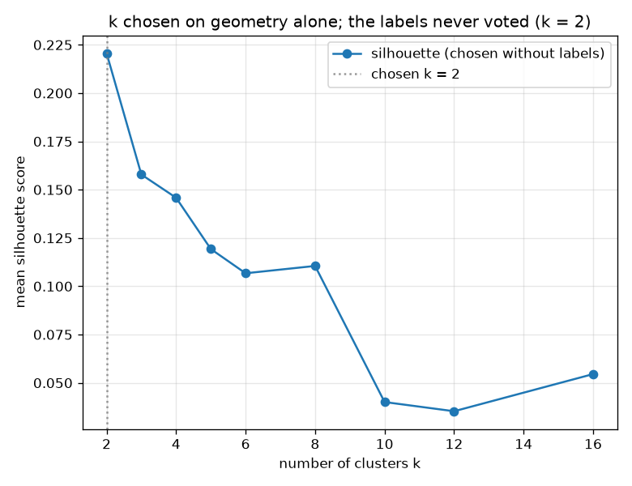

# NetSentry — Discovering the Attack Taxonomy Without Labels

_Synthetic stand-in. Stratified/binary split (every family appears in the test set, so
"would it have been discovered" is well posed). The 1,367 flows flagged at a
1% false-positive budget are clustered; **k is chosen by silhouette score
on the unlabelled features**, and the labels are opened only afterwards to grade a decision
already made._

## Why this report exists

The anomaly detector's job ends with a pile: flows that do not look like normal traffic,
handed over one at a time with no structure. That is what novel-attack detection actually
looks like — you learn *that* something is wrong long before anyone can say *what* — and it
is where analyst time goes, because a hundred flows from one campaign arrive as a hundred
tickets. Clustering is the obvious response and the obvious trap: grouping anomalies is easy,
and the usual failure is to choose the number of groups by seeing which value best reproduces
the labels, which is leakage wearing an unsupervised costume. Here the labels never vote.

## Does the geometry know about the taxonomy?

Clustering the 1,367 flagged flows into k = 2 groups — a value chosen by silhouette score on the features alone, with the labels sealed — recovers an Adjusted Rand Index of **-0.014** against the true attack classes, normalized mutual information 0.025, and cluster purity 38.6%. Random assignment into the same number of groups scores -0.0002, so the lift is -0.014 and there is essentially no correspondence. Purity and ARI disagree in the usual direction and both are reported for that reason: purity rewards splitting a family across several clusters (an analyst still sees coherent groups), while ARI penalises it (the taxonomy was not recovered exactly). Which one matters depends on whether the goal is triage or taxonomy.

A negative result is only useful if it says *why*, so one diagnostic arm refits at k = 10, the true number of families. It **uses the labels** and is therefore not a result — it exists to separate two very different failures. It scores ARI 0.279, purity 64.3%, and would have surfaced 3 families. So the geometry does carry the taxonomy and **the selector is what failed**: silhouette rewards a small number of compact, well-separated blobs, and the attack families here are neither equally sized nor spherical, so it collapses them. That is an actionable finding — the fix is a selector suited to unbalanced clusters (gap statistic, or a density-based method that does not need k at all), not a different feature space.

## Which families would have been rediscovered?

Of the 10 attack families present among the flagged flows, **0** would have been surfaced by a cluster on their own terms — a cluster at least 60% made of that family and large enough to be worth opening (0% discovery rate). The families no cluster surfaced were Bot, DDoS, DoS GoldenEye, DoS Hulk, DoS Slowhttptest, DoS slowloris, FTP-Patator, PortScan, SSH-Patator, Web Attack — either too rare to form a cluster of their own at this flag budget, or behaviourally close enough to another family that the geometry merges them.

## The clusters

| cluster | flows | what it actually contained | purity | nearest known family | distance | verdict |
|---|---|---|---|---|---|---|
| 1 | 1,293 | DoS Hulk | 38% | DoS Hulk | 1.6 | matches the catalogue |
| 0 | 74 | DDoS | 50% | DDoS | 8.5 | **candidate new family** |

The arithmetic looks spectacular and is not: 1,367 flagged flows become 2 groups, a 684x reduction in tickets — but the saving is only real if judging one member of a group judges the rest, and at 39% purity it does not. An analyst who closed a whole cluster on the strength of one sample would be wrong most of the time. The triage ratio is reported because it is the number people quote, and qualified because on this data it does not survive contact with the purity column. 1 cluster(s) sit further than the 7.1 distance cut from every known-class centroid and are flagged as candidate *new* families rather than named after the nearest catalogue entry — which is the distinction between recognising an attack and merely matching it to the closest thing already known.

## Scope

Clustering runs on the flows the *supervised* model flags, not on the anomaly detector's
output, so the population is "what the deployed system escalates" rather than "everything
unusual" — the [anomaly](anomaly.md) and [novelty](novelty.md) studies cover the latter, and
running this over the anomaly detector's flags is the natural extension. `k` is chosen by
silhouette, which prefers compact spherical clusters and therefore suits k-means and suits
some attack families better than others; a density-based method would find differently-shaped
groups and is the obvious alternative. Purity, ARI and NMI are computed *after* the fact and
never influence the clustering, but they are computed on labels this project treats as ground
truth, which the [label-audit](label_audit.md) study shows is itself an approximation. And
"candidate new family" is a relative judgement — a cluster far from the *known* centroids in
this feature space — not a claim that the traffic is novel in any absolute sense.