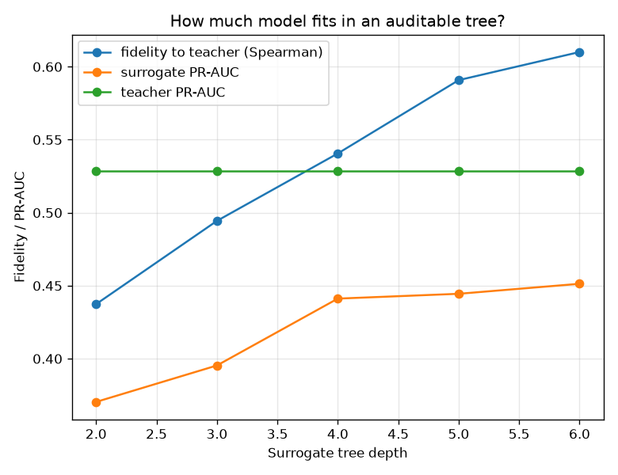

# NetSentry - Surrogate Distillation (the auditable approximation)

_Synthetic stand-in; the method is the point. A depth-limited decision tree is
trained to imitate the teacher's **attack ranking** over the temporal training
split (raw score; the monotone calibrator applies identically on top, so serving
semantics are unchanged) and judged on the temporal test split. Teacher: PR-AUC
**0.529**, detection **21.0%** at the
1% FP budget - the headline evaluation's own numbers._

## The question

The [rules baseline](rules.md) benchmarks hand-written signatures against the
model; this asks the inverse: how much of the *learned* model survives translation
into a form an auditor can read end-to-end? Fidelity says how well the surrogate
mimics the teacher; its own PR-AUC says what the translation costs.

| depth | leaves (rules) | fidelity (Spearman) | decision agreement | surrogate PR-AUC | surrogate TPR @ 1% FPR |
|---|---|---|---|---|---|
| 2 | 4 | 0.437 | 90.5% | 0.370 | 2.6% |
| 3 | 8 | 0.494 | 93.1% | 0.395 | 21.1% |
| 4 | 16 | 0.541 | 96.2% | 0.441 | 16.6% |
| 5 | 30 | 0.591 | 97.3% | 0.444 | 24.7% |
| 6 | 49 | 0.610 | 97.5% | 0.451 | 21.3% |



## Read

- At depth 6 the surrogate tracks the teacher's ranking with Spearman
  **0.610** and agrees with **97.5%** of its
  volume-matched decisions - the share of deployed behavior that fits in
  49 rules. The gap between the surrogate's PR-AUC and the teacher's
  0.529 is the price of auditability, stated per depth.
- **Score quantization is an interpretability cost.** A K-leaf tree emits only K
  distinct scores, so tight FP budgets are unreachable by construction: the
  surrogate's TPR at the 1% budget moves in leaf-sized jumps.
  Anyone shipping "the interpretable version" inherits that granularity.
- **A surrogate explains behavior, not mechanism.** High fidelity means these rules
  reproduce the model's decisions on this traffic - not that the model "reasons"
  this way. The claim is scoped on purpose; over-reading global surrogates is a
  classic explainability failure.

## The depth-4 surrogate, in full (16 leaves)

```text
|--- Total Fwd Packets <= 0.28
|   |--- Flow Packets/s <= 0.77
|   |   |--- Flow Duration <= 0.80
|   |   |   |--- Flow Bytes/s <= 1.20
|   |   |   |   |--- value: [0.12]
|   |   |   |--- Flow Bytes/s >  1.20
|   |   |   |   |--- value: [0.62]
|   |   |--- Flow Duration >  0.80
|   |   |   |--- Flow IAT Mean <= 0.37
|   |   |   |   |--- value: [0.35]
|   |   |   |--- Flow IAT Mean >  0.37
|   |   |   |   |--- value: [0.72]
|   |--- Flow Packets/s >  0.77
|   |   |--- Flow Bytes/s <= -0.09
|   |   |   |--- Total Fwd Packets <= -0.14
|   |   |   |   |--- value: [0.18]
|   |   |   |--- Total Fwd Packets >  -0.14
|   |   |   |   |--- value: [0.51]
|   |   |--- Flow Bytes/s >  -0.09
|   |   |   |--- Flow Bytes/s <= 0.29
|   |   |   |   |--- value: [0.71]
|   |   |   |--- Flow Bytes/s >  0.29
|   |   |   |   |--- value: [0.94]
|--- Total Fwd Packets >  0.28
|   |--- Flow Packets/s <= 0.10
|   |   |--- Flow Bytes/s <= 0.75
|   |   |   |--- Total Fwd Packets <= 1.18
|   |   |   |   |--- value: [0.35]
|   |   |   |--- Total Fwd Packets >  1.18
|   |   |   |   |--- value: [0.61]
|   |   |--- Flow Bytes/s >  0.75
|   |   |   |--- Flow Packets/s <= -0.21
|   |   |   |   |--- value: [0.72]
|   |   |   |--- Flow Packets/s >  -0.21
|   |   |   |   |--- value: [0.95]
|   |--- Flow Packets/s >  0.10
|   |   |--- Flow Bytes/s <= -0.20
|   |   |   |--- Flow Packets/s <= 0.88
|   |   |   |   |--- value: [0.52]
|   |   |   |--- Flow Packets/s >  0.88
|   |   |   |   |--- value: [0.90]
|   |   |--- Flow Bytes/s >  -0.20
|   |   |   |--- Flow Bytes/s <= 0.01
|   |   |   |   |--- value: [0.86]
|   |   |   |--- Flow Bytes/s >  0.01
|   |   |   |   |--- value: [0.98]
```

Complements: [SHAP](evaluation.md) attributes per-prediction contributions, the
[ablation](ablation.md) measures each family's causal value, the
[recourse study](recourse.md) gives the per-flow what-if - this gives the whole
model's closest small imitation, with its cost printed beside it.
