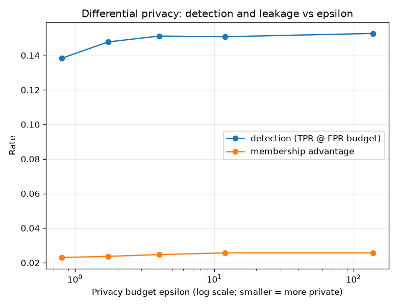

# NetSentry - Differential Privacy: the Utility-Leakage Frontier

_Synthetic stand-in; the methodology is the point. DP-SGD **logistic** models on the
exchangeable **stratified**, binary split (the split the membership audit uses), at a
fixed delta = 1e-05. epsilon is spent by a pure-stdlib integer-order Renyi-DP
accountant; utility is binary attack-vs-benign detection, leakage is the same Yeom
confidence-threshold attack the [membership audit](membership.md) runs._

The [membership-inference audit](membership.md) measures how much the model memorises
its training data and ends by naming the mitigation with a formal guarantee -
**differentially-private training** - which buys an (epsilon, delta) bound at a
measured detection cost. This is that study. DP-SGD clips each flow's gradient to a
fixed L2 norm (bounding any one flow's influence) and adds Gaussian noise, so the
spent epsilon is a function of the noise multiplier, the minibatch sampling rate, and
the number of steps **only** - a certificate that holds for any dataset and any
attacker, not just the one measured below.

## The frontier

| model | noise (sigma) | epsilon (delta fixed) | PR-AUC | TPR @ 0.1% FPR | membership AUC | advantage |
|---|---|---|---|---|---|---|
| non-private | 0 | inf (non-private) | 0.690 | 15.2% | 0.507 | 0.030 |
| sigma=0.5 | 0.5 | 138.61 | 0.692 | 15.3% | 0.507 | 0.026 |
| sigma=1 | 1 | 11.99 | 0.691 | 15.1% | 0.507 | 0.026 |
| sigma=2 | 2 | 4.02 | 0.689 | 15.1% | 0.506 | 0.025 |
| sigma=4 | 4 | 1.73 | 0.683 | 14.8% | 0.506 | 0.024 |
| sigma=8 | 8 | 0.80 | 0.666 | 13.8% | 0.505 | 0.023 |

Smaller **epsilon** is a stronger privacy guarantee. **PR-AUC** and **TPR @ FPR** are
the detection kept; **membership AUC** (0.5 = no leakage) is the empirical leak that
remains against the Yeom attack. The **advantage** is Yeom's max(TPR - FPR).

## Read

The non-private reference detects at PR-AUC **0.690** (TPR@0.1%FPR 15.2%) and its membership leakage sits at AUC 0.507. Tightening to a formal **epsilon = 0.80** guarantee costs **+0.024 PR-AUC** (+1.4 pts of detection at the operating point) and moves membership leakage by -0.002 AUC.

The measured leak barely moves here, and honestly so: a regularised **linear** model memorises little to begin with (the membership audit's thesis — leakage tracks memorisation, which linear models and early stopping already suppress), so the empirical attack has little to close. That does not make DP pointless: its value is the *formal* (epsilon, delta) bound, which holds against **every** attacker and dataset, not just the Yeom attack measured here. The frontier prices its cost.

This is the project's measure -> fix -> re-measure arc one axis over: the membership audit *measured* the leak, DP-SGD *applies* the control with a certificate, and the table *re-measures* both the residual empirical leak and the detection the guarantee costs.

## Scope

- The guarantee is **formal**: DP bounds the influence of any single training flow on
  the released model, so it defends against attacks not enumerated here (the shadow
  attack, reconstruction, future attacks) - which is the whole point of a certificate
  over an empirical patch.
- The mechanism is **DP-SGD on a linear model**. DP for gradient-boosted trees is a
  different, messier mechanism; a linear model keeps the accountant honest and the
  utility ceiling real (the leaderboard shows logistic regression is competitive on
  the honest split). The deployed GBDT is unchanged.
- The accountant scans **integer** RDP orders, a sound upper bound on epsilon;
  fractional orders (Mironov 2019) would tighten the reported epsilon marginally.
