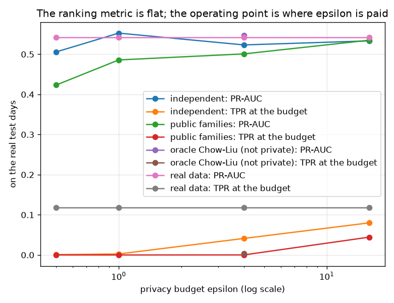
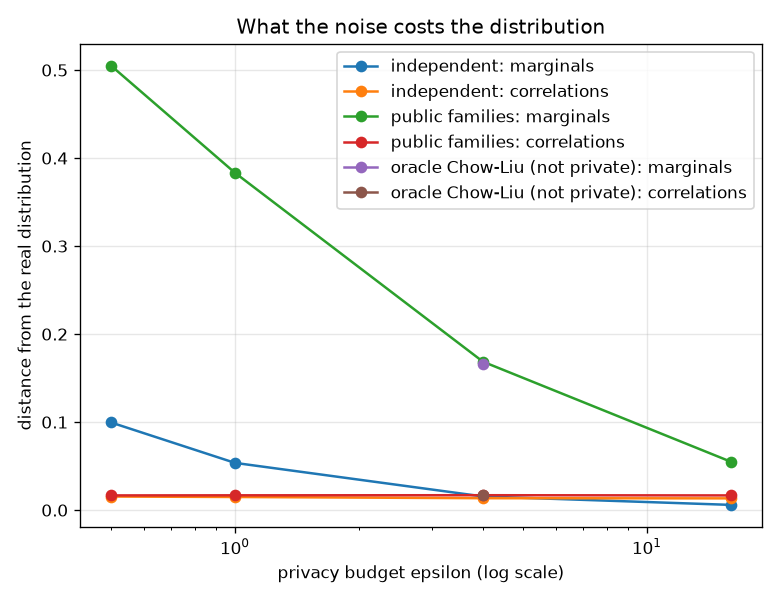

# NetSentry — Releasing the Data Instead of the Model

_A differentially-private synthetic flow release (PrivBayes family; Zhang et al., TODS 2017)
over 76 features on a 24-bin public grid, 28,034
rows per release, judged by training on it and testing on the real later capture days._

## Why this report exists

Every model here is trained on a 2017 capture, and the reason is not that intrusion detection
stopped being interesting in 2017. Flow records carry who talked to whom, on what port, for how
long — so they do not leave the organisation that collected them. The
[federated](federated.md) and [secure-aggregation](secagg.md) studies both take the same escape
route: keep the data still, move the computation. This asks the other question. Can the *data*
be released — synthetic, with a formal guarantee — well enough that somebody who has never seen
the capture can train a detector that works on real traffic?

## The mechanism, and its accounting

| release | how the budget is spent |
|---|---|
| independent, epsilon = 0.5 | epsilon = 0.5 = 0.025 (class prior) + 76 x 0.00625 (one marginal per feature, sequential), taken in parallel across 2 classes |
| independent, epsilon = 1 | epsilon = 1 = 0.05 (class prior) + 76 x 0.0125 (one marginal per feature, sequential), taken in parallel across 2 classes |
| independent, epsilon = 4 | epsilon = 4 = 0.2 (class prior) + 76 x 0.05 (one marginal per feature, sequential), taken in parallel across 2 classes |
| independent, epsilon = 16 | epsilon = 16 = 0.8 (class prior) + 76 x 0.2 (one marginal per feature, sequential), taken in parallel across 2 classes |
| independent, no privacy (control) | no guarantee (control arm) |

Three details are worth stating because they are where synthetic-data claims usually go soft:

- **The domain is public, and no data was consulted to build it.** Every feature is binned on a
  fixed signed-log grid over a declared range (up to 1e+09). Taking `min`/`max`
  from the data would itself be a query about one record — the longest flow in a capture is
  *somebody's* flow — and a release whose bin edges came from the data has leaked before any
  noise is added.
- **The neighbouring relation is add/remove one flow.** That is what makes the per-class split
  parallel composition: a flow has exactly one label, so releasing each class's marginals costs
  the maximum rather than the sum. Under replace-one neighbouring the same step would be
  invalid, because a record could move between classes.
- **Within a class the marginals compose sequentially**, one per feature, so each receives
  `epsilon / 76`. That division is the single most important number in this
  report: it is why high-dimensional private synthesis is hard, and it is visible in every row
  of the table below.

## Does a model trained on the release detect real attacks?

| trained on | PR-AUC (mean of draws) | range across draws | TPR @ budget, threshold chosen on the training distribution | realised FPR | TPR, threshold chosen on real validation | marginal TV | correlation error |
|---|---|---|---|---|---|---|---|
| real training data (the ceiling) | 0.542 | n/a | 11.8% | 0.08% | 10.3% | 0.000 | 0.000 |
| independent, epsilon = 0.5 | 0.506 | 0.443-0.543 | 0.1% | 0.00% | 4.0% | 0.100 | 0.015 |
| independent, epsilon = 1 | 0.553 | 0.521-0.577 | 0.3% | 0.00% | 6.4% | 0.054 | 0.015 |
| independent, epsilon = 4 | 0.523 | 0.499-0.547 | 4.1% | 0.01% | 9.9% | 0.016 | 0.014 |
| independent, epsilon = 16 | 0.533 | 0.525-0.549 | 8.0% | 0.05% | 11.8% | 0.006 | 0.013 |
| public families, epsilon = 0.5 | 0.423 | 0.358-0.478 | 0.0% | 0.00% | 1.9% | 0.505 | 0.017 |
| public families, epsilon = 1 | 0.486 | 0.451-0.522 | 0.0% | 0.00% | 2.8% | 0.383 | 0.017 |
| public families, epsilon = 4 | 0.501 | 0.475-0.524 | 0.0% | 0.00% | 6.3% | 0.169 | 0.017 |
| public families, epsilon = 16 | 0.535 | 0.519-0.544 | 4.4% | 0.01% | 13.9% | 0.055 | 0.017 |
| independent, no privacy (control) | 0.527 | 0.522-0.531 | 13.0% | 0.11% | 12.3% | 0.004 | 0.006 |
| public families, no privacy (control) | 0.524 | 0.518-0.529 | 11.9% | 0.04% | 14.5% | 0.004 | 0.006 |
| oracle Chow-Liu (not private), epsilon = 4 | 0.547 | 0.532-0.565 | 0.4% | 0.00% | 9.4% | 0.166 | 0.017 |

**The ranking metric cannot see the privacy cost. The operating point can.**

PR-AUC barely moves: the real data reaches 0.542 on the later capture days, the no-privacy control reaches 0.527, and the best private release reaches 0.553 at epsilon = 1. The whole spread across every private arm is 0.129, against a run-to-run range of up to 0.121 on repeated draws of the *same* configuration — so most of the ordering in that column is Laplace noise and has to be read as such.

The detection column next to it is not flat at all. Reading the independent-marginal arm up the budget: 0.1% (epsilon = 0.5) -> 0.3% (epsilon = 1) -> 4.1% (epsilon = 4) -> 8.0% (epsilon = 16), against 11.8% for a model trained on the real data and 13.0% for the no-privacy synthetic control. That is the privacy/utility curve this report was built to find, and it is invisible to the metric most synthetic-data papers lead with. The mechanism is that noise damages the *tails* of each marginal long before it damages the ordering: a threshold at a 0.1% false-positive budget lives entirely in the top thousandth of the score distribution, which is exactly the region a noisy histogram reconstructs worst.

This is the [previous wave's lesson](online.md) arriving from a new direction — a streaming learner beat the incumbent on PR-AUC and could not be deployed at the budget; here a release matches the incumbent on PR-AUC and detects a twentieth as much at the budget. Anything that reports a single ranking number for a private release is reporting the number least sensitive to what it did.

## Does the structure earn its budget?

Degree-1 loses, and the mechanism is arithmetic rather than modelling. A root node releases a histogram of 25 cells; a node with a parent releases a joint table of 625. Both are one sensitivity-1 query and both get the *same* slice of epsilon, so the conditional table receives the same total noise spread over 25 times as many cells. At epsilon = 0.5 the marginal total-variation distance is 0.505 for the degree-1 release against 0.100 for independent marginals — the structure-aware model is an order of magnitude further from the real distribution, on the very statistic it was supposed to preserve better.

The **oracle** row settles whether a private structure *search* could rescue the degree-1 design. Its tree is fitted on the real data with no noise and no budget, so nobody could publish it — it is an upper bound. At epsilon = 4 it reaches a marginal TV of 0.166 against the free public structure's 0.169. A perfect structure does not pay for the cells it costs. Spending part of a scarce epsilon searching for one would be worse still, and this arm is why that can be said rather than assumed.

This is consistent with what the [multivariate-drift study](mmd.md) found by a completely different route: the mean absolute pairwise correlation across these features is 0.005 on this stand-in, so there is almost no dependence structure to capture and a model that captures none loses almost nothing while paying nothing. On the real CIC-IDS2017 — where a duration is a sum of inter-arrival times and a rate is a count over a duration — the trade could reverse, and the way to find out is to run this grid there rather than to argue about it.

## The threshold is a second, separate loss

The two TPR columns are the same scores read at two different thresholds, and the difference between them is a cost that has nothing to do with the model. A recipient of a synthetic release has no real traffic, so the operating point has to be chosen on the release as well. At a 0.1% budget chosen that way the best private release detects **0.3%** of real attacks; the identical model, scored at a threshold chosen on real validation data, detects 6.4%. Several arms — public families, epsilon = 0.5 among them — detect 0.0% and run at 0.00% false positives, which is not a conservative threshold, it is a threshold placed in a part of the score range that real traffic never reaches.

That is the finding this report would have missed with a ranking metric alone. The release preserves *ordering* well enough to keep PR-AUC intact and does not preserve the score **distribution** at all, and an operating point is a statement about a distribution. It is the same failure the [threshold-transfer study](threshold_transfer.md) measured for a foreign dataset, arriving here by a different road: a synthetic release must ship with the warning that the threshold has to be re-bought on whatever labelled real traffic the recipient can get, and a release used to *choose an operating point* is being used outside what it can support.

## What the noise costs the distribution

Total-variation distance per feature and mean absolute correlation error, both against the real
training distribution. Marginal TV tracks epsilon cleanly and tracks the *operating-point*
column with it — the two quantities that respond to the budget are the shape of each marginal
and the detection rate at a fixed false-positive rate, which is not a coincidence: both are
statements about where the mass sits, and the threshold lives in the thin end of it. The
correlation error barely moves at all, because there is barely any correlation to lose (0.005
mean absolute pairwise, per [mmd.md](mmd.md)). Fidelity numbers remain diagnostics for the
synthesiser rather than evidence for the release: matching marginals is necessary and nowhere
near sufficient, since the decision boundary lives on the joint distribution.

## Does the release leak the rows it was built from?

| release | membership AUC from the release alone | median distance: released row to a training row | ... and for a genuine held-out row |
|---|---|---|---|
| public families, epsilon = 0.5 | 0.499 | 124.74 | 9.25 |
| public families, epsilon = 4 | 0.499 | 64.55 | 9.28 |
| public families, no privacy (control) | 0.495 | 10.19 | 9.23 |

The attack holds only the released rows. For each candidate flow it measures the distance to the nearest released row and accuses the close ones — if the synthesiser memorised, members sit closer than non-members and the AUC climbs above 0.5. On the no-privacy control it reads 0.495; at epsilon = 0.5 it reads 0.499. Two honest readings of that. First, a low AUC at high epsilon is **not** evidence the release is safe: this is one weak attack, and a guarantee is a guarantee precisely because it holds against attacks nobody has invented. Second, the distance columns are the check that actually catches the embarrassing failure — a synthesiser that re-emits training rows would show released rows sitting far closer to training data than genuine held-out flows do, and here they sit at 10.19 against 9.23 for real held-out traffic. Nothing is being copied; the release is bad at reproducing the data in general, which is a different failure and is priced in the utility table.

## Scope and honest limits

- **This is a degree-<=1 model.** PrivBayes proper searches for a higher-degree network under
  the exponential mechanism; the oracle arm here bounds what that search could return on this
  data before anybody pays for it. If the oracle row were far ahead, the follow-up would be to
  build the search — the point of the arm is that it says whether to.
- **Epsilon is per release, not per organisation.** Publishing two releases from the same
  capture costs the sum. A programme that re-releases monthly needs a budget over the programme,
  which is a governance decision rather than a parameter.
- **The utility ceiling is the synthesiser, not the noise.** The no-privacy control makes this
  measurable rather than arguable, and it is the number a reader should quote when asked "how
  much does DP cost here?" — the answer is *less than binning does*.
- **A low membership AUC is not a proof of safety.** It is one attack. The guarantee is the
  claim; the attack is a sanity check on the implementation, in the same spirit as the
  [membership-inference audit](membership.md) of the trained model.
- **The stand-in has almost no dependence structure** (mean absolute pairwise correlation 0.005;
  see [mmd.md](mmd.md)), which flatters every low-degree synthesiser. On real CIC-IDS2017,
  where a duration is a sum of inter-arrival times and a rate is a count over a duration, the
  structure arms are the ones most likely to reorder.