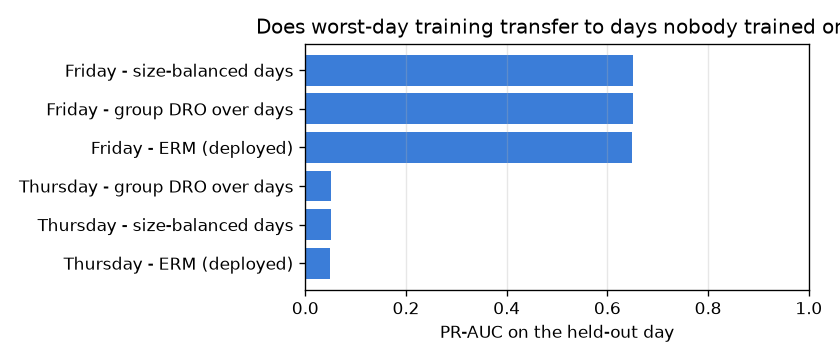
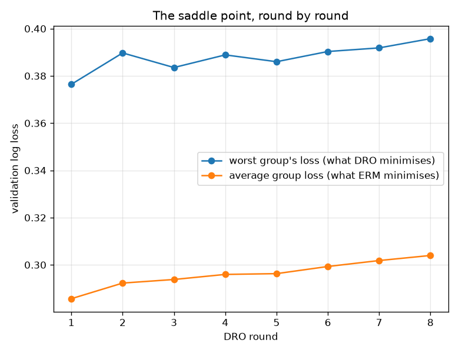

# NetSentry — Group DRO: Training for the Worst Case, Not the Average One

_Synthetic stand-in. Honest temporal/binary split; groups are the 3 training
capture days. All three arms are judged on the same later-day test set
(Friday, Thursday) at each arm's own validated 0.1% false-positive
budget. 8 DRO rounds at step size 2._

## Why this report exists

Empirical risk minimisation optimises a mean, and a mean belongs to whoever contributes most of
it. Any subpopulation that is a small share of traffic can be served badly without the objective
noticing. Distributionally robust optimisation replaces that objective with the worst group's:

```
minimise over theta   max over groups g   E[ loss | group g ]
```

and Sagawa, Koh, Hashimoto & Liang (ICLR 2020) solve the saddle point by online exponentiated
gradient — keep a weight per group, upweight whoever is doing worst, refit, repeat. The inner
step here is a weighted LightGBM fit rather than a gradient step, which coarsens the dynamics
without changing the game.

## Choosing the groups is most of the work

The natural grouping for a parity study is the **service**, and it is the one the [parity audit](subgroups.md) uses. It cannot carry a DRO objective on this data: 5 of 8 services are a single class end to end, leaving 3 with any mixture at all.

| service | training flows | attack share | usable as a group? |
|---|---|---|---|
| DNS | 2,463 | 0.0% | **no — one class only** |
| FTP | 563 | 100.0% | **no — one class only** |
| HTTP | 9,534 | 47.2% | yes |
| HTTPS | 2,517 | 0.4% | yes |
| IMAP | 5,044 | 0.0% | **no — one class only** |
| POP3 | 2,484 | 0.0% | **no — one class only** |
| SMTP | 2,390 | 0.0% | **no — one class only** |
| SSH | 3,039 | 17.1% | yes |

A group that is 100% attack or 100% benign is not a subpopulation, it is a label. Upweighting it does not ask the model to be fair to an under-served slice of traffic, it asks the model to predict one class harder — so 'worst-group loss' would reduce to 'hardest class' and the whole exercise would measure nothing. This is not an artefact of the synthetic generator either: attacks concentrate on service ports in the real capture too, which is exactly why `Destination Port` is dropped as a model feature in the first place ([DATA_CARD](../DATA_CARD.md)). **The same collinearity that makes the port a leakage risk makes the service a useless DRO group.** Worth stating, because reaching for group DRO without checking the group definition is the standard way this method gets misapplied.

So the groups here are **capture days**, which are a genuine operational partition, carry both classes at very different rates, and happen to be the axis this project cares most about.

| group | training flows | attack share |
|---|---|---|
| Monday | 7,511 | 0.0% |
| Tuesday | 8,562 | 12.7% |
| Wednesday | 11,961 | 37.7% |

## Three arms

| arm | test PR-AUC | detection | FPR | worst training-group loss | worst held-out day |
|---|---|---|---|---|---|
| **ERM (deployed)** | 0.529 | 9.1% | 0.059% | 0.3854 | Thursday (0.050) |
| **size-balanced days** | 0.529 | 9.0% | 0.059% | 0.3764 | Thursday (0.050) |
| **group DRO over days** | 0.529 | 9.0% | 0.059% | 0.3764 | Thursday (0.050) |

DRO did what it promised on its own objective: the worst training group's validation loss falls from 0.3854 to 0.3764 (+0.0089). But the question that matters is transfer, and there it is a wash at best. On the unseen days, PR-AUC is 0.529 for ERM, 0.529 size-balanced and 0.529 for DRO, with the worst held-out day at 0.050 / 0.050 / 0.050. The best arm overall is **size-balanced**.

The size-balanced control earns its place in the table here: it applies the same per-group normalisation as DRO with no adversary at all, so any gap between it and plain ERM is the effect of equalising day sizes, and any gap between it and DRO is what the adversary actually contributed. And here the gap is exactly nothing, for a reason worth stating rather than leaving as a coincidence of three identical columns: **the round DRO selected was round 1, whose weights are still uniform.** Every subsequent round — every round in which the adversary actually did something — scored worse on the very objective it was maximising against. Group DRO, given the chance to reweight, chose not to. The two columns are identical by construction, not by luck, and the honest reading is that the adversary found nothing to exploit.

## Transfer, day by day

| held-out day | ERM (deployed) | size-balanced days | group DRO over days |
|---|---|---|---|
| Friday | 0.649 | 0.650 | 0.650 |
| Thursday | 0.050 | 0.050 | 0.050 |



## The game, round by round

| round | worst group loss | mean group loss | worst group | heaviest weight | validation PR-AUC |
|---|---|---|---|---|---|
| 1 | 0.3764 | 0.2857 | Tuesday | Monday (0.33) | 0.782 |
| 2 | 0.3897 | 0.2923 | Tuesday | Tuesday (0.39) | 0.776 |
| 3 | 0.3835 | 0.2938 | Tuesday | Tuesday (0.46) | 0.776 |
| 4 | 0.3889 | 0.2959 | Tuesday | Tuesday (0.51) | 0.776 |
| 5 | 0.3860 | 0.2963 | Tuesday | Tuesday (0.57) | 0.776 |
| 6 | 0.3903 | 0.2993 | Tuesday | Tuesday (0.61) | 0.776 |
| 7 | 0.3918 | 0.3018 | Tuesday | Tuesday (0.66) | 0.773 |
| 8 | 0.3958 | 0.3040 | Tuesday | Tuesday (0.70) | 0.775 |

The worst group's loss went from 0.3764 to 0.3958 (+0.0193) while the average moved +0.0183. Across 8 rounds the hardest group changed 1 time — one group is persistently hardest, and upweighting it does not fix it, which usually means the difficulty is in the data rather than in the emphasis. The inner minimisation is a full LightGBM refit rather than a gradient step, so this explores a handful of large moves in the game rather than converging it; a longer run with a smaller step would be a fairer test of DRO's ceiling and a far more expensive one.

**The interesting failure is that upweighting the worst group made it worse.** Tuesday is the hardest group in every round, the adversary's weight on it climbs from 0.33 to 0.70, and across that climb Tuesday's own loss rises from 0.3764 to 0.3958. That is not a bug in the update, it is the premise of the method failing. Weight is a fixed budget: emphasising one day necessarily de-emphasises the others, and the model learns Tuesday's attacks largely *from the other days' attacks* — the families overlap, so the data that helps most is not the data that scores worst. Group DRO assumes a group's difficulty is fixable by paying it more attention. That holds when groups are genuinely separate sub-populations and fails when they share their signal, which is the common case in traffic captured from one network. The diagnostic is cheap and this report is what it looks like: if the worst-group loss rises monotonically as its weight rises, the partition is wrong for DRO, not the model.



## Scope

Group weights are updated on **validation** loss and the deployed round is chosen by validation
worst-group loss, so the test days stay untouched — but that also hands DRO a model-selection
step the ERM arm does not get, and it still has to win with it. Three groups is a thin game;
DRO's guarantees are asymptotic in neither the number of groups nor the number of rounds, and
with a full refit per round this run explores the game rather than solving it. Each arm re-picks
its own threshold on validation at the shared budget, so the detection column compares operating
points that were calibrated the same way rather than a single threshold applied to differently
scaled scores. Monday carries no attacks at all, which makes its per-group loss a pure
false-positive term — the [federated study](federated.md) hit the same fact from another
direction and found an all-benign site produces an accidental one-class fit. Worst-group results
on a group that contains one class should be read as "how confidently does it clear benign
traffic", not as detection.