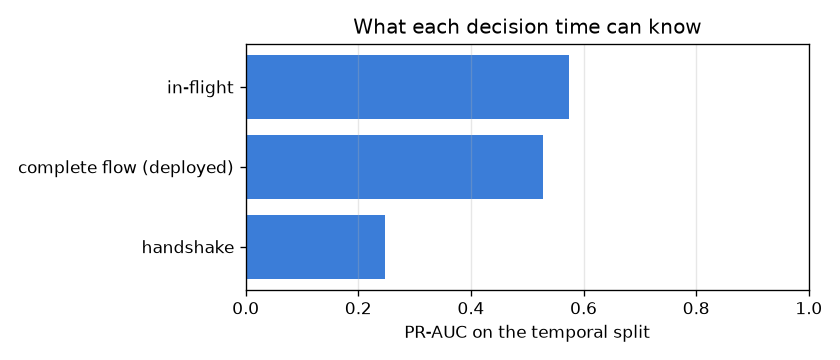
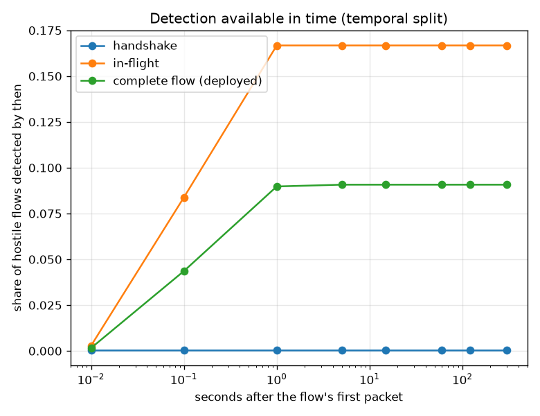

# NetSentry — When the Verdict Can Exist

_Synthetic stand-in. Honest temporal/binary split, 0.1% false-positive
budget. Exporter idle timeout 120 s; the in-flight tier is
allowed 1.00 s to accumulate packets._

## Why this report exists

Every other number in this repository is quoted as though the detector decides the moment the
attack does. It does not. Flow exporters emit **one record per finished flow**, and most of the
statistics the model consumes are only defined once the flow is over — `Total Fwd Packets` is
not a running counter read at the end, it is a quantity that does not exist until then. So the
deployed detector is structurally a post-mortem one, and the interesting question is not only
"is the verdict right" but "when could the verdict possibly have existed".

## Half one: how long the verdict takes

Across the 6,237 hostile flows on the test days the median wait for a complete-flow verdict is **43 ms** and the 90th percentile is **0.24 s**. That is the whole flow duration and nothing more, because **100% of these flows showed the exporter a teardown** — the synthetic generator stamps FIN/RST counts on essentially every flow it emits, so the idle timer never fires and this stand-in cannot exercise the half of the latency model that matters most. Saying so is more useful than quoting the number as though it generalised: on a real capture the unanswered SYN, the half-open connection and the UDP exchange all end without a teardown, and each one is held for the configured 120 s before its record exists at all. So the sweep below reports the one quantity the stand-in cannot supply — what the wait becomes as that share rises.

### What the wait becomes when flows stop closing politely

| flows with no teardown | median wait for the deployed verdict |
|---|---|
| 0% | 43 ms |
| 10% | 53 ms |
| 25% | 80 ms |
| 50% | 120 s |
| 75% | 120 s |
| 100% | 120 s |

The step is not gradual, it is a cliff. At 25% unclosed the median verdict still waits 80 ms; at 50% it waits 120 s — a 1,504x jump caused by a change in the *traffic*, with the model, the features and the threshold all held fixed. The mechanism is simply that once more than half the flows are waiting on the idle timer, the median flow is one of them. That is the operational point: flow-level detection latency is governed by whether connections close politely, which is a property of the attacker rather than of the detector, and the traffic that never closes politely is exactly what an operator most wants early — reconnaissance, whose probes go unanswered by definition.

## Half two: what it would cost not to wait

Features partition by *when the value the model trained on is knowable*: fixed at connection
setup, intensive statistics whose prefix value estimates the final one, or extensive and
teardown quantities that only exist at the end. The tiers are nested, so each row is a
detector that could actually be deployed at that moment.

| decision time | features | PR-AUC | detection @ budget | median wait | 90th-pct wait |
|---|---|---|---|---|---|
| handshake | 3 | 0.247 | 0.0% | 0 ms | 0 ms |
| in-flight | 36 | 0.574 | 16.7% | 43 ms | 0.24 s |
| complete flow (deployed) | 76 | 0.529 | 9.1% | 43 ms | 0.24 s |

The handshake tier sees 3 features — the initial TCP windows and the minimum forward segment size, fixed by the connection setup and never revised — and reaches 0.247 PR-AUC. The in-flight tier adds every intensive statistic (means, extremes, spreads, rates) for 36 features and 0.574. The deployed complete-flow model has 76 features and 0.529. **The ordering inverts.** Waiting for the flow to finish does not buy detection here, it costs it: the in-flight tier is +0.045 PR-AUC and +7.6% detection against the model this repository actually ships, using half its features and deciding while the connection is still open. That is not a tuning artefact, it is what the temporal split is for. The 40 features the in-flight tier drops are the *extensive* ones — totals, cumulative sums, durations, subflow volumes — and an extensive feature is a measurement of how big this particular burst happened to be. Burst size is a property of the campaign that was running on Wednesday, not of the behaviour that makes a flow hostile, so the model leans on it in training and it means something different on Friday. The intensive statistics that survive — packet-size distribution, inter-arrival shape, directional ratios — describe how the traffic behaves at any scale, and they transfer. The [ablation](ablation.md) study measures which families carry detection *within* a split; this measures which of them survive crossing one, and the answer is the scale-free half.

## The two halves together

The frontier asks the only question that matters once latency is on the axis: does waiting for the flow to end ever pay for itself? Here **it never does**, at any horizon plotted: the early curve is above the deployed one everywhere, so every second the deployed detector spends waiting is a second it is behind and never catches up. By the widest horizon plotted, 16.7% of hostile flows are caught in flight against 9.1% caught after the fact. A dominated curve is the strongest form this result can take. It means there is no operating regime, however patient, in which the extra features earn their latency — the choice between the two detectors is not a trade-off on this split, it is a strict improvement that the deployed configuration is declining to take.

## Per attack class

| attack class | flows | saw a teardown | median wait | 90th-pct wait | detected @ handshake | detected @ in-flight | detected @ complete flow (deployed) |
|---|---|---|---|---|---|---|---|
| Bot | 351 | 100% | 0.11 s | 0.37 s | 0.0% | 0.0% | 0.0% |
| Web Attack | 288 | 100% | 0.10 s | 0.37 s | 0.0% | 0.0% | 0.0% |
| DDoS | 2442 | 100% | 95 ms | 0.34 s | 0.1% | 42.5% | 23.2% |
| PortScan | 3114 | 100% | 19 ms | 73 ms | 0.0% | 0.1% | 0.0% |

The inversion is not spread evenly: it is almost entirely **DDoS**, which the in-flight tier catches +19.3% more often than the deployed model does — a volumetric class, and precisely the one whose extensive features (total bytes, total packets, duration) encode how large *that particular flood* was rather than what a flood looks like. Bot, Web Attack, PortScan are invisible to every tier, early or late, which is a coverage problem no decision time can fix and is handed to the [slices](slices.md) and [novelty](novelty.md) studies. The slowest verdict belongs to **Bot** at a median of 0.11 s and 0.37 s for its slowest tenth. Per class is the right granularity because response differs by class: waiting on a brute-force campaign costs a few more guesses, and the same wait on a reconnaissance sweep costs the entire target list.

## Scope

The in-flight tier is scored on the **completed** values of its intensive
features, because the CSVs contain one row per finished flow and nothing per packet. A real
mid-flow detector would see noisier estimates of the same quantities, so this tier is an
**upper bound** on in-flight detection — the gap it already shows against the complete tier is
a floor on the gap a deployed early detector would face. The handshake tier does not have this
problem: its fields are fixed at setup and never revised, so its numbers are exact.

Latency is measured from the flow's first packet, and the handshake verdict is timed at zero
rather than at one round trip, which flatters it by an amount that is small next to a
two-minute idle timer but is not nothing on a wide-area link. `SYN Flag Count` is classified
as complete-only although a SYN necessarily arrives first, because the *count* keeps accruing
on retransmits and the exporter only reports it at flow end; moving it to the handshake tier
would strengthen that tier's numbers, so the conservative call is the one that does not
flatter the argument being made. Finally, the exporter timeout is the configured
`capture.flow_timeout_us`; a deployment that shortens it trades this latency directly for
split flows, which fragment exactly the volumetric statistics the complete tier relies on.

The unclosed-share sweep assumes a flow's chance of ending without a teardown is independent
of its duration, which makes the mixture's median exact but is optimistic: short unanswered
probes are both the most likely to lack a teardown and the shortest, so a real capture would
put more mass on the timed-out branch at the low-duration end than the sweep does. Each tier
is refit from scratch on its own columns rather than masking a single model's inputs, so the
comparison is between three detectors that were each allowed to do their best with what they
could see, not between one detector and a crippled copy of itself.