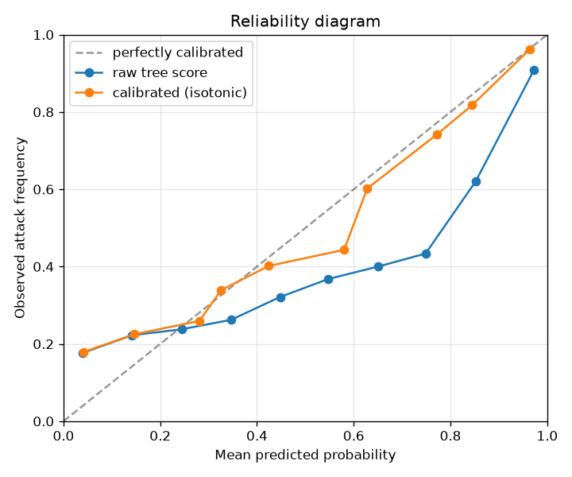
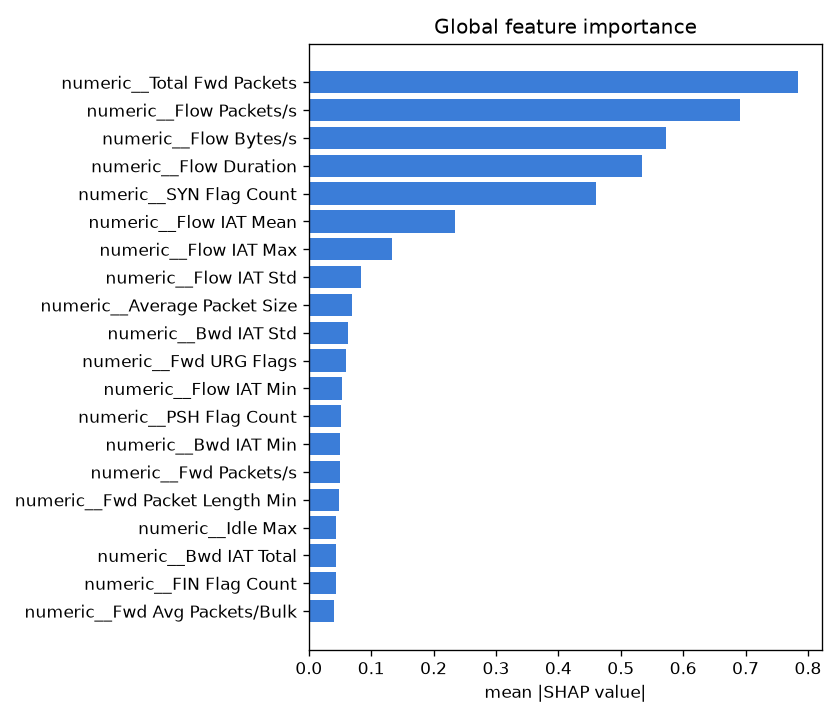

# NetSentry — Evaluation Report

_Generated 2026-07-01 15:58 UTC. Numbers below are on
the **synthetic** CIC-IDS2017 stand-in unless you have run on the real dataset;
the methodology and framing are identical either way._

## Headline — temporal (by-day) split, attack vs benign

The honest number: trained on earlier days, tested on later days (largely
**novel** attack types). This is what generalisation to tomorrow's traffic looks
like.

- **PR-AUC: 0.529** (majority-class baseline: 0.250)
- ROC-AUC: 0.668

### Operating points (threshold chosen on validation at a fixed FP budget)

| FPR budget | detection (TPR) | achieved FPR | ~false alerts/day |
|---|---|---|---|
| 0.1% | 9.1% | 0.059% | 441 |
| 1.0% | 21.0% | 0.876% | 6,571 |

> A SOC reads the first row as: "at a 0.1%
> false-positive budget, the detector catches this fraction of attacks, at roughly
> this many false alerts/day." False positives — not misses — are what cause alert
> fatigue, so the operating point matters more than any AUC.

## The honesty gap — temporal vs stratified

| Split | Binary PR-AUC |
|---|---|
| **Temporal (honest, headline)** | **0.529** |
| Stratified (optimistic reference) | 0.786 |
| **Gap (over-optimism)** | **+0.257** |

A naive shuffled split scores markedly higher because near-duplicate flows from
one attack burst land on both sides and all attack types are seen in training.
Reporting the temporal number — and this gap — is the whole point.

## Statistical significance (bootstrap, 95% CIs, 1,000 resamples)

A point estimate invites over-reading; the headline numbers come with percentile-bootstrap intervals so the comparison can be judged, not assumed.

| metric | estimate | 95% CI |
|---|---|---|
| PR-AUC — temporal (honest) | 0.529 | [0.518, 0.541] |
| PR-AUC — stratified (optimistic) | 0.786 | [0.773, 0.800] |
| detection @ 0.1% FPR (temporal) | 9.1% | [8.4%, 9.8%] |
| detection @ 1% FPR (temporal) | 21.0% | [20.0%, 22.0%] |

The over-optimism gap (stratified minus temporal) is **+0.257** (95% CI [+0.239, +0.276], bootstrap p = < 0.001) — the gap is **statistically significant**. The temporal PR-AUC interval excludes the majority baseline (0.250), so the model **beats** chance at the 95% level. This is the honest-vs-optimistic finding restated with uncertainty attached.

## Per-class — stratified multiclass ("name the attack")

Multiclass naming is evaluated on the stratified split (all classes appear in
training); on the temporal split it is degenerate because attack classes are
disjoint across the day boundary.

| class | precision | recall | F1 | support |
|---|---|---|---|---|
| BENIGN | 0.91 | 0.93 | 0.92 | 9354 |
| Bot | 0.00 | 0.00 | 0.00 | 70 |
| DDoS | 0.75 | 0.81 | 0.78 | 488 |
| DoS GoldenEye | 0.49 | 0.41 | 0.45 | 210 |
| DoS Hulk | 0.71 | 0.80 | 0.75 | 717 |
| DoS Slowhttptest | 0.34 | 0.12 | 0.17 | 95 |
| DoS slowloris | 0.30 | 0.23 | 0.26 | 105 |
| FTP-Patator | 0.10 | 0.01 | 0.01 | 140 |
| Heartbleed | 0.00 | 0.00 | 0.00 | 2 |
| Infiltration | 0.00 | 0.00 | 0.00 | 8 |
| PortScan | 0.64 | 0.75 | 0.69 | 623 |
| SSH-Patator | 0.23 | 0.02 | 0.04 | 130 |
| Web Attack | 0.00 | 0.00 | 0.00 | 58 |
| **macro avg** | 0.34 | 0.31 | 0.31 | |
| **weighted avg** | 0.83 | 0.86 | 0.84 | |

## Probability calibration

Gradient-boosted scores rank well but are **not probabilities** — a raw score of 0.9 need not mean a 90% attack rate. We fit **isotonic** calibration on the validation split and apply it to the served probability and the decision thresholds. Test-set diagnostics (lower is better):

| score | Brier ↓ | ECE ↓ | MCE ↓ |
|---|---|---|---|
| raw tree output | 0.1746 | 0.1206 | 0.3149 |
| **calibrated (isotonic)** | **0.1708** | **0.1057** | **0.1377** |

The map is monotonic, so it preserves the ranking of flows — the PR-AUC above is the model's discriminative power either way. Calibration changes only how that score maps to a probability, which is what makes a stated FP budget or a reported `attack_probability` trustworthy.

## Explainability — SHAP global importance

Attribution method: **shap**. The features driving attack predictions (per-prediction contributions are returned by the API):

| rank | feature | importance |
|---|---|---|
| 1 | numeric__Total Fwd Packets | 0.7833 |
| 2 | numeric__Flow Packets/s | 0.6910 |
| 3 | numeric__Flow Bytes/s | 0.5729 |
| 4 | numeric__Flow Duration | 0.5336 |
| 5 | numeric__SYN Flag Count | 0.4597 |
| 6 | numeric__Flow IAT Mean | 0.2348 |
| 7 | numeric__Flow IAT Max | 0.1331 |
| 8 | numeric__Flow IAT Std | 0.0829 |
| 9 | numeric__Average Packet Size | 0.0684 |
| 10 | numeric__Bwd IAT Std | 0.0632 |

## Notes

- Accuracy is intentionally absent from the headline: on ~80%-benign data it is
  ~0.8 for a model that detects nothing.
- A near-perfect score here would indicate leakage, not skill — see `NOTES.md`.
