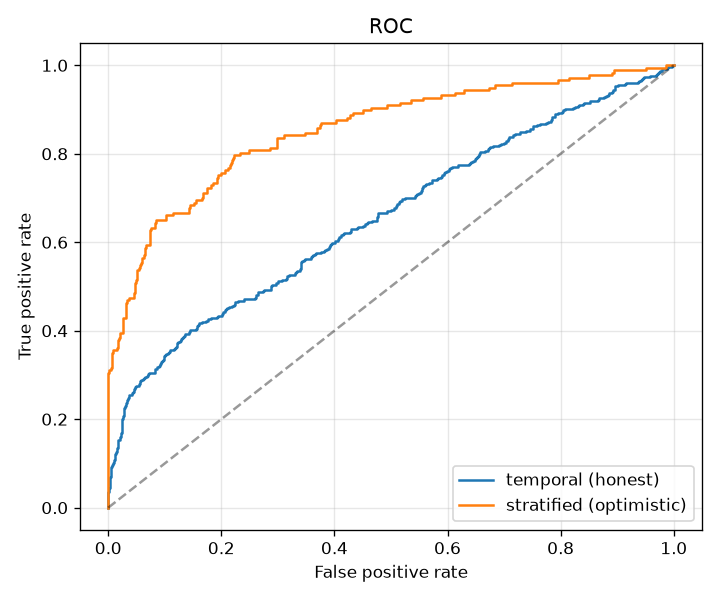
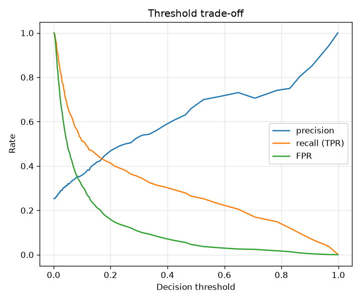
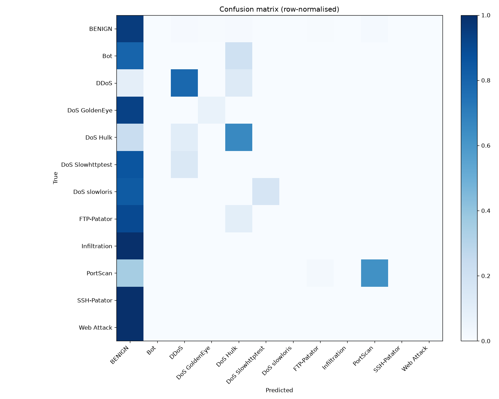

# NetSentry — Evaluation Report

_Generated 2026-06-25 15:25 UTC. Numbers below are on
the **synthetic** CIC-IDS2017 stand-in unless you have run on the real dataset;
the methodology and framing are identical either way._

## Headline — temporal (by-day) split, attack vs benign

The honest number: trained on earlier days, tested on later days (largely
**novel** attack types). This is what generalisation to tomorrow's traffic looks
like.

- **PR-AUC: 0.478** (majority-class baseline: 0.253)
- ROC-AUC: 0.656

### Operating points (threshold chosen on validation at a fixed FP budget)

| FPR budget | detection (TPR) | achieved FPR | ~false alerts/day |
|---|---|---|---|
| 0.1% | 2.4% | 0.000% | 0 |
| 1.0% | 13.0% | 1.518% | 11,337 |

> A SOC reads the first row as: "at a 0.1%
> false-positive budget, the detector catches this fraction of attacks, at roughly
> this many false alerts/day." False positives — not misses — are what cause alert
> fatigue, so the operating point matters more than any AUC.

## The honesty gap — temporal vs stratified

| Split | Binary PR-AUC |
|---|---|
| **Temporal (honest, headline)** | **0.478** |
| Stratified (optimistic reference) | 0.729 |
| **Gap (over-optimism)** | **+0.250** |

A naive shuffled split scores markedly higher because near-duplicate flows from
one attack burst land on both sides and all attack types are seen in training.
Reporting the temporal number — and this gap — is the whole point.

## Per-class — stratified multiclass ("name the attack")

Multiclass naming is evaluated on the stratified split (all classes appear in
training); on the temporal split it is degenerate because attack classes are
disjoint across the day boundary.

| class | precision | recall | F1 | support |
|---|---|---|---|---|
| BENIGN | 0.88 | 0.95 | 0.91 | 623 |
| Bot | 0.00 | 0.00 | 0.00 | 5 |
| DDoS | 0.66 | 0.78 | 0.71 | 32 |
| DoS GoldenEye | 0.25 | 0.07 | 0.11 | 15 |
| DoS Hulk | 0.70 | 0.66 | 0.68 | 47 |
| DoS Slowhttptest | 0.00 | 0.00 | 0.00 | 7 |
| DoS slowloris | 0.00 | 0.00 | 0.00 | 6 |
| FTP-Patator | 0.00 | 0.00 | 0.00 | 10 |
| Infiltration | 0.00 | 0.00 | 0.00 | 1 |
| PortScan | 0.75 | 0.63 | 0.68 | 43 |
| SSH-Patator | 0.00 | 0.00 | 0.00 | 7 |
| Web Attack | 0.00 | 0.00 | 0.00 | 4 |
| **macro avg** | 0.27 | 0.26 | 0.26 | |
| **weighted avg** | 0.80 | 0.84 | 0.82 | |

## Notes

- Accuracy is intentionally absent from the headline: on ~80%-benign data it is
  ~0.8 for a model that detects nothing.
- A near-perfect score here would indicate leakage, not skill — see `NOTES.md`.
