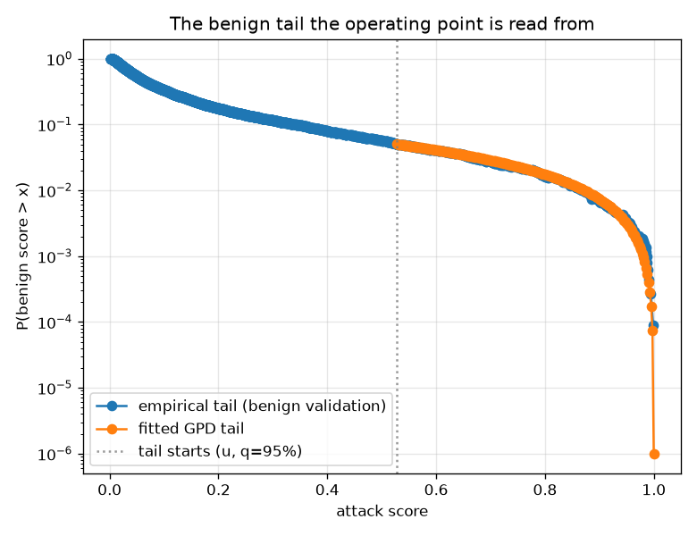
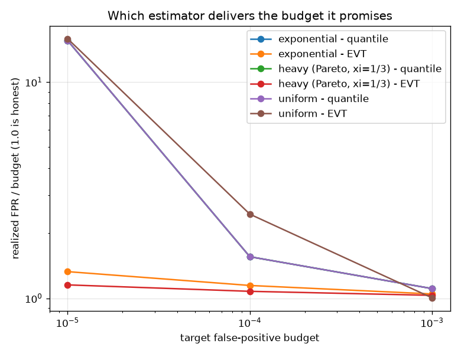

# NetSentry — Extreme-Value Thresholds: Operating Points Past the Edge of the Data

_Synthetic stand-in. Honest temporal/binary split; the benign tail is fitted on the
5,611 benign validation flows and applied to the 24,957-flow later-day test
set (18,720 benign). The controlled arm runs 400 replicates per
cell at n = 5,000._

## Why this report exists

The [Neyman-Pearson study](neyman_pearson.md) showed the deployed threshold is an order
statistic and gave it a guarantee. This one asks what else can be done with a tail besides
counting it.

At a 0.1% budget on 5,611 benign validation flows, the threshold is pinned by the
top 5 scores. Every number downstream — detection rate,
alerts per day, the cost model's operating point — inherits wherever those
5 flows happened to land. Tighten the budget by one order of
magnitude and the empirical quantile stops existing: `n * alpha < 1`, and the rule degenerates
into "the largest score I have seen".

Extreme-value theory is built for this regime. Pickands-Balkema-de Haan says exceedances over
a high threshold converge to a **Generalized Pareto** distribution for essentially any
underlying law, so the tail can be *fitted* from hundreds of flows and then extrapolated,
rather than read off five. It is the same peaks-over-threshold machinery Siffer et al. (KDD
2017) brought to streaming anomaly detection. The fit here is Grimshaw's (1993)
profile-likelihood reparameterisation, implemented directly: with `theta = xi/sigma` the shape
solves in closed form and only a one-dimensional search remains.

## The benign tail, fitted

The tail is declared to start at the 95% quantile of the benign validation scores (u = 0.52814), leaving **281 exceedances** to fit two parameters — against the 5 order statistics the 0.1% empirical quantile rests on. The fitted shape is **xi = -0.811**, comfortably negative, which is a substantive claim and not a fitting artefact: the benign score distribution has an **upper endpoint at 0.99976**. Above it, the fit says, benign traffic does not go. That is what a bounded score should produce — the model's attack probability cannot exceed 1 — and it has an operational consequence the empirical quantile can never state: there is a strictest achievable false-positive budget, below which the only way to hit the target is to alert on nothing.

## Where the two estimators disagree

| budget | benign flows needed to resolve it | empirical threshold | EVT threshold | test FPR (empirical) | test FPR (EVT) | test TPR (empirical) | test TPR (EVT) |
|---|---|---|---|---|---|---|---|
| 1.000% | 100 | 0.86700 | 0.87216 | 0.8761% | 0.8440% | 21.0% | 20.8% |
| 0.100% | 1,000 | 0.98754 | 0.98006 | 0.0588% | 0.0855% | 9.2% | 11.6% |
| 0.010% | 10,000 | 0.99859 **(unresolvable)** | 0.99672 | 0.0053% | 0.0214% | 2.5% | 4.2% |
| 0.001% | 100,000 | 0.99859 **(unresolvable)** | 0.99929 | 0.0053% | 0.0000% | 2.5% | 1.7% |

The 0.010%, 0.001% rows are marked unresolvable because `n * budget < 1`: there is no order statistic to read, so the empirical rule silently collapses to *the largest benign score seen*, which is not an estimate of a quantile at all — it is a sample maximum, and its expectation depends on how much traffic happened to be collected. EVT still returns a number there, and that number is the whole reason to fit a tail.

## Where does the tail begin? The bias-variance dial

`u` is not a free lunch — set it too low and non-tail data biases the fit, too high and there
is nothing left to fit. Standard practice is a stability plot: sweep `u` and look for the
range where the shape estimate stops moving.

| tail starts at | u | exceedances | xi | sigma | 0.1% threshold | upper endpoint |
|---|---|---|---|---|---|---|
| 90% | 0.34042 | 561 | -0.568 | 0.39163 | 0.97914 | 1.02943 |
| 95% | 0.52814 | 281 | -0.811 | 0.38269 | 0.98006 | 0.99976 |
| 98% | 0.77881 | 113 | -0.826 | 0.18236 | 0.98104 | 0.99950 |
| 99% | 0.86681 | 57 | -1.099 | 0.14479 | 0.98827 | 0.99859 |

## The controlled comparison (the arm that actually decides)

The real-data rows above report thresholds, not verdicts, because **no held-out sample
available here can adjudicate them**: judging a 0.01% budget needs on the order of
100,000 benign flows before the measurement resolves
anything, and the later-day traffic carries 18,720. That is the same
finite-holdout trap the [Neyman-Pearson report](neyman_pearson.md) documents, and the same
answer applies: go somewhere the truth is known.

Each population below has a closed-form tail, so the *realized* false-positive rate of any
threshold can be computed exactly — no holdout, no resolution limit. A ratio of 1.00x is an
estimator that delivers the budget it promised; above 1.00x the deployment quietly runs over.

| population | budget | estimator | median realized / budget | 10-90% spread | over 2x budget |
|---|---|---|---|---|---|
| exponential | 0.100% | empirical quantile | **1.11x** | 0.64-1.71x | 7% |
| exponential | 0.100% | EVT (peaks-over-threshold) | **1.05x** | 0.64-1.54x | 2% |
| exponential | 0.010% | empirical quantile | **1.56x** | 0.23-4.26x | 41% |
| exponential | 0.010% | EVT (peaks-over-threshold) | **1.15x** | 0.29-2.97x | 25% |
| exponential | 0.001% | empirical quantile | **15.56x** | 2.28-42.62x | 90% |
| exponential | 0.001% | EVT (peaks-over-threshold) | **1.33x** | 0.09-7.64x | 40% |
| heavy (Pareto, xi=1/3) | 0.100% | empirical quantile | **1.11x** | 0.64-1.71x | 7% |
| heavy (Pareto, xi=1/3) | 0.100% | EVT (peaks-over-threshold) | **1.03x** | 0.64-1.54x | 2% |
| heavy (Pareto, xi=1/3) | 0.010% | empirical quantile | **1.56x** | 0.23-4.26x | 41% |
| heavy (Pareto, xi=1/3) | 0.010% | EVT (peaks-over-threshold) | **1.08x** | 0.37-2.55x | 19% |
| heavy (Pareto, xi=1/3) | 0.001% | empirical quantile | **15.56x** | 2.28-42.62x | 90% |
| heavy (Pareto, xi=1/3) | 0.001% | EVT (peaks-over-threshold) | **1.15x** | 0.19-4.68x | 31% |
| uniform | 0.100% | empirical quantile | **1.11x** | 0.64-1.71x | 7% |
| uniform | 0.100% | EVT (peaks-over-threshold) | **1.00x** | 0.71-1.47x | 1% |
| uniform | 0.010% | empirical quantile | **1.56x** | 0.23-4.26x | 41% |
| uniform | 0.010% | EVT (peaks-over-threshold) | **2.45x** | 0.92-4.92x | 58% |
| uniform | 0.001% | empirical quantile | **15.56x** | 2.28-42.62x | 90% |
| uniform | 0.001% | EVT (peaks-over-threshold) | **15.87x** | 2.67-42.54x | 93% |

- **exponential** (the boundary case: no shape parameter to estimate). At 0.001% the empirical quantile delivers 15.56x its budget (spread 2.28-42.62x, 90% of runs over double); EVT delivers 1.33x (spread 0.09-7.64x, 40% over double). Closer to honest: **EVT**.
- **heavy (Pareto, xi=1/3)** (an unbounded tail the quantile cannot see). At 0.001% the empirical quantile delivers 15.56x its budget (spread 2.28-42.62x, 90% of runs over double); EVT delivers 1.15x (spread 0.19-4.68x, 31% over double). Closer to honest: **EVT**.
- **uniform** (a hard endpoint: the tail simply stops). At 0.001% the empirical quantile delivers 15.56x its budget (spread 2.28-42.62x, 90% of runs over double); EVT delivers 15.87x (spread 2.67-42.54x, 93% over double). Closer to honest: **quantile**.

Two things in that table deserve to be said out loud rather than left to be noticed.

**The empirical-quantile rows are byte-identical across all three populations, and that is a check rather than a copy-paste.** The realized false-positive rate of an order-statistic threshold is `1 - F(X_(n-m))`, which is `Beta(m+1, n-m)` *whatever* `F` is — the rule reads the sample only through its ranks. So the empirical quantile's error distribution genuinely does not depend on the population, which is the same rank-invariance the [Neyman-Pearson report](neyman_pearson.md) leans on to simulate its guarantee with uniform draws. Seeing it reproduced here, from a completely different computation, is a free consistency check on both.

**EVT loses on the bounded population, and the reason is worth more than the result.** At 0.001% it reads 15.87x against the quantile's 15.56x — a dead heat, both catastrophic. It is not that the GPD fit fails; parameter recovery at this shape is unbiased to within a few percent (the unit tests pin it). It is that for a tail with a hard endpoint, the extreme quantile **is** the endpoint, and the endpoint cannot be known more precisely than the largest observation in hand. Traced through the runs, both estimators land on the sample maximum in essentially every replicate — they agree because they are estimating the same thing, and the sample maximum of n draws sits about `1/n` short of the true endpoint no matter how it is dressed up. Extrapolation buys nothing when there is nothing left to extrapolate into. This is the direct analogue of the Neyman-Pearson sample-size floor: past a certain budget the answer stops being *which estimator* and starts being *collect more benign traffic*.

The pattern is the one theory predicts, and it is not a clean win. EVT pays a fixed cost — a
shape parameter estimated from the same finite tail — and collects a return that grows as the
budget tightens and the empirical quantile runs out of order statistics to read. On the
unbounded populations that return is large and one-directional: at the tightest budget the
quantile overshoots by more than an order of magnitude while EVT stays inside a factor of two.
On the bounded one the return is zero, for the reason above. So the honest summary is narrower
than "EVT is better at extreme quantiles": **EVT trades an assumption for variance, and the
trade pays only where variance is the binding constraint and the tail has room left to
extrapolate into.** Where the tail has ended, no estimator can buy what the data does not
contain.

### Which regime is this detector in?

The bounded case is not the hypothetical one: the benign tail here fits **xi = -0.811** with an upper endpoint at **0.99976**, which is the same regime as the simulated uniform population. The practical consequence is a second floor, alongside the [Neyman-Pearson](neyman_pearson.md) one and arrived at from a different direction: with 5,611 benign calibration flows the largest observation sits around the `1/n` = **0.018%** tail probability, so below roughly that budget any threshold — empirical or extrapolated — is an estimate of where the distribution *ends*, not of a quantile inside it. On that reading the 0.010%, 0.001% rows in the real-data table are an endpoint estimate wearing a quantile's clothes, from *either* method, and should be treated as an ordering of thresholds rather than as a calibrated budget. The 0.1% budget the project actually deploys sits 5.6x above the floor, which is why the two estimators still meaningfully disagree there rather than both collapsing onto the maximum.

## How this fits with the other two guarantees

Three ways to place the same threshold, with genuinely different epistemics:

| approach | what it assumes | what it gives you | where it fails |
|---|---|---|---|
| empirical quantile | nothing | an unbiased-ish point estimate | degenerates when `n * alpha < 1` |
| [Neyman-Pearson](neyman_pearson.md) | nothing (order statistics only) | `P(FPR > alpha) <= delta`, finite-sample | infeasible below ~`log(delta)/log(1-alpha)` flows |
| EVT / POT (this report) | the tail is in a GPD domain of attraction | a low-variance estimate that extrapolates past the data | silently wrong if the tail assumption is wrong |

They are complements, not rivals. NP answers *"can I promise this budget?"* and refuses when
it cannot. EVT answers *"what threshold should I use out where I have no data?"* and always
answers — which is its strength and its risk. Used together the sensible policy is EVT for the
point estimate and NP for the promise, and where NP declares the budget uncertifiable, that is
a signal to collect more benign traffic rather than to trust the extrapolation harder.

## Scope

The GPD limit is asymptotic in the threshold `u`, so every number here inherits the choice of
where the tail begins; the stability sweep exposes that dependence rather than resolving it.
The fit assumes independent exceedances, and flows within a burst are not independent, so the
effective tail sample is smaller than 281 and the fitted
scale is correspondingly optimistic — declustering the exceedances is the standard remedy and
is not applied here. Scores are raw (uncalibrated) model outputs throughout: the isotonic
calibrator is monotone, so it cannot change which flows a threshold selects, but it flattens
the tail into ties and a tie-heavy tail cannot be fitted at all. The extrapolated thresholds
are reported, not wired into the served profiles — like the certified thresholds, adopting one
is an operator's decision about which assumption to hold, and this report exists to name the
assumption. 400 replicates per simulated cell.