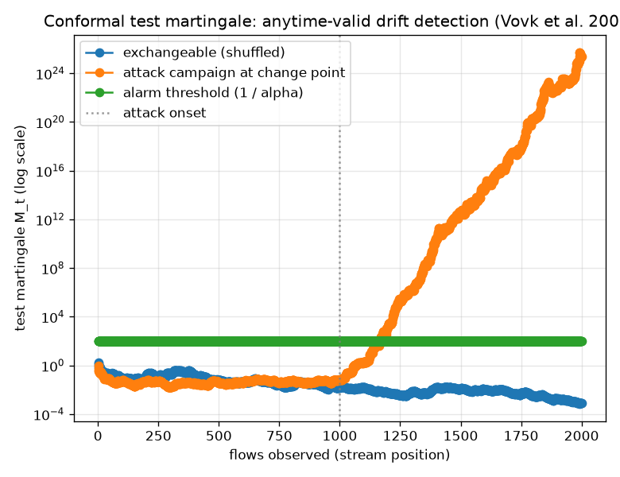

# NetSentry — Anytime-Valid Drift Detection (Conformal Test Martingale)

_Synthetic stand-in. Temporal/binary model; the deployed attack score is the nonconformity
measure. Streams of 2,000 flows; the drift stream turns attack-heavy at flow
1,000. Alarm at ``M_t >= 1/alpha = 100`` (alpha =
0.01)._

## Why this report exists

The drift suite already has PSI, per-feature KS with FDR control, and online Page-Hinkley /
DDM. All of them either need a fixed reference window or spend their false-alarm budget at a
declared moment. A monitor that runs forever needs a stronger contract: it may raise an alarm
at **any** time and still control the false-alarm probability over the whole unbounded run.

A conformal test martingale (Vovk, Nouretdinov & Gammerman, ICML 2003) provides it. Each flow
yields an online conformal p-value — the smoothed rank of its nonconformity among all flows
seen so far — which is Uniform(0, 1) exactly when the stream is **exchangeable**, the
assumption every IID evaluation rests on. Those p-values drive a betting martingale
``M_t = M_{t-1} * g(p_t)`` (a parameter-free mixture of power martingales) that stays a fair
game under the null and grows without bound when the stream stops being exchangeable. By
**Ville's inequality**, ``P(sup_t M_t >= 1/alpha) <= alpha`` — so alarming at the crossing has
false-alarm probability at most ``alpha`` at *any* stopping time.

## Null stream vs drift stream

The exchangeable stream's martingale stays near its starting value of 1 (it peaks at only 1.7) — betting against a fair sequence does not pay. The drift stream, benign until an attack campaign opens at flow 1,000, detects it **167 flows later** (at flow 1,167). Across 50 drift streams the median detection delay is **140 flows** past the change point. Across 50 independent exchangeable streams, **0%** ever crossed the 100 line — at or under the 1% budget Ville's inequality promises, so the anytime-valid guarantee holds empirically here. Unlike the windowed PSI/KS detectors, this spends no fixed false-alarm budget and needs no reference window: it can be watched forever and alarmed the instant the bet pays off.

## Scope

The mixture bets that p-values become *small*, i.e. that the stream grows **more anomalous**
than its own history — the operationally important direction (an attack campaign, a new scan),
and the reason the deployed attack score is used as the nonconformity measure. A drift that
made traffic *more* benign than its history is the symmetric case a large-p betting function
would catch; it is not the SOC's alarm. The guarantee is against the null of exchangeability,
so it complements rather than replaces the feature-wise PSI/KS reports: those localise *which*
feature moved, while this one answers *whether and when* the stream stopped being the
distribution the model was validated on — with a false-alarm rate controlled for all time.