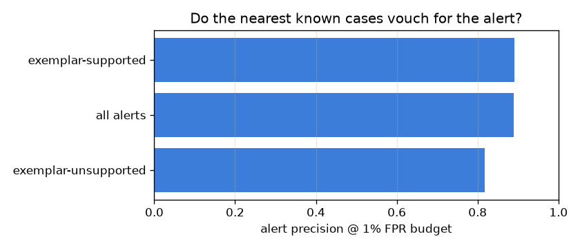

# NetSentry — Exemplar Explanations (the case-based *have we seen this?*)

_Synthetic stand-in. Temporal split; binary model, raw scores, threshold chosen
on validation at the 1% FPR budget. The case base is a
class-balanced sample of the training split (1411 exemplars,
200/class cap) in the fitted pipeline's standardized feature space;
retrieval is exact k-NN (k = 5), distances in standardized units._

## Why cases, when SHAP already explains?

SHAP attributes the score to features; it cannot tell an analyst whether the
flow resembles anything the model has actually seen. Exemplars answer with
precedent — the nearest labeled training flows — which is checkable evidence: an
analyst can pull those cases and compare. This report audits whether the
retrieval earns trust before the API ships it.

## Does the neighbourhood vouch for the alerts?

97% of alerts are exemplar-supported (majority of 5 neighbours
vote attack; ties count against, conservatively).

Neighbour agreement points the right way: alerts whose 5 nearest training cases vote attack are 89% precise (1428 alerts), against 82% when the neighbourhood disagrees (44 alerts; all alerts 89%). Read the bucket sizes before the percentages — the disagreeing bucket is small here, so the gap is directional evidence for triage ordering (corroborated alerts first), not a calibrated re-ranker.

## Distance as an unfamiliarity flag

Distance does **not** separate caught from missed attacks here (caught 9.7 vs missed 7.8 mean NN distance) — consistent with the novelty study's stand-in finding that the hard attacks hug the benign manifold rather than sitting far away. On real burst-structured data the expectation flips; the report states what this data shows.

## What an analyst would see

| alert (raw score) | true label | nearest training cases (label @ distance) |
|---|---|---|
| 1.000 | DDoS | DoS Hulk @ 11.7, DoS Hulk @ 15.9, DoS Hulk @ 18.5 |
| 1.000 | DDoS | FTP-Patator @ 6.4, DoS Hulk @ 6.7, FTP-Patator @ 7.1 |
| 1.000 | DDoS | BENIGN @ 8.9, BENIGN @ 9.4, FTP-Patator @ 9.4 |
| 1.000 | DDoS | DoS Hulk @ 19.7, DoS GoldenEye @ 20.5, DoS Hulk @ 20.5 |
| 1.000 | DDoS | BENIGN @ 6.9, DoS Hulk @ 7.0, FTP-Patator @ 7.1 |

## Scope

Exemplars explain by *similarity in the model's feature space*, not mechanism —
two flows can be near neighbours for reasons an analyst would not consider
related, and the space itself is the standardized CIC features, so the
explanation inherits every representational limit the model has. The case base
is a subsample: absence of a near neighbour means "nothing similar in the
sample", not "nothing similar in training". Distances are in standardized units
and comparable only within one pipeline fit.
