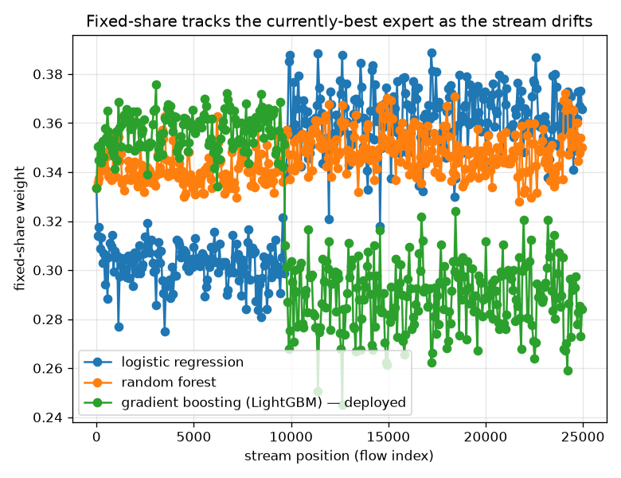

# NetSentry — Online Prediction with Expert Advice (track the best model under drift)

_Synthetic stand-in. Honest temporal/binary stream of 24,957 flows;
3 experts (trained model families) combined online with learning rate
eta = 0.019. Every number is prequential — predict, then see the label and update._

## Why this report exists

The [leaderboard](leaderboard.md) shows different models win on different splits, and the
[streaming study](streaming.md) shows the best model drifts across the week. Committing to one
in advance is a gamble; prediction with expert advice (Cesa-Bianchi & Lugosi 2006) removes it by
weighting the models online by their running loss, with a **regret guarantee** and no retraining.
**Hedge** competes with the best fixed expert in hindsight (regret `≤ sqrt((T/2) ln N)`);
**fixed-share** (Herbster & Warmuth 1998) keeps a little weight on every expert so it can *track*
a best expert that changes, competing with the best expert *sequence* — the right benchmark under
drift.

## Experts and online algorithms on the temporal stream

| expert / algorithm | cumulative loss | PR-AUC |
|---|---|---|
| logistic regression | 13164.3 | 0.569 |
| random forest (best fixed) | 12412.4 | 0.522 |
| gradient boosting (LightGBM) — deployed | 15299.3 | 0.529 |
| **Hedge** | **12473.1** | **0.526** |
| **fixed-share** | **13406.9** | **0.565** |

Cumulative log-loss (lower is better), capped per step; PR-AUC of each probability stream.

Hedge's cumulative loss (12473.1) sits **within 60.7 of the best fixed expert** (random forest, 12412.4) — comfortably under the guaranteed regret bound of 117.1 (`sqrt((T/2) ln N)`), the theory holding on real network-flow data: with no idea in advance which model would win, the ensemble converged on the one that did and paid a vanishing average price for the privilege. But no single model stays best: the per-segment leader shifts across the capture days (gradient boosting (LightGBM) — deployed then logistic regression), so Hedge's convergence onto one fixed expert leaves detection on the table. That is fixed-share's regime. It carries a deliberate log-loss tax to stay adaptive (13406.9 vs Hedge's 12473.1, the price of keeping weight on every expert), but that diversification is exactly what lifts the metric this project leads with: **PR-AUC 0.565 vs Hedge's 0.526**, the best of any online strategy here and level with the strongest single model — under drift, tracking the best *sequence* pays in ranking even where committing to the best *fixed* expert wins on loss.

## Does the best expert actually shift?

| stream segment | lowest-loss expert |
|---|---|
| Thursday | gradient boosting (LightGBM) — deployed |
| Friday | logistic regression |

## Scope

The guarantee is on **regret**, not accuracy: the ensemble is promised to do nearly as well as
the best expert (or expert sequence) available, so it is only as good as its pool — it cannot
beat a model no one trained. Labels are revealed prequentially to update the weights, so this
assumes a deployment where ground truth arrives with some delay (the same assumption the
[streaming](streaming.md) and [threshold-refresh](refresh.md) studies make); the weighting itself
needs no labels *ahead* of a prediction. The learning rate uses the horizon-optimal
`sqrt(8 ln N / T)`; an anytime doubling-trick or ``eta`` override is available in config. This
complements the retrain-policy study — that decides *when* to replace the pool, this decides *how
to weight* it in between, and the two compose: a fresh model can simply be added as a new expert
and fixed-share will discover its worth online.