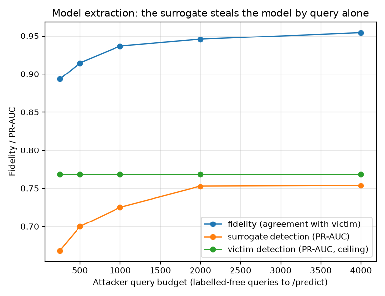

# NetSentry — Model Extraction (Model Stealing)

_Synthetic stand-in. Stratified/binary split; the victim is the deployed model, the
attacker queries it with held-out same-distribution traffic and never sees a
ground-truth label. Surrogate: a generic gradient-boosting model the attacker picks
without knowing the victim's architecture. Victim and surrogate share the public
feature pipeline — the secret being stolen is the model, not the featurisation._

Evasion is the inference-time adversary, poisoning the training-time one, and
membership inference the privacy one. This is the fourth classic attack and the one
about the **confidentiality of the model**: with only the query access the
`/predict` API grants, can an attacker rebuild the detector? It completes NetSentry's
adversarial picture (evasion + poisoning + membership + **extraction**).

## The model is stealable by query alone

A surrogate trained purely on the victim's returned scores — no labels — recovers the
victim's detection as the query budget grows. **Fidelity** is agreement with the
victim's own decisions (the extraction-success metric); **surrogate PR-AUC** is the
stolen model's detection against the true labels, with the victim's PR-AUC as the
ceiling.

| query budget | fidelity (vs victim) | surrogate PR-AUC | of victim's |
|---|---|---|---|
| 250 | 89.3% | 0.669 | 87% |
| 500 | 91.5% | 0.700 | 91% |
| 1,000 | 93.7% | 0.725 | 94% |
| 2,000 | 94.5% | 0.753 | 98% |
| 4,000 | 95.5% | 0.754 | 98% |

At 4,000 free queries the surrogate reaches **95.5% fidelity**
and **98%** of the victim's detection
(PR-AUC 0.754 vs 0.768). The detector's
behaviour — the asset a competitor or an attacker would want — leaks through the
interface.

## The defence axis: return less, leak less (partially)

| query response | fidelity (vs victim) | surrogate PR-AUC |
|---|---|---|
| full probabilities | 95.5% | 0.754 |
| rounded to 1 dp | 95.2% | 0.755 |
| top-1 label only | 95.0% | 0.752 |

Returning less information is the classic mitigation (Tramer et al.), and it works only partially. Full probabilities give the attacker 95.5% fidelity; collapsing the response to the **top-1 label alone** drops it to 95.0% (+0.5 points) — a real reduction, but the surrogate still recovers PR-AUC 0.752 against the victim's 0.768. The decision boundary is the thing worth stealing, and a hard label reveals which side of it every query lands on. The honest read: response minimisation raises the query cost of a *high-fidelity* copy, but it does not keep the boundary secret.

## Why it matters: extraction enables black-box transfer evasion

The stolen surrogate is a white box the attacker owns. An evasion search that would
cost a query per trial against the victim runs free and offline against the surrogate;
the perturbations then transfer. Detection is measured at the victim's
1%-FPR operating point over 851 attack flows, with an L2
budget of 2 standardised units confined to the attacker-controllable features.

| attack source | victim detection @ 1% FPR | evasion vs baseline |
|---|---|---|
| none (unperturbed attack) | 43.0% | — |
| random perturbation (no model) | 40.0% | +3.1% pts |
| **transfer (stolen surrogate)** | **16.9%** | +26.1% pts |
| white-box (victim itself) | 15.5% | +27.5% pts |

This is why stealing the model matters for detection, not just for IP. Searching for an evasion perturbation *against the victim* costs one query per trial and is exactly the traffic the robustness study's rate limit and the drift monitor watch for. Against the **stolen surrogate** the search is free, offline, and unmonitored — and the perturbations found offline on the stolen surrogate transfer to the victim: unperturbed attack flows are detected 43.0% of the time, a random perturbation of the same L2 budget still 40.0%, but the surrogate-guided perturbation pulls victim detection down to 16.9% — recovering **95%** of the fully white-box attack's effect (15.5%) without a single evasion query to the victim. Extraction is the enabler behind black-box transfer evasion; the defence is the same pairing the robustness report argues for — the identity-blind classifier is one signal, and the benign-only anomaly detector, drift monitor, and query rate limits are the others.

## Scope

The study treats the feature representation as public and the surrogate shares the
victim's pipeline; a fully black-box attacker would additionally fit its own scaler on
collected traffic, which the cross-dataset study shows costs a calibration step, not
the ranking. Fidelity is measured on the natural argmax cut so it is threshold-free.
The transfer attack reuses the robustness study's controllable-feature threat model, so
the two reports read against each other: robustness measures the white-box weakness,
this measures how model theft hands that weakness to a black-box attacker — and both
point at the same layered defence (anomaly detector, drift/query monitoring, rate
limits), because no single per-flow classifier closes an adaptive-attacker gap.
