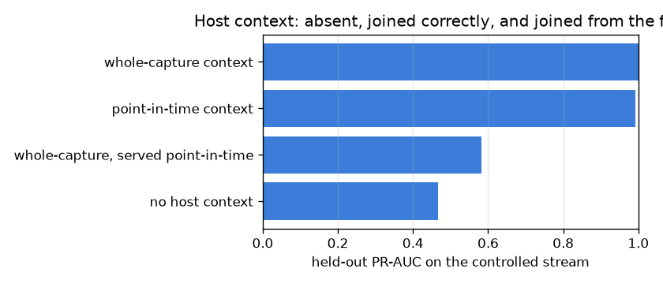

# NetSentry — Point-in-Time Correctness: a Feature Store, and the Leak It Prevents

_Controlled stream: 3,546 flows from 400 hosts, 20 of
them scanning. Lookback window 60s. Trained on the earlier half of the
stream, scored on the later half._

## Why this report exists

The per-flow model is identity-blind by design — IPs are dropped before anything is modelled, so
it cannot memorise *which host* attacked instead of *what an attack looks like*. That firewall
costs something real: one flow cannot express "this source has opened four hundred connections in
the last minute", which is the first thing a human analyst would look at.

Host **context** recovers that signal without reintroducing identity, because a behaviour count is
not an address. Computing it correctly is where production ML infrastructure earns its keep. The
obvious implementation — group the whole capture by source, join the totals back — hands a flow at
09:00 information about what its host did at 17:00. That is a **temporal leak**: it scores well
offline and cannot be reproduced by a serving path, for which 17:00 has not happened. The as-of
join is the fix, and it is the defining guarantee of a feature store (Feast, Tecton). It is also
the same class of mistake as the identifier leakage this project was built around — one axis over,
and the one that survives dropping every identifier column.

## Why this runs on a controlled stream

The synthetic stand-in cannot host the comparison, and the measurement says so plainly: across
60,000 raw flows it contains **60,000 distinct source addresses** —
one per flow. No source is ever observed twice, so every host context is structurally empty
and both joins return the same nothing. (The controlled stream below averages
8.9 prior events per flow, for comparison.) That is a property of the
generator, not of CIC-IDS2017, where a few hundred hosts
produce hundreds of thousands of flows. Rather than quietly reporting a null result caused by the
data, the mechanism is demonstrated on a stream built to have the structure the stand-in lacks:
ordinary hosts making occasional connections, and a handful of scanners sweeping many
destinations in tight bursts, with per-flow features that deliberately overlap so the *only*
reliable evidence is host-level.

## How different are the two joins, before any model?

| context feature | leaky mean / point-in-time mean |
|---|---|
| `ctx_flows_in_window` | 2.9x |
| `ctx_distinct_dest_ports` | 2.5x |
| `ctx_distinct_dest_hosts` | 2.9x |
| `ctx_mean_gap_seconds` | 0.0x |

These ratios are the discrepancy at the feature level — how much larger each flow's context looks
when the future is allowed to contribute to it. Nothing has been fitted yet.

## What does each join buy?

| detector | what it sees | features | held-out PR-AUC |
|---|---|---|---|
| no host context | per-flow features only | 3 | 0.467 |
| point-in-time context | as-of join, 60s lookback, strictly earlier events only | 7 | 0.993 |
| whole-capture context | the one-line groupby: each flow sees its host's totals, including the future | 7 | 1.000 |
| whole-capture, served point-in-time | trained on the leaky join, then deployed against features a serving path can actually compute | 7 | 0.583 |

Host context is worth **+0.525 PR-AUC** when it is computed correctly (0.467 to 0.993): the per-flow features cannot separate a single scan connection from a single benign one, and the count of what the source did in the preceding minute can. The incorrect join adds only +0.007 on top, because correctly computed context has already resolved this stream and there is little left to buy. That makes the offline comparison look almost harmless, which is exactly why the last row exists. **The last row is the one that matters.** A model trained on whole-capture context and then deployed against features a serving path can actually compute scores 0.583 — a **0.417 collapse** from the 1.000 it was benchmarked at, and +0.115 against having no context at all. That is the shape of the failure in production: not a model that is subtly optimistic, but one that learned to lean on a number nobody can supply at request time. It would be diagnosed as drift, investigated as drift, and never fixed, because the cause is a join written six months earlier.

## The design that makes this safe

The store computes context with a two-pointer sweep over time-sorted events per entity, so each
flow sees only its source's events in `[t - 60s, t)` — strictly earlier,
never simultaneous. Excluding the flow's own instant matters more than it looks: with one-second
timestamp resolution ties are common, and including them would leak the label-bearing flow into
its own feature. The sweep is linear in the number of flows rather than the quadratic of a
per-row filter, and it is the same computation an online lookup would run against a live window —
which is the other half of the guarantee, since a store whose offline and online definitions can
drift has reintroduced the training/serving skew it exists to prevent.

Identifiers are used to *compute* the aggregates and never reach the model: what the model sees
is four behaviour counts, and `Source IP` stays behind the same `remainder="drop"` firewall as
always.

## Scope

Four aggregates over one entity type and one window is a deliberately small store; destination-side
context, per-(source, service) entities and multiple windows are the obvious extensions, and each
multiplies the join cost without changing the correctness argument. The controlled stream is a
demonstration of the *mechanism*, not a detection result — its absolute numbers mean nothing
about CIC-IDS2017, and the report would be dishonest if it presented them as if they did. Running
this on the real dataset is the natural follow-up and requires only that the capture have repeat
hosts, which the real one does. The store's correctness properties are pinned by unit tests
independently of any dataset: that a flow never sees its own instant, that events outside the
window are excluded, and that the leaky join demonstrably includes the future.