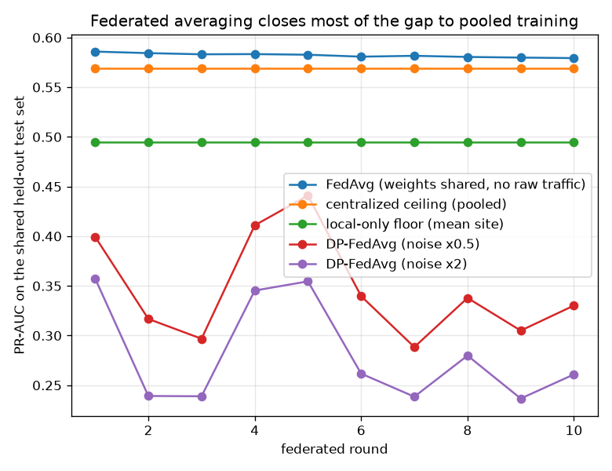

# NetSentry — Federated Training Across Sites That Cannot Pool Traffic

_Synthetic stand-in. Honest temporal/binary split; 3 sites = the capture days
of the training split, 24,957 shared held-out test flows. 10 federated
rounds of 2 local epochs each; the local-only and centralized arms are
given the same total optimisation budget so the comparison is about **data access**, not
compute. All arms use the same linear model, because FedAvg averages parameters and a
gradient-boosted forest has none to average._

## Why this report exists

Every other model here trains on one pooled dataset, which assumes the least true thing about
security telemetry: that someone is allowed to collect it all. Flow records carry who talked
to whom, for how long, on what port. For a hospital group, a bank's regional entities, or an
MSSP's client estates, "send us your flow logs" is a data-protection conversation that ends
the project — and training alone is expensive, because each site only sees the attacks that
hit it. Federated averaging (McMahan et al. 2017) is the standard escape: train locally,
share only weights, average by sample count, repeat.

## Who holds what

| site (capture day) | flows held | local attack prior | alone: PR-AUC | alone: detection |
|---|---|---|---|---|
| Wednesday | 11,961 | 37.7% | 0.484 | 12.1% |
| Monday | 7,511 | 0.0% _(no attacks — see below)_ | 0.583 | 14.6% |
| Tuesday | 8,562 | 12.7% | 0.418 | 3.2% |
| **all sites pooled** | 28,034 | 20.0% | **0.569** | **12.1%** |

The sites are **non-IID by construction**, which is the regime where FedAvg is supposed to struggle. CIC-IDS2017 runs different attacks on different days, so each site's local attack prior ranges from 0.0% (Monday) to 37.7% (Wednesday) against a global 20.0% — a mean absolute skew of 0.150. Beyond the prior, the *kinds* of attack differ: a site that never saw a web attack contributes weights that have no opinion about one, and averaging those weights with a site that did is exactly the client-drift problem. With 2 local epochs per round the drift stays mild here; pushing local work up (fewer, longer rounds — the usual move to save bandwidth) is what makes site optima diverge far enough for the average to be worse than any of them.

One row deserves a second look rather than a footnote: **Monday holds no attacks at all** — it is CIC-IDS2017's clean baseline day — and yet its local model posts 0.583 PR-AUC, beating Wednesday, Tuesday despite never having seen a single attack. That looks wrong, so it was checked rather than reported: the fitted model is not degenerate (its scores span the full range and take 17k distinct values), and the explanation is that logistic loss on all-benign labels is a **one-class fit**. Every gradient step pushes predictions down, and the flows that resist hardest are the ones least like the site's benign traffic — which is a benign-manifold model, not a supervised detector. It is, almost exactly, the benign-only training regime this project's [anomaly detector](anomaly.md) already uses, arrived at by accident. The practical reading for a federation is that a site with no confirmed attacks still contributes something real to the average, which is a genuinely useful property when most participants have never knowingly been breached — but its standalone number should be read as an anomaly score, not as detection it could be trusted to repeat.

## What federation costs, and what it saves

| regime | raw traffic leaves the site? | PR-AUC | detection | privacy budget |
|---|---|---|---|---|
| centralized (pooled) | **yes** | 0.569 | 12.1% | none |
| local-only (mean site) | no | 0.495 | — | none |
| local-only (best site that saw an attack) | no | 0.484 | — | none |
| **FedAvg** | no (weights only) | **0.579** | **10.7%** | none |
| DP-FedAvg (noise x0.5) | no (noised weights) | 0.330 | 1.5% | eps = 50.13 |
| DP-FedAvg (noise x2) | no (noised weights) | 0.261 | 0.0% | eps = 8.09 |

The three numbers that decide whether to build this: pooled training reaches 0.569, the average site training alone reaches 0.495, and FedAvg reaches 0.579 while raw flow records never leave a site. The federation tax is **negative** (-0.010): averaging over sites landed at or above pooled training. That is not a paradox — the site-weighted average of several locally-balanced models is a mild ensemble, and ensembling reduces variance, which on a shifted test split can be worth more than the extra data pooling provides. Against the alternative that actually happens when the data-sharing conversation fails — everyone trains alone — federation is worth +0.084 PR-AUC, recovering 113% of the distance from the local floor to the pooled ceiling. That is the comparison that matters: the choice is rarely federated-versus-pooled, it is federated-versus-nothing.

## Weights are not privacy

Sharing weights instead of flows is a **confidentiality** improvement, not a privacy guarantee: the [membership-inference](membership.md) study in this repo exists because model parameters leak information about the rows that produced them, and an averaged update is still a function of every site's data. The DP-FedAvg rows buy an actual guarantee — clip each site's update to bound its influence, add Gaussian noise to the aggregate, and account for the composition across rounds with the same Renyi accountant the [DP study](dp.md) uses (delta = 1e-05, full participation each round). The privacy unit is the **site**, which is the one that matches the threat: the guarantee is that the released model looks nearly the same whether or not any one organisation joined. It costs what privacy always costs — 0.330 PR-AUC at eps = 50.13 and 0.261 at eps = 8.09, against 0.579 unnoised.

Both rows are reported as measured, and neither is a good deal here. An epsilon in the tens (50) is a **vacuous** guarantee — it bounds the privacy loss at a level no practitioner would accept, so that row pays utility for nothing; and the budget that is at least nameable (eps = 8.09) costs 0.318 PR-AUC, roughly half the detection. The reason is structural and worth stating plainly: DP-FedAvg's noise is calibrated to one *site's* influence, and with only 3 sites each one moves the average a great deal, so the noise needed to hide it is large. Site-level DP gets cheap with hundreds of participants, not three — the same 1/n scaling the [DP study](dp.md) enjoys in the per-example setting, where thousands of examples make the noise affordable. Federation and DP are complements (the first keeps the data home, the second bounds what the model gives away), but this federation is far too small to buy the second cheaply, and saying so is more useful than reporting whichever row looks least bad.

## Scope

The sites are capture days, not real organisations — a partition that is genuinely non-IID
(different attacks per day) but shares one sensor, one schema, and one feature pipeline. Real
federation is harder in exactly the places this cannot show: sites disagree about feature
definitions, run different exporter versions, and drop in and out between rounds. The model
is linear because FedAvg averages parameters; federating the deployed gradient-boosted model
means a different algorithm entirely (federated boosting, or distilling site models into a
shared student), which is why the centralized ceiling here sits below this project's headline
LightGBM number and should be read as the linear ceiling, not the project's. The DP accounting
assumes every site participates in every round (q = 1) and one Gaussian release per round;
subsampling participation would buy amplification the accountant does not credit here. And
the threat model is an honest-but-curious coordinator: a malicious one can do considerably
more with per-round updates than with the final model, which is what secure aggregation
protocols exist for and which this does not implement.