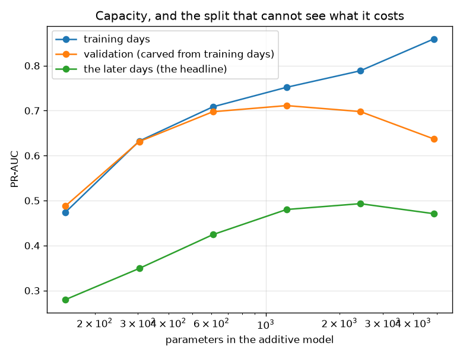
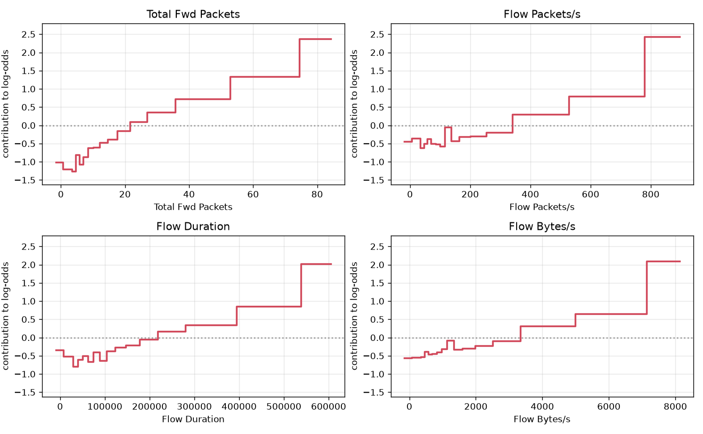

# NetSentry — The Glass Box, and What Capacity Costs on the Honest Split

_A generalized additive model (Lou, Caruana & Gehrke 2012) fitted from scratch by cyclic Newton
boosting over single-feature histograms, on 28,034 training flows and
76 features, against the deployed ensemble and the linear floor under the
project's temporal protocol. Capacity is chosen on validation, never on the later days.
Regenerate with `netsentry gam`._

## Why this report exists

Everything this project ships to explain the deployed detector is **post hoc**. SHAP attributes
a verdict after the fact, [anchors](anchors.md) find a rule that happens to hold nearby,
[distillation](distill.md) trains a small model to imitate a big one, and each is an
approximation whose own error has to be measured -- which is why the
[stability study](importance_stability.md) exists at all.

An additive model needs none of that. It *is* a sum of one-dimensional curves,

    score(x) = intercept + f_1(x_1) + ... + f_d(x_d)

so the explanation is the model: exact rather than attributed, global rather than local, and a
lookup table rather than a fitted approximation -- which means an operator can **edit** it.

**Interpretability is not what costs anything here. Capacity is.** The most readable model in the comparison -- logistic regression, one coefficient per feature -- is also the most accurate on the honest split at PR-AUC 0.569, ahead of the deployed boosted ensemble's 0.529 and the additive model's 0.480. The winner over every arm is _logistic regression_.

That ordering is not an accident of four model families, and the additive model is what makes it measurable, because its capacity is a **dial** rather than an architecture. Turning the resolution of every shape function from 2 bins to 64 takes training PR-AUC from 0.474 to 0.859, and the later days from 0.280 to 0.471 -- rising then falling, with everything else held exactly fixed: the same loss, the same boosting, the same class weights, the same splits.

Validation, which this project carves out of the **training days**, does catch the turn -- it peaks at 16 bins per feature while the later days peak at 32 bins per feature. It is off by one rung and it overstates the achievable score by 0.231 PR-AUC. **Validation is a usable signal about the shape of the capacity curve and a useless one about its level**, which is the reason every headline in this repository is a temporal-split number.

## Does the fitter recover a function it was given?

| component | correlation with the truth | curve error (log-odds) |
|---|---|---|
| a step | 0.968 | 0.208 |
| a parabola | 0.974 | 0.249 |
| pure noise (must stay flat) | -- | 0.197 |

A shape function that looks plausible is evidence of nothing, so the fitter is first pointed at
a known additive truth: a step, a parabola, and a feature that carries **no signal at all**. The
first two come back. The third is the row that matters -- it is the curve this fitter invents
for pure noise, with a magnitude of 0.197 in log-odds, and it is the floor
every real curve below has to be read against. A model that explains itself can still explain
itself wrongly, and this number is how much of that is on offer for free.

## What the glass box costs

| model | readable? | parameters | PR-AUC | ROC-AUC | detection @ 1% FPR | fit (s) |
|---|---|---|---|---|---|---|
| logistic regression | yes | 77 | 0.569 | 0.711 | 21.1% | 0.1 |
| gradient-boosted ensemble (deployed) | **no** | 34,902 | 0.529 | 0.668 | 21.0% | 11.3 |
| additive + pairwise (GA2M) | yes | 2,240 | 0.481 | 0.636 | 16.1% | 3.0 |
| additive model (GAM) | yes | 1,216 | 0.480 | 0.669 | 12.0% | 2.9 |

The two additive arms and the linear one are readable in the strict sense: their entire
decision rule can be printed. The ensemble cannot, which is why the rest of
`netsentry/explain` exists.

The additive model gives up 0.049 PR-AUC to the deployed ensemble and 0.089 to a linear model carrying 15x fewer parameters. That is the wrong way round for the usual story about interpretability, and the next two
sections are why.

## The capacity dial

| capacity | parameters | train PR-AUC | validation PR-AUC | later-days PR-AUC |
|---|---|---|---|---|
| 2 bins per feature | 152 | 0.474 | 0.488 | 0.280 |
| 4 bins per feature | 304 | 0.632 | 0.631 | 0.349 |
| 8 bins per feature | 608 | 0.708 | 0.698 | 0.424 |
| 16 bins per feature **(selected)** | 1,216 | 0.752 | 0.711 | 0.480 |
| 32 bins per feature | 2,432 | 0.789 | 0.698 | 0.493 |
| 64 bins per feature | 4,862 | 0.859 | 0.637 | 0.471 |

Bins per shape function is this model's resolution, its parameter count, and its capacity, in
one integer. Nothing else changes across these rows: same loss, same boosting schedule, same
class weights, same splits. Training PR-AUC rises monotonically -- capacity does what capacity
does -- and the later days rise, turn and fall.

**The gap between the validation column and the later-days column is the finding.** At
16 bins per feature validation reports 0.711 where the later days deliver
0.480: a 0.231 overstatement, from a split carved out
of the *training days* and therefore drawn from the regime the model was fitted on. It is not
useless -- it turns over, so a practitioner following the protocol would have stopped adding
capacity -- but it stops one rung early (32 bins per feature is the rung the later days actually
want) and it never tells the truth about the level.

| capacity | parameters | train PR-AUC | validation PR-AUC | later-days PR-AUC |
|---|---|---|---|---|
| 1 boosting rounds | 1,216 | 0.752 | 0.729 | 0.490 |
| 3 boosting rounds | 1,216 | 0.756 | 0.729 | 0.492 |
| 10 boosting rounds | 1,216 | 0.758 | 0.723 | 0.492 |
| 30 boosting rounds | 1,216 | 0.753 | 0.713 | 0.482 |
| 120 boosting rounds | 1,216 | 0.752 | 0.711 | 0.480 |

The second dial is the boosting schedule at the selected resolution, and it is here because one
hyperparameter behaving this way is an anecdote. It replicates: validation peaks at
3 boosting rounds, the later days at 3 boosting rounds.

## The capacity an additive model structurally cannot have

| capacity | parameters | train PR-AUC | validation PR-AUC | later-days PR-AUC |
|---|---|---|---|---|
| 1 pairwise term | 1,472 | 0.775 | 0.728 | 0.522 |
| 4 pairwise terms **(selected)** | 2,240 | 0.803 | 0.730 | 0.481 |
| 16 pairwise terms | 5,312 | 0.870 | 0.677 | 0.426 |

An additive model cannot represent an interaction -- that is the definition, and it is the
usual reason given for preferring an ensemble. So the interactions are added back, a bounded
number at a time, ranked by the exact Newton gain a joint table would buy (the FAST heuristic,
Lou et al. 2013) rather than by refitting each candidate.

The first pair is worth +0.042 on the later days. Going on to 16 pairwise terms costs -0.097 while training PR-AUC climbs +0.095. The interaction terms are where the day-specific structure lives: they fit the training
week's particular co-occurrences, and the later days do not have them. That is a
mechanism for the [leaderboard's](leaderboard.md) cross-family observation -- that the honest
split crowns the *least* flexible model -- observed inside a single family with one knob.

## What the curves say

| feature | swing (log-odds) | riskiest region (raw units) | monotone? |
|---|---|---|---|
| `Total Fwd Packets` | 3.62 | 80.37 .. inf | no |
| `Flow Packets/s` | 3.06 | 854.3 .. inf | no |
| `Flow Duration` | 2.81 | 5.771e+05 .. inf | no |
| `Flow Bytes/s` | 2.66 | 7753 .. inf | no |
| `SYN Flag Count` | 1.69 | 5.068 .. inf | no |
| `Flow IAT Mean` | 1.61 | 5.141e+04 .. inf | no |
| `Flow IAT Max` | 1.27 | 5.081e+04 .. inf | no |
| `Fwd IAT Min` | 0.51 | 1.635 .. 1.966 | no |

Printed in raw feature units by inverting the fitted scaler, because a curve quoted in standard
deviations is not a curve an analyst can argue with. The swing column is the range of log-odds
the feature is allowed to move the score by, and the noise floor from the recovery harness
(0.197) is what separates a curve from a decoration.

Almost none of them are monotone, which is worth pausing on: the
[monotone-constraint study](monotonic.md) shows that forcing monotonicity in the deployed
ensemble makes an entire evasion family impossible at a small detection cost. Here the same
question is visible directly -- the shapes show exactly where the model's response reverses,
and a reversal is where an attacker inflates a feature to *lower* their score.

## Editing the model

This is the operation a black box does not have. Clamping one bin of one shape function to zero
changes the score of every flow in that region by exactly the removed amount -- no retraining,
no surrogate, no approximation -- and the change is auditable in one line of a table an analyst
can read.

Every candidate is ranked by the trade it actually makes on **validation**, evaluated exactly
(clamping one bin shifts the margin by a known constant for exactly the rows in that bin, so
all several thousand candidate edits can be scored in the time it takes to re-sigmoid a few
hundred rows), and then measured on the later days it was not chosen on.

### At the deployed budget (1% false positives)

| clamped region | validation cleared / lost | false alarms cleared | attacks lost | exchange rate | benign flows in the region |
|---|---|---|---|---|---|
| `Bwd Packets/s` 0.8523 .. 0.9982 | 3 / 0 | 1 | 4 | 0.2:1 | 6.3% |
| `Bwd Header Length` 1.623 .. 1.959 | 3 / 0 | 4 | 7 | 0.6:1 | 6.2% |
| `Fwd IAT Mean` 0.6159 .. 0.7304 | 3 / 0 | 2 | 6 | 0.3:1 | 6.1% |
| `Active Mean` -inf .. 0.2177 | 3 / 1 | 5 | 6 | 0.8:1 | 6.3% |
| `Init_Win_bytes_forward` -inf .. 959.9 | 3 / 1 | 2 | 2 | 1.0:1 | 6.7% |
| `Subflow Bwd Packets` 1.634 .. 1.965 | 3 / 1 | 2 | 4 | 0.5:1 | 6.3% |

The best available edit clears 2 false alarms and stops catching 2 attacks -- 1.0 to 1, against the 20 to 1 the [cost study's](cost.md) economics require, so it does not pay.

### At a budget where the selection can see something (10%)

| false-positive budget | false alarms on validation (what an edit is chosen from) | false alarms on the later days | attacks caught |
|---|---|---|---|
| 1% | 56 | 161 | 750 |
| 10% | 559 | 1,736 | 1,970 |

| clamped region | validation cleared / lost | false alarms cleared | attacks lost | exchange rate | benign flows in the region |
|---|---|---|---|---|---|
| `Fwd IAT Total` 2.435e+04 .. 3.199e+04 | 10 / 0 | 22 | 4 | 5.5:1 | 6.7% |
| `FIN Flag Count` 0.2163 .. 0.315 | 8 / 0 | 14 | 3 | 4.7:1 | 6.1% |
| `Max Packet Length` 97.15 .. 117.6 | 8 / 0 | 21 | 7 | 3.0:1 | 6.7% |
| `RST Flag Count` 0.9966 .. 1.17 | 14 / 1 | 35 | 11 | 3.2:1 | 6.4% |
| `Idle Std` 1.625 .. 1.946 | 6 / 0 | 25 | 8 | 3.1:1 | 6.1% |
| `Fwd IAT Min` 0.3154 .. 0.4083 | 6 / 0 | 19 | 5 | 3.8:1 | 6.5% |

The best available edit clears 22 false alarms and stops catching 4 attacks -- 5.5 to 1, against the 20 to 1 the [cost study's](cost.md) economics require, so it does not pay.

Two things separate those tables, and only one of them is about the model.

**The first is evidence.** An edit can only be chosen from false alarms an operator can see,
and a tight false-positive budget is *defined* by there being almost none: at
1% the whole validation split offers 56 of them to reason from,
spread across 76 features and 16 bins each. Loosening the
budget 10x multiplies the evidence by 10x and the best available
trade improves 5.5x. The failure at the deployed budget is a sample-size failure,
and saying so requires running the second budget rather than assuming it.

**The second is the exchange rate, and it is not improved by evidence.** The
[cost study's](cost.md) economics make a caught attack worth 20 triaged
alerts, so an edit has to clear 20 false alarms per attack it stops
catching before it is worth making. The best edit found anywhere here reaches
5.5 to 1. **The regions carrying false alarms are the regions carrying detection**,
and no amount of looking harder changes that -- which is the same thing a threshold sweep says,
arrived at from a direction that could have disagreed.

What the glass box adds is therefore not a free lunch. It is that the trade is **inspectable
and choosable region by region**, with its exchange rate visible before the change ships,
instead of being made globally and invisibly by moving one number.

## Scope and honest limits

- **The additive model here loses, and the report is named for what that measures.** The claim
  is not that a GAM is the right detector for this data; it is that its capacity dial makes the
  honest split's preference for low capacity legible, which four different architectures
  cannot.
- **The binning family does not nest the linear model.** At the coarsest rung each feature is a
  step function, which throws away within-bin ordering, so the ladder's bottom end is not "a
  linear model" and its 0.280 should not be read as one.
- **Correlated features split their credit arbitrarily.** Two features carrying the same signal
  produce two curves that each look half as important as the effect is, and nothing in the
  model says so. The gradient is refreshed after every feature rather than once per round
  specifically to stop them each taking *full* credit, which is worse, but it does not solve
  the attribution.
- **A legible model is only legible if its features are.** `Flow IAT Std` has a shape function
  and an operator still has to know what it means. The
  [feature-availability study](earliness.md) is the honest companion here.
- **The edits are single-bin clamps.** A real operator edit is a region and a rationale, and
  a production version of this would want a review trail -- which is what the
  [alert ledger](ledger.md) does for alerts and nothing yet does for models.