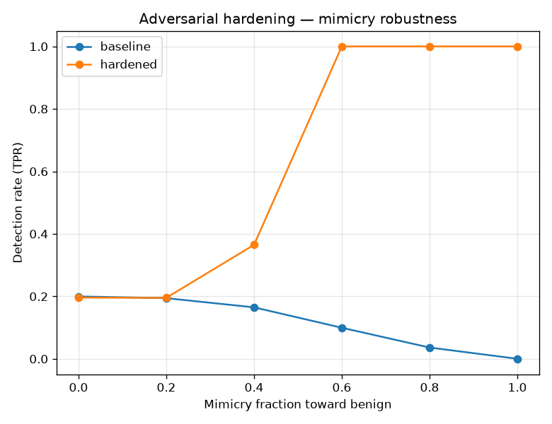

# NetSentry — Adversarial Hardening (measure → fix → re-measure)

_Synthetic stand-in; the methodology is the point. Honest **temporal/binary** model
at operating point **fpr_1pct**. 6,000 adversarial rows
synthesized at mimicry fractions [0.5, 0.75, 1.0] and added to training._

The [robustness report](robustness.md) measures how a mimicry attacker collapses
detection; it ends by naming adversarial training as a direction. This closes that
loop: the attack flows are perturbed toward the benign centroid — the attacker's own
move — and added to training (still labeled attack), so the classifier learns the
mimicry direction. The model is then re-run through the **same** evasion study.

## Robustness under mimicry (detection vs fraction toward benign)

| mimicry fraction | 0 | 0.2 | 0.4 | 0.6 | 0.8 | 1 |
|---|---|---|---|---|---|---|
| baseline detection | 20.0% | 19.4% | 16.5% | 10.0% | 3.6% | 0.0% |
| hardened detection | 19.6% | 19.5% | 36.5% | 100.0% | 100.0% | 100.0% |

## Robustness under adaptive query search (L2 budget on controllable features)

| L2 budget (std units) | 0 | 0.5 | 1 | 2 | 3 |
|---|---|---|---|---|---|
| baseline detection | 20.0% | 13.0% | 9.9% | 5.8% | 4.0% |
| hardened detection | 19.6% | 13.3% | 10.2% | 6.9% | 5.0% |

## The trade-off (this is the honest part)

| quantity | baseline | hardened | Δ |
|---|---|---|---|
| clean detection @ fpr_1pct (un-attacked) | 20.0% | 19.6% | -0.4 pts |
| clean PR-AUC (temporal test) | 0.529 | 0.519 | -0.010 |
| detection at full mimicry | 0.0% | 100.0% | +100.0 pts |
| detection at largest search budget | 4.0% | 5.0% | +1.0 pts |

Adversarial training lifts full-mimicry detection by **+100.0 pts** (0.0% → 100.0%) at a clean PR-AUC cost of +0.010 — the measured, honest form of closing the evasion gap.

## Takeaways

- Adversarial training is **not free**: hardening against mimicry can shift the clean
  operating point, and the table above shows both sides so the trade is a decision,
  not a surprise.
- It is also **not a silver bullet**: it hardens against the *specific* perturbation
  it trains on. A defender pairs it with the benign-only anomaly detector (mimicry
  that flattens an attack toward benign is exactly where reconstruction error still
  carries signal) and with input-side constraints — the layered argument the
  [robustness report](robustness.md) makes.
- The point is the arc: NetSentry *measured* the evasion weakness, *acted* on it, and
  *re-measured* — reporting the result whichever way it fell.
