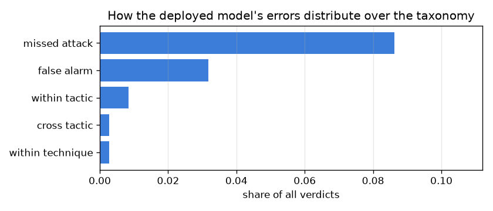
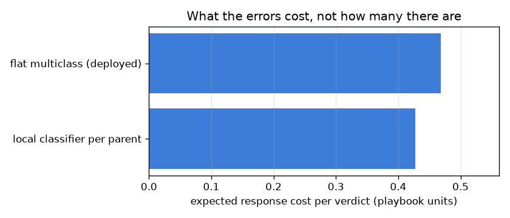

# NetSentry — Errors That Cost Different Amounts

_Synthetic stand-in. Stratified/multiclass split (see Scope). Taxonomy: 13
classes under 6 ATT&CK tactics, depth 4._

## Why this report exists

The multiclass report treats the label set as flat, so calling `DoS Hulk` a `DoS GoldenEye`
and calling it `BENIGN` are both worth exactly one unit of error. They are not the same
mistake. The first sends an analyst to the right playbook under a slightly wrong name; the
second sends them nowhere. A metric that cannot tell those apart is not measuring the thing
the response cares about.

The hierarchy needed to tell them apart already exists in this repository: every class is
mapped onto MITRE ATT&CK, and ATT&CK is a tree of tactics containing techniques containing
concrete behaviours. Using it costs nothing and cannot be accused of being chosen to flatter
the model.

```
benign/
  BENIGN
attack/
  Command and Control/
    T1071 Application Layer Protocol/
      Bot
  Credential Access/
    T1110 Brute Force/
      FTP-Patator
      SSH-Patator
  Discovery/
    T1046 Network Service Discovery/
      PortScan
  Execution/
    T1204 User Execution/
      Infiltration
  Impact/
    T1498 Network Denial of Service/
      DDoS
    T1499 Endpoint Denial of Service/
      DoS GoldenEye
      DoS Hulk
    T1499.002 Service Exhaustion Flood/
      DoS Slowhttptest
      DoS slowloris
  Initial Access/
    T1190 Exploit Public-Facing Application/
      Heartbleed
      Web Attack
```

## Scoring against the tree

| classifier | exact accuracy | macro-F1 | hier. P | hier. R | hier. F1 | mean tree distance | cost/verdict |
|---|---|---|---|---|---|---|---|
| flat multiclass (deployed) | 0.868 | 0.305 | 0.860 | 0.821 | **0.840** | 0.76 | 0.468 |
| local classifier per parent | 0.855 | 0.322 | 0.835 | 0.820 | **0.828** | 0.83 | 0.428 |

The deployed flat model is 86.8% accurate, so 13.2% of its verdicts are wrong, and the taxonomy says what kind of wrong. Only **8% of those errors are the forgivable kind** — a sibling name under the right tactic, where the analyst runs the correct playbook anyway. **65% are missed attack**, the most expensive row in the schedule. So the honest reading of hierarchical F1 here is not that the flat metric was too harsh: hF1 lands at 0.840, *below* the 0.868 flat accuracy reports.

That direction is worth pausing on, because partial credit can only add. It goes the other way because hierarchical recall divides by path length, and in this tree an attack is four levels deep while benign is two — so calling an attack benign costs twice what calling a benign flow an attack does, automatically, with nobody choosing a weight. For a detector that is the right asymmetry, and it is a property of the taxonomy rather than of the cost schedule below. The mean error travels 0.76 edges of a possible 6.



## Where every verdict lands

| outcome | playbook cost | flat multiclass (deployed) | local classifier per parent |
|---|---|---|---|
| exact | 0.0 | 86.83% | 85.52% |
| within technique | 0.1 | 0.27% | 0.43% |
| within tactic | 0.3 | 0.83% | 0.92% |
| cross tactic | 1.0 | 0.27% | 0.68% |
| false alarm | 1.0 | 3.18% | 5.12% |
| missed attack | 5.0 | 8.62% | 7.33% |

Training hierarchically is the trade it is supposed to be, and it is a trade worth making here: the local-per-parent classifier gives up 1.3% of exact accuracy and returns 0.040 of cost per verdict — a 9% reduction — because the errors it makes are cheaper ones. Specifically it converts missed attacks into false alarms: 8.62% down to 7.33%, against false alarms 3.18% up to 5.12%. Routing benign-versus-attack as its own decision, before any question about which attack, is what buys that: the router sees every hostile flow as one class instead of thirteen sparse ones, so it is better at the only question whose error costs five units. It also gains +0.017 macro-F1, which is the same effect seen from the other side: macro-F1 weights every class equally and the rare classes are exactly the ones a flat model starves, because splitting a fixed model capacity across thirteen leaves spends most of it on the two that dominate the rows. A flat metric scores this model as the worse of the two. An operator would deploy it.



## Which classes the flat metric understates

| attack class | flows | named exactly | reached the right tactic | partial credit |
|---|---|---|---|---|
| DoS Slowhttptest | 95 | 9.5% | 29.5% | +20.0% |
| DDoS | 488 | 78.5% | 87.3% | +8.8% |
| DoS slowloris | 105 | 17.1% | 25.7% | +8.6% |
| DoS Hulk | 717 | 77.8% | 84.7% | +6.8% |
| DoS GoldenEye | 210 | 29.5% | 35.2% | +5.7% |
| Bot | 70 | 0.0% | 0.0% | +0.0% |
| FTP-Patator | 140 | 0.0% | 0.0% | +0.0% |
| PortScan | 623 | 66.6% | 66.6% | +0.0% |
| SSH-Patator | 130 | 1.5% | 1.5% | +0.0% |
| Web Attack | 58 | 0.0% | 0.0% | +0.0% |

**DoS Slowhttptest** is where the flat metric understates most: named exactly 9.5% of the time, but routed to the right tactic +20.0% more often than that. Those are the verdicts where an analyst opens the alert, sees a sibling class name, and runs the correct playbook anyway. Classes with no gap are the honest failures — when the model is wrong about them it is wrong about what the adversary was trying to do, and no amount of partial credit should hide that.

## Scope

The taxonomy is derived from `netsentry.intel.attack_mapping`, and those ATT&CK
mappings are **indicative**: CIC-IDS2017 is not labelled with ATT&CK IDs, so the tactic and
technique assigned to each class is a documented judgement about the capture scenario rather
than ground truth. Every number here inherits that judgement. Changing one class's tactic
would move partial credit between the within-tactic and cross-tactic rows, which is exactly
why the mapping lives in one module that serving, the coverage report and this study all read
rather than being restated here.

The playbook costs are a stated schedule (`hierarchy.cost_*` in config), not a measurement.
They encode an ordering nobody would dispute — a missed attack costs more than the wrong
playbook, which costs more than a sibling name — but their magnitudes are illustrative, and
the comparison between classifiers is only as meaningful as that ordering. The alternative,
leaving every error priced identically, is the flat metric this report exists to replace.

This runs on the **stratified** split, which is optimistic about detection: it is the
reference split, not the headline. That is deliberate rather than convenient — the temporal
split shares no attack classes across the day boundary, so on it every test class is unseen
and a multiclass taxonomy comparison would be measuring novelty rather than structure. Read
the detection numbers here alongside [evaluation](evaluation.md), which states the gap.